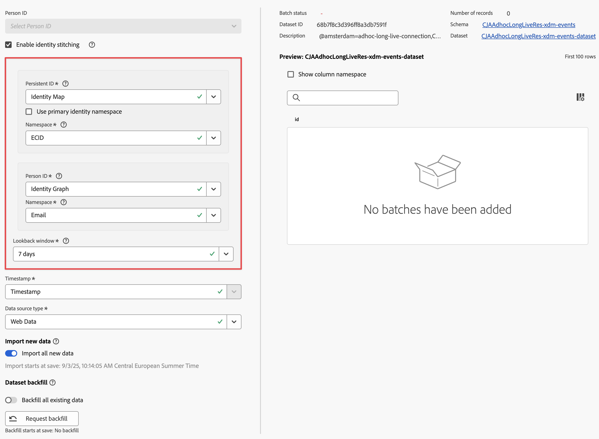

# Utilizzare l’unione

Puoi abilitare l’unione su uno o più set di dati evento configurati come parte della connessione. Il pacchetto Customer Journey Analytics per il quale hai concesso la licenza determina il numero di set di dati evento che puoi abilitare per l’unione.

{{release-limited-testing}}

Puoi abilitare l&#39;unione come parte delle [impostazioni del set di dati](/help/connections/create-connection.md#dataset-settings) per un set di dati evento quando [crei una connessione](/help/connections/create-connection.md) o quando [modifichi una connessione](/help/connections/manage-connections.md#edit-a-connection).

## Prerequisiti

Per abilitare l’unione su un set di dati evento nell’interfaccia utente Connessioni:

* Lo schema su cui si basa il set di dati deve avere:

   * più campi configurati come identità e che consentono di selezionare valori diversi per un ID persistente e un ID persona.
   * almeno un campo contrassegnato come identità primaria con uno spazio dei nomi associato nel caso in cui si desideri utilizzare Identity Map e lo spazio dei nomi dell’identità primaria per l’ID persistente o l’ID persona.

* Il set di dati dell&#39;evento deve essere [abilitato per il servizio Identity](/help/stitching/faq.md#enable-a-dataset-for-the-identity-service) se si desidera utilizzare l&#39;unione basata su grafo e grafo di identità.


## Controlli di verifica preliminare

Se soddisfi i prerequisiti, prima di abilitare l’unione di identità potresti voler eseguire alcuni controlli di verifica preliminare sui dati nel set di dati dell’evento:

* Assicurati che le identità siano contrassegnate correttamente nello schema per il set di dati dell’evento. [Consulta la panoramica dello spazio dei nomi delle identità](https://experienceleague.adobe.com/it/docs/experience-platform/identity/features/namespaces).
* Verifica la copertura delle identità sia per l’ID persistente che per l’ID persona:
   * ID persistente: esegui la query per 7 giorni di dati in cui il campo ID persistente non è nullo e dividi per una query di 7 giorni di dati per tutti gli eventi nel set di dati. Tale percentuale dovrebbe essere superiore al 95%.

     Esempio di query da utilizzare per la verifica:

     ```sql
     SELECT
       COUNT(*) AS total_events,
       COUNT({PERSISTENT_ID_FIELD}) AS events_with_persistentid,
       ROUND(COUNT({PERSISTENT_ID_FIELD}) / COUNT(*), 2) AS percent_with_persistentid_not_null
     FROM 
       {DATASET_TABLE_NAME}
     WHERE
       TO_TIMESTAMP(timestamp, '{FORMAT_STRING}') >= TIMESTAMP '{START_DATE}'
       AND TO_TIMESTAMP(timestamp, 'FORMAT_STRING') < TIMESTAMP '{END_DATE}';
     ```

     Dove:

      * `{PERSISTENT_ID_FIELD}` è il campo per l&#39;ID persistente. Ad esempio: `identityMap.ecid[0]`.
      * `{DATASET_TABLE_NAME}` è il nome della tabella per il set di dati evento.
      * `{FORMAT_STRING}` è la stringa di formato per il campo timestamp. Ad esempio: `MM/DD/YY HH12:MI AM`.
      * `{START_DATE} ` è la data di inizio. Ad esempio: `2024-01-01 00:00:00`.
      * `{END_DATE}` è la data di fine in formato standard. Ad esempio: `2024-01-08 00:00:00`.


   * ID persona: esegui la query di 7 giorni di dati in cui il campo ID persona non è nullo e dividi per una query di 7 giorni di dati per tutti gli eventi nel set di dati. Tale percentuale dovrebbe essere superiore al 5%.

     Esempio di query da utilizzare per la verifica:

     ```sql
     SELECT
       COUNT(*) AS total_events,
       COUNT({PERSON_ID_FIELD}) AS events_with_personid,
       ROUND(COUNT({PERSON_ID_FIELD}) / COUNT(*), 2) AS percent_with_personid_not_null
     FROM 
       {DATASET_TABLE_NAME}
     WHERE
       TO_TIMESTAMP(timestamp, '{FORMAT_STRING}') >= TIMESTAMP '{START_DATE}'
       AND TO_TIMESTAMP(timestamp, 'FORMAT_STRING') < TIMESTAMP '{END_DATE}';
     ```

     Dove:

      * `{PERSON_ID_FIELD}` è il campo per l&#39;ID persona. Ad esempio: `identityMap.crmId[0]`.
      * `{DATASET_TABLE_NAME}` è il nome della tabella per il set di dati evento.
      * `{FORMAT_STRING}` è la stringa di formato per il campo timestamp. Ad esempio: `MM/DD/YY HH12:MI AM`.
      * `{START_DATE}` è la data di inizio. Ad esempio: `2024-01-01 00:00:00`.
      * `{END_DATE}` è la data di fine in formato standard. Ad esempio: `2024-01-08 00:00:00`.


## Abilitare l’unione di identità

>[!NOTE]
>
>Se **[!UICONTROL Enable identity stitching]** non è disponibile nell&#39;interfaccia Connessioni, utilizzare la procedura di richiesta [per abilitare l&#39;unione](/help/stitching/use-stitching.md) in un set di dati.


Per abilitare l&#39;unione, nella sezione del set di dati evento della finestra di dialogo **[!UICONTROL Add datasets]** o **[!UICONTROL Edit dataset]**:



1. Seleziona **[!UICONTROL Enable identity stitching]**.

   Se si abilita l&#39;unione per un set di dati evento esistente, nella finestra di dialogo **[!UICONTROL Change Person ID]** vengono visualizzate le implicazioni di una modifica dell&#39;ID persona dovuta all&#39;utilizzo dell&#39;unione. Seleziona **[!UICONTROL Continue]** (Avanti) per continuare.

   La finestra di dialogo **[!UICONTROL Enable identity stitching]** riepiloga le conseguenze dell&#39;unione di identità. Seleziona **[!UICONTROL Continue]** (Avanti) per continuare.

1. Selezionare un ID persistente dal menu a discesa **[!UICONTROL Persistent ID]**.

   Se si seleziona **[!UICONTROL Identity Map]** per l&#39;ID persistente, è necessario selezionare uno spazio dei nomi. Sono disponibili due opzioni:

   * Consenti a **[!UICONTROL Use primary identity namespace]** di utilizzare lo spazio dei nomi dell&#39;identità primaria.
   * Selezionare uno spazio dei nomi dal menu a discesa **[!UICONTROL Namespace]**.

1. Selezionare un ID persona dal menu a discesa **[!UICONTROL Person ID]**.

   Se selezioni **[!UICONTROL Identity Map]** per l&#39;ID persona, devi selezionare uno spazio dei nomi. Sono disponibili due opzioni:

   * Consenti a **[!UICONTROL Use primary identity namespace]** di utilizzare lo spazio dei nomi dell&#39;identità primaria.
   * Selezionare uno spazio dei nomi dal menu a discesa **[!UICONTROL Namespace]**.


   Se selezioni **[!UICONTROL Identity Graph]** per l&#39;ID persona (per utilizzare [unione basata su grafico](/help/stitching/gbs.md)), devi selezionare uno spazio dei nomi.

   >[!NOTE]
   >
   >Assicurati di essere autorizzato a utilizzare il grafo delle identità.
   >

   Prima di ciò, viene visualizzata una finestra di dialogo **[!UICONTROL Change to identity graph]** per verificare che [&#x200B; abbia completato la configurazione del grafico delle identità per il set di dati](/help/stitching/faq.md#enable-a-dataset-for-the-identity-service) prima di utilizzare il grafico delle identità per l&#39;unione. Seleziona **[!UICONTROL Continue]** (Avanti) per continuare.

   * Selezionare uno spazio dei nomi dal menu a discesa **[!UICONTROL Namespace]**.


1. Selezionare un intervallo di lookback dal menu a discesa **[!UICONTROL Lookback window]**. Le opzioni disponibili dipendono dal pacchetto Customer Journey Analytics a cui hai diritto.

Dopo aver salvato una connessione contenente set di dati abilitati per l’unione di identità, il processo di unione per ciascun set di dati inizia all’avvio dell’acquisizione dei dati per tale set di dati.

## Limitazioni

Oltre alle [limitazioni relative all&#39;unione basata sui campi](/help/stitching/fbs.md#limitations) e alle [limitazioni relative all&#39;unione basata sui grafi](/help/stitching/gbs.md#limitations), quando si abilita l&#39;unione nell&#39;interfaccia Connessioni vengono applicate le seguenti limitazioni:

* È possibile unire un set di dati evento una sola volta come parte di una singola connessione. Non è possibile definire lo stesso set di dati evento più di una volta e utilizzare una configurazione di unione separata per ogni istanza. Se desideri applicare diverse configurazioni di unione sullo stesso set di dati, utilizza una connessione separata per ogni configurazione.

