# Convalidare l’unione delle identità

L&#39;obiettivo di [unione identità](/help/stitching/overview.md) (o semplicemente unione) è quello di elevare l&#39;idoneità di un set di dati evento per l&#39;analisi cross-channel. Questa elevazione si ottiene quando tutte le righe di dati nel set di dati contengono l’identità dell’ordine più alto desiderata disponibile. Questa quota altimetrica consente di:

* Crea rapporti incentrati sulla persona senza escludere le persone anonime.
* Collegare più dispositivi a una singola persona.
* Connettere una persona tra canali diversi.

Questo articolo illustra metodi di analisi per misurare la quota altimetrica di uno o più set di dati uniti appena creati e per garantire che l’unione offra questi vantaggi.

I metodi di analisi coinvolgono [impostazioni del componente Visualizzazione dati](/help/data-views/component-settings/overview.md), generalmente accessibili agli amministratori. I metodi richiedono inoltre agli analisti che lavorano in un progetto Analysis Workspace di creare metriche calcolate e visualizzazioni.

Anche se questi metodi di analisi possono essere utilizzati sia per l’unione basata sui campi che per l’unione basata sui grafici, alcuni elementi potrebbero non essere presenti nel set di dati, in particolare in uno scenario di unione basata sui grafici. Questi elementi mancanti possono rendere difficile il calcolo dell’incremento direttamente in Analysis Workspace.

>[!NOTE]
>
>L’unione (o la convalida di) di uno o più set di dati contribuisce in ultima analisi a migliorare le informazioni. Tuttavia, questo articolo non descrive il valore complessivo di una configurazione Customer Journey Analytics in cui tutti i set di dati in Experience Platform sono allineati allo stesso spazio dei nomi dell’identità. E che tutti questi set di dati sono ben uniti tra loro per eseguire analisi su un intero percorso di clienti.

>[!BEGINSHADEBOX]

Consulta  [Abilitazione e convalida dell&#39;unione](https://video.tv.adobe.com/v/3478128?captions=ita&quality=12&learn=on){target="_blank"} per un video demo.

>[!ENDSHADEBOX]

## Unione nella convalida delle connessioni

Questa sezione descrive come convalidare l’unione abilitata nell’interfaccia Connessioni.

### Consigli di connessione

Per convalidare l&#39;unione abilitata nell&#39;interfaccia Connessioni, selezionare un periodo breve e rappresentativo per **[!UICONTROL Recupero set di dati]**. Ad esempio, una settimana.

Nell’esempio seguente, vuoi unire il set di dati dell’evento. È stata impostata una connessione di prova in cui aggiungere il set di dati dell’evento. Per questo set di dati, definisci **[!UICONTROL ECID]** **[!UICONTROL Spazio dei nomi]** come **[!UICONTROL ID persistente]** e **[!UICONTROL Indirizzo e-mail con hash del visitatore (directMarketing.hashedEmail)]** come **[!UICONTROL ID persona]**. Per convalidare questa unione, definisci una **[!UICONTROL retrocompilazione set di dati]** per una finestra temporale piccola (24 gennaio 2026 - 10 febbraio 2026). Utilizzate questa piccola finestra per verificare se l&#39;unione funziona come previsto.

### Prerequisiti per la visualizzazione dati

Per la convalida dell’unione, è necessario assicurarsi di aver definito in una visualizzazione dati tutte le dimensioni e le metriche richieste dal set di dati uniti. Crea una visualizzazione dati in base alla connessione definita in precedenza. Nel passaggio **[!UICONTROL Componenti]** della configurazione della visualizzazione dati, è necessario:

* Aggiungi **[!UICONTROL Spazio dei nomi identità]** da **[!UICONTROL Metriche e dimensioni]** come dimensione all&#39;elenco **[!UICONTROL Dimensioni]**.

  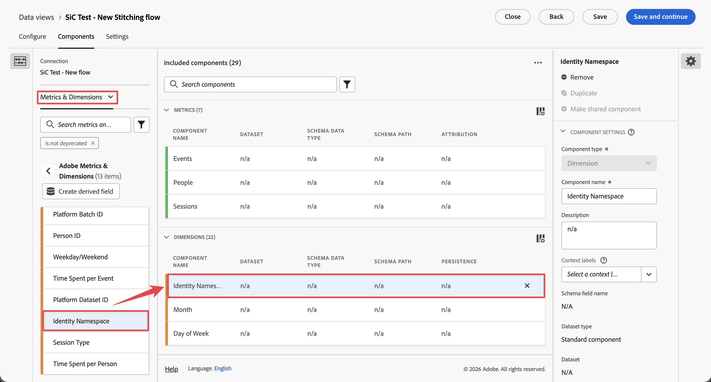

* Seleziona **[!UICONTROL Identificatore indirizzo e-mail con hash visitatore]** definito come ID persona per gli eventi dai **[!UICONTROL campi schema]**. Aggiungere il campo come dimensione all&#39;elenco **[!UICONTROL Dimensioni]** e come metrica all&#39;elenco **[!UICONTROL Metriche]**. Modificare il **[!UICONTROL nome componente]** per la metrica in `Email set`.

  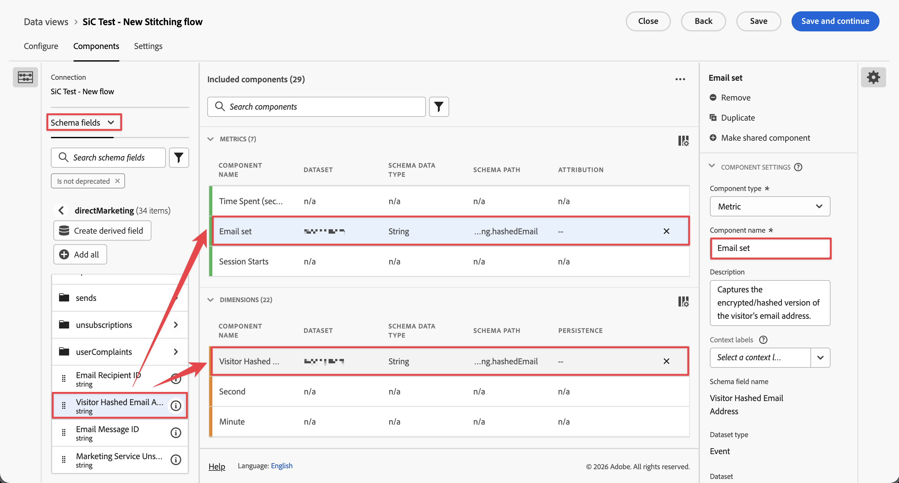

Assicurati di salvare la visualizzazione dati.

### Workspace

In Workspace, crea un nuovo progetto e utilizza una tabella a forma libera per mostrare la metrica **[!UICONTROL Set di e-mail]** per l&#39;intervallo di date definito per testare la configurazione dell&#39;unione. Questa tabella a forma libera mostra gli eventi che hanno un indirizzo e-mail prima dell’unione.

Per visualizzare gli eventi per i quali è stato impostato un indirizzo e-mail dopo il processo di unione, definire una metrica calcolata `Email stitched namespace`. La metrica calcolata esamina **[!UICONTROL Eventi]** che hanno uno **[!UICONTROL Spazio dei nomi identità]** uguale allo spazio dei nomi e-mail con hash **[!UICONTROL email_lc_sha256]**.

Se aggiungi la nuova metrica calcolata **[!UICONTROL Spazio dei nomi unito tramite e-mail]** alla tabella a forma libera, noterai l&#39;aumento del numero di eventi che ora dispongono di un indirizzo e-mail dopo il processo di unione.

Puoi ottenere ulteriori informazioni definendo due metriche calcolate aggiuntive.

* **[!UICONTROL Percentuale di autenticazione e-mail]**. Questa metrica calcolata determina il tasso di autenticazione prima del processo di unione.

  

* **[!UICONTROL Percentuale di autenticazione unita]**. Questa metrica calcolata determina il tasso di autenticazione dopo il processo di unione.

  

Aggiungi queste due metriche calcolate aggiuntive alla tabella a forma libera per verificare l’aumento degli eventi uniti.

Per ulteriori informazioni, puoi aggiungere altre due metriche calcolate (**[!UICONTROL Aumento percentuale]** e **[!UICONTROL Incremento]**) alla tabella a forma libera per vedere l&#39;impatto della configurazione di unione.

L’aspetto chiave di questo articolo è che questo tipo di convalida e analisi delle unioni consente di:

* Fornisci una visione completa personalizzata dell’efficacia dell’autenticazione confrontando le percentuali correnti con quelle unite.
* Consente di misurare chiaramente il miglioramento mediante aumenti percentuali e metriche di incremento.
* Identifica il vero impatto dell’implementazione dell’unione sull’autenticazione degli utenti.
* Crea un modo standardizzato per comunicare le prestazioni di autenticazione tra i team.
* Consente decisioni basate sui dati sulla strategia di autenticazione e l’ottimizzazione.

Queste metriche insieme forniscono alle parti interessate un quadro completo del modo in cui l’unione di Customer Journey Analytics influisce sui tassi di successo dell’autenticazione e sulle prestazioni complessive di identificazione della persona.

## Convalida dell’unione delle richieste

Questa sezione descrive come convalidare l’unione richiesta ad Adobe. Questo metodo è obsoleto, ma è possibile che esistano ancora set di dati uniti utilizzando questo metodo.

### Prerequisiti per la visualizzazione dati

Per il piano di misurazione della convalida dell’unione, è necessario assicurarsi di aver definito in una visualizzazione dati tutte le dimensioni e le metriche richieste dal set di dati uniti. Verificare che i campi `stitchedID.id` e `stitchedID.namespace.code` siano aggiunti come dimensioni. Mentre il set di dati uniti è una copia esatta del set di dati originale, il processo di unione aggiunge queste due nuove colonne al set di dati:

* Utilizzare `stitchedID.namespace.code` per definire una dimensione **[!UICONTROL Spazio dei nomi unito]**. Questa dimensione contiene lo spazio dei nomi dell&#39;identità a cui è stata elevata la riga, ad esempio `Email` o `Phone`. Oppure lo spazio dei nomi a cui ricorre il processo di unione, ad esempio `ECID`.
  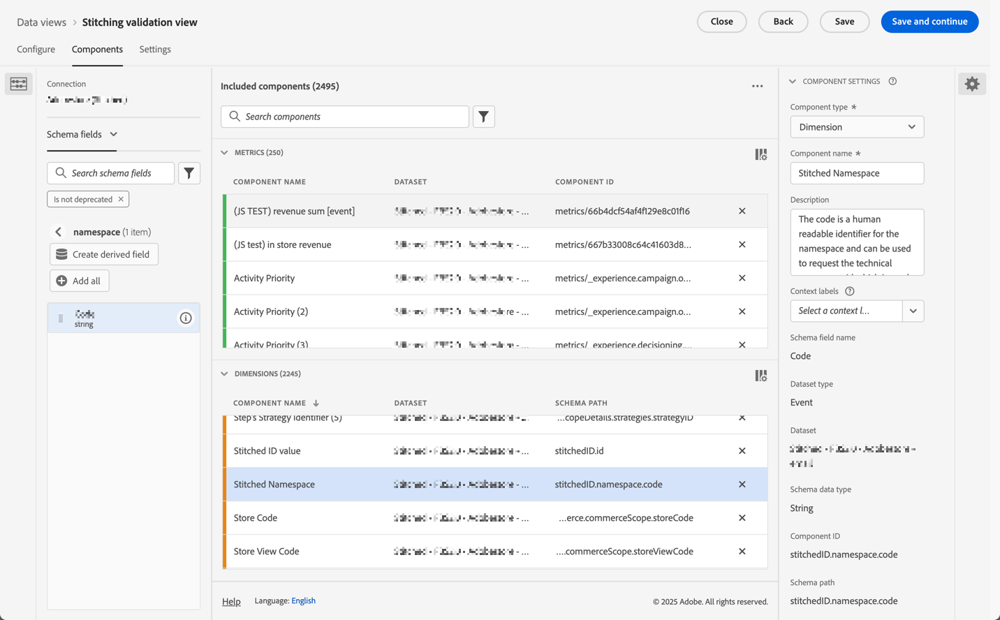

* Utilizzare `stitchedID.id` per definire una dimensione **[!UICONTROL ID unito]**. Questa dimensione contiene il valore non elaborato dell’identità. Ad esempio: e-mail con hash, telefono con hash, ECID. Questo valore viene utilizzato con **[!UICONTROL Spazio dei nomi unito]**.
  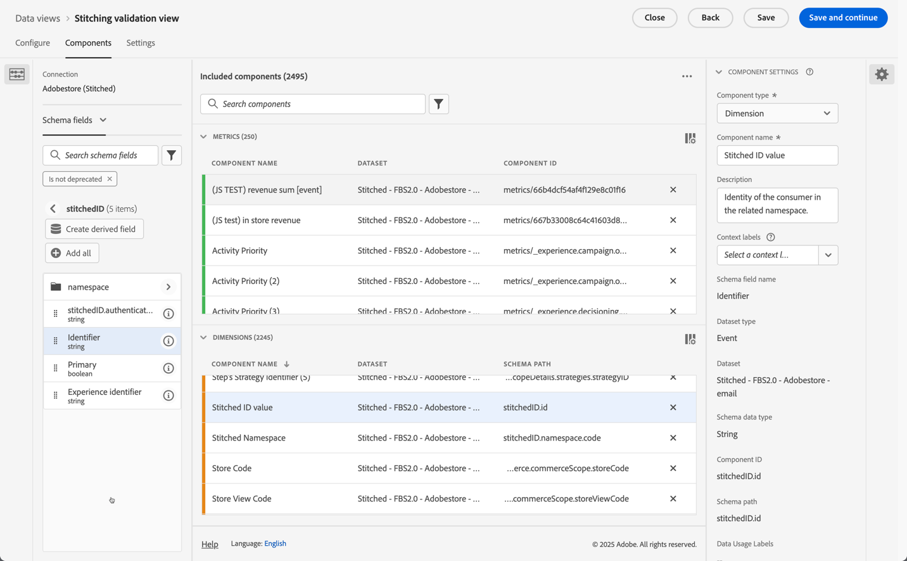

Inoltre, devi aggiungere due metriche di unione basate sulla presenza di valori in una dimensione.

1. Utilizza il campo che contiene l’ID persona del set di dati uniti per configurare una metrica che definisca se un ID persona è impostato. Aggiungi questo ID persona anche se utilizzi l’unione basata su grafico, in quanto l’ID persona consente di stabilire una linea di base. Se l’ID della persona non è contenuto nel set di dati, la linea di base è 0%.

   Nell&#39;esempio seguente, `personalEmail.address` funge da identità e viene utilizzato per creare la metrica **[!UICONTROL _Email set]**.
   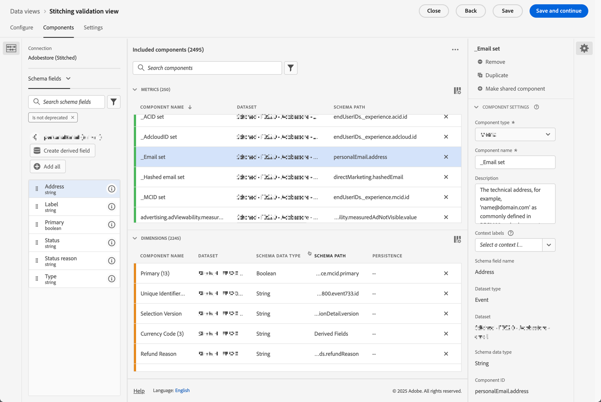

1. Utilizza il campo `stitchedID.namespace.code` per creare una metrica dello spazio dei nomi **[!UICONTROL E-mail]**. Accertati di specificare [Includi valori di esclusione nelle impostazioni del componente](/help/data-views/component-settings/include-exclude-values.md), in modo da considerare solo i valori dello spazio dei nomi a cui stai tentando di elevare le righe di dati.
   1. Selezionare **[!UICONTROL Imposta valori di inclusione/esclusione]**.
   1. Seleziona **[!UICONTROL Se tutti i criteri sono soddisfatti]** come **[!UICONTROL Corrispondenza]**.
   1. Specificare **[!UICONTROL Equals]** `email` come **[!UICONTROL Criteri]** per selezionare gli eventi elevati allo spazio dei nomi e-mail.

   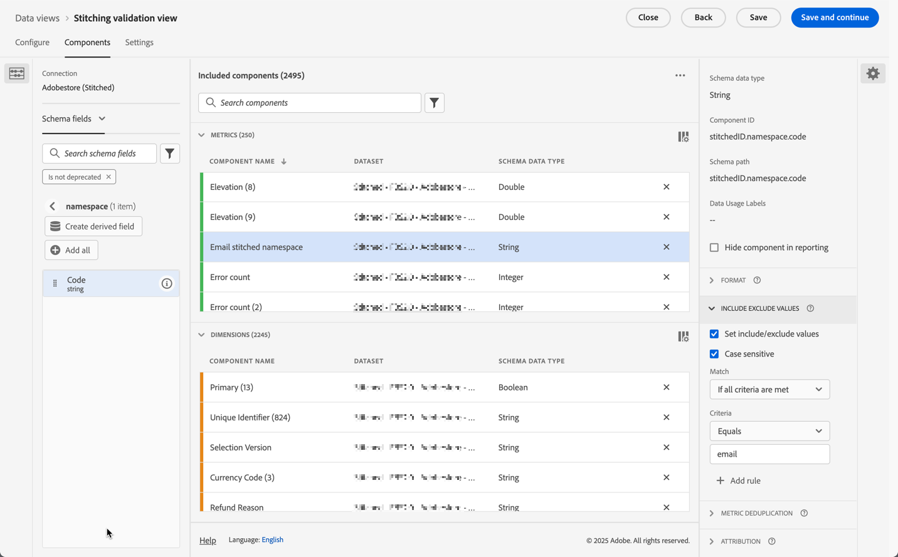

### Dimensioni unite

Con entrambe queste dimensioni aggiunte alla visualizzazione dati, utilizza [Tabelle a forma libera](/help/analysis-workspace/visualizations/freeform-table/freeform-table.md) in Analysis Workspace per verificare i dati di ogni dimensione.

Nella tabella delle dimensioni **[!UICONTROL Spazio dei nomi unito]**, in genere vengono visualizzate due righe per ogni set di dati. Una riga rappresenta quando il processo di unione ha dovuto utilizzare il metodo di fallback (ECID). L’altra riga mostra gli eventi associati allo spazio dei nomi dell’identità (e-mail) desiderato.

Nella tabella delle dimensioni **[!UICONTROL Valore ID unito]** vengono visualizzati i valori non elaborati provenienti dagli eventi. In questa tabella puoi vedere che i valori oscillano tra l’ID persistente e l’ID persona desiderato.

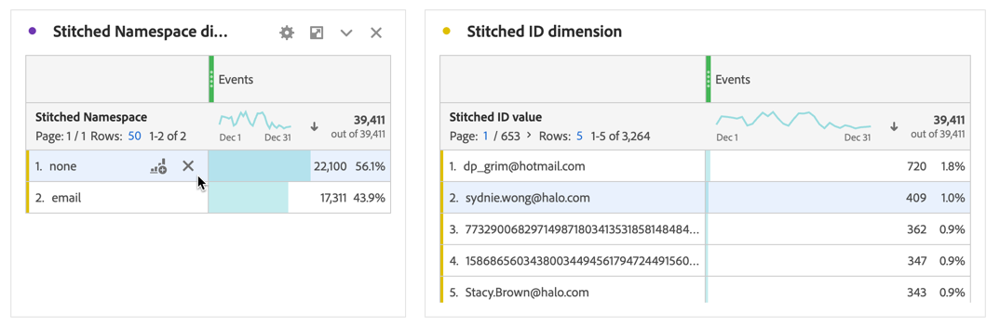

### Reporting incentrato su dispositivo o su persona

Quando crei una connessione, devi definire quale campo o identità viene utilizzato per l’ID persona. Ad esempio, in un set di dati web, se scegli un ID dispositivo come ID persona, puoi creare rapporti incentrati sul dispositivo e perdere la possibilità di unire questi dati con altri canali offline. Se selezioni un campo o un’identità cross-channel, ad esempio e-mail, si perdono tutti gli eventi non autenticati. Per comprendere questo impatto, devi capire quanto traffico non è autenticato e quanto traffico è autenticato.

1. Crea una metrica calcolata **[!UICONTROL Eventi non autenticati sul totale]**. Definisci la regola nel generatore di regole come mostrato di seguito:
   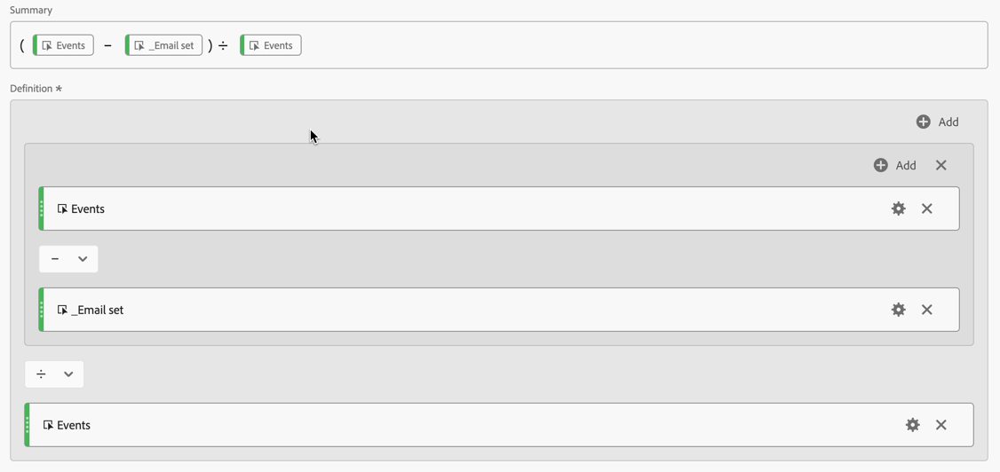

1. Crea una metrica calcolata **[!UICONTROL Percentuale di autenticazione e-mail]**, in base alla metrica **[!UICONTROL _Email set]** definita in precedenza. Definisci la regola nel generatore di regole come mostrato di seguito:
   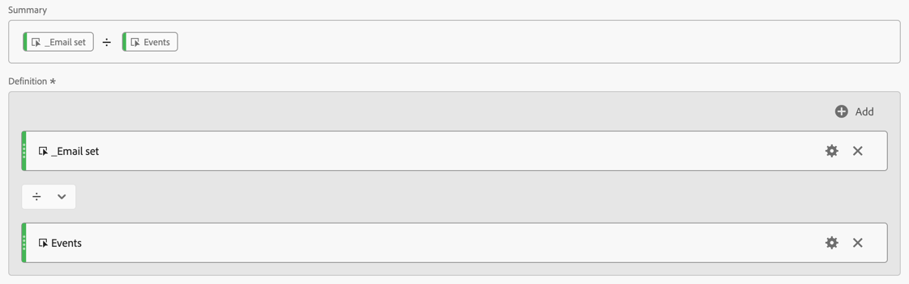

1. Utilizza **[!UICONTROL Eventi non autenticati sul totale]** metrica calcolata, insieme alla metrica calcolata **[!UICONTROL Percentuale di autenticazione e-mail]**, per creare una visualizzazione [Anello](/help/analysis-workspace/visualizations/donut.md). La visualizzazione mostra il numero di eventi nel set di dati che sono non autenticati e autenticati.

   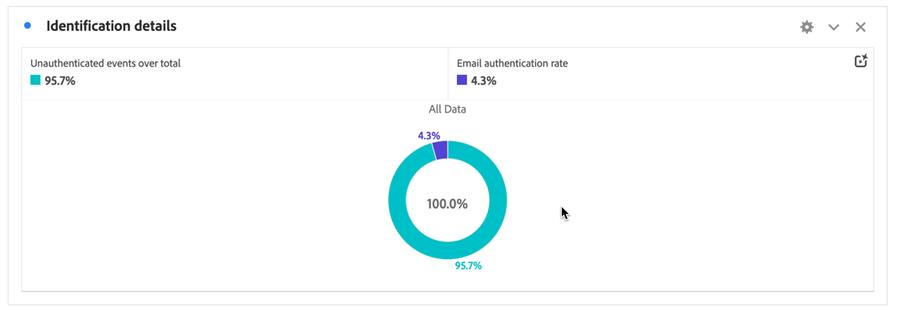

### Percentuali di identificazione dell’unione

Si desidera misurare le prestazioni di identificazione prima e dopo l&#39;unione. Per farlo, crea tre metriche calcolate aggiuntive:

1. Una metrica calcolata del tasso di autenticazione **[!UICONTROL Stitched]** che calcola il numero di eventi in cui lo spazio dei nomi unito è impostato sull&#39;identità desiderata rispetto al numero totale di eventi. Quando configuri la visualizzazione dati, hai creato una metrica dello spazio dei nomi **[!UICONTROL E-mail unito]** che includeva un filtro da contare solo quando un evento ha uno spazio dei nomi impostato su E-mail. La metrica calcolata utilizza questa metrica **[!UICONTROL Spazio dei nomi unito tramite e-mail]** per fornire un&#39;indicazione della percentuale di dati con l&#39;identità desiderata.
   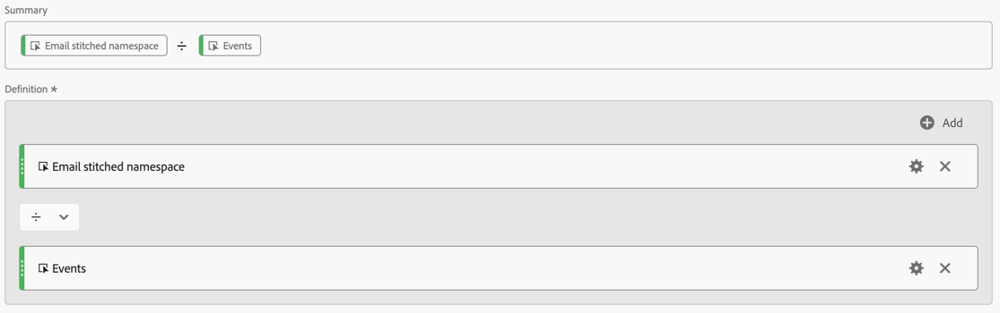

1. Una metrica calcolata con incremento del **[!UICONTROL Percentuale]** che calcola la variazione percentuale non elaborata tra il tasso di identificazione corrente e quello unito.
   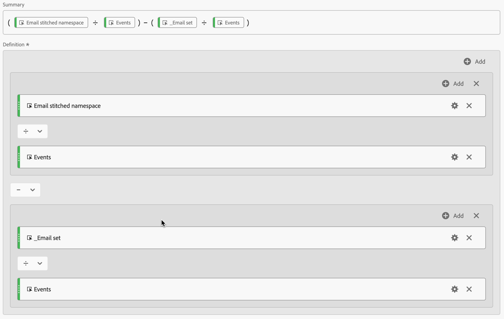

1. Una metrica calcolata per **[!UICONTROL Incremento]** che calcola l&#39;incremento tra il tasso di identificazione corrente e il tasso di identificazione unito.
   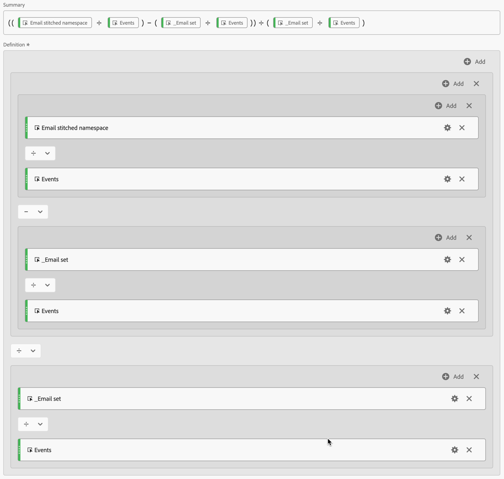

### Conclusione

Se combini tutti i dati in una tabella a forma libera di Analysis Workspace, puoi iniziare a visualizzare l’impatto e il valore forniti dall’unione, inclusi:

* Tasso di autenticazione corrente: linea di base del numero di eventi che avevano già l’ID persona corretto sul numero totale di eventi.
* Tasso di autenticazione unita: il nuovo numero di eventi che hanno l’ID persona corretto sul numero totale di eventi.
* Aumento percentuale: l’aumento percentuale non elaborato dal tasso di autenticazione unita meno il tasso di autenticazione corrente linea di base.
* Incremento: variazione percentuale rispetto al tasso di autenticazione corrente previsto.

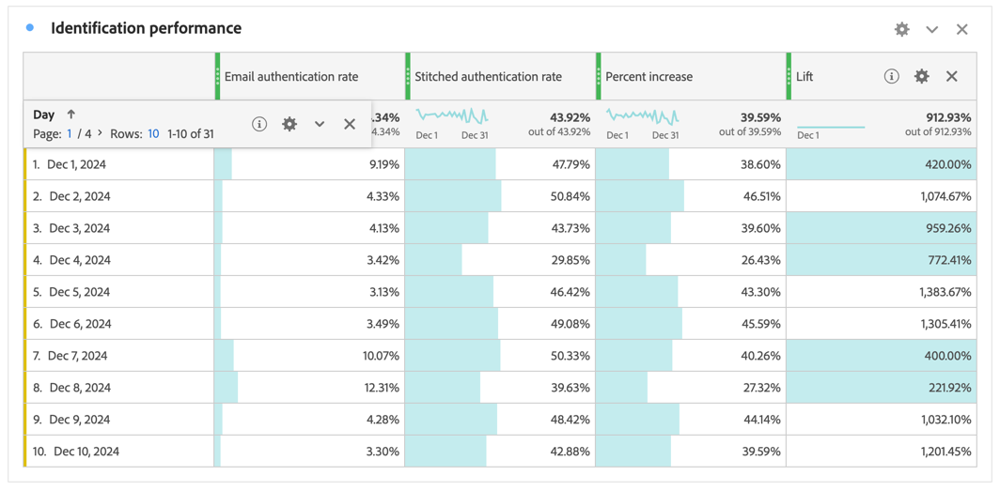

L’aspetto chiave di questo articolo è che questo tipo di convalida e analisi delle unioni consente di:

* Fornisci una visione completa personalizzata dell’efficacia dell’autenticazione confrontando le percentuali correnti con quelle unite.
* Consente di misurare chiaramente il miglioramento mediante aumenti percentuali e metriche di incremento.
* Identifica il vero impatto dell’implementazione dell’unione sull’autenticazione degli utenti.
* Crea un modo standardizzato per comunicare le prestazioni di autenticazione tra i team.
* Consente decisioni basate sui dati sulla strategia di autenticazione e l’ottimizzazione.

Queste metriche insieme forniscono alle parti interessate un quadro completo del modo in cui l’unione di Customer Journey Analytics influisce sui tassi di successo dell’autenticazione e sulle prestazioni complessive di identificazione della persona.
