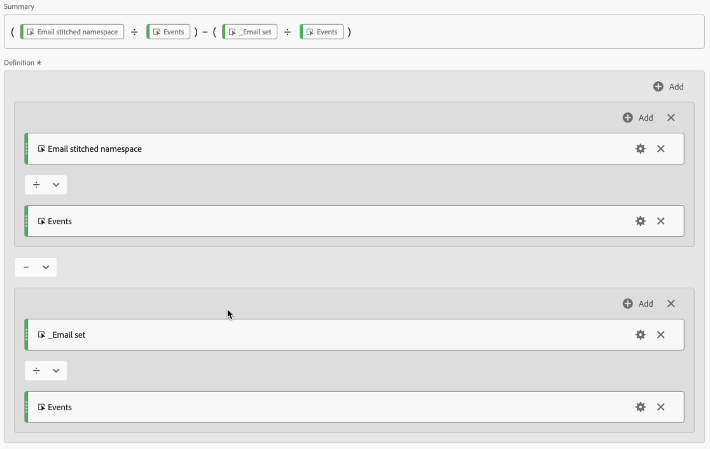

# Convalidare l’unione

L&#39;obiettivo di [unione identità](/help/stitching/overview.md) (o semplicemente unione) è quello di elevare l&#39;idoneità di un set di dati evento per l&#39;analisi cross-channel. Questa elevazione si ottiene quando tutte le righe di dati nel set di dati contengono l’ordine di identità più alto desiderato disponibile. Tale quota altimetrica consente di:

* Crea rapporti incentrati sulla persona senza escludere le persone anonime.
* Collegare più dispositivi a una singola persona.
* Connettere una persona tra canali diversi.

Questo articolo illustra metodi di analisi per misurare la quota altimetrica su uno o più set di dati uniti appena creati e per garantire che l’unione offra questi vantaggi.

I metodi di analisi coinvolgono [impostazioni del componente Visualizzazione dati](/help/data-views/component-settings/overview.md), generalmente accessibili agli amministratori. I metodi richiedono inoltre agli analisti che lavorano in un progetto Analysis Workspace di creare metriche calcolate e visualizzazioni.

Anche se questi metodi di analisi possono essere utilizzati sia per l’unione basata sui campi che per l’unione basata sui grafici, alcuni elementi potrebbero non essere presenti nel set di dati, in particolare in uno scenario di unione basata sui grafici. Questi elementi mancanti possono rendere difficile il calcolo dell’incremento direttamente in Analysis Workspace.

>[!NOTE]
>
>Questo articolo non tratta il valore complessivo di una configurazione Customer Journey Analytics con tutti i set di dati in Experience Platform allineati allo stesso spazio dei nomi dell’identità. E che tutti questi set di dati sono ben uniti tra loro per eseguire analisi su un intero percorso di clienti.

## Prerequisiti per la visualizzazione dati

Per il piano di misurazione della convalida dell’unione, è necessario assicurarsi di aver definito in una visualizzazione dati tutte le dimensioni e le metriche richieste dal set di dati uniti. È necessario verificare che i campi `stitchedID.id` e `stitchedId.namespace.code` siano aggiunti come dimensioni. Mentre il set di dati uniti è una copia esatta del set di dati originale, il processo di unione aggiunge queste due nuove colonne al set di dati:

* Utilizzare `stitchedID.namespace.code` per definire una dimensione **[!UICONTROL Stitched Namespace]**. Questa dimensione contiene lo spazio dei nomi dell&#39;identità a cui è stata elevata la riga, ad esempio `Email`, `Phone`. Oppure lo spazio dei nomi a cui fa riferimento il processo di unione, ad esempio `ECID`.
  

* Utilizzare `stitchedID.id` per definire una dimensione **[!UICONTROL Stitched ID value]**. Questa dimensione contiene il valore non elaborato dell’identità. Ad esempio: e-mail con hash, telefono con hash, ECID. Questo valore viene utilizzato con **[!UICONTROL Stitched Namespace]**.
  

Inoltre, devi aggiungere due metriche di unione basate sulla presenza di valori in una dimensione.

1. Utilizza il campo che contiene l’ID persona del set di dati uniti per configurare una metrica che definisce se è impostato un ID persona. Aggiungi questo ID persona anche se utilizzi l’unione basata su grafico, in quanto l’ID persona consente di stabilire una linea di base. Se l’ID persona non è contenuto nel set di dati, la linea di base è 0%.

   Nell&#39;esempio seguente, `personalEmail.address` funge da identità e viene utilizzato per creare la metrica **[!UICONTROL &#x200B; _Email set]**.
   

1. Usa il campo `stitchedID.namespae.code` per creare una dimensione **[!UICONTROL Email stitched namespace]**. Accertati di specificare [Includi impostazioni del componente Valori di esclusione](/help/data-views/component-settings/include-exclude-values.md), in modo da considerare solo i valori dello spazio dei nomi a cui stai tentando di elevare le righe di dati.
   1. Seleziona **[!UICONTROL Set include/exclude values]**.
   1. Seleziona **[!UICONTROL If all criteria are met]** come **[!UICONTROL Match]**.
   1. Specificare **[!UICONTROL Equals]** `email` come **[!UICONTROL Criteria]** per selezionare gli eventi che sono stati elevati allo spazio dei nomi e-mail.

   

## Dimensioni unite

Con entrambe queste dimensioni aggiunte alla visualizzazione dati, utilizza [Tabelle a forma libera](/help/analysis-workspace/visualizations/freeform-table/freeform-table.md) in Analysis Workspace per verificare i dati di ogni dimensione.

Nella tabella **[!UICONTROL Stitched Namespace dimension**] vengono in genere visualizzate due righe per ogni set di dati. Una riga che rappresenta quando il processo di unione ha dovuto utilizzare il metodo di fallback (ECID). L’altra riga mostra gli eventi associati allo spazio dei nomi dell’identità (e-mail) desiderato.

Per la tabella **[!UICONTROL Stitched ID dimension**] vengono visualizzati i valori non elaborati provenienti dagli eventi. In questa tabella, puoi vedere che i valori oscillano tra l’ID persistente e l’ID persona desiderato.

## Reporting incentrato su dispositivo o su persona

Quando crei una Connessione, devi definire quale campo o identità viene utilizzato per l’ID persona. Ad esempio, in un set di dati web, se scegli un ID dispositivo come ID persona, puoi creare rapporti incentrati sul dispositivo e perdere la possibilità di unire questi dati con altri canali offline. Se selezioni un campo o un’identità cross-channel, ad esempio e-mail, si perdono tutti gli eventi non autenticati. Per comprendere questo impatto, devi capire quanto traffico non è autenticato e quanto traffico è autenticato.

1. Creare una metrica calcolata **[!UICONTROL Unauthenticated events over total]**. Definisci la regola nel generatore di regole come segue:
   

1. Creare una metrica calcolata **[!UICONTROL Email authentication rate]**, in base alla metrica **[!UICONTROL _Email set]** definita in precedenza. Definisci la regola nel generatore di regole come segue:
   

1. Utilizzare la metrica calcolata **[!UICONTROL Unauthenticated events over total]** insieme alla metrica calcolata **[!UICONTROL Email authentication rate]** per creare una visualizzazione [Anello](/help/analysis-workspace/visualizations/donut.md). La visualizzazione mostra il numero di eventi nel set di dati che sono non autenticati e sono autenticati.

   

## Percentuali di identificazione dell’unione

Si desidera misurare le prestazioni di identificazione prima e dopo l&#39;unione. Per farlo, crea tre metriche calcolate aggiuntive:

1. Una metrica calcolata **[!UICONTROL Stitched authentication rate]** che calcola il numero di eventi in cui lo spazio dei nomi unito è impostato sull&#39;identità desiderata rispetto al numero totale di eventi. Quando si configura la visualizzazione dati, è stata creata una metrica **[!UICONTROL Email stitched namespace]** che include un filtro da contare solo quando uno spazio dei nomi di un evento è impostato su e-mail. La metrica calcolata utilizza questa metrica **[!UICONTROL Email stitched namespace]** per fornire un&#39;indicazione della percentuale di dati con l&#39;identità desiderata.
   

1. Una metrica calcolata **[!UICONTROL Percent increase]** che calcola la variazione percentuale non elaborata tra il tasso di identificazione corrente e quello unito.
   

1. Una metrica calcolata **[!UICONTROL Lift]** che calcola l&#39;incremento tra il tasso di identificazione corrente e il tasso di identificazione unito.
   

## Conclusione

Se combini tutti i dati in una tabella a forma libera di Analysis Workspace puoi iniziare a visualizzare l’impatto e il valore forniti dall’unione, inclusi:

* Tasso di autenticazione corrente: linea di base del numero di eventi che avevano già l’ID persona corretto sul numero totale di eventi.
* Tasso di autenticazione unita: il nuovo numero di eventi che presentano l’ID persona corretto sul numero totale di eventi.
* Aumento percentuale: l’aumento percentuale non elaborato dal tasso di autenticazione unita meno il tasso di autenticazione corrente linea di base.
* Incremento: variazione percentuale rispetto al tasso di autenticazione corrente previsto.

L’aspetto chiave di questo articolo è che questo tipo di convalida e analisi delle unioni consente di:

* Fornisci una visione completa personalizzata dell’efficacia dell’autenticazione confrontando le percentuali correnti con quelle unite.
* Consente di misurare chiaramente il miglioramento mediante aumenti percentuali e metriche di incremento.
* Identifica il vero impatto dell’implementazione dell’unione sull’autenticazione degli utenti.
* Crea un modo standardizzato per comunicare le prestazioni di autenticazione tra i team.
* Consente decisioni basate sui dati sulla strategia di autenticazione e l’ottimizzazione.

Queste metriche insieme forniscono alle parti interessate un quadro completo del modo in cui l’unione di Customer Journey Analytics influisce sui tassi di successo dell’autenticazione e sulle prestazioni complessive di identificazione della persona.
