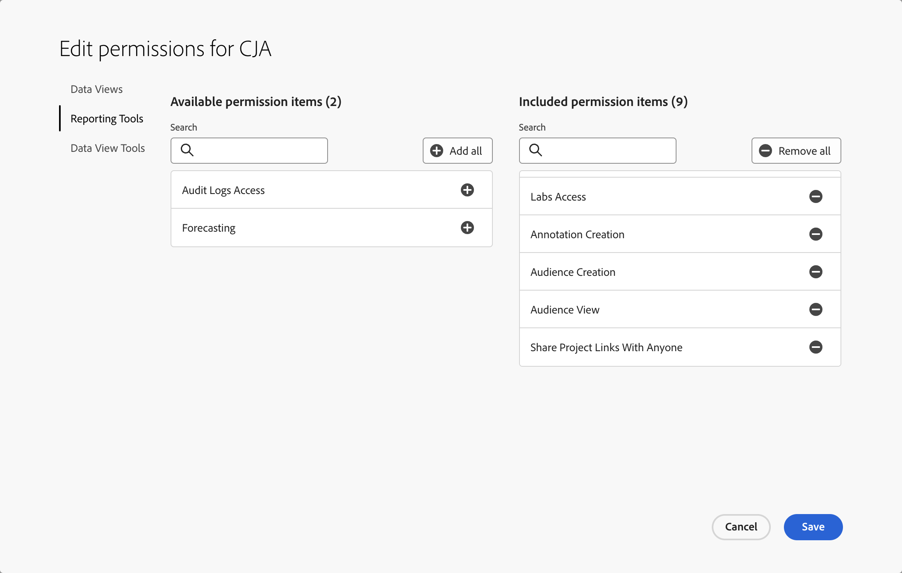

# Controllo degli accessi

Customer Journey Analytics è regolato da tre livelli di accesso o da tre ruoli: il ruolo di amministratore di prodotto, il ruolo di amministratore del profilo di prodotto e l’accesso a livello di utente. Questo argomento spiega questi ruoli nei dettagli.

Inoltre, in questo articolo vengono descritti modi più granulari per limitare l’accesso, come la cura di Workspace e il controllo dell’accesso a livello di riga o di valore.

## Controllo degli accessi basato su ruolo

Sono disponibili i seguenti livelli di controllo degli accessi basati su ruolo.

### Ruolo di amministratore di prodotto

Per impostazione predefinita, gli utenti a cui è assegnato il ruolo di amministratore di prodotto dispongono delle autorizzazioni necessarie per eseguire la maggior parte delle attività all’interno di Customer Journey Analytics. Tuttavia, alcune attività richiedono autorizzazioni aggiuntive.

Per aggiungere un utente come Amministratore di prodotto:

1. Vai a [Admin Console](https://adminconsole.adobe.com/enterprise/).

1. Seleziona [!UICONTROL **Customer Journey Analytics**] > scheda [!UICONTROL **Amministratori**] > [!UICONTROL **Aggiungi amministratore**].

   Agli utenti aggiunti vengono assegnate le [autorizzazioni predefinite dell’amministratore di prodotto](#product-admin-default-permissions). Se necessario, puoi anche concedere loro [autorizzazioni aggiuntive](#product-admin-additional-permissions).

#### Autorizzazioni predefinite dell’amministratore di prodotto

Gli amministratori di prodotto dispongono delle autorizzazioni per completare la maggior parte delle attività in Customer Journey Analytics.

Per impostazione predefinita, gli amministratori di prodotto dispongono delle autorizzazioni necessarie per eseguire le attività seguenti:

* Aggiornare o eliminare progetti, segmenti, metriche calcolate, tipi di pubblico, annotazioni o segmenti creati da altri utenti
* Condividere progetti Workspace con tutti gli utenti
* Gestire le attività di reporting in [Reporting Activity Manager](/help/reporting-activity-manager/reporting-activity-overview.md)
* [Esportare tabelle complete](/help/analysis-workspace/export/export-cloud.md) da Analysis Workspace

#### Autorizzazioni aggiuntive dell’amministratore di prodotto

Oltre a essere stato aggiunto come amministratore di prodotto nel **profilo di prodotto Customer Journey Analytics** in [Admin Console](https://adminconsole.adobe.com/enterprise/), sono necessarie autorizzazioni aggiuntive per completare le seguenti attività in Customer Journey Analytics:

* Creare, aggiornare ed eliminare [visualizzazioni dati](/help/data-views/data-views.md).
* Creare, aggiornare ed eliminare [connessioni](/help/connections/overview.md)

  Per eseguire questa attività, gli utenti devono far parte di un **profilo di prodotto Experience Platform** che fornisce le seguenti autorizzazioni:

  | Categoria | Autorizzazione | Descrizione |
  |---|---|---|
  | [!UICONTROL Sandbox] | [!UICONTROL Almeno uno] | Accesso alle sandbox pertinenti per le connessioni. |
  | [!UICONTROL Modellazione dati] | [!UICONTROL Visualizza schemi] | Accesso in sola lettura agli schemi e alle risorse correlate. |
  | [!UICONTROL Modellazione dati] | [!UICONTROL Gestisci schemi] | Accesso per leggere, creare, modificare ed eliminare schemi e risorse correlate. |
  | [!UICONTROL Gestione dati] | [!UICONTROL Visualizza set di dati] | Accesso in sola lettura per set di dati e schemi. |
  | [!UICONTROL Identity Management] | [!UICONTROL Visualizza spazi dei nomi delle identità] | Accesso in sola lettura per gli spazi dei nomi identità. |

  Per ulteriori informazioni sulle autorizzazioni di Experience Platform, consulta [Gestire le autorizzazioni per un profilo di prodotto](https://experienceleague.adobe.com/it/docs/experience-platform/access-control/ui/permissions).

* Se Journey Optimizer è integrato con Customer Journey Analytics in cui sono presenti connessioni Journey Optimizer, devi aggiungere anche le autorizzazioni dei percorsi per accedere alle connessioni:

  | Categoria | Autorizzazione | Descrizione |
  |---|---|---|
  | [!UICONTROL Percorsi] | [!UICONTROL Visualizza eventi, origini dati e azioni dei percorsi] | Accesso in sola lettura a eventi del percorso, azioni personalizzate del percorso e origini dati del percorso. |
  | [!UICONTROL Percorsi] | [!UICONTROL Gestisci eventi, origini dati e azioni dei percorsi] | Leggi, crea, modifica ed elimina eventi, origini o azioni. |
  | [!UICONTROL Percorsi] | [!UICONTROL Visualizza percorsi] | Accesso in sola lettura ai percorsi. |
  | [!UICONTROL Percorsi] | [!UICONTROL Gestisci percorsi] | Leggi, crea, modifica ed elimina i percorsi. |

* Esporta set di dati nelle [destinazioni](https://experienceleague.adobe.com/it/docs/experience-platform/destinations/ui/activate/export-datasets)

  Per eseguire questa attività, gli utenti devono far parte di un **profilo di prodotto Experience Platform** che fornisce le seguenti autorizzazioni:

  | Categoria | Autorizzazione | Descrizione |
  |---|---|---|
  | [!UICONTROL Destinazioni] | [!UICONTROL Gestisci destinazioni] | Accesso per leggere, creare ed eliminare connessioni di destinazione e account di destinazione. |
  | [!UICONTROL Destinazioni] | [!UICONTROL Attiva destinazioni] | Consente agli utenti di attivare i segmenti nelle destinazioni esistenti. Abilita il passaggio di mappatura nel flusso di lavoro di attivazione. Questa autorizzazione richiede anche che l’autorizzazione Visualizza destinazioni sia concessa all’utente che desidera attivare i dati nelle destinazioni. |

  Per ulteriori informazioni sulle autorizzazioni di Experience Platform, consulta [Gestire le autorizzazioni per un profilo di prodotto](https://experienceleague.adobe.com/it/docs/experience-platform/access-control/ui/permissions).

* Utilizzare l’[estensione BI](../data-views/bi-extension.md)

  Per consentire agli utenti di utilizzare l’estensione BI, un amministratore di prodotto

   * deve garantire che le autorizzazioni di Experience Platform per l’utente includano un ruolo che disponga della risorsa Query Service con le opzioni Gestisci query e Gestisci integrazione Query Service. Per ulteriori informazioni sulle autorizzazioni di Experience Platform, consulta [Gestire le autorizzazioni per un profilo di prodotto](https://experienceleague.adobe.com/it/docs/experience-platform/access-control/ui/permissions).

     | Categoria | Autorizzazione | Descrizione |
     |---|---|---|
     | [!UICONTROL Query Service] | [!UICONTROL Gestisci query] | Accesso per leggere, creare, modificare ed eliminare query SQL strutturate per i dati di Platform. |
     | [!UICONTROL Query Service] | [!UICONTROL Gestisci integrazione Query Service] | Accesso per creare, aggiornare ed eliminare credenziali senza scadenza per l’accesso a Query Service. |

   * deve garantire le autorizzazioni Customer Journey Analytics appropriate per l’utente:
      * l’autorizzazione ad accedere alle visualizzazioni dati pertinenti. Consulta [!UICONTROL Visualizzazioni dati] in [Accesso a livello di utente](#user-level-access).
      * l’autorizzazione ad accedere all’estensione BI di Customer Journey Analytics. Consulta [!UICONTROL Strumenti di visualizzazione dati] in [Accesso a livello di utente](#user-level-access).

### Ruolo di amministratore del profilo di prodotto

Un profilo di prodotto è un set di autorizzazioni. Gli amministratori di prodotto creano profili di prodotto e possono assegnare il ruolo di Amministratore del profilo di prodotto al fine di gestire uno o più profili di prodotto. Un amministratore del profilo di prodotto può quindi:

* Gestire i profili di prodotto assegnati. Ad esempio, aggiungendo o rimuovendo utenti o gruppi di utenti e modificando le autorizzazioni per i profili di prodotto.

* In Customer Journey Analytics, possono modificare le visualizzazioni dati che fanno parte di un profilo di prodotto assegnato. Gli amministratori dei profili di prodotto non possono creare nuove visualizzazioni dati.

### Accesso a livello di utente

La tabella seguente illustra le autorizzazioni di accesso principali per diverse funzionalità di Customer Journey Analytics che puoi configurare per gli utenti rilevanti. Puoi gestire diversi livelli di accesso utente tramite i profili di prodotto. Un profilo di prodotto combina una serie di autorizzazioni che puoi quindi assegnare a singoli utenti o gruppi di utenti.

La scheda **[!UICONTROL Autorizzazioni]** fa parte di ciascun profilo di prodotto in [Admin Console](https://adminconsole.adobe.com/enterprise/).

| Categoria | Autorizzazione | Descrizione |
| --- | --- | ---|
| [!UICONTROL Visualizzazioni dati] | *nome visualizzazione dati* | Se imposti l&#39;opzione **[!UICONTROL Inclusione automatica]** su **[!UICONTROL Attiva]**, gli utenti che fanno parte di questo profilo di prodotto possono visualizzare tutte le visualizzazioni di dati esistenti e appena create. Se questa impostazione è impostata su **[!UICONTROL Disattiva]**, puoi selezionare visualizzazioni dati specifiche a cui gli utenti hanno accesso. |
| [!UICONTROL Strumenti di reporting] | [!UICONTROL Accesso all’analisi guidata] | Consenti agli utenti di accedere all&#39;[Analisi guidata](/help/guided-analysis/overview.md). |
| [!UICONTROL Strumenti di reporting] | [!UICONTROL Creazione metrica calcolata] | Consenti agli utenti di creare [metriche calcolate](/help/components/calc-metrics/calc-metr-overview.md).  Gli utenti possono assegnare tag, condividere, eliminare e rinominare solo alle metriche calcolate create o a quelle condivise. |
| [!UICONTROL Strumenti di reporting] | [!UICONTROL Creazione di segmenti] | Consenti agli utenti di creare [segmenti](/help/components/segments/seg-overview.md). Gli utenti possono assegnare tag, condividere, eliminare e rinominare solo ai segmenti creati o a quelli condivisi con loro. |
| [!UICONTROL Strumenti di reporting] | [!UICONTROL Accesso a Labs] | Consenti agli utenti di accedere alla scheda [Labs](/help/labs/labs.md) in Customer Journey Analytics. |
| [!UICONTROL Strumenti di reporting] | [!UICONTROL Creazione di annotazioni] | Consenti agli utenti di creare [annotazioni](/help/components/annotations/overview.md).  Gli utenti possono gestire (taggare, condividere, eliminare o rinominare) esclusivamente le annotazioni create da loro o ricevute in condivisione. |
| [!UICONTROL Strumenti di reporting] | [!UICONTROL Visualizzazione del pubblico] | Consenti agli utenti di visualizzare i [segmenti di pubblico](/help/components/audiences/audiences-overview.md). |
| [!UICONTROL Strumenti di reporting] | [!UICONTROL Creazione del pubblico] | Consenti agli utenti di creare [audience](/help/components/audiences/audiences-overview.md). Richiede [Gestione segmenti](https://experienceleague.adobe.com/it/docs/experience-platform/access-control/home) in Adobe Experience Platform. |
| [!UICONTROL Strumenti di reporting] | [!UICONTROL Narrazione dei dati] | Consente agli utenti di [generare presentazioni con diapositive in base ai progetti Workspace.](/help/analysis-workspace/curate-share/generate-slides.md) |
| [!UICONTROL Strumenti di reporting] | [!UICONTROL Accesso a registri di audit] | Applica il controllo delle autorizzazioni all’[API](https://developer.adobe.com/cja-apis/docs/endpoints/auditlogs/) e all’interfaccia utente dei registri di audit. |
| [!UICONTROL Strumenti di reporting] | [!UICONTROL Condividi i collegamenti al progetto con chiunque] | Consente agli utenti [di condividere i progetti con chiunque.](https://experienceleague.adobe.com/it/docs/analytics-platform/using/cja-workspace/curate-share/share-projects) |
| [!UICONTROL Strumenti di reporting] | [!UICONTROL Previsione] | Consente agli utenti di accedere alla funzione [Previsione](../analysis-workspace/c-forecast/forecasting.md) in Analysis Workspace |
| [!UICONTROL Strumenti di reporting] | [!UICONTROL Assistente IA: conoscenza del prodotto] | Consente agli utenti di accedere all’[Assistente IA](../ai-assistant.md) per conoscere il prodotto. |
| [!UICONTROL Strumenti di reporting] | [!UICONTROL Agente Data Insights] | Consenti agli utenti di accedere a [Data Insights Agent](../data-analysis-ai.md) per approfondimenti sui dati basati sull&#39;intelligenza artificiale. |
| [!UICONTROL Strumenti di reporting] | [!UICONTROL Didascalie intelligenti] | Consente agli utenti di accedere a [Didascalie intelligenti](/help/analysis-workspace/visualizations/intelligent-captions.md). |
| [!UICONTROL Strumenti di visualizzazione dati] | [!UICONTROL Esportazione tabella completa] | Consente agli utenti di [esportare tabelle complete nel cloud](/help/analysis-workspace/export/export-cloud.md). |
| [!UICONTROL Strumenti di visualizzazione dati] | [!UICONTROL Estensione CJA BI] | Consente agli utenti di utilizzare l’estensione [BI](../data-views/bi-extension.md). |

{style="table-layout:auto"}

## Cura dei progetti Workspace

È possibile utilizzare un altro livello di controllo degli accessi a livello di reporting di Workspace. Puoi limitare l’accesso a componenti specifici per determinati utenti. Per ulteriori informazioni su come limitare i componenti (dimensioni, metriche, segmenti, intervalli di date) a livello di progetto Workspace e come la cura è associata alle visualizzazioni dati, consulta [Curare i progetti](/help/analysis-workspace/curate-share/curate.md).

## Consentire l’accesso a singole metriche o dimensioni

Non puoi concedere o negare autorizzazioni per singole metriche o dimensioni in Customer Journey Analytics, come invece puoi fare in Adobe Analytics. Le metriche e le dimensioni possono essere modificate nelle [visualizzazioni dati](/help/data-views/data-views.md) e sono quindi soggette a modifiche in Customer Journey Analytics. La relativa modifica comporta anche modifiche retroattive del reporting.

## Casi d’uso

Di seguito sono riportati alcuni casi d’uso che illustrano come il controllo degli accessi può essere utilizzato in scenari reali.

### Accesso di terze parti

Puoi fornire l’accesso all’amministrazione del profilo di prodotto a un responsabile di team presso una terza parte con cui lavora la tua azienda. Tale amministratore può quindi aggiungere utenti del team dell’azienda a questo profilo di prodotto. Tale amministratore del profilo di prodotto può concedere l’accesso a specifiche visualizzazioni dati e aggiungere altri utenti presso una terza parte a questo profilo di prodotto. L’amministratore del profilo di prodotto può modificare le visualizzazioni dati in base ai requisiti del team presso una terza parte.

### Controllo dell’accesso a livello di riga

Supponiamo che tu voglia permettere agli utenti di accedere ai dati di un solo giorno. Ecco come limitare l’accesso a queste righe specifiche:

1. Crea un segmento in [!UICONTROL Impostazioni] di una visualizzazione dati specifica, dove [!UICONTROL Giorno] è uguale alla data i cui dati desideri siano accessibili agli utenti. Per ulteriori informazioni, consulta [Crea visualizzazione dati](/help/data-views/create-dataview.md#settings-filters).
1. Salva la visualizzazione dati, che applica il segmento alla parte di dati dei set di dati nella connessione sottostante. Tutte le righe che non rientrano nella definizione del segmento vengono automaticamente escluse dalla visualizzazione dati e non sono disponibili in Analysis Workspace quando si utilizza questa visualizzazione dati.
1. Crea un nuovo [profilo di prodotto](#product-profile-admin-role) in Admin Console, aggiungi gli utenti al profilo di prodotto e includi solo questa visualizzazione dati specifica nel profilo di prodotto.

### Controllo dell’accesso a livello di valore

Gli utenti che hanno accesso a una visualizzazione dati possono lavorare solo con le metriche e le dimensioni incluse dall’amministratore in questa visualizzazione dati. Gli amministratori possono utilizzare le impostazioni del componente [Includi/Escludi funzionalità](/help/data-views/component-settings/include-exclude-values.md) o [Bucket dei valori](../data-views/component-settings/value-bucketing.md) in una visualizzazione dati per escludere o aggregare determinati valori di dimensione da una visualizzazione dati.

Ad esempio: puoi creare una metrica denominata *Ipertensione* all&#39;interno di una visualizzazione dati, partendo da un componente che contiene i dati dei singoli pazienti del set di dati. L&#39;aggregazione dei dati in bucket garantisce l&#39;accesso esclusivamente a valori collettivi, impedendo agli utenti la visualizzazione dei singoli record dei pazienti.
