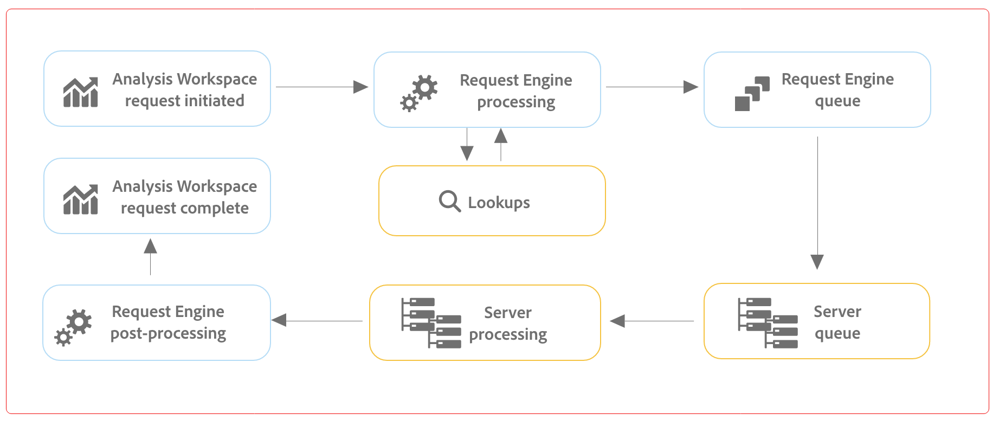

# Ottimizzare le prestazioni di Customer Journey Analytics e [!UICONTROL Analysis Workspace]

Diversi fattori possono influenzare le prestazioni complessive di Customer Journey Analytics e le prestazioni di un progetto in Analysis Workspace. In Workspace, potresti ricevere un messaggio di errore che indica

`This query is too complex. Please review best practices for building Analysis Workspace queries.`

Queste best practice descrivono quali fattori potrebbero causare questo errore e come semplificare il rapporto/progetto.

## Fattori di query {#query}

Questi sono i fattori di query più comuni che influenzano le prestazioni complessive di Customer Journey Analytics:

| Fattore | Definizione | Influenzato da | Ottimizzazione |
| --- | --- | --- | --- |
| **Numero di righe e colonne a forma libera** | Numero totale di celle di tabella a forma libera nel progetto, calcolato come righe * colonne per tutte le tabelle. Sono escluse le origini di dati nascosti. La soglia consigliata è 4000. | | Riduci il numero di colonne nella tabella, includendo solo i punti dati più rilevanti. Riduci il numero di righe nella tabella regolando il numero di righe visualizzate, applicando un segmento di tabella o applicando un segmento. |
| **Componenti utilizzati** | Numero totale di componenti utilizzati nel progetto. La soglia consigliata è 100. | Il numero di componenti utilizzati non influisce direttamente sulle prestazioni. Tuttavia, la complessità di tali componenti contribuirà alle prestazioni del progetto. Consulta le ottimizzazioni nella sezione “Altri fattori”, di seguito. |
| **Intervallo date più lungo** | Questo fattore visualizza l’intervallo di date più lungo utilizzato nel progetto. La soglia consigliata è 1 anno. |  | Dove possibile, non inserire più dati del necessario. Limita il calendario del pannello alle date pertinenti per l’analisi o utilizza i componenti per intervallo di date (componenti viola) nelle tabelle a forma libera. Gli intervalli di date utilizzati in una tabella prevalgono sull’intervallo di date del pannello. Ad esempio, puoi aggiungere alle colonne della tabella Mese scorso, Settimana scorsa e Ieri, per richiedere tali intervalli di dati specifici. Per ulteriori informazioni sulle attività con gli intervalli di date in Analysis Workspace, guarda [questo video](https://experienceleague.adobe.com/docs/analytics-learn/tutorials/analysis-workspace/calendar-and-date-ranges/date-ranges-and-calendar-in-analysis-workspace.html?lang=it).   Inoltre, riduci al minimo il numero di confronti su base annua utilizzati nel progetto. Quando viene calcolato un confronto su base annua, vengono esaminati 13 mesi di dati tra i mesi di interesse. Questo ha lo stesso impatto di un intervallo di date del pannello impostato sugli ultimi 13 mesi. |
| **Complessità del segmento** | Segmenti complessi possono avere un impatto significativo sulle prestazioni del progetto. | I fattori che aggiungono complessità a un segmento (in ordine approssimativo di impatto) includono: <ul><li>Operatori “contiene”, “contiene qualsiasi di”, “corrisponde a”, “inizia con” o “termina con” </li><li>Segmentazione sequenziale, soprattutto quando si utilizzano restrizioni di dimensione (entro/dopo) </li><li>Numero di elementi dimensionali univoci all’interno delle dimensioni utilizzate nel segmento (ad esempio, Pagina = &quot;A&quot; quando Pagina ha 10 elementi univoci sarà più veloce di Pagina = &quot;A&quot; quando Pagina ha 100000 elementi univoci) </li><li>Numero di diverse dimensioni utilizzate (ad es. Pagina = “Home” e Pagina = “Risultati della ricerca” sarà più veloce di eVar 1 = “rosso” ed eVar 2 = “blu”)</li><li>Molti operatori O (invece di E)</li><li>Contenitori nidificati di vario ambito (ad esempio, &quot;Evento&quot; all’interno di &quot;Sessione&quot; all’interno di &quot;Persona&quot;)</li></ul> | Mentre alcuni dei fattori di complessità non possono essere evitati, cerca di individuare le opportunità di riduzione della complessità dei segmenti. In generale, più si può essere specifici con i propri criteri di segmento, meglio è. Ad esempio:<ul><li>Con i contenitori, l’utilizzo di un singolo contenitore nella parte superiore del segmento è più veloce di una serie di contenitori nidificati.</li><li>Con l’utilizzo degli operatori, &quot;uguale a&quot; è più veloce di &quot;contiene&quot; e &quot;uguale a qualsiasi di&quot; è più veloce di &quot;contiene qualsiasi di&quot;.</li><li>Con molti criteri, gli operatori AND sono più veloci di una serie di operatori OR.</li></ul> Cercare opportunità per ridurre molte istruzioni OR in un&#39;unica istruzione &quot;equals any of&quot;.  |
| **Complessità della visualizzazione** (segmenti, metriche, filtri) | Il tipo di visualizzazione (ad esempio abbandono rispetto a una tabella a forma libera) aggiunta a un progetto di per sé non influenza molto le prestazioni del progetto. È la complessità della visualizzazione che aumenta il tempo di elaborazione. | Fattori che aggiungono complessità a una visualizzazione includono:<ul><li>Intervallo dei dati richiesti</li><li>Numero di segmenti applicati; ovvero segmenti utilizzati come righe di una tabella a forma libera</li><li>Utilizzo di segmenti complessi</li><li>Righe o colonne [statiche di elementi](/help/analysis-workspace/visualizations/freeform-table/column-row-settings/manual-vs-dynamic-rows.md) in tabelle a forma libera</li><li>Segmenti applicati alle righe nelle tabelle a forma libera</li><li>Numero di metriche incluse, in particolare metriche calcolate che utilizzano segmenti</li></ul> |
| **Capacità del centro dati** | Capacità di generazione dei rapporti condivisa da te e altri clienti all’interno di un data center di Adobe. | È influenzata dal numero di query simultanee effettuate dalla tua organizzazione e da altre organizzazioni all’interno del centro dati. | La tua organizzazione ha diritto a una determinata capacità e, se il carico del sistema è leggero, Adobe ti allocherà una maggiore capacità, oltre il limite determinato. |
| **Numero di query simultanee** | Il numero di query che vengono richieste contemporaneamente dall’organizzazione. Ogni organizzazione ha diritto a un minimo di 5 query simultanee. Se un rapporto richiede molto tempo, è probabile che si trovi in coda con altri rapporti. L’organizzazione sta tentando di eseguire molte richieste simultanee su una visualizzazione dati specifica. | Le query possono provenire da richieste API, interfacce per la generazione di rapporti (Analysis Workspace, Report Builder, ecc.), progetti pianificati, avvisi pianificati e utenti simultanei che eseguono richieste di reporting. | Distribuisci le richieste e le pianificazioni per la visualizzazione dati in modo più uniforme nel corso della giornata. Inoltre, se possibile, rimanda le tue richieste a orari fuori picco. Lunedì mattina, martedì mattina e il primo di ogni mese sono solitamente momenti di picco per la generazione di rapporti. |
| **Dimensione connessione** | La quantità di dati raccolti nella connessione. |  | Rivolgiti al team addetto all’implementazione o all’esperto Customer Journey Analytics per determinare se è possibile migliorare l’implementazione al fine di migliorare l’esperienza complessiva in Customer Journey Analytics. |
| **Complessità delle impostazioni delle dimensioni** | Dimensioni molto complesse possono avere un impatto significativo sulle prestazioni del progetto, in particolare dimensioni o metriche basate su campi personalizzati complessi. | | Riduci il numero di campi personalizzati o crea dimensioni separate. |
| **Dimensioni con molti valori univoci** | Anche note come dimensioni ad alta cardinalità, queste possono influire sulle prestazioni di reporting. | Vedi [dimensioni ad alta cardinalità](/help/components/dimensions/high-cardinality.md) | Vedi [dimensioni ad alta cardinalità](/help/components/dimensions/high-cardinality.md) |

## [!UICONTROL Help] > [!UICONTROL Performance] in Analysis Workspace

Alcuni fattori possono incidere sulle prestazioni di un progetto in Analysis Workspace. È importante conoscere tali fattori prima di iniziare a creare un progetto, in modo da pianificare e creare il progetto nel modo migliore. Questa sezione include un elenco di fattori che influiscono sulle prestazioni e possibili ottimizzazioni per garantire prestazioni di picco in Analysis Workspace.

In **Analysis Workspace > [!UICONTROL Help] >[!UICONTROL Performance]** puoi vedere quali fattori influiscono sulle prestazioni del progetto, compresi rete, browser e fattori del progetto. Per ottenere risultati più precisi, aspetta che il progetto sia stato caricato completamente prima di aprire la pagina Prestazioni.

* La colonna Progetto corrente presenta i risultati per il progetto corrente e l’ambiente utente.
* La colonna Linee guida presenta la soglia consigliata da Adobe per ciascun fattore.

Puoi anche **Download as CSV** (Scaricare come CSV) i contenuti delle prestazioni, per condividerli facilmente con l’Assistenza clienti di Adobe o con il tuo team IT interno.

>[!NOTE]
>
>Le informazioni nella pagina Prestazioni variano ogni volta che viene aperta questa finestra modale, in quanto i fattori sono soggetti a modifiche. Inoltre, Adobe continuerà a perfezionare le linee guida fornite man mano che diventano disponibili ulteriori dati.

### Fattori di rete

I fattori di rete in [!UICONTROL Help] > [!UICONTROL Performance] includono:

| Fattore | Definizione | Influenzato da | Ottimizzazione |
| --- | --- | --- | --- |
| **Connessione ad Adobe** | Adobe invia 10 chiamate di test all’apertura della pagina Prestazioni. Rappresenta la percentuale delle chiamate ad Adobe che hanno esito positivo. | Su questo fattore incidono problemi di rete locale o problemi della rete Adobe. | Visita status.adobe.com per verificare se esistono problemi di servizio noti. Quindi, controlla la tua connessione di rete locale. |
| **Larghezza di banda Internet** | Disponibile solo per Google Chrome. Stima della larghezza di banda fornita dal browser in uso. La soglia consigliata è 2,0 MB/s. | Su questo fattore incide la connessione di rete locale. | Controlla la tua connessione di rete locale. |
| **Latenza Internet** | Adobe invia 10 chiamate di test all’apertura della pagina Prestazioni. La latenza corrisponde al tempo medio necessario affinché ogni richiesta arrivi ad Adobe e venga quindi restituita. In altre parole, indica la velocità di Internet tra la tua posizione e Adobe. La soglia consigliata è &lt; 1 secondo. | Su questo fattore incidono problemi di rete locale, la presenza di numerose schede aperte nel browser o problemi della rete Adobe. | Visita status.adobe.com per verificare se esistono problemi di servizio noti. Quindi, controlla la tua connessione di rete locale e chiudi le schede del browser che non inutilizzi. |

### Fattori del browser

I fattori del browser in [!UICONTROL Help] > [!UICONTROL Performance] includono:

| Fattore | Definizione | Influenzato da | Ottimizzazione |
| --- | --- | --- | --- |
| **Velocità di calcolo** | Velocità del computer per l’esecuzione di un test di elaborazione. La soglia consigliata è &lt; 750 ms. | Su questo fattore incidono l’hardware e i programmi in esecuzione allo stesso tempo. | Apri Gestione attività (PC) o Monitoraggio attività (Mac) per determinare se è possibile chiudere alcuni dei programmi aperti. Quindi, chiudi le schede del browser inutilizzate o altri programmi.   Se tali azioni non migliorano le prestazioni, rivolgiti al tuo team IT per valutare i dettagli hardware. |
| **Memoria utilizzata** | Disponibile solo per Google Chrome. Ogni scheda di Workspace in un browser Google Chrome condivide 4 GB di memoria in totale. Questo valore indica la percentuale di tale quota di memoria che viene effettivamente utilizzata dal progetto corrente. La soglia consigliata è di 3500 MB; oltre tale valore, Workspace inizierà a presentare errori di memoria. | Se si lavora con più schede o si scaricano 50000 righe di dati, verrà utilizzata più memoria. | Se ricevi un errore di memoria, chiudi le altre schede di Workspace e/o esegui un download di 50000 righe alla volta. |
| **Archiviazione locale utilizzata** | Dati memorizzati localmente sul computer da utilizzare nel browser. Ciascuna origine (ad esempio experience.adobe.com) dispone di un limite di 10 MB. | Analysis Workspace utilizza l’archiviazione locale per diverse funzioni, quali l’archiviazione dei salvataggi automatici di progetti esistenti, le impostazioni utente e i flag delle funzioni. | Per evitare l’interruzione delle funzioni di Analysis Workspace, cancella l’archiviazione locale per il dominio experience.adobe.com. |
| **Velocità di rendering** | FPS è l’acronimo di frame al secondo, ossia quante volte al secondo il browser disegna la pagina sullo schermo. L’occhio può osservare 24 fps; se il valore fps è inferiore a 24, in Workspace saranno visibili problemi di rendering. | Il valore fps è influenzato dal multitasking in molti progetti Workspace allo stesso tempo e dalle dimensioni del progetto visualizzato. È influenzato inoltre dall’esecuzione di altri programmi sul computer, come streaming, scanner in background, ecc. Anche l’hardware incide su questo fattore. | Apri Gestione attività (PC) o Monitoraggio attività (Mac) per determinare se è possibile chiudere alcuni dei programmi aperti. Quindi, chiudi le schede del browser inutilizzate o altri programmi.   Se tali azioni non migliorano le prestazioni, rivolgiti al tuo team IT per valutare i dettagli hardware. |

### Fattori del progetto

I fattori del progetto in [!UICONTROL Help] > [!UICONTROL Performance] includono:

| Fattore | Definizione | Ottimizzazione |
| --- | --- | --- |
| **Numero di query** | Numero totale di query (richieste) inviate ad Adobe per recuperare i dati da visualizzare nel progetto. Le query includono richieste con classificazione per tabelle, rilevamento di anomalie, grafici sparkline, componenti visualizzati nella barra a sinistra e altri ancora. Non sono invece inclusi le visualizzazioni e i pannelli compressi. La soglia consigliata è 100. | Semplifica il progetto laddove possibile, suddividendo i dati in diversi progetti in base a uno scopo specifico o a un gruppo di soggetti interessati. Utilizza i tag per organizzare i progetti in temi e utilizza [collegamenti diretti](https://experienceleague.adobe.com/docs/analytics/analyze/analysis-workspace/curate-share/shareable-links.html?lang=it) per creare un sommario interno che consenta agli interessati di trovare facilmente ciò di cui hanno bisogno. |
| **Pannelli espansi (sul totale dei pannelli)** | Numero di pannelli espansi rispetto al numero totale di pannelli nel progetto. La soglia consigliata è 5. | Dopo aver semplificato il progetto, comprimi i pannelli che non è necessario visualizzare al momento del caricamento. All’apertura di un progetto, vengono elaborati solo i pannelli espansi. I pannelli compressi vengono caricati solo quando l’utente li espande. |
| **Visualizzazioni espanse (sul totale delle visualizzazioni)** | Numero di tabelle e visualizzazioni espanse rispetto al totale nel progetto, incluse le origini dati nascoste. La soglia consigliata è 15. | Dopo aver semplificato il progetto, comprimi le visualizzazioni che non è necessario visualizzare al momento del caricamento. Dai priorità agli elementi visivi più importanti per chi userà il rapporto e, se necessario, suddividi gli elementi visivi di supporto in un pannello o un progetto separato e più dettagliato. |
| **Numero di celle a forma libera** | Vedi la tabella &quot;Fattori di query&quot; sopra. | |
| **Componenti utilizzati** | Vedi la tabella &quot;Fattori di query&quot; sopra. | |
| **Intervallo date più lungo** | Vedi la tabella &quot;Fattori di query&quot; sopra. | |

## Fattori di richiesta

[!UICONTROL Help] > [!UICONTROL Performance] fattori di richiesta

Utilizza il diagramma e i termini seguenti per scoprire come vengono elaborate le richieste e i vari fattori che influenzano i tempi di elaborazione:

>[!NOTE]
>
>Le linee guida consigliate per questi fattori si basano su un punteggio di complessità di Medium per le richieste di reporting.

### Diagramma di elaborazione delle richieste

### Richiedi termini di elaborazione

| Fattore | Definizione | Ottimizzazione |
| --- | --- | --- |
| [!UICONTROL **Tempo medio di richiesta**] | Il tempo necessario dall’avvio della richiesta al completamento. La soglia consigliata è 15 secondi. 
Nel diagramma [Elaborazione richiesta](#request-processing-diagram) riportato sopra, il tempo di richiesta rappresenta l&#39;intero processo, da **Richiesta Analysis Workspace avviata** a **Richiesta Analysis Workspace completata**.
 |  |
| [!UICONTROL **Tempo di richiesta più lungo**] | Il tempo necessario dall’avvio della richiesta al completamento. 
Nel diagramma [Elaborazione richiesta](#request-processing-diagram) riportato sopra, il tempo di richiesta rappresenta l&#39;intero processo, da **Richiesta Analysis Workspace avviata** a **Richiesta Analysis Workspace completata**.
 |  |
| [!UICONTROL **Tempo medio di ricerca**] | Poiché Analysis Workspace memorizza solo l&#39;hash per le stringhe utilizzate in qualsiasi segmento, ogni volta che si elabora un progetto vengono eseguite **ricerche** per far corrispondere gli hash con i valori appropriati. La soglia consigliata è inferiore a 2 secondi.
Questo può richiedere molte risorse, a seconda del numero di valori che potrebbero potenzialmente corrispondere all’hash. 

Nel diagramma [Elaborazione richiesta](#request-processing-diagram) riportato sopra, il tempo di ricerca è rappresentato nella fase **Ricerche** (al momento della **elaborazione del motore di richiesta**).
 | Se le richieste rallentano qui, è probabile che il problema sia dovuto al fatto che nel progetto sono presenti troppi segmenti di stringa o stringhe con valori eccessivamente generici con troppe potenziali corrispondenze. |
| [!UICONTROL **Tempo medio coda**] | Tempo totale di attesa in coda prima dell’elaborazione delle richieste. La soglia consigliata è di 5 secondi.
Nel diagramma [Elaborazione richiesta](#request-processing-diagram) riportato sopra, il tempo di coda è rappresentato nella fase **Coda motore di richiesta** e nella fase **Coda server**.
 | Se le richieste rallentano qui, la causa potrebbe essere un numero eccessivo di richieste in esecuzione simultaneamente nell’organizzazione. Prova a eseguire la richiesta in un orario non di punta. |
| [!UICONTROL **Tempo medio di elaborazione del server**] | Il tempo medio necessario per elaborare la richiesta.
Nel diagramma [Elaborazione richiesta](#request-processing-diagram) riportato sopra, il tempo medio di elaborazione del server è rappresentato nella fase **Coda server** e nella fase **Elaborazione server**. La soglia consigliata è 10 secondi | Se le richieste di rallentano qui, è probabile che il progetto abbia intervalli di date eccessivamente lunghi o visualizzazioni complesse. Prova ad abbreviare l’intervallo di date del progetto per ridurre i tempi di elaborazione. |
| [!UICONTROL **Complessità**] | Il tempo di elaborazione non è uguale per tutte le richieste. La complessità delle richieste può essere utile per avere un’idea generale sul tempo necessario per elaborarle. La soglia consigliata è Medium o inferiore. 
I valori possibili includono:
 <ul><li>[!UICONTROL **Basso**]</li><li>[!UICONTROL **Medio**]</li><li>[!UICONTROL **Alto**]</li></ul>Questo valore è influenzato dai valori delle colonne seguenti:<ul><li>[!UICONTROL **Limiti del mese**]</li><li>[!UICONTROL **Colonne**]</li><li>[!UICONTROL **Segmenti**]</li></ul> |  |
| [!UICONTROL **Limiti del mese**] | Il numero di mesi inclusi in una richiesta. L’aumento dei limiti di mese aggiunge complessità alla richiesta. La soglia consigliata è pari o inferiore a 6. | Se le richieste rallentano qui, è possibile che i limiti dei mesi nel progetto siano troppo grandi. Prova a ridurre il numero di mesi. |
| [!UICONTROL **Colonne**] | Il numero di metriche e raggruppamenti nella richiesta. Più colonne aumenta la complessità della richiesta. La soglia consigliata è pari o inferiore a 10. | Se le richieste rallentano qui, è possibile che il progetto contenga troppe colonne. Prova a ridurre il numero di colonne. |
| [!UICONTROL **Segmenti**] | Il numero di segmenti applicati alla richiesta. Altri segmenti aumentano la complessità della richiesta. La soglia consigliata è pari o inferiore a 5. | Se le richieste rallentano qui, è possibile che il progetto contenga troppi segmenti. Prova a ridurre il numero di segmenti. |
