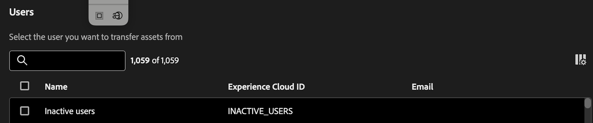

# Trasferire le risorse

Lo strumento Asset Transfer (Trasferimento risorse) consente di trasferire la proprietà delle risorse ad altri utenti. Le risorse possono includere componenti quali progetti, segmenti, intervalli di date, metriche calcolate, annotazioni, avvisi e progetti pianificati.

Le risorse sono associate a un singolo proprietario e in alcuni casi, come segmenti e metriche calcolate, non possono essere modificate o condivise anche dagli amministratori. Quando gli utenti abbandonano l’organizzazione o il rispettivo ruolo cambia, potrebbe diventare necessario trasferire la proprietà di queste risorse ad altri utenti per garantire la continuità e l’accesso appropriato.

## Autorizzazioni

Il trasferimento delle risorse richiede l’autorizzazione dell’amministratore di prodotto per Customer Journey Analytics.

## Trasferire le risorse

1. In CJA, passa a **[!UICONTROL Strumenti]** > **[!UICONTROL Trasferimento risorse]**.

   

1. Nella finestra di dialogo **[!UICONTROL Utenti]**, cerca e seleziona l&#39;utente da cui desideri trasferire le risorse.

   >[!IMPORTANT]
   >
   >È possibile eseguire solo un trasferimento 1:1 da un utente a un altro. I trasferimenti uno-a-molti o molti-a-uno non sono supportati.

1. Dopo aver selezionato un utente, nella parte inferiore della schermata viene visualizzata l’opzione Transfer assets (Trasferisci risorse).

   

1. Fai clic su **[!UICONTROL Trasferisci risorse]**.

1. Nella schermata **[!UICONTROL Trasferisci risorse]**, seleziona innanzitutto il destinatario a cui desideri trasferire le risorse.

1. Ora scorri la cartella di ciascun componente nel menu di navigazione a sinistra per selezionare i singoli componenti o tutte le risorse di una cartella da trasferire.

   >[!NOTE]
   >
   >Quando si trasferiscono delle risorse da un amministratore a un utente non amministratore, quest’ultimo non diventa a sua volta amministratore.

   >[!NOTE]
   >
   >    Quando si trasferiscono risorse che fanno riferimento ad altri componenti (ad esempio progetti che fanno riferimento ad altri segmenti e metriche calcolate), i componenti che non appartengono all’attuale proprietario del progetto verranno solo condivisi con il destinatario. Tutti gli altri componenti diventeranno di proprietà del destinatario.

1. Per selezionare _tutte_ le risorse in una cartella, seleziona la casella accanto a **[!UICONTROL Nome]** nella parte superiore della tabella.

   

1. Fai clic su **[!UICONTROL Trasferisci]** in alto a destra dopo aver effettuato tutte le selezioni.

1. Fare clic su **[!UICONTROL Conferma]** quando viene visualizzato il messaggio di conferma.

   >[!IMPORTANT]
   >
   >Durante il trasferimento, non chiudere la schermata; in caso contrario, il processo verrà interrotto. Questo garantisce un’esperienza di trasferimento fluida.

## Risultati del trasferimento

Esistono tre possibili risultati per un trasferimento:

- **Trasferimento completato**: “Risorse trasferite correttamente”.

- **Parzialmente completato**: “Alcune risorse sono state trasferite correttamente”.

- **Trasferimento non riuscito**: “Impossibile trasferire le risorse. Riprova più tardi”.

### Possibili motivi per trasferimento non riuscito

- Errori causati da servizi dipendenti: il trasferimento delle risorse interagisce con un servizio diverso per ciascun tipo di componente (ad esempio problemi di rete o di servizio a valle), pertanto la mancata riuscita potrebbe essere parziale, completa o intermittente.

- Componente mancante o trasferito da un altro amministratore: un componente è stato eliminato da un altro utente o trasferito da un altro amministratore a un altro utente mentre era ancora in corso un processo di trasferimento di risorse.

- Il corpo del POST API non viene popolato correttamente: un componente potrebbe non essere inviato nel corpo del POST API quando sono selezionati più tipi di componente.

- L’utente non esiste: l’utente è stato eliminato mentre era in corso il trasferimento oppure non è valido per un altro motivo. Se l’utente non è valido prima che inizi il trasferimento, lo strumento rileva tale situazione e non elabora il processo. Se l’utente viene eliminato mentre il trasferimento è in corso, si possono verificare errori parziali.

- Errore di connessione o rete: la connessione si interrompe durante il trasferimento. Eventuali batch di processi di trasferimento già trasmessi al back-end continuano a essere elaborati fino al completamento, ma l’utente non riceverà il messaggio dei risultati del trasferimento con un riepilogo di ciò che è stato completato e ciò che non è riuscito.

- Scheda del browser chiusa durante il trasferimento: per trasferimenti molto grandi, se la scheda del browser viene chiusa o si passa a un’altra pagina mentre è in corso il trasferimento, il corretto trasferimento delle risorse verrà eseguito solo per le richieste di rete effettuate prima della chiusura della scheda o del passaggio a un’altra pagina. Se l’utente ritorna sulla pagina, non riceverà il messaggio di stato della risposta che indica quali risorse sono state trasferite e quali no.

## Trasferire le risorse durante l’aggiornamento da Adobe Analytics a Customer Journey Analytics

Uno dei casi d’uso principali per il trasferimento delle risorse è durante l’aggiornamento da Adobe Analytics a Customer Journey Analytics.

La funzione [Component Migration](https://experienceleague.adobe.com/it/docs/analytics/admin/admin-tools/component-migration/component-migration) (Migrazione componenti) di Adobe Analytics consente di migrare ad altri amministratori i progetti di proprietà dell’amministratore. Tutti i componenti di questi progetti vengono quindi ricreati in Customer Journey Analytics e diventano di proprietà dell’amministratore destinatario, a prescindere da chi li ha creati.

Lo strumento Asset Transfer (Trasferimento risorse) consente poi agli amministratori di riassegnare i componenti ai legittimi proprietari, che siano amministratori o meno.

>[!IMPORTANT]
>
>Anche se puoi trasferire i componenti utilizzando questo strumento, l’amministratore deve comunque assicurarsi che il destinatario abbia accesso alle visualizzazioni dati necessarie per visualizzare o utilizzare questi componenti. Puoi visualizzare e assegnare le autorizzazioni in [Admin Console](https://helpx.adobe.com/it/enterprise/using/admin-console.html).

## Export to CSV (Esporta in CSV)

L&#39;opzione **[!UICONTROL Esporta in CSV]** consente solo agli amministratori di scaricare un elenco di utenti visualizzato in un file .csv. Non consente loro di esportare in un file .csv un elenco di risorse trasferite.

## Utenti inattivi

Tutti gli utenti eliminati in precedenza vengono visualizzati in una voce “Inactive users” (Utenti inattivi), insieme a tutti i relativi componenti orfani. Questi componenti possono essere trasferiti a un nuovo destinatario. Questa funzione sarà disponibile a gennaio.

