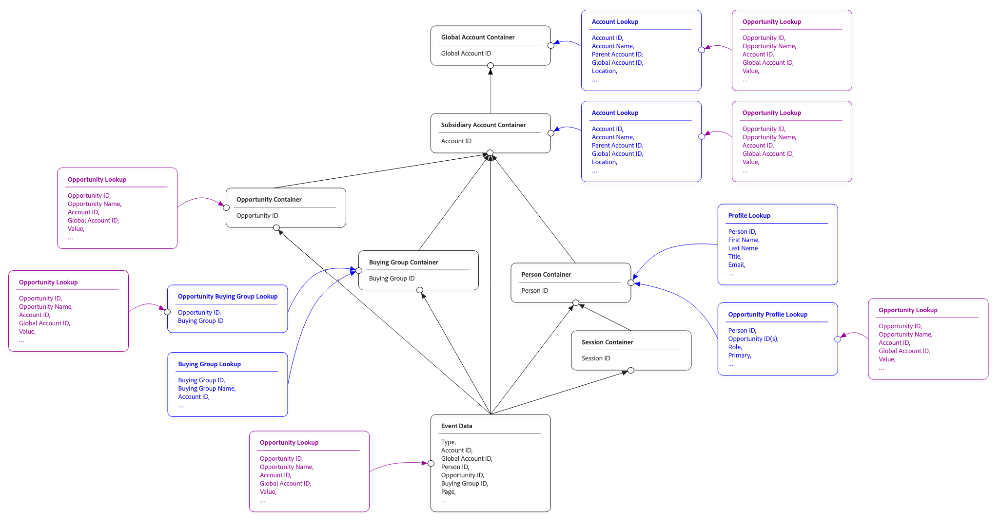
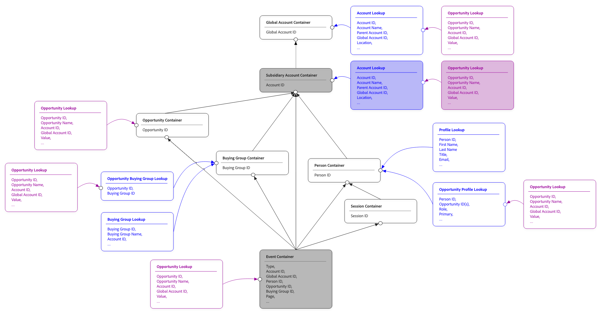
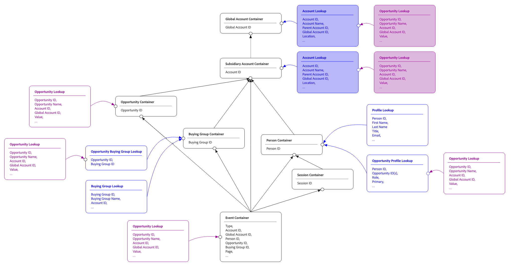

# Ricerche condivisi

In Customer Journey Analytics, un set di dati di ricerca arricchisce i dati dell’evento con un contesto aggiuntivo. Ad esempio, un set di dati del catalogo dei prodotti che aggiunge nomi di prodotti, categorie e prezzi agli eventi di acquisto. Oppure un set di dati di metadati della campagna che aggiunge i dettagli della campagna agli eventi di marketing.

Le ricerche consentono di creare rapporti sui dati dell’evento utilizzando attributi che non sono memorizzati negli eventi stessi.
In genere, un set di dati di ricerca viene unito agli eventi tramite un singolo percorso fisso. Un campo chiave nel set di dati evento viene fatto corrispondere a un campo chiave nel set di dati di ricerca. Questa ricerca funziona quando esiste un solo modo per correlare i due set di dati, ma questo semplice collegamento si suddivide in scenari comuni del mondo reale:

* Un catalogo di prodotti unito a eventi sullo SKU del prodotto o sull’ID del prodotto, a seconda dell’origine dell’evento.
* Una ricerca di attributi utente si unisce a eventi su diversi spazi dei nomi di identità, a seconda del canale (e-mail per eventi web, ID fedeltà per eventi in-store).
* Un set di dati di profilo unito a eventi direttamente (per persona) e indirettamente (per account, a scopo di reporting B2B)

Le ricerche condivise risolvono join limitati di percorsi fissi consentendo di definire più percorsi di join tra un set di dati di ricerca e gli eventi che arricchiscono i dati di ricerca. Ogni percorso descrive un modo per far corrispondere le righe di ricerca alle righe dell’evento. Le dimensioni o le metriche, basate sulla ricerca, possono scegliere il percorso da utilizzare. Lo stesso set di dati di ricerca può ora alimentare più scenari di reporting da una singola configurazione.

Le ricerche condivise sono anche la base per il [reporting sulla popolazione totale](./tpr.md), che utilizza le ricerche condivise per connettere i set di dati del profilo agli eventi.

## Concetti

Le sezioni seguenti descrivono i concetti chiave delle ricerche condivise.

### Unisci percorsi

Un percorso di join è un singolo percorso per la corrispondenza delle righe tra un set di dati di ricerca e gli eventi. Ogni percorso di unione dispone di:

* Un **nome percorso**. Un’etichetta leggibile che scegli, utilizzata per identificare il percorso nell’interfaccia utente durante la creazione di dimensioni e metriche.
* Un campo **chiave** sul lato eventi. Questo campo viene utilizzato per la corrispondenza dell’evento con i dati di ricerca.
* Un **campo chiave corrispondente** sul lato di ricerca.  Questo campo corrisponde a quello della chiave.
* Uno spazio dei nomi **facoltativo**. Lo spazio dei nomi è obbligatorio quando il campo chiave è una mappa di identità.

Un singolo set di dati di ricerca può avere uno o più percorsi di unione. Le dimensioni e le metriche create su un campo in tale ricerca possono specificare il percorso da utilizzare. Se non viene specificato un percorso, viene utilizzato il percorso predefinito per un set di dati.

### Corrispondenza per contenitore

Per i set di dati di profilo (utilizzati con il reporting sulla popolazione totale), le ricerche condivise supportano un’impostazione di corrispondenza per contenitore che configura automaticamente il join in base al tipo di contenitore:

* **Corrispondenza per contenitore persona**. La ricerca viene unita agli eventi tramite l’identità della persona, utilizzando la mappa di identità del set di dati dell’evento come chiave.
* **Corrispondenza per contenitore account** [!BADGE B2B edition]{type=Informative url="https://experienceleague.adobe.com/it/docs/analytics-platform/using/cja-overview/cja-b2b/cja-b2b-edition" newtab=true tooltip="Customer Journey Analytics B2B Edition"}. La ricerca viene unita tramite l’identità dell’account.
* **Corrispondenza per contenitore account globale** ([!BADGE B2B edition]{type=Informative url="https://experienceleague.adobe.com/it/docs/analytics-platform/using/cja-overview/cja-b2b/cja-b2b-edition" newtab=true tooltip="Customer Journey Analytics B2B Edition"} con account globali abilitati). La ricerca viene unita tramite l’identità dell’account globale.

Corrispondenza per contenitore gestisce i casi comuni senza richiedere la configurazione manuale dei campi chiave. Il vantaggio principale della corrispondenza per contenitore è che le deduplicazioni vengono gestite automaticamente. Il contenitore memorizza identità univoche (per persona, account o account globale).

Oltre al reporting sulla popolazione totale, puoi anche utilizzare corrispondenza per contenitore per definire percorsi di unione per altri set di dati di ricerca.

### Corrispondenza per campo

In alternativa, puoi far corrispondere i set di dati di profilo per campo. Tale corrispondenza determina ricerche dirette per ogni evento nei dati dell’evento, in base a un’identità specifica. Quando utilizzi corrispondenza per campo, i risultati possono contenere dati duplicati, il che può portare a risultati confusi, soprattutto se utilizzati con le metriche. Vedi [Esempio](#example) per una spiegazione più dettagliata.

### Mappe di identità come campi chiave

Quando il campo chiave su entrambi i lati del join è una mappa di identità (un campo contenente più identità con spazio dei nomi), è necessaria una configurazione aggiuntiva:

* **Chiave primaria** o **spazio dei nomi**. Puoi trovare una corrispondenza utilizzando la chiave primaria della mappa delle identità o selezionando uno spazio dei nomi specifico. La scelta più comune è quella di selezionare uno spazio dei nomi; la chiave primaria non viene compilata in tutte le origini dati del profilo.
* **Spazio dei nomi secondario**. Nei casi in cui lo spazio dei nomi principale non viene popolato in una determinata riga (comune con i set di dati uniti), puoi specificare uno spazio dei nomi di fallback. Il join utilizza lo spazio dei nomi primario quando viene popolato e torna al secondario in caso contrario.
* **Coerenza tra i percorsi**. Quando si utilizza la stessa mappa di identità come campo chiave in più ricerche condivise su una connessione, le selezioni dello spazio dei nomi devono essere coerenti tra tali ricerche.

### Ricerca nei percorsi di ricerca

Un set di dati di ricerca può essere aggiunto a un altro set di dati di ricerca. Questa ricerca crea una catena di ricerca a due livelli: evento → ricerca A ricerca → B.

Ogni livello della catena di ricerca può disporre di percorsi di join specifici. Le dimensioni o le metriche basate sui campi della ricerca di secondo livello attraversano la catena utilizzando il percorso configurato in ogni passaggio. Le catene di ricerca più profonde di due livelli non sono supportate.

## Quando utilizzare

Utilizza le ricerche condivise quando si verifica una delle seguenti condizioni:

* È necessario unire lo stesso set di dati di ricerca a eventi in più modi.
* Lavori con dati di identità B2C (business to consumer) in cui eventi diversi utilizzano spazi dei nomi di identità diversi.
* Puoi configurare una connessione B2B (business to business) che deve correlare gli eventi sia alle persone che agli account.
* Aggiungi un set di dati profilo a una connessione per il reporting sulla popolazione totale.

Se il set di dati di ricerca ha una singola chiave di join ovvia e hai bisogno di un solo modo per correlare i dati del set di dati di ricerca agli eventi, puoi configurare un singolo percorso. Le ricerche condivise supportano anche questo caso semplice.

## Esempio

L’esempio completo seguente descrive le ricerche condivise in generale.

Immagina di disporre, accanto a un set di dati evento, dei seguenti set di dati di profilo, profilo opportunità, account e ricerca opportunità impostati come parte della connessione Customer Journey Analytics.

I dati di esempio per ciascun set di dati:

>[!BEGINTABS]

>[!TAB Eventi]

| Marca temporale | ID persona | ID account | ID account globale | ID opportunità | Pagina |
|---|---|---|---|---|---|
| 2025-01-29 07:01:57 | P-ABC | A-123 | A-123 | O-432 | Pagina Home |
| 2025-02-28 05:32:13 | P-ABC | A-123 | A-123 | O-432 | Widget |
| 2025-03-13 08:21:47 | P-ABC | A-123 | A-123 | O-432 | Doohickey |
| 2025-03-17 17:21:45 | P-EFG | A-123 | A-123 | 543 O | Gadget |
| 2025-04-01 05:32:13 | P-LMN | A-456 | A-789 | O-876 | Pagina Home |
| 2025-04-01 05:32:13 | P-LMN | A-456 | A-789 | O-876 | Gadget |

>[!TAB Profilo]

| ID persona | Nome | ID account | ID account globale |
|---|---|---|---|
| P-ABC | John | A-123 | A-123 |
| P-EFG | Kate | A-123 | A-123 |
| P-HIJ | Dave | A-789 | A-789 |
| P-LMN | Vijay | A-456 | A-789 |

>[!TAB Account]

| ID account | Nome | ID account globale | Paese | Valore del ciclo di vita |
|---|---|---|---|---:|
| A-123 | Acme | A-123 | US | $ 122 milioni |
| A-456 | BigCo | A-789 | JP | $ 23 milioni |
| A-789 | Gigante | A-789 | Regno Unito | $ 48 milioni |

>[!TAB Profilo opportunità]

| ID persona | ID opportunità | ID account globale |
|---|---|---|
| P-ABC | O-432 | A-123 |
| P-ABC | 543 O | A-123 |
| P-EFG | 543 O | A-123 |
| P-LMN | O-876 | A-789 |

>[!TAB Opportunità]

| ID opportunità | Nome | ID account | ID account globale | Stato | Valore |
|---|---|---|---|---|---:|
| O-432 | Acme Express | A-123 | A-123 | Apri | $ 2 milioni |
| 543 O | Acme CC | A-123 | A-123 | Chiuso | $ 1 milione |
| O-765 | Acme DX | A-123 | A-123 | Apri | $ 8 milioni |
| O-876 | CC BigCo | A-456 | A-789 | Apri | $ 7 milioni |
| O-987 | BigCo DX | A-456 | A-789 | Apri | $ 16 milioni |
| O-888 | DX gigante | A-789 | A-789 | Apri | $ 13 milioni |

>[!ENDTABS]

Al momento della creazione di questa connessione, [contenitori](/help/getting-started/cja-b2b-concepts-features.md#containers) vengono creati automaticamente come parte delle funzionalità di base di Customer Journey Analytics.

Il diagramma seguente mostra le relazioni tra le entità per questa connessione.

{zoomable="yes"}

Puoi utilizzare questi contenitori come parte del percorso per generare rapporti sul valore dell’opportunità per ogni account. In base al contenitore selezionato, puoi ottenere risultati diversi.

| Nome account | Valore opportunità (contenitore opportunità) | Valore opportunità (contenitore account secondario) | Valore opportunità (contenitore persona) |
|---|---:|---:|---:|
| Acme | $ 3 milioni | $ 11 milioni | $ 4 milioni |
| BigCo | $ 7 milioni | $ 23 milioni | $ 7 milioni |

### Corrispondenza per contenitore opportunità

Per far corrispondere le opportunità con gli account, utilizza il contenitore opportunità come percorso dai dati di ricerca evento a opportunità, che si traduce in 3 milioni di dollari per Acme e 7 milioni di dollari per BigCo.

{zoomable="yes"}

>[!BEGINTABS]

>[!TAB Dati evento]

| Marca temporale | ID persona | ID account | ID account globale | ID opportunità  | Pagina |
|---|---|---|---|---|---|
| 2025-01-29 07:01:57 | P-ABC | A-123 | A-123 | **O-432** | Pagina Home |
| 2025-02-28 05:32:13 | P-ABC | A-123 | A-123 | **O-432** | Widget |
| 2025-03-13 08:21:47 | P-ABC | A-123 | A-123 | **O-432** | Doohickey |
| 2025-03-17 17:21:45 | P-EFG | A-123 | A-123 | **O-543** | Gadget |
| 2025-04-01 05:32:13 | P-LMN | A-456 | A-789 | **O-876** | Pagina Home |
| 2025-04-01 05:32:13 | P-LMN | A-456 | A-789 | **O-876** | Gadget |

>[!TAB Opportunità]

| ID opportunità  | Nome | ID account | ID account globale | Stato | Valore |
|---|---|---|---|---|---:|
| **O-432** | Acme Express | A-123 | A-123 | Apri | **$2M** |
| **O-543** | Acme CC | A-123 | A-123 | Chiuso | **$1M** |
| O-765 | Acme DX | A-123 | A-123 | Apri | $ 8 milioni |
| **O-876** | CC BigCo | A-456 | A-789 | Apri | **$7M** |
| O-987 | BigCo DX | A-456 | A-789 | Apri | $ 16 milioni |
| O-888 | DX gigante | A-789 | A-789 | Apri | $ 13 milioni |

>[!ENDTABS]

### Corrispondenza per contenitore account affiliata

Per far corrispondere le opportunità con gli account, utilizza il contenitore dell’account secondario come percorso dai dati di ricerca evento a opportunità, che si traduce in 11 milioni di dollari per Acme e 23 milioni di dollari per BigCo.

{zoomable="yes"}

>[!BEGINTABS]

>[!TAB Eventi]

| Marca temporale | ID persona | ID account  | ID account globale | ID opportunità | Pagina |
|---|---|---|---|---|---|
| 2025-01-29 07:01:57 | P-ABC | **A-123** | A-123 | O-432 | Pagina Home |
| 2025-02-28 05:32:13 | P-ABC | **A-123** | A-123 | O-432 | Widget |
| 2025-03-13 08:21:47 | P-ABC | **A-123** | A-123 | O-432 | Doohickey |
| 2025-03-17 17:21:45 | P-EFG | **A-123** | A-123 | 543 O | Gadget |
| 2025-04-01 05:32:13 | P-LMN | **A-456** | A-789 | O-876 | Pagina Home |
| 2025-04-01 05:32:13 | P-LMN | **A-456** | A-789 | O-876 | Gadget |

>[!TAB Opportunità]

| ID opportunità | Nome | ID account  | ID account globale | Stato | Valore |
|---|---|---|---|---|---:|
| O-432 | Acme Express | **A-123** | A-123 | Apri | **$2M** |
| 543 O | Acme CC | **A-123** | A-123 | Chiuso | **$1M** |
| O-765 | Acme DX | **A-123** | A-123 | Apri | **$8M** |
| O-876 | CC BigCo | **A-456** | A-789 | Apri | **$7M** |
| O-987 | BigCo DX | **A-456** | A-789 | Apri | **$16M** |
| O-888 | DX gigante | A-789 | A-789 | Apri | $ 13 milioni |

>[!ENDTABS]

### Corrispondenza per contenitore persona

{zoomable="yes"}

Per abbinare le opportunità con gli account, utilizza il contenitore persona come percorso per il profilo opportunità e i dati di ricerca, con un risultato di 4 milioni di dollari per Acme e 7 milioni di dollari per BigCo.

>[!BEGINTABS]

>[!TAB Eventi]

| Marca temporale | ID persona  | ID account | ID account globale | ID opportunità | Pagina |
|---|---|---|---|---|---|
| 2025-01-29 07:01:57 | **P-ABC** | A-123 | A-123 | O-432 | Pagina Home |
| 2025-02-28 05:32:13 | **P-ABC** | A-123 | A-123 | O-432 | Widget |
| 2025-03-13 08:21:47 | **P-ABC** | A-123 | A-123 | O-432 | Doohickey |
| 2025-03-17 17:21:45 | **P-EFG** | A-123 | A-123 | 543 O | Gadget |
| 2025-04-01 05:32:13 | **P-LMN** | A-456 | A-789 | O-876 | Pagina Home |
| 2025-04-01 05:32:13 | **P-LMN** | A-456 | A-789 | O-876 | Gadget |

>[!TAB Persona/Opportunità]

| ID persona  | ID opportunità  | ID account globale |
|---|---|---|
| **P-ABC** | **O-432** | A-123 |
| **P-ABC** | **O-543** | A-123 |
| **P-EFG** | **O-543** | A-123 |
| **P-LMN** | **O-876** | A-789 |

>[!TAB Ricerca opportunità]

| ID opportunità  | Nome | ID account | ID account globale | Stato | Valore |
|---|---|---|---|---|---:|
| **O-432** | Acme Express | A-123 | A-123 | Apri | **$2M** |
| **O-543** (2x) | Acme CC | A-123 | A-123 | Chiuso | $ 1M x 2 = **$2M** |
| O-765 | Acme DX | A-123 | A-123 | Apri | $ 8 milioni |
| **O-876** | CC BigCo | A-456 | A-789 | Apri | **$7M** |
| O-987 | BigCo DX | A-456 | A-789 | Apri | $ 16 milioni |
| O-888 | DX gigante | A-789 | A-789 | Apri | $ 13 milioni |

>[!ENDTABS]

### Altre corrispondenze per contenitori

Nell’esempio sono disponibili più percorsi di unione possibili. Ad esempio tramite il contenitore account globale o il contenitore gruppo di acquisto. Ciascuno dei percorsi di join esegue una ricerca tramite una corrispondenza per contenitore.

### Corrispondenza per campo

Invece di trovare le corrispondenze per contenitore, puoi anche scegliere di cercare le corrispondenze per campo. Quindi abbini direttamente gli ID opportunità.

>[!BEGINTABS]

>[!TAB Eventi]

| Marca temporale | ID persona | ID account | ID account globale | ID opportunità  | Pagina |
|---|---|---|---|---|---|
| 2025-01-29 07:01:57 | P-ABC | **A-123** | A-123 | **O-432** | Pagina Home |
| 2025-02-28 05:32:13 | P-ABC | **A-123** | A-123 | **O-432** | Widget |
| 2025-03-13 08:21:47 | P-ABC | **A-123** | A-123 | **O-432** | Doohickey |
| 2025-03-17 17:21:45 | P-EFG | **A-123** | A-123 | **O-543** | Gadget |
| 2025-04-01 05:32:13 | P-LMN | **A-456** | A-789 | **O-876** | Pagina Home |
| 2025-04-01 05:32:13 | P-LMN | **A-456** | A-789 | **O-876** | Gadget |

>[!TAB Opportunità]

| ID opportunità  | Nome | ID account | ID account globale | Stato | Valore |
|---|---|---|---|---|---:|
| **O-432** (3x) | Acme Express | A-123 | A-123 | Apri | $2 milioni x 3 = **$6 milioni** |
| **O-543** | Acme CC | A-123 | A-123 | Chiuso | **$1M** |
| O-765 | Acme DX | A-123 | A-123 | Apri | $ 8 milioni |
| **O-876** (2x) | CC BigCo | A-456 | A-789 | Apri | $7 milioni x 2 = **$14 milioni** |
| O-987 | BigCo DX | A-456 | A-789 | Apri | $ 16 milioni |
| O-888 | DX gigante | A-789 | A-789 | Apri | $ 13 milioni |

>[!ENDTABS]

### Segnalazione popolazione totale

{zoomable="yes"}

[Generazione rapporti popolazione totale](tpr.md) utilizza ricerche condivise ma non genera rapporti sugli eventi. Nell’esempio, è possibile creare rapporti solo sulle metriche del valore dell’opportunità dell’account utilizzando l’account o il contenitore account globale, in quanto questi contenitori sono gli unici join possibili ai dati di ricerca dell’opportunità.

>[!BEGINTABS]

>[!TAB Profilo]

| ID persona | Nome | ID account  | ID account globale |
|---|---|---|---|
| P-ABC | John | **A-123** | A-123 |
| P-EFG | Kate | **A-123** | A-123 |
| P-HIJ | Dave | **A-789** | A-789 |
| P-LMN | Vijay | **A-456** | A-789 |

>[!TAB Opportunità]

| ID opportunità | Nome | ID account  | ID account globale | Stato | Valore |
|---|---|---|---|---|---:|
| O-432 | Acme Express | **A-123** | A-123 | Apri | **$2M** |
| 543 O | Acme CC | **A-123** | A-123 | Chiuso | **$1M** |
| O-765 | Acme DX | **A-123** | A-123 | Apri | **$8M** |
| O-876 | CC BigCo | **A-456** | A-789 | Apri | **$7M** |
| O-987 | BigCo DX | **A-456** | A-789 | Apri | **$16M** |
| O-888 | DX gigante | **A-789** | A-789 | Apri | **$13M** |

* 3 opportunità per l&#39;account A-123 (Acme) per un totale di **$13M**.
* 2 opportunità per l&#39;account A-456 (BigCo) per un totale di **$23M**.
* 1 opportunità per l&#39;account A-789 (Giant) con un totale di **$13M**.

>[!ENDTABS]
