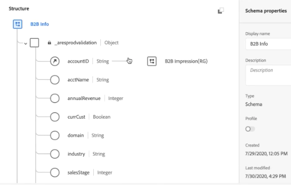
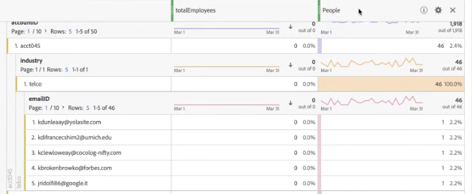

# (B2B) Aggiungere dati a livello di account come set di dati di ricerca

Questo caso d’uso B2B mostra come specificare i dati a livello di account anziché di persona per l’analisi. L&#39;analisi a livello di account può rispondere a domande come

* Qual è il nome della società associato a questo account?
* Quanti dipendenti sono associati a questo account/società?
* Quali ruoli sono rappresentati in questo account?
* Come funziona l&#39;account nel suo insieme rispetto a una campagna di marketing specifica, rispetto a un altro account?
* Alcuni ruoli (come Manager IT) in un account si comportano in modo diverso rispetto allo stesso ruolo in un account diverso?

A tal fine, inserisci le informazioni a livello di account come [search](/help/getting-started/cja-glossary.md) dataset (simile alle classificazioni in Adobe Analytics  tradizionale).

Prima si crea uno schema di ricerca in Adobe Experience Platform, quindi si crea un set di dati della tabella di ricerca mediante l&#39;inserimento di dati a livello di account basati su .csv. Quindi si crea una connessione CJA che combina diversi set di dati, inclusa la ricerca creata dall&#39;utente. È quindi possibile creare una visualizzazione dati e, infine, utilizzare tutti questi dati in Workspace.

>[!NOTE]
>
>Le tabelle di ricerca possono avere una dimensione massima di 1 GB.

## 1. Crea schema di ricerca (Experience Platform )

Creazione di uno schema personalizzato per [search](/help/getting-started/cja-glossary.md) la tabella assicura che il set di dati utilizzato sia disponibile in CJA con la configurazione corretta (tipo di record). La best practice è di: [creazione di una classe di schema personalizzata](https://docs.adobe.com/content/help/en/experience-platform/xdm/tutorials/create-schema-ui.html#create-new-class) denominato &quot;Lookup&quot;, vuoto di qualsiasi elemento, che può essere riutilizzato per tutte le tabelle di ricerca.

## 2. Crea set di dati di ricerca ( Experience Platform)

Una volta creato lo schema, è necessario creare un set di dati di ricerca da tale schema, in  Experience Platform. Questo set di dati di ricerca contiene informazioni di marketing a livello di account, ad esempio: nome della società, numero totale di dipendenti, nome del dominio, il settore di appartenenza, i ricavi annuali, che siano clienti correnti del Experience Platform  o meno, in quale fase di vendita sono, quale team all&#39;interno del conto utilizza CJA, ecc.

1. In Adobe Experience Platform, vai a **[!UICONTROL Data Management > Datasets]**.
1. Fai clic su **[!UICONTROL + Create dataset]**.
1. Fai clic su **[!UICONTROL Create dataset from schema]**.
1. Selezionare la classe Schema di ricerca creata.
1. Fai clic su **[!UICONTROL Next]**.
1. Denominate il dataset (nel nostro esempio, Informazioni B2B) e fornite una descrizione.
1. Fai clic su **[!UICONTROL Finish]**.

## 3. Assimilazione di dati in  Experience Platform

Istruzioni su come [Mappare un file CSV su uno schema XDM](https://docs.adobe.com/content/help/en/experience-platform/ingestion/tutorials/map-a-csv-file.html) dovrebbe essere utile se utilizzi un file CSV.

[Altri metodi](https://docs.adobe.com/content/help/en/experience-platform/ingestion/home.html) sono disponibili anche.

L&#39;inserimento dei dati e l&#39;impostazione della ricerca richiede circa 2-4 ore, a seconda delle dimensioni della tabella di ricerca.

## 4. Combinazione di set di dati in una connessione (Customer Journey Analytics)

Per questo esempio, stiamo combinando 3 set di dati in una connessione CJA:

| Nome set di dati | Descrizione | Classe AEP Schema | Dettagli del set di dati |
|---|---|---|---|
| Impression B2B | Contiene i dati a livello di evento e clickstream a livello di account. Ad esempio, contiene l&#39;ID e-mail e l&#39;ID account corrispondente, nonché il nome marketing, per l&#39;esecuzione di annunci di marketing. Include inoltre le impression per tali annunci, per utente. | Basato sulla classe dello schema ExperienceEvent XDM | Il `emailID` viene utilizzata come identità principale e viene assegnata una `Customer ID` namespace. Di conseguenza, viene visualizzato come predefinito **[!UICONTROL Person ID]** in Customer Journey Analytics.  |
| Profilo B2B | Questo set di dati del profilo descrive meglio gli utenti in un account, ad esempio il titolo del loro lavoro, l’account a cui appartengono, il profilo LinkedIn e così via. | In base alla classe dello schema del profilo singolo XDM | Non è necessario selezionare `emailID` come ID principale in questo schema. Assicurarsi di abilitare **[!UICONTROL Profile]**; in caso contrario, la CJA non sarà in grado di collegare la `emailID` nel profilo B2B con `emailID` nei dati relativi all’impressione B2B. Questa funzione è denominata cucitura basata sul campo.  |
| Informazioni B2B | Vedere &quot;Crea set di dati di ricerca&quot; sopra. | B2BAccount (classe schema di ricerca personalizzata) | Il rapporto tra `accountID` e il dataset Impression B2B è stato creato automaticamente collegando il dataset B2B Info con il dataset Impression B2B in CJA, come descritto nei passaggi descritti di seguito.  |

Di seguito è illustrato come combinare i set di dati:

1. Nel Customer Journey Analytics, selezionate il pulsante **[!UICONTROL Connections]** tab.
1. Selezionate i set di dati (nel nostro esempio, i tre precedenti) da combinare.
1. Per il set di dati di informazioni B2B, seleziona il `accountID` chiave che verrà utilizzata nella tabella di ricerca. Quindi selezionate la chiave corrispondente (dimensione corrispondente), anche `accountID` nel set di dati dell’evento.
1. Fai clic su **[!UICONTROL Next]**.
1. Denominate e descrivete la connessione e configuratela in base a [queste istruzioni](/help/connections/create-connection.md).
1. Fai clic su **[!UICONTROL Save]**.

## 5. Creazione di una visualizzazione dati da questa connessione

Segui le istruzioni riportate in [creazione di viste dati](/help/data-views/create-dataview.md).

* Aggiungi tutti i componenti (dimensioni e metriche) necessari dai set di dati.

## 6. Analisi dei dati in Workspace

È ora possibile creare progetti Workspace basati sui dati provenienti da tutti e tre i set di dati.

Ad esempio, potete trovare le risposte alle risposte fornite nell&#39;introduzione:

* Analizza l’e-mailID per accountID per scoprire a quale società appartiene un ID e-mail.
* Quanti dipendenti vengono mappati a un ID account specifico?
* A quale settore appartiene un ID account?

