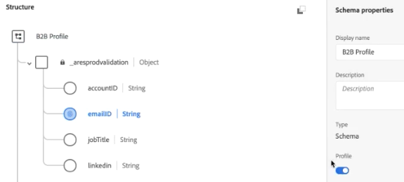

# (B2B) Aggiungere dati a livello di account come set di dati di ricerca

Questo caso d’uso B2B mostra come specificare i dati a livello di account anziché di persona per l’analisi. L&#39;analisi a livello di account può rispondere a domande come

* Qual è il nome della società associato a questo account?
* Quanti dipendenti sono associati a questo account/società?
* Quali ruoli sono rappresentati in questo account?
* Come funziona l&#39;account nel suo insieme rispetto a una campagna di marketing specifica, rispetto a un altro account?
* Alcuni ruoli (come Manager IT) in un account si comportano in modo diverso rispetto allo stesso ruolo in un account diverso?

A tal fine, inserisci le informazioni a livello di account come set di dati [Search](/help/getting-started/cja-glossary.md) (simili alle classificazioni in Adobe Analytics  tradizionale).

Prima si crea uno schema di ricerca in Adobe Experience Platform, quindi si crea un set di dati della tabella di ricerca mediante l&#39;inserimento di dati a livello di account basati su .csv. Quindi si crea una connessione CJA che combina diversi set di dati, inclusa la ricerca creata dall&#39;utente. È quindi possibile creare una visualizzazione dati e utilizzare tutti questi dati in Workspace.

>[!NOTE]
>
>Le tabelle di ricerca possono avere una dimensione massima di 1 GB.

## 1. Crea schema di ricerca (Experience Platform )

La creazione di uno schema personalizzato per la tabella [search](/help/getting-started/cja-glossary.md) garantisce che il set di dati utilizzato sia disponibile in CJA con la configurazione corretta (tipo di record). È consigliabile [creare una classe di schema personalizzata](https://docs.adobe.com/content/help/en/experience-platform/xdm/tutorials/create-schema-ui.html#create-new-class) denominata &quot;Lookup&quot;, vuota per qualsiasi elemento, che possa essere riutilizzata per tutte le tabelle di ricerca.

## 2. Crea set di dati di ricerca ( Experience Platform)

Una volta creato lo schema, è necessario creare un set di dati di ricerca da tale schema, in  Experience Platform. Questo set di dati di ricerca contiene informazioni di marketing a livello di account, ad esempio: nome della società, numero totale di dipendenti, nome del dominio, il settore di appartenenza, i ricavi annuali, che siano clienti correnti del Experience Platform  o meno, in quale fase di vendita sono, quale team all&#39;interno del conto utilizza CJA, ecc.

>[!IMPORTANT]
>
>CJA non supporta i numeri interi nei set di dati di ricerca. Se si aggiungono i campi interi nello schema XDM per il set di dati di ricerca, non sarà possibile utilizzare tali numeri interi come metriche o metriche calcolate. Ad esempio, se i ricavi annuali o i dipendenti totali sono definiti come numeri interi, nei rapporti di CJA verranno visualizzati come &quot;0&quot;. Tuttavia, se vengono assegnate come stringhe, è possibile utilizzarle come informazioni di ricerca.

Ad esempio, yearRevenue o totalEmployees sono definiti come Intero nell’esempio di seguito, motivo per il quale viene visualizzato &quot;0&quot; nella CJA.

1. In Adobe Experience Platform, passare a **[!UICONTROL Data Management > Datasets]**.
1. Fai clic su **[!UICONTROL + Create dataset]**.
1. Fai clic su **[!UICONTROL Create dataset from schema]**.
1. Selezionare la classe Schema di ricerca creata.
1. Fai clic su **[!UICONTROL Next]**.
1. Denominate il dataset (nel nostro esempio, Informazioni B2B) e fornite una descrizione.
1. Fai clic su **[!UICONTROL Finish]**.

## 3. Assimilazione di dati in  Experience Platform

Le istruzioni su come [Mappare un file CSV su uno schema XDM](https://docs.adobe.com/content/help/en/experience-platform/ingestion/tutorials/map-a-csv-file.html) sono utili se utilizzi un file CSV.

[Sono disponibili anche altri ](https://docs.adobe.com/content/help/en/experience-platform/ingestion/home.html) metodi.

L&#39;inserimento dei dati e l&#39;impostazione della ricerca richiede circa 2-4 ore, a seconda delle dimensioni della tabella di ricerca.

## 4. Combinazione di set di dati in una connessione (Customer Journey Analytics)

Per questo esempio, stiamo combinando 3 set di dati in una connessione CJA:

| Nome set di dati | Descrizione | Classe AEP Schema | Dettagli del set di dati |
|---|---|---|---|
| Impression B2B | Contiene i dati a livello di evento e clickstream a livello di account. Ad esempio, contiene l&#39;ID e-mail e l&#39;ID account corrispondente, nonché il nome marketing, per l&#39;esecuzione di annunci di marketing. Include inoltre le impression per tali annunci, per utente. | Basato sulla classe dello schema ExperienceEvent XDM | `emailID` viene utilizzato come identità principale e gli viene assegnato uno spazio dei nomi `Customer ID`. Di conseguenza, verrà visualizzato come il valore predefinito **[!UICONTROL Person ID]** nel Customer Journey Analytics.  |
| Profilo B2B | Questo set di dati del profilo descrive meglio gli utenti in un account, ad esempio il titolo del loro lavoro, l’account a cui appartengono, il profilo LinkedIn e così via. | In base alla classe dello schema del profilo singolo XDM | Non è necessario selezionare `emailID` come ID principale in questo schema. Assicurarsi di abilitare **[!UICONTROL Profile]**; in caso contrario, la CJA non sarà in grado di collegare la `emailID` nel profilo B2B con la `emailID` nei dati Impression B2B.  |
| Informazioni B2B | Vedere &quot;Crea set di dati di ricerca&quot; sopra. | B2BAccount (classe schema di ricerca personalizzata) | La relazione tra `accountID` e il dataset Impression B2B è stata creata automaticamente collegando il dataset Informazioni B2B con il dataset Impression B2B in CJA, come descritto nei passaggi descritti di seguito.  |

Di seguito è illustrato come combinare i set di dati:

1. Nell&#39;Customer Journey Analytics, selezionare la scheda **[!UICONTROL Connections]**.
1. Selezionate i set di dati (nel nostro esempio, i tre precedenti) da combinare.
1. Per il set di dati di informazioni B2B, selezionate la chiave `accountID` che verrà utilizzata nella tabella di ricerca. Quindi selezionate la chiave corrispondente (dimensione corrispondente), anche `accountID` nel set di dati dell&#39;evento.
1. Fai clic su **[!UICONTROL Next]**.
1. Assegnare un nome e descrivere la connessione e configurarla in base alle [presenti istruzioni](/help/connections/create-connection.md).
1. Fai clic su **[!UICONTROL Save]**.

## 5. Creazione di una visualizzazione dati da questa connessione

Seguire le istruzioni riportate in [creazione di viste dati](/help/data-views/create-dataview.md).

* Aggiungi tutti i componenti (dimensioni e metriche) necessari dai set di dati.

## 6. Analisi dei dati in Workspace

È ora possibile creare progetti Workspace basati sui dati provenienti da tutti e tre i set di dati.

Ad esempio, potete trovare le risposte alle risposte fornite nell&#39;introduzione:

* Analizza l’e-mailID per accountID per scoprire a quale società appartiene un ID e-mail.
* Quanti dipendenti vengono mappati a un ID account specifico?
* A quale settore appartiene un ID account?

