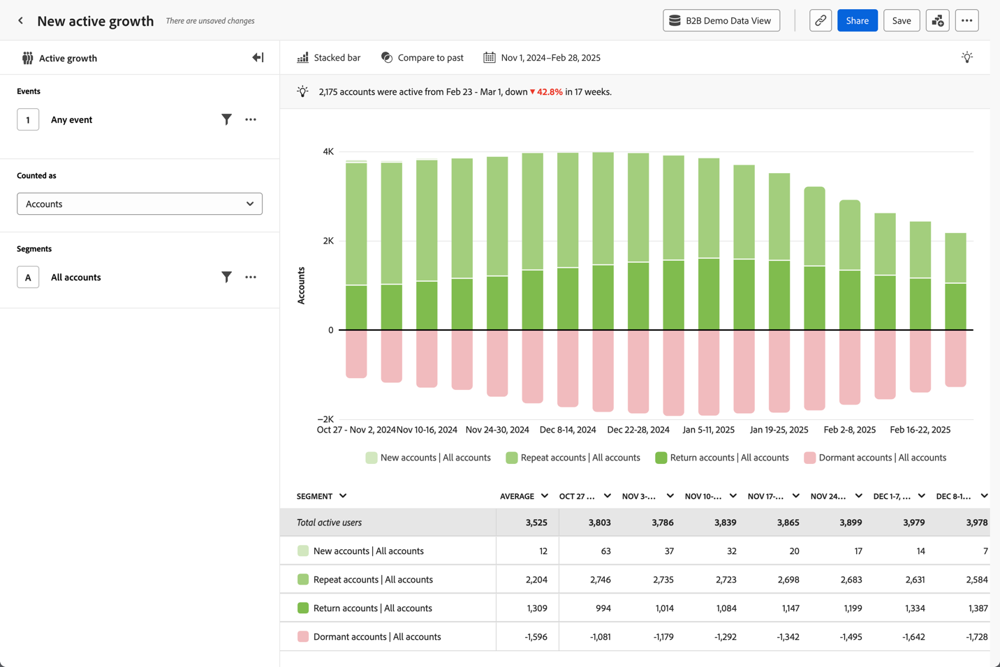
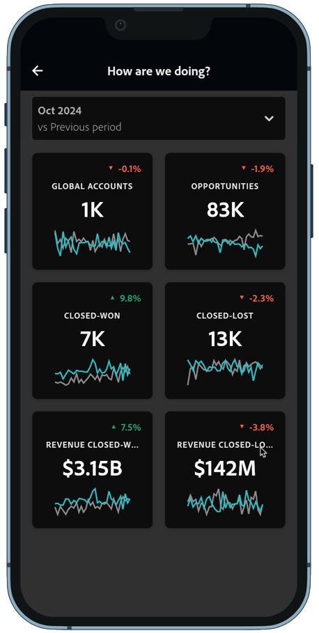

# Creare valore di prodotto

{{draft-b2b}}

Desideri fornire informazioni sul valore dei prodotti B2B a responsabili di prodotto, CMO o CEO. Ad esempio, attraverso un’analisi o previsioni di abbandono basate su dati. E rendi queste informazioni digeribili attraverso le dashboard dei dispositivi mobili.

Customer Journey Analytics B2B edition può aiutarti a fornire informazioni sul valore del prodotto. Per alcuni esempi, consulta le sezioni seguenti.

## Riduci abbandono

Desideri identificare gli account con un basso utilizzo dei prodotti, un basso coinvolgimento del brand e altri fattori chiave che indicano un elevato potenziale di abbandono. Questa identificazione anticipata consente di sviluppare strategie di attivazione dell’account.

L&#39;analisi guidata [Crescita attiva](/help/guided-analysis/types/active-growth.md) può aiutarti a determinare come:

* Ottieni informazioni sulla crescita e l’acquisizione di account, opportunità e utenti in un periodo specifico.
* Individua account inattivi, senza alcun coinvolgimento recente. Puoi quindi scegliere una strategia di rinnovo o di upselling.
* Collabora con il tuo successo cliente o con la tua organizzazione di vendita per riattivare gli account inattivi. È possibile analizzare l’utilizzo ridotto e pianificare i miglioramenti dei prodotti per affrontare l’abbandono e superare un’adozione lenta o in stallo.

### Esempio

Desideri visualizzare la crescita attiva netta tra i nuovi account, i nuovi account ripetuti, quelli di ritorno e quelli inattivi.

1. [Crea e configura un&#39;analisi guidata di crescita attiva](/help/guided-analysis/types/active-growth.md).
1. Seleziona **[!UICONTROL Accounts]** come **[!UICONTROL Counted as]**.
1. Selezionare il **[!UICONTROL Chart settings]** preferito. Ad esempio:  **[!UICONTROL Stacked bar]**.
1. Selezionare il  **[!UICONTROL Interval]** e **[!UICONTROL Date range]** preferiti.

## Democratizzare gli insights

Desideri rendere accessibili le informazioni chiave per le OCM e i CEO, in modo che possano, ad esempio, esaminare immediatamente i dati dell’account e l’utilizzo dei prodotti dal loro dispositivo mobile.

Una [scorecard per dispositivi mobili](/help/mobile-app/home.md) può aiutare a fornire queste informazioni.

### Esempio

Desideri creare una scorecard mobile che combini i dettagli su account, opportunità, opportunità realizzate e perse e i ricavi associati a tali opportunità.

1. [Crea una scorecard per dispositivi mobili](/help/mobile-app/create-scorecard.md).
1. Definire il periodo per il quale si desidera generare il rapporto. Ad esempio **[!UICONTROL October 2024 vs Previous Period]**.
1. Trascina e rilascia le metriche rilevanti nell’area di lavoro dell’app. Ad esempio: **[!UICONTROL Global accounts]**, **[!UICONTROL Opportunities]**, **[!UICONTROL Closed-Won]**, **[!UICONTROL Closed-Lost]**, **[!UICONTROL Revenue Closed-Won]** e **[!UICONTROL Revenue-Closed-Lost]**.

   

1. Utilizza **[!UICONTROL Preview]** per visualizzare l&#39;anteprima del dashboard. Il dashboard è ora disponibile nell&#39;app del dashboard di Adobe Analytics, disponibile in [App Store](https://apps.apple.com/us/app/adobe-analytics-dashboards/id1509062264) o [Google Play](https://play.google.com/store/apps/details?id=com.adobe.analyticsdashboards).

   
