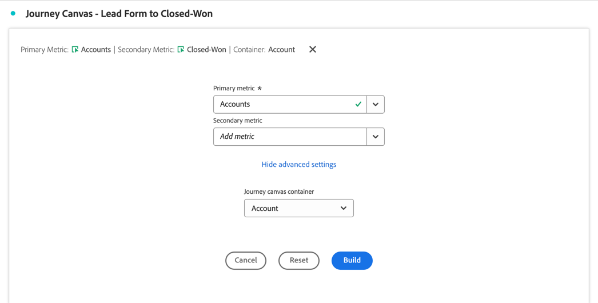
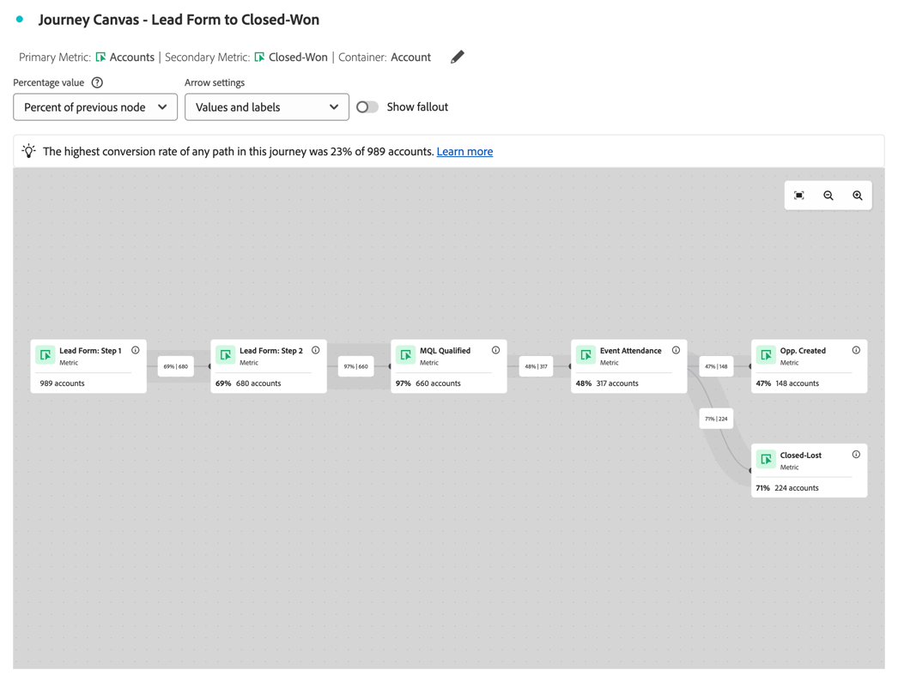
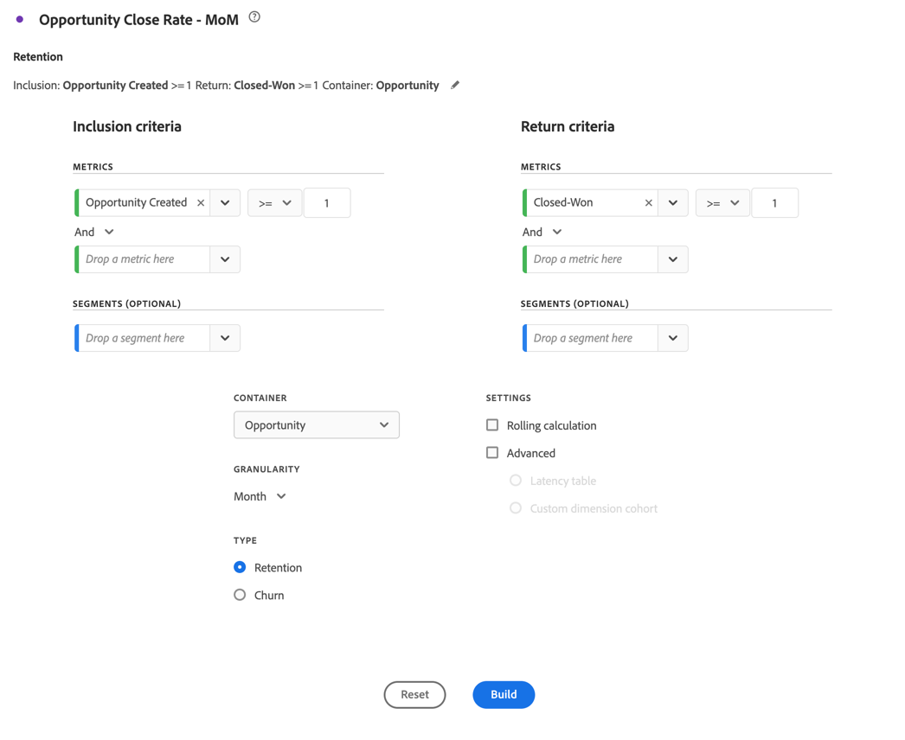
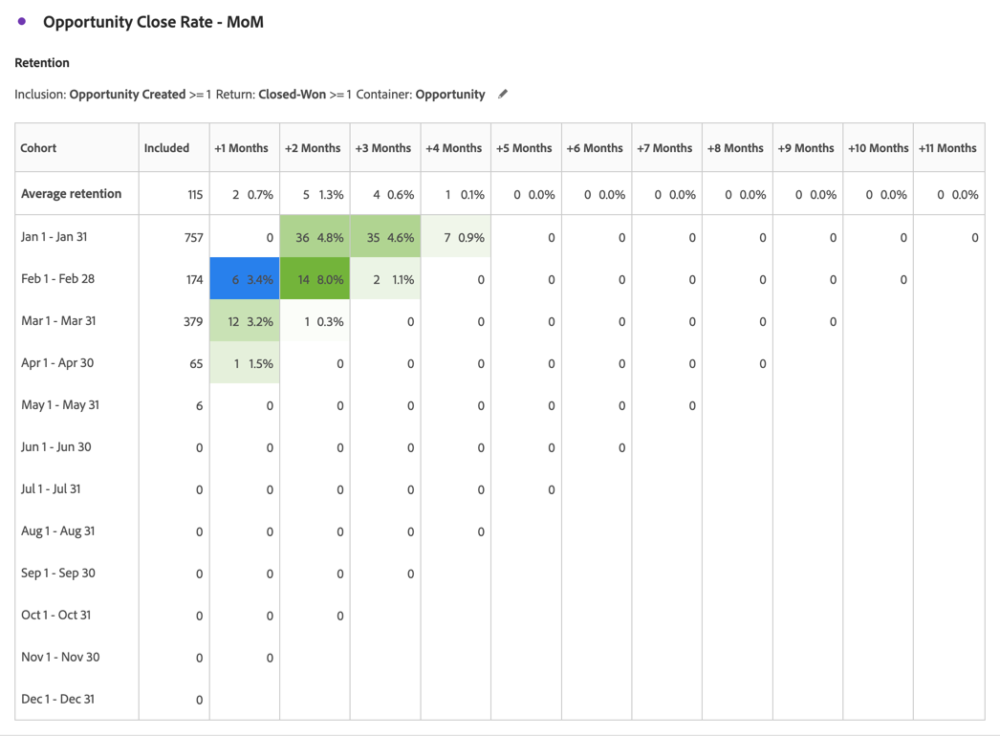
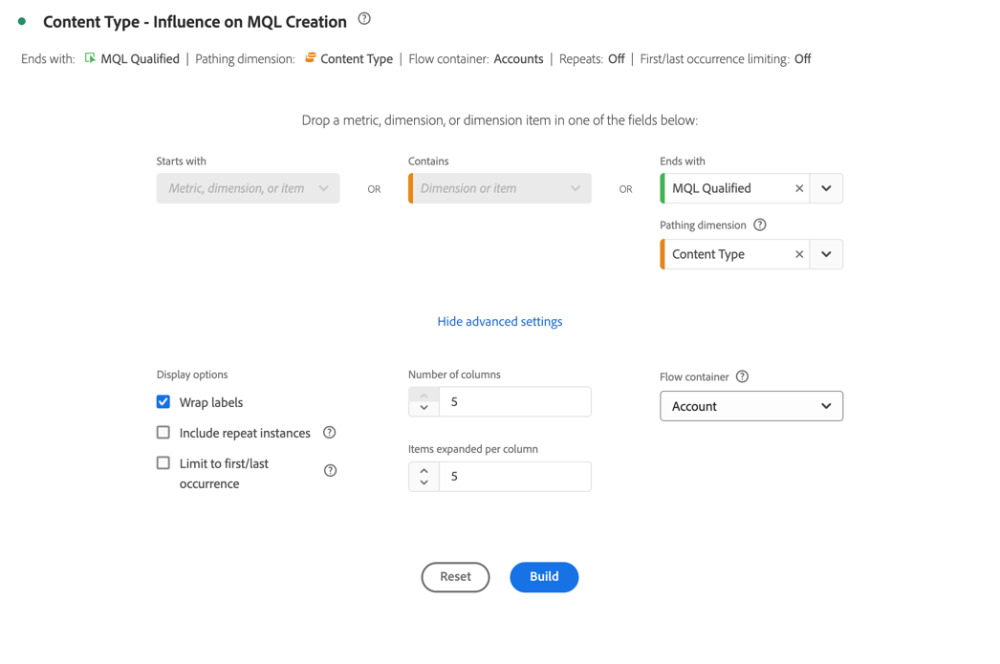
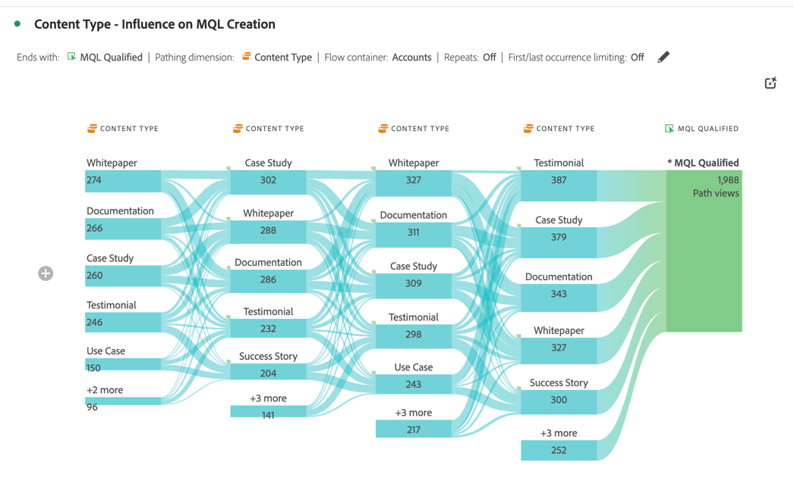

# Ottimizzare il marketing per account

Un marketing efficace basato sull’account richiede una profonda comprensione del percorso di acquisto a livello di account. Quindi, puoi determinare le attività di marketing di maggior impatto da concludere.

Per comprendere questo aspetto, è necessario analizzare ed esplorare i seguenti aspetti:

* Impatto sul marketing:

   * Tra campagne, canali e contenuti.
   * Per gruppi di acquisto all’interno di account,

* Progressione della pipeline di vendita.
* Opportunità di upselling e cross-selling.
* Integrità dell’account del cliente.

Customer Journey Analytics B2B edition può aiutarti nell’ottimizzazione del marketing per gli account. Per alcuni esempi, consulta le sezioni seguenti.

## Coinvolgimento di marketing basato sull’account

Desideri identificare quali esperienze, sia online che offline, sono più incisive nella creazione di opportunità chiuse.

Utilizza la visualizzazione [area di lavoro Percorsi](/help/analysis-workspace/visualizations/journey-canvas/journey-canvas.md) per mappare ogni interazione tra account, opportunità, gruppi di acquisto, campagne e canali per ottenere informazioni approfondite su ciò che funziona nel marketing del tuo account e su dove puoi migliorare.

Una visualizzazione dell’area di lavoro del percorso consente di:

* Guarda la storia completa. Ad esempio, puoi visualizzare un percorso dettagliato di un account o gruppo di acquisto *specifico* che include tutte le interazioni note online e offline.
* Contestualizzare i momenti chiave che precedono o seguono tappe fondamentali critiche (ad esempio: un trigger di lead qualificato per il marketing o la creazione di opportunità).
* Supporta il personale di vendita attraverso la cronologia delle interazioni della visualizzazione su account specifici. Tale visualizzazione consente conversazioni rilevanti.

### Esempio

Si desidera visualizzare il percorso da modulo lead a vincitore chiuso.

1. [Crea e configura una visualizzazione area di lavoro del Percorso](/help/analysis-workspace/visualizations/journey-canvas/configure-journey-canvas.md).
1. Configura **[!UICONTROL Account]** come **[!UICONTROL Metrica primaria]**.
1. Accertati di selezionare **[!UICONTROL Account]** come **[!UICONTROL contenitore area di lavoro Percorsi]**.

   

1. Seleziona **[!UICONTROL Genera]**.
1. Trascina e rilascia i nodi nell’area di lavoro e connetti i nodi per illustrare il percorso di account. Esempio: da **[!UICONTROL Modulo lead: passaggio 1]** a **[!UICONTROL Opp. Creato]**.

   

## Segmentazione per coorte

Vuoi identificare il gruppo chiave di acquirenti in modo da attivare questi gruppi di acquirenti per altri canali, come media a pagamento, e-mail, social.

Utilizza la visualizzazione [Tabella coorte](/help/analysis-workspace/visualizations/cohort-table/cohort-analysis.md) per raggruppare entità B2B (account, opportunità, gruppi di acquisto) in base a un punto di partenza condiviso (come una data di lead time di qualificazione del mercato (MQL)). E tenere traccia dell&#39;avanzamento di ciascuna di queste entità nel tempo nelle fasi o nei milestone successivi.

Una visualizzazione con tabella coorte consente di:

* Analizza la rapidità con cui le coorti di account o opportunità raggiungono le tappe fondamentali (ad esempio: da un lead qualificato per il marketing a un lead qualificato per le vendite) nell’arco di settimane o mesi.
* Identifica se alcune coorti (per segmento, origine della campagna, tipo di gruppo di acquisto) progrediscono più rapidamente nel ciclo di vendita rispetto ad altre coorti.
* Valuta se le iniziative strategiche (ad esempio: campagne di marketing) sono correlate a tempistiche di progressione più brevi per le coorti successive.

### Esempio

Volete vedere coorti mensili di opportunità chiuse.

1. [Crea e configura una visualizzazione Tabella coorte](/help/analysis-workspace/visualizations/cohort-table/t-cohort.md).
1. Utilizza **[!UICONTROL Opportunità creata]** come metrica **[!UICONTROL Criteri di inclusione]**. Selezionare **[!UICONTROL >=]** come operatore e immettere il valore `1`.
1. Utilizza **[!UICONTROL Closed-Won]** come metrica **[!UICONTROL Return criteria]**. Selezionare **[!UICONTROL >=]** come operatore e immettere il valore `1`.
1. Seleziona **[!UICONTROL Opportunità]** come contenitore.

   

1. Seleziona **[!UICONTROL Genera]**. Di seguito è riportato un esempio di tabella coorte.

   

## Eventi di persona

Desideri creare rapporti sull’account coinvolto e visualizzare l’attività in più eventi di persona. In questo modo, puoi analizzare e ottimizzare l’impatto della partecipazione diretta agli eventi.

Una visualizzazione del [flusso](/help/analysis-workspace/visualizations/c-flow/flow.md) consente di visualizzare i percorsi seguiti dagli utenti, ma ora anche dagli account o dai gruppi di acquisto, da seguire tra le interazioni o le fasi nel tempo.

Una visualizzazione del flusso consente di:

* Identifica le sequenze più frequenti di punti di contatto attraversati da entità B2B (ad esempio: da *Visita sito* a *Download white paper* a *Richiesta demo*).
* Visualizzare la modalità di navigazione non lineare degli account o dei gruppi di acquisto (ad esempio: eseguire un ciclo indietro, saltare fasi o seguire percorsi imprevisti).
* Concentrati sul flusso prima o dopo un’interazione critica (ad esempio: una richiesta demo) per capire a quali fattori contribuisce o quali azioni seguono dopo l’interazione.

### Esempio

Desideri visualizzare l’influenza sulla generazione di MQL (lead qualificati per il marketing).

1. [Crea e configura una visualizzazione Flusso](/help/analysis-workspace/visualizations/c-flow/create-flow.md).
1. Seleziona **[!UICONTROL MQL qualificato]** per **[!UICONTROL Termina con]**.
1. Selezionare **[!UICONTROL Tipo di contenuto]** per **[!UICONTROL Dimensione percorso]**.
1. Seleziona **[!UICONTROL Mostra impostazioni avanzate]**.
1. Immetti `5` per **[!UICONTROL Numero di colonne]**.
1. Selezionare **[!UICONTROL Account]** per il **[!UICONTROL contenitore di flusso]**.

   

1. Seleziona **[!UICONTROL Genera]**.

   
