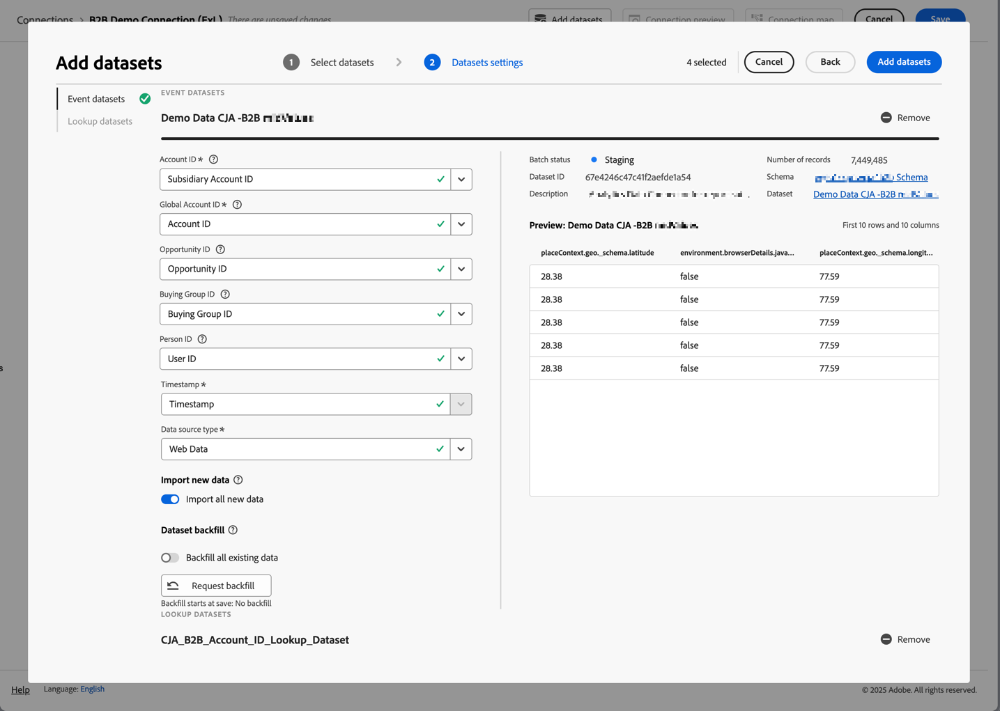

# Configurazione per i casi d’uso di B2B edition

Questo articolo descrive una configurazione tipica di Customer Journey Analytics B2B edition per supportare i seguenti casi d’uso:

* [Ottimizzare il marketing dell’account](optimize-account-marketing.md)
* [Crescita account chiave](grow-key-accounts.md)
* [Creare valore di prodotto](build-product-value.md)

>[!NOTE]
>
>I dati demo e le schermate utilizzati in questi casi d’uso sono solo a scopo illustrativo e non riflettono dati reali.

## Guida di riferimento per la progettazione della soluzione

Prima di configurare Customer Journey Analytics B2B edition, assicurati di disporre di un riferimento di progettazione della soluzione appropriato che documenti ciascuno dei campi raccolti.

Un esempio di riferimento di progettazione della soluzione potrebbe essere:

+++ Dimensioni evento

| Nome Dimension |
|---|
| ID account |
| Nome account |
| ID gruppo acquisti |
| Call center |
| ID rappresentante call center |
| ID chiamata |
| Codice di tracciamento campagna |
| ID contenuto |
| Tipo di contenuto |
| Origine dati |
| Tipo di dispositivo |
| Dettagli evento |
| Nome evento |
| Funnel |
| Canale di interazione |
| ID lead |
| Canale di marketing |
| ID evento di marketing |
| Tipo di evento di marketing |
| ID opportunità |
| Pagina |
| Dettagli pagina |
| Dominio di riferimento |
| ID rappresentante commerciale |
| Nome fase di vendita |
| Numero fase di vendita |
| Sezione del sito |
| SKU |
| ID account affiliata |
| ID sondaggio |
| Punteggio di soddisfazione sondaggio |
| Tipo di sondaggio |
| ID utente |

+++

+++ Metriche degli eventi

| Nome della metrica | Tipo di evento |
|---|---|
| Creazione account: completata | Contatore |
| Creazione account: inizio | Contatore |
| Costo chiamata | Valuta |
| Lunghezza chiamata | Contatore |
| Punteggio di soddisfazione chiamata | Numerici |
| Indagini telefoniche completate | Contatore |
| Chiamate | Contatore |
| Closed-Lost | Contatore |
| Closed Won | Contatore |
| Visualizzazioni contenuto | Contatore |
| Click-through per visualizzazione valuta dimensioni transazione | Contatore |
| Impression di visualizzazione | Contatore |
| E-mail non recapitata | Contatore |
| E-mail selezionata | Contatore |
| E-mail consegnata | Contatore |
| E-mail aperta | Contatore |
| E-mail inviata | Contatore |
| Partecipazione agli eventi | Contatore |
| Registrazione evento: completata | Contatore |
| Registrazione evento: passaggio 1 | Contatore |
| Registrazione evento: passaggio 2 | Contatore |
| Registrazione evento: passaggio 3 | Contatore |
| Chiamata in entrata numerica con punteggio di soddisfazione globale | Contatore |
| Modulo lead: completo | Contatore |
| Modulo lead: passaggio 1 | Contatore |
| Modulo lead: passaggio 2 | Contatore |
| Lead generato | Contatore |
| Qualificazione lead | Contatore |
| Riunioni | Contatore |
| MQL non qualificato | Contatore |
| Qualificato MQL | Contatore |
| Valutazione delle esigenze | Contatore |
| Negoziazione | Contatore |
| Gestione delle obiezioni | Contatore |
| Opportunità | Contatore |
| Creazione di opportunità | Contatore |
| Ordini | Contatore |
| Chiamata in uscita | Contatore |
| Follow-up post vendita | Contatore |
| Invio della proposta | Contatore |
| Ricavi chiusi-persi | Valuta |
| Ricavi ottenuti con la chiusura | Valuta |
| Chiamate contatto vendite | Contatore |
| Fase di vendita avviata | Contatore |
| Click-through SMS | Contatore |
| SMS inviati | Contatore |
| Click-through social | Contatore |
| Impression social | Contatore |
| Presentazione della soluzione | Contatore |
| SQL non qualificato | Contatore |
| SQL qualificato | Contatore |
| Unità (non esporre) | Contatore |
| Punteggio di soddisfazione sondaggio VoC | Numerici |
| Indagini VoC completate | Contatore |

+++

+++ Record persona

| Nome campo visualizzazione dati | Tipo di campo |
|---|---|
| Età | Metrica |
| Fascia di età | Dimensione |
| Livello di affinità categoria 1 | Dimensione |
| Punteggio affinità categoria 1 | Metrica |
| Livello di affinità categoria 2 | Dimensione |
| Punteggio affinità categoria 2 | Metrica |
| Livello di affinità categoria 3 | Dimensione |
| Punteggio affinità categoria 3 | Metrica |
| Livello di affinità categoria 4 | Dimensione |
| Punteggio affinità categoria 4 | Metrica |
| Livello di affinità categoria 5 | Dimensione |
| Punteggio affinità categoria 5 | Metrica |
| Consenso Advertising | Dimensione |
| Consenso a tutte le comunicazioni | Dimensione |
| Direct mailing di consenso | Dimensione |
| E-mail di consenso | Dimensione |
| Cellulare di consenso | Dimensione |
| Consent Personalization | Dimensione |
| Condivisione dei dati | Dimensione |
| SMS di consenso | Dimensione |
| E-mail | Dimensione |
| Nome | Dimensione |
| Genere | Dimensione |
| Singola città | Dimensione |
| Livello CLTV individuale | Dimensione |
| Punteggio CLTV individuale | Metrica |
| Singolo paese | Dimensione |
| Telefono singolo | Dimensione |
| Codice postale individuale | Dimensione |
| Propensione individuale al livello di acquisto | Dimensione |
| Punteggio propensione individuale all’acquisto | Metrica |
| Propensione individuale al livello di abbandono | Dimensione |
| Propensione individuale al punteggio di abbandono | Metrica |
| Propensione individuale al livello di aggiornamento | Dimensione |
| Propensione individuale all&#39;aggiornamento del punteggio | Metrica |
| Stato individuale | Dimensione |
| Indirizzo Individuale | Dimensione |
| Qualifica | Dimensione |
| Cognome | Dimensione |
| Punteggio promotore netto | Metrica |
| Stato Net Promoter | Dimensione |
| Tipo di Ruolo | Dimensione |

+++

+++ Record account

| Nome campo visualizzazione dati | Tipo di campo |
|---|---|
| Ricavi annuali | Metrica |
| Città società | Dimensione |
| Livello CLTV società | Dimensione |
| Punteggio CLTV società | Metrica |
| Paese dell’azienda | Dimensione |
| Nome società | Dimensione |
| Telefono società | Dimensione |
| CAP società | Dimensione |
| Propensione aziendale al livello di acquisto | Dimensione |
| Punteggio tendenza società ad acquistare | Metrica |
| Propensione dell&#39;azienda al livello di abbandono | Dimensione |
| Propensione dell’azienda all’abbandono | Metrica |
| Propensione dell&#39;azienda ad aggiornare il livello | Dimensione |
| Propensione dell&#39;azienda ad aggiornare il punteggio | Metrica |
| Dimensioni società | Dimensione |
| Stato società | Dimensione |
| Indirizzo società | Dimensione |
| Settore | Dimensione |
| Numero di dipendenti | Metrica |
| Pubblico dei partner - Acquirenti hardware | Dimensione |
| Pubblico dei partner - Crescita rapida | Dimensione |
| Pubblico partner - Servizi necessari | Dimensione |
| Pubblico partner - Acquirenti di software | Dimensione |
| Intervallo ricavi | Dimensione |
| Sito Web | Dimensione |

+++

+++ Record SKU

| Nome campo visualizzazione dati | Tipo di campo |
|---|---|
| Categoria di prodotti hardware | Dimensione |
| Nome prodotto hardware | Dimensione |
| Categoria servizio | Dimensione |
| Nome servizio | Dimensione |
| Categoria di prodotti software | Dimensione |
| Nome prodotto software | Dimensione |

+++

## Schemi e set di dati

I dati che supportano il riferimento di progettazione della soluzione sono strutturati utilizzando i seguenti schemi e set di dati.

### Dati evento

Le dimensioni e le metriche dell’evento sono supportate tramite uno schema basato su serie temporali (evento) e uno o più set di dati che contengono dati dell’evento.

<!--For example: the Account ID field is mapped to **[!UICONTROL Account ID]**. See below for a preview of the data typically available in such a dataset.

-->

### Dati della persona

I record persona sono supportati tramite uno schema basato su record (profilo) e uno o più set di dati che contengono dati persona. Di seguito trovi un esempio di dati personali (basati sull’esempio di riferimento per la progettazione della soluzione) in genere disponibili in tale set di dati.

### Dati account

I record account sono supportati tramite uno schema basato su record (ricerca) e uno o più set di dati che contengono dati account. Di seguito trovi un esempio di dati account (basati sull’esempio di riferimento per la progettazione della soluzione) in genere disponibili in tale set di dati.

### Dati SKU

I record SKU sono supportati tramite uno schema basato su record (ricerca) e uno o più set di dati che contengono dati SKU. Di seguito trovi un esempio di dati SKU (basati sull’esempio di riferimento per la progettazione della soluzione) generalmente disponibili in tale set di dati.

## Connessione

Definisci una connessione basata su account in Customer Journey Analytics per acquisire e unire i record dai set di dati evento, account, persona e SKU.

1. [Crea una nuova connessione](/help/connections/create-connection.md) in Customer Journey Analytics.
1. Immettere un nome descrittivo e una descrizione per la connessione.
1. Seleziona  **[!UICONTROL Account]** come **[!UICONTROL Primary ID]**.
1. Seleziona tutti **[!UICONTROL Optional containers]**.
1. Seleziona la sandbox preferita e stima il numero medio di eventi giornalieri.

   

1. Selezionare **[!UICONTROL Add datasets]** e aggiungere i set di dati B2B che contengono i dati per eventi, account, persone e SKU.

   

1. Selezionare **[!UICONTROL Next]** per configurare le impostazioni per ciascuno dei set di dati selezionati.
1. Per il set di dati dell&#39;evento, assicurati di selezionare le eVar appropriate che corrispondono alle identità per **[!UICONTROL Account ID]**, **[!UICONTROL Global Account ID]**, **[!UICONTROL Opportunity ID]**, **[!UICONTROL Buying Group ID]** e **[!UICONTROL Person ID]**.

   .

1. Scorri verso il basso per configurare il set di dati dei record account. Accertarsi di selezionare l&#39;identificatore corretto (**[!UICONTROL Account_ID]**) in modo che corrisponda all&#39;account dal contenitore **[!UICONTROL Global Account]**. Selezionare l&#39;identificatore corretto (**[!UICONTROL Account_ID]**) come **[!UICONTROL Global Account field]**.

   

1. Scorri verso il basso per configurare il set di dati dei record persona. Accertarsi di selezionare la chiave corretta (**[!UICONTROL Person_ID]**) in base alla persona dal contenitore **[!UICONTROL Person]**. Selezionare l&#39;identità appropriata (**[!UICONTROL Profile_Account_ID_Individual]**) per la corrispondenza con il campo **[!UICONTROL Global Account]**.

   

1. Scorri verso il basso per configurare il set di dati dei record SKU. Assicurarsi di selezionare la chiave corretta (**[!UICONTROL Sku]**). Selezionare **[!UICONTROL Match by field]** perché per questi dati non è configurato o disponibile alcun contenitore. Selezionare il campo SKU nel set di dati evento (**[!UICONTROL SKU (event datasets)]**) come chiave corrispondente.

   

1. Selezionare **[!UICONTROL Add datasets]** per salvare i set di dati e le relative impostazioni configurate.

1. Selezionare **[!UICONTROL Save]** per salvare la connessione.

## Visualizzazione dati

Dopo l’acquisizione dei dati in Customer Journey Analytics, desideri creare una visualizzazione dati che includa tutti i componenti definiti nella documentazione di riferimento per la progettazione della soluzione.

### Configurare

1. [Crea una nuova visualizzazione dati](/help/data-views/data-views.md) in Customer Journey Analytics.
1. Selezionare la connessione creata in precedenza (ad esempio: **[!UICONTROL B2B Demo Connection (ExL)]**).
1. Immetti un nome per la visualizzazione dati. Ad esempio: `B2B Demo Data view (ExL)` e facoltativamente una descrizione.
1. Facoltativamente, rinomina i contenitori. Oppure attieniti ai nomi dei contenitori predefiniti.

   
1. Seleziona **[!UICONTROL Save and continue]**.

### Componenti

Per impostazione predefinita, tutti i [componenti standard](/help/data-views/component-reference.md) sono già inclusi nella visualizzazione dati. Questi componenti standard includono le metriche specifiche B2B per conti, gruppi di acquisto, conti globali e opportunità.

1. Aggiungi tutte le dimensioni evento definite nella [documentazione sulla progettazione della soluzione](#solution-design-reference) ai componenti dimensione nella visualizzazione dati. Ad esempio, il campo **[!UICONTROL Event Name]**, che rappresenta la dimensione **[!UICONTROL Event Name]**. Assicurati di configurare il componente dimensione tramite le [impostazioni del componente](/help/data-views/component-settings/overview.md) disponibili.

   

1. Aggiungi tutte le metriche degli eventi definite nella [documentazione sulla progettazione della soluzione](#solution-design-reference) ai componenti delle metriche nella visualizzazione dati. Ad esempio, il campo **[!UICONTROL SQL Qualified]**, che rappresenta la metrica **[!UICONTROL SQL Qualified]**. Assicurati di configurare il componente dimensione tramite le [impostazioni del componente](/help/data-views/component-settings/overview.md) disponibili.

   

1. Aggiungi tutte le dimensioni conto definite nel [riferimento progettazione soluzione](#solution-design-reference) ai componenti dimensione nella visualizzazione dati. Ad esempio, il campo **[!UICONTROL Industry]**, che rappresenta la dimensione **[!UICONTROL Industry]**. Assicurati di configurare il componente dimensione tramite le [impostazioni del componente](/help/data-views/component-settings/overview.md) disponibili.

   

1. Aggiungi tutte le metriche account definite nella [documentazione sulla progettazione della soluzione](#solution-design-reference) ai componenti delle metriche nella visualizzazione dati. Ad esempio, il campo **[!UICONTROL Number_of_Employees]**, che rappresenta la metrica **[!UICONTROL Number_of_Employees]**. Assicurati di configurare il componente dimensione tramite le [impostazioni del componente](/help/data-views/component-settings/overview.md) disponibili.

   

1. Aggiungi tutte le dimensioni persona definite nel [riferimento progettazione soluzione](#solution-design-reference) ai componenti dimensione nella visualizzazione dati. Ad esempio, il campo **[!UICONTROL Category_1_Affinity_Level]**, che rappresenta la dimensione **[!UICONTROL Category_1_Affinity_Level]**. Assicurati di configurare il componente dimensione tramite le [impostazioni del componente](/help/data-views/component-settings/overview.md) disponibili.

   

1. Aggiungi tutte le metriche persona definite nella [documentazione sulla progettazione della soluzione](#solution-design-reference) ai componenti metriche nella visualizzazione dati. Ad esempio, il campo **[!UICONTROL Category_1_Affinity_Score]**, che rappresenta la metrica **[!UICONTROL Category_1_Affinity_Score]**. Assicurati di configurare il componente dimensione tramite le [impostazioni del componente](/help/data-views/component-settings/overview.md) disponibili.

   

1. Aggiungi tutte le dimensioni SKU definite nel [riferimento progettazione soluzione](#solution-design-reference) ai componenti dimensione nella visualizzazione dati. Ad esempio, il campo **[!UICONTROL Service Category]**, che rappresenta la dimensione **[!UICONTROL Service Category]**. Assicurati di configurare il componente dimensione tramite le [impostazioni del componente](/help/data-views/component-settings/overview.md) disponibili.

   

1. Seleziona **[!UICONTROL Save and Continue]**.

### Impostazioni

1. Facoltativamente, puoi definire [impostazioni](/help/data-views/create-dataview.md#settings-1) specifiche per la visualizzazione dati:

   * Aggiungi segmenti alla visualizzazione dati.
   * Utilizza una metrica (calcolata) per definire le impostazioni della sessione.

1. Seleziona **[!UICONTROL Save and continue]**.

## Segmenti

Puoi preparare uno o più segmenti basati su contenitori specifici B2B che puoi utilizzare nel progetto Workspace.

Ad esempio:

* Account con segmento di registrazione eventi.

  

* Account USA con gruppo di acquisto e segmento opportunità di fase 5.

  

## Altro

Facoltativamente, puoi definire altri componenti per i tuoi casi d&#39;uso, come [metriche calcolate](/help/components/calc-metrics/calc-metr-overview.md), [intervalli di date](/help/components/date-ranges/overview.md) o [avvisi](/help/components/c-intelligent-alerts/intelligent-alerts.md).
