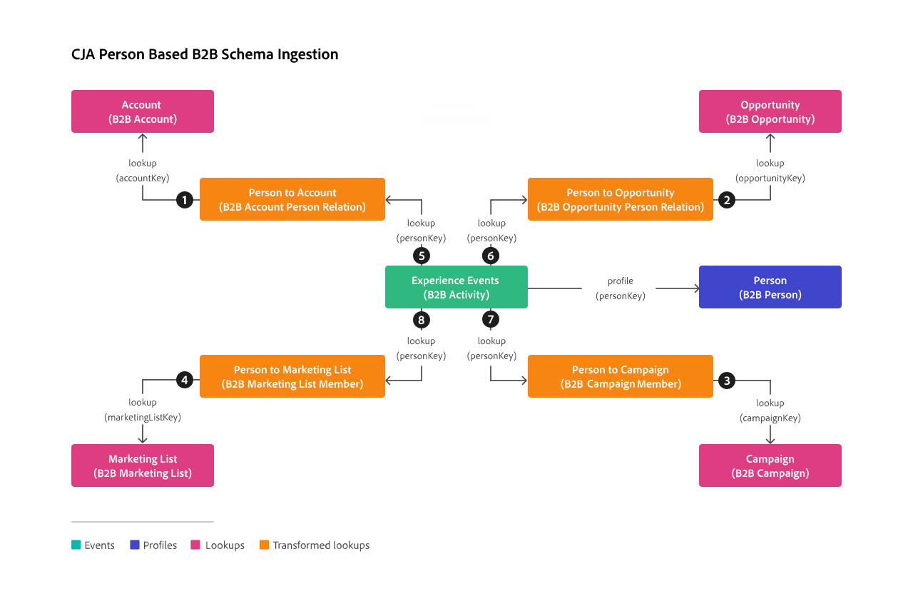

# Un esempio di progetto B2B basato su persona

Questo articolo illustra un caso d’uso in cui si desidera creare un rapporto appropriato in Customer Journey Analytics sui dati personali nel contesto di una tipica configurazione B2B basata su persona. Tale configurazione è facilitata da [Real-Time CDP B2B edition](https://experienceleague.adobe.com/en/docs/experience-platform/rtcdp/intro/rtcdpb2b-intro/b2b-overview).  Il caso d’uso spiega come impostare, configurare e generare rapporti sui dati B2B a livello di profilo (persona) in Customer Journey Analytics.

[!BADGE B2B edition]{type=Informative url="https://experienceleague.adobe.com/it/docs/analytics-platform/using/cja-overview/cja-b2b/cja-b2b-edition" newtab=true tooltip="Customer Journey Analytics B2B Edition"} Con la versione di [Customer Journey Analytics B2B edition](/help/getting-started/cja-b2b-edition.md) è stata pubblicata una sezione separata per i casi di utilizzo di reporting basati sull&#39;account.

## Connessione

Definisci la connessione in modo da includere tutti i set di dati B2B pertinenti di Experience Platform. Set di dati da aggiungere alla connessione:

| Set di dati | Schema | Tipo di schema | Classe base | Descrizione |
|---|---|---|---|---|
| Set di dati sull’attività B2B | Schema attività B2B | Evento | XDM ExperienceEvent | Un ExperienceEvent è una registrazione fattuale di ciò che è accaduto, incluso il momento e l’identità dell’individuo coinvolto. ExperienceEvents possono essere espliciti (azioni umane direttamente osservabili) o impliciti (generati senza un’azione umana diretta) e vengono registrati senza aggregazione o interpretazione. Gli eventi di esperienza sono fondamentali per l’analisi del dominio del tempo in quanto consentono l’osservazione e l’analisi dei cambiamenti che si verificano in una determinata finestra temporale e il confronto tra più finestre temporali per monitorare le tendenze. |
| Set di dati persona B2B | Schema persona B2B | Profilo | Profilo individuale XDM | Un profilo individuale XDM costituisce una rappresentazione unica degli attributi e degli interessi sia di individui identificati che parzialmente identificati. I profili meno identificati possono contenere solo segnali comportamentali anonimi, come i cookie del browser, mentre i profili altamente identificati possono contenere informazioni personali dettagliate come nome, data di nascita, posizione e indirizzo e-mail. Man mano che un profilo cresce, diventa un solido archivio di informazioni personali, informazioni di identificazione, dettagli di contatto e preferenze di comunicazione per un individuo. |
| Set di dati account B2B | Schema dell’account B2B | Ricerca | Account aziendale XDM | Un account aziendale XDM è una classe XDM (Experience Data Model) standard che acquisisce le proprietà minime richieste di un account aziendale. Questa classe XDM può essere inclusa solo nel profilo per i clienti con la versione B2B o B2P. |
| Set di dati dell’opportunità B2B | Schema opportunità B2B | Ricerca | Opportunità di business XDM | XDM Business Opportunity è una classe XDM (Experience Data Model) standard che acquisisce le proprietà minime richieste di un’opportunità aziendale. Questa classe XDM può essere inclusa solo nel profilo per i clienti con la versione B2B o B2P. |
| Set di dati della campagna B2B | Schema campagna B2B | Ricerca | Campagna aziendale XDM | XDM Business Campaign è una classe XDM (Experience Data Model) standard che acquisisce le proprietà minime richieste di una campagna aziendale. Questa classe XDM può essere inclusa solo nel profilo per i clienti con la versione B2B o B2P. |
| Set di dati dell’elenco di marketing B2B | Schema elenco di marketing B2B | Ricerca | Elenco di marketing aziendale XDM | XDM Business Marketing List è una classe XDM (Experience Data Model) standard che acquisisce le proprietà minime richieste di un elenco di marketing. Gli elenchi di marketing ti consentono di dare la priorità ai potenziali clienti che hanno maggiori probabilità di acquistare il tuo prodotto. Questa classe XDM può essere inclusa solo nel profilo per i clienti con la versione B2B o B2P. |
| Set di dati relazione persona account B2B | Schema di relazione della persona dell’account B2B | Ricerca | Relazione della persona dell’account aziendale XDM | XDM Business Account Person Relation è una classe XDM (Experience Data Model) standard che acquisisce le proprietà minime richieste di una persona associata a un account aziendale. |
| Set di dati relazione persona opportunità B2B | Schema di relazione persona opportunità B2B | Ricerca | Relazione della persona dell’opportunità aziendale XDM | La relazione tra persona opportunità aziendale XDM è una classe XDM (Experience Data Model) standard che acquisisce le proprietà minime richieste di una persona associata a un’opportunità aziendale. |
| Set di dati membri dell’elenco di marketing B2B | Schema membro dell’elenco di marketing B2B | Ricerca | Membri dell’elenco di marketing XDM | XDM Business Marketing List Members è una classe XDM (Experience Data Model) standard che descrive membri, persone o contatti associati a un elenco di marketing. |
| Set di dati dei membri della campagna B2B | Schema membro della campagna B2B | Ricerca | Membri della campagna aziendale XDM | XDM Business Campaign Members è una classe XDM (Experience Data Model) standard che descrive un contatto o un lead associato a una campagna aziendale. |

<!--
| B2B Account Dataset | B2B Account Schema | Lookup | XDM Business Account | XDM Business Account is a standard Experience Data Model (XDM) class that captures the minimum required properties of a business account.  |
| B2B Opportunity Dataset | B2B Opportunity Schema | Lookup | XDM Business Opportunity | XDM Business Opportunity is a standard Experience Data Model (XDM) class that captures the minimum required properties of a business opportunity.  |
| B2B Campaign Dataset | B2B Campaign Schema | Lookup | XDM Business Campaign | XDM Business Campaign is a standard Experience Data Model (XDM) class that captures the minimum required properties of a business campaign.  |
| B2B Marketing List Dataset | B2B Marketing List Schema | Lookup | XDM Marketing List | XDM Business Marketing List is a standard Experience Data Model (XDM) class that captures the minimum required properties of a marketing list. Marketing lists allow you to prioritize on prospect clients who are most likely to buy your product.  |
-->

La relazione tra gli schemi di ricerca B2B, lo schema di profilo e lo schema evento è definita nella configurazione B2B in Experience Platform. Vedere Schemi in [Real-Time Customer Data Platform B2B edition](https://experienceleague.adobe.com/it/docs/experience-platform/rtcdp/schemas/b2b) e [Definire una relazione molti-a-uno tra due schemi in Real-Time Customer Data Platform B2B edition](https://experienceleague.adobe.com/en/docs/experience-platform/xdm/tutorials/relationship-b2b).

Per garantire una configurazione corretta di una connessione che supporta le ricerche basate su persone dei dati B2B, utilizza la seguente illustrazione per una panoramica e segui questi passaggi:

1. Aggiungi alla connessione i set di dati della tabella precedente.
1. Per ogni set di dati di ricerca aggiunto alla connessione, è necessario definire esplicitamente la relazione con un set di dati evento utilizzando **[!UICONTROL Key]** e **[!UICONTROL Matching key]** nella finestra di dialogo **[!UICONTROL Edit dataset]**.
1. Per ogni set di dati di ricerca che si desidera trasformare per ricerche B2B basate su persone, abilitare **[!UICONTROL Transform dataset]** per garantire che i dati vengano trasformati per le ricerche basate su persone. Per ulteriori informazioni, vedere [Trasformare i set di dati per le ricerche B2B](/help/connections/transform-datasets-b2b-lookups.md).

   

   La tabella seguente fornisce una panoramica di esempio dei valori [!UICONTROL Person ID], [!UICONTROL Key] e [!UICONTROL Matching key] per ciascuno dei set di dati.

   | Set di dati | ID persona | Chiave | Chiave corrispondente (nel set di dati evento) |
   |---|---|---|---| 
   | Set di dati sull’attività B2B | ChiaveOrigine  **chiavePersona.ChiaveOrigine** | | |
   | Set di dati persona B2B | ChiaveOrigine  **b2b.personKey.sourceKey** | | |
   | Set di dati account B2B | | ChiaveOrigine  **accountKey.sourceKey**&#x200B;❶ | SourceKey (Set di dati persona B2B) **b2b.accountKey.sourceKey**&#x200B;❶ |
   | Set di dati dell’opportunità B2B | | Chiave Source  **optionKey.sourceKey**&#x200B;❷ | SourceKey (Set di dati relazione opportunità B2B) **optionKey.sourceKey**&#x200B;❷ |
   | Set di dati della campagna B2B | | ChiaveOrigine  **chiaveCampagna.chiaveOrigine**&#x200B;❸ | SourceKey (Set di dati membro campagna B2B) **campaignKey.sourceKey**&#x200B;❸  |
   | Set di dati dell’elenco di marketing B2B | | ChiaveOrigine  **marketingListKey.sourceKey**&#x200B;❹ | SourceKey (set di dati membro elenco di marketing B2B) **marketingListKey.sourceKey**&#x200B;❹ |
   | Set di dati relazione persona account B2B | | ChiaveOrigine  **chiavePersona.ChiaveOrigine**&#x200B;❺ | Chiave Source (Set di dati evento) **personKey.sourceKey**&#x200B;❺ |
   | Set di dati relazione persona opportunità B2B | | ChiaveOrigine  **chiavePersona.chiaveOrigine** y❻ | Chiave Source (Set di dati evento) **personKey.sourceKey**&#x200B;❻ |
   | Set di dati dei membri della campagna B2B | | ChiaveOrigine  **chiavePersona.ChiaveOrigine**&#x200B;❼ | Chiave Source (Set di dati evento) **personKey.sourceKey**&#x200B;❼ |
   | Set di dati membri dell’elenco di marketing B2B | | ChiaveOrigine  **chiavePersona.ChiaveOrigine**&#x200B;❽ | Chiave Source (Set di dati evento) **personKey.sourceKey**&#x200B;❽ |

{style="table-layout:auto"}

Per ulteriori informazioni su come configurare le impostazioni per un set di dati, vedere [Aggiungere e configurare i set di dati](../../connections/create-connection.md).

## Visualizzazione dati

Per poter accedere alle dimensioni e alle metriche B2B rilevanti durante la creazione di un progetto Workspace, devi definire di conseguenza la visualizzazione dati.

Ad esempio, puoi aggiungere i seguenti componenti alla visualizzazione dati per garantire la possibilità di creare rapporti a livello di persona in base ai dati B2B. A volte i nomi dei componenti vengono modificati per maggiore chiarezza rispetto ai nomi degli schemi originali.

+++Metriche 

| Nome componente | Set di dati | Tipo di dati | Percorso dello schema |
|---|---|---|---|
| Ricavi del conto annuale | Set di dati account B2B | Doppio | accountOrganization.annualRevenue.amount |
| Numero di dipendenti | Set di dati account B2B | Intero | accountOrganization.numberOfEmployees |
| Costo effettivo campagna | Set di dati della campagna B2B | Doppio | actualCost.amount |
| Costo campagna preventivato | Set di dati della campagna B2B | Doppio | budgetedCost.amount |
| Ricavi opportunità previsti | Set di dati dell’opportunità B2B | Doppio | expectedRevenue.amount |
| Ricavi previsti dalla campagna | Set di dati della campagna B2B | Doppio | expectedRevenue.amount |
| Importo dell’opportunità | Set di dati dell’opportunità B2B | Doppio | opportunityAmount.amount |

+++

+++Dimensioni

| Nome componente | Set di dati | Tipo di dati | Percorso dello schema |
|---|---|---|---|
| Nome account | Set di dati account B2B | Stringa | accountName |
| Nome della campagna | Set di dati della campagna B2B | Stringa | campaignName |
| Nome del canale | Set di dati della campagna B2B | Stringa | channelName |
| Paese | Set di dati account B2B | Stringa | accountBillingAddress.country |
| Nome categoria previsione | Set di dati dell’opportunità B2B | Stringa | forecastCategoryName |
| Settore | Set di dati account B2B | Stringa | accountOrganization.industry |
| Cognome | Set di dati persona B2B | Stringa | person.name.lastName |
| Nome elenco di marketing | Set di dati dell’elenco di marketing B2B | Stringa | marketingListName |
| Nome dell’opportunità | Set di dati dell’opportunità B2B | Stringa | NomeOpzione |
| Fase dell’opportunità | Set di dati dell’opportunità B2B | Stringa | optionStage |
| Tipo di opportunità | Set di dati per tipo di opportunità B2B | Stringa | tipo opportunità |
| Nome sessione webinar | Set di dati della campagna B2B | Stringa | webinarSessionName |

+++

## Workspace

Con i componenti definiti correttamente nella visualizzazione dati, ora puoi creare rapporti e visualizzazioni B2B specifici nel progetto Workspace.

Di seguito è riportata una schermata da un progetto di esempio che si basa sulla connessione e sulla visualizzazione dati descritte in precedenza. Le descrizioni delle visualizzazioni spiegano quale delle tabelle a forma libera si basa sui dati di ricerca B2B trasformati.

