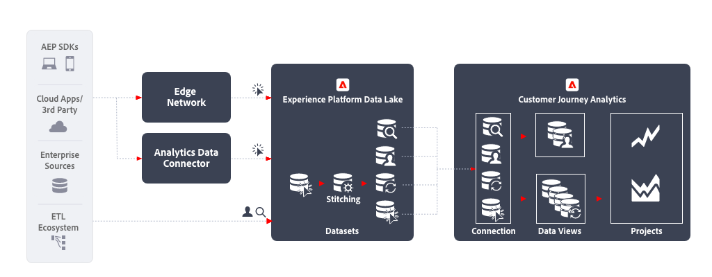

# Analisi cross-channel {#cross-channel}

<!-- markdownlint-disable MD034 -->

>[!CONTEXTUALHELP]
>id="cja-upgrade-additional-datasets"
>title="Aggiungere altri set di dati alla connessione"
>abstract="Dopo aver aggiunto dati a un set di dati in Adobe Experience Platform, puoi aggiungere il set di dati alla tua connessione in Customer Journey Analytics. Se aggiungi dati da altri canali, assicurati che siano conformi allo schema utilizzato dalla tua organizzazione.  Ogni set di dati aggiunto richiede un’ingente mole di lavoro, in particolare per verificare che per ogni evento esista un identificatore univoco e per assicurarsi che la struttura generale dei dati sia conforme allo schema personalizzato dell’organizzazione. La definizione di questo flusso di lavoro può richiedere il coordinamento di più team all’interno dell’organizzazione per un periodo di alcuni mesi."

<!-- markdownlint-enable MD034 -->

L’analisi cross-channel abilita un’unica vista consolidata del comportamento della clientela tra vari canali, unificando i dati provenienti da varie proprietà web su dispositivi mobili e offline. Ad esempio, puoi utilizzare questa vista consolidata per analizzare le interazioni dei clienti su computer desktop e dispositivi mobili per comprendere il comportamento dei clienti ed estrarre informazioni per ottimizzare le esperienze dei clienti digitali. Puoi anche analizzare le interazioni dei clienti tra i diversi canali, compresi i canali digitali e offline, come le interazioni di supporto e gli acquisti in-store per comprendere e ottimizzare meglio il percorso del cliente.

## Passaggi di implementazione

1. [Creare schemi](https://experienceleague.adobe.com/docs/experience-platform/xdm/tutorials/create-schema-ui.html?lang=it) per i dati da inserire.
1. [Creare set di dati](https://experienceleague.adobe.com/docs/platform-learn/tutorials/data-ingestion/create-datasets-and-ingest-data.html?lang=it) per i dati da inserire.
1. [Acquisire dati in Experience Platform](https://experienceleague.adobe.com/docs/platform-learn/tutorials/data-ingestion/understanding-data-ingestion.html?lang=it):
   1. Dati basati su evento  dal sito web o dall’app mobile tramite il connettore di origine di Edge Network o Analytics.
   2. Dati di profilo  (ad esempio da un sistema CRM, un’applicazione call center, un’applicazione fedeltà).
   3. Dati di ricerca  (ad esempio nome prodotto, categoria da un sistema di informazioni sul prodotto).

1. Utilizza un ID con uno spazio dei nomi comune nei diversi set di dati. Utilizza [Unione](../../stitching/overview.md) per elevare qualsiasi set di dati basato su eventi  rispetto alla fornitura dell’ID comune su ciascuna riga. Al momento, Customer Journey Analytics non utilizza i servizi Profile o Identity di Experience Platform per l’unione.
1. Esegui le attività di preparazione necessarie dei dati personalizzati affinché tutti i set di dati delle serie temporali abbiano una chiave comune da inserire in Customer Journey Analytics.
1. Attribuisci ai dati di ricerca un ID primario che possa unirsi a un campo nei dati dell’evento. Conta come righe nella licenza.
1. Imposta lo stesso ID primario per i dati di profilo come ID primario dei dati dell’evento.
1. [Crea una connessione](../../connections/overview.md) per acquisire i set di dati rilevanti da Experience Platform in Customer Journey Analytics.
1. [Crea una visualizzazione dati](/help/data-views/create-dataview.md) sulla connessione per selezionare le dimensioni e le metriche specifiche da includere nella visualizzazione. Le impostazioni di attribuzione e allocazione sono configurate anche nella visualizzazione dati. Queste impostazioni vengono calcolate al momento del rapporto.
1. [Crea un progetto](/help/analysis-workspace/home.md) per configurare dashboard e rapporti in Analysis Workspace.

## Considerazioni

Quando stabilisci questo flusso di lavoro, assicurati di prendere in considerazione i seguenti punti.

* L’analisi dei dati tra canali diversi richiede lo stesso ID dello spazio dei nomi su ogni record.
* Il processo di unione di diversi set di dati richiede una chiave primaria comune per la persona/entità nei set di dati.
* Le unioni basate su chiavi secondarie non sono supportate al momento.
* Il processo di unione consente di reimpostare le identità nelle righe in base alle informazioni di un ID transitorio (come un ID di autenticazione) da record che condividono lo stesso ID persistente. Questo consente di risolvere diversi record in un singolo ID di unione per l’analisi a livello di persona, anziché a livello di dispositivo o cookie.
* Gli oggetti e gli attributi dello stesso campo XDM si uniscono in una dimensione in Customer Journey Analytics. Per unire più attributi da diversi set di dati nella stessa dimensione di Customer Journey Analytics, i set di dati devono fare riferimento allo stesso campo o schema XDM.

