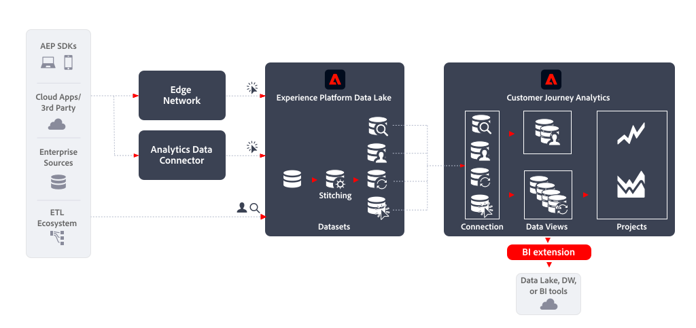

# Estensione BI

Questo articolo illustra come utilizzare [!DNL Customer Journey Analytics BI extension] per implementare il seguente [caso d&#39;uso per l&#39;esportazione dei dati](overview.md):

- Strumenti Data Lake, Data Warehouse o BI

## Introduzione

L&#39;esportazione di dati tramite [!DNL Customer Journey Analytics BI extension] consente di esportare dati dalle visualizzazioni dati di Customer Journey Analytics.

## Ulteriori informazioni

L’[!DNL Customer Journey Analytics BI extension] consente a SQL di accedere alle [visualizzazioni dati](/help/data-views/data-views.md) definite in Customer Journey Analytics. I data engineer e gli analisti potrebbero avere più familiarità con Power BI, Tableau o altri strumenti di business intelligence e visualizzazione (denominati anche strumenti BI). Ora possono creare reporting e dashboard basati sulle stesse visualizzazioni dati utilizzate dagli utenti di Customer Journey Analytics durante la creazione dei loro progetti Analysis Workspace.

Per ulteriori informazioni, consulta la documentazione dettagliata sull&#39;estensione [BI](../../data-views/bi-extension.md).
