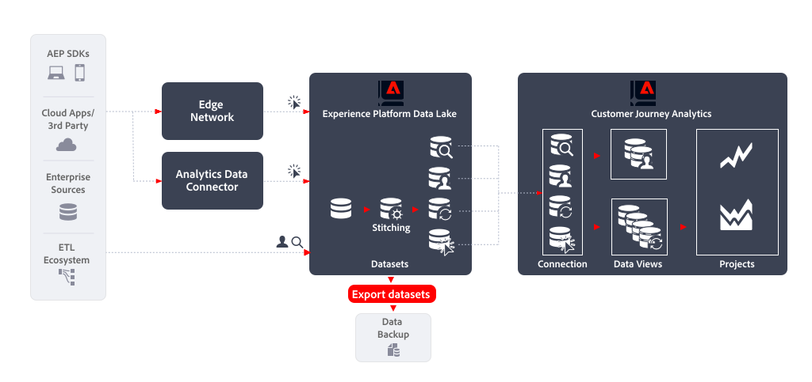

# Esportare i set di dati

Questo articolo illustra come [!DNL Customer Journey Analytics Export datasets] può essere utilizzato per implementare quanto segue [caso di utilizzo dell’esportazione dei dati](overview.md):

- Backup dei dati

## Introduzione

Esportazione di dati tramite [!DNL Experience Platform Export datasets] consente di esportare dati dalle visualizzazioni dati del Customer Journey Analytics a qualsiasi destinazione di archiviazione cloud.

## Ulteriori informazioni

Puoi esportare i set di dati non elaborati dal data lake in Experienci Platform nelle destinazioni di archiviazione cloud. Questa esportazione si trova nella terminologia di Experienci Platform Destinations, o destinazioni di esportazione del set di dati. Consulta [Esportare i set di dati nelle destinazioni dell’archiviazione cloud](https://experienceleague.adobe.com/en/docs/experience-platform/destinations/ui/activate/export-datasets) panoramica.

Sono supportate le seguenti destinazioni di archiviazione cloud:

- [Archiviazione Azure Data Lake Gen2](https://experienceleague.adobe.com/en/docs/experience-platform/destinations/catalog/cloud-storage/adls-gen2)
- [Data Landing Zone](https://experienceleague.adobe.com/en/docs/experience-platform/destinations/catalog/cloud-storage/data-landing-zone)
- [Archiviazione cloud Google](https://experienceleague.adobe.com/en/docs/experience-platform/destinations/catalog/cloud-storage/google-cloud-storage)
- [Amazon S3](https://experienceleague.adobe.com/en/docs/experience-platform/destinations/catalog/cloud-storage/amazon-s3#changelog)
- [BLOB di Azure](https://experienceleague.adobe.com/en/docs/experience-platform/destinations/catalog/cloud-storage/azure-blob#changelog)
- [SFTP](https://experienceleague.adobe.com/en/docs/experience-platform/destinations/catalog/cloud-storage/sftp#changelog)

### Interfaccia utente Experienci Platform

Puoi esportare e pianificare l’esportazione dei set di dati tramite l’interfaccia utente di Experienci Platform. Questa sezione descrive i passaggi necessari.

#### Seleziona destinazione

Dopo aver determinato la destinazione dell’archiviazione cloud in cui desideri esportare il set di dati, [seleziona la destinazione](https://experienceleague.adobe.com/en/docs/experience-platform/destinations/ui/activate/export-datasets#select-destination). Quando non hai ancora configurato una destinazione per l’archiviazione cloud preferita, devi [creare una nuova connessione di destinazione](https://experienceleague.adobe.com/en/docs/experience-platform/destinations/ui/connect-destination).

Durante la configurazione di una destinazione, puoi definire:

- il tipo di file (JSON o Parquet),
- se il file risultante deve essere compresso o meno e
- se un file manifesto deve essere incluso o meno.

#### Seleziona set di dati

Dopo aver selezionato la destinazione, nel successivo **[!UICONTROL Select datasets]** passaggio è necessario selezionare il set di dati dall’elenco dei set di dati. Se hai creato più query pianificate e desideri che i set di dati vengano inviati alla stessa destinazione di archiviazione cloud, puoi selezionare i set di dati corrispondenti. Consulta [Seleziona i set di dati](https://experienceleague.adobe.com/en/docs/experience-platform/destinations/ui/activate/export-datasets#select-datasets) per ulteriori informazioni.

#### Pianificare l’esportazione di set di dati

Infine, desideri pianificare l’esportazione del set di dati come parte del **[!UICONTROL Scheduling]** passaggio. In questo passaggio puoi definire la pianificazione e se l’esportazione del set di dati deve essere incrementale o meno. Consulta [Pianificare l’esportazione di set di dati](https://experienceleague.adobe.com/en/docs/experience-platform/destinations/ui/activate/export-datasets#scheduling) per ulteriori informazioni.

#### Passaggi finali

[Revisione](https://experienceleague.adobe.com/en/docs/experience-platform/destinations/ui/activate/export-datasets#review) della selezione e, se corretto, inizia a esportare il set di dati nella destinazione di archiviazione cloud.

Innanzitutto, devi [verifica](https://experienceleague.adobe.com/en/docs/experience-platform/destinations/ui/activate/export-datasets#verify) esportazione dei dati riuscita. Durante l’esportazione dei set di dati, in Experienci Platform ne vengono creati uno o più `.json` o `.parquet` file nel percorso di archiviazione definito nella destinazione. I nuovi file verranno archiviati nel percorso di archiviazione in base alla pianificazione di esportazione configurata. In Experience Platform viene creata una struttura di cartelle nel percorso di archiviazione specificato come parte della destinazione selezionata, in cui vengono depositati i file esportati. Per ogni esportazione viene creata una nuova cartella, seguendo il modello: `folder-name-you-provided/datasetID/exportTime=YYYYMMDDHHMM`. Il nome di file predefinito viene generato in modo casuale e garantisce che i nomi di file esportati siano univoci.

### API del servizio Flusso

In alternativa, puoi esportare e pianificare l’esportazione dei set di dati utilizzando le API. I passaggi necessari sono documentati in [Esportare i set di dati utilizzando l’API del servizio Flusso](https://experienceleague.adobe.com/en/docs/experience-platform/destinations/api/export-datasets).

#### Introduzione

Per esportare i set di dati, assicurati di disporre dei [autorizzazioni richieste](https://experienceleague.adobe.com/en/docs/experience-platform/destinations/api/export-datasets#permissions). Verifica inoltre che la destinazione in cui desideri inviare il set di dati supporti l’esportazione dei set di dati. Devi quindi [raccogliere i valori per le intestazioni obbligatorie e facoltative](https://experienceleague.adobe.com/en/docs/experience-platform/destinations/api/export-datasets#gather-values-headers) che utilizzi nelle chiamate API. È inoltre necessario [identificare la specifica di connessione e gli ID delle specifiche di flusso della destinazione](https://experienceleague.adobe.com/en/docs/experience-platform/destinations/api/export-datasets#gather-connection-spec-flow-spec) intendi esportare i set di dati in.

#### Recuperare i set di dati idonei

È possibile [recuperare un elenco di set di dati idonei](https://experienceleague.adobe.com/en/docs/experience-platform/destinations/api/export-datasets#retrieve-list-of-available-datasets) per l’esportazione e verifica se il set di dati fa parte di tale elenco utilizzando [`GET /connectionSpecs/{id}/configs`](https://developer.adobe.com/experience-platform-apis/references/destinations/#tag/Configurations/operation/getDatasets) API.

#### Crea connessione sorgente

Quindi, devi [creare una connessione sorgente](https://experienceleague.adobe.com/en/docs/experience-platform/destinations/api/export-datasets#create-source-connection) per il set di dati, utilizzando il relativo ID univoco, che desideri esportare nella destinazione di archiviazione cloud. Utilizzi il [`POST /sourceConnections`](https://developer.adobe.com/experience-platform-apis/references/destinations/#tag/Source-connections/operation/postSourceConnection) API.

#### Autentica nella destinazione (crea connessione di base)

Ora devi [creare una connessione di base](https://experienceleague.adobe.com/en/docs/experience-platform/destinations/api/export-datasets#create-base-connection) per autenticare e archiviare in modo sicuro le credenziali nella destinazione di archiviazione cloud utilizzando [`POST /targetConection`](https://developer.adobe.com/experience-platform-apis/references/destinations/#tag/Target-connections/operation/postTargetConnection) API.

#### Fornire parametri di esportazione

Quindi, devi [crea una connessione di destinazione aggiuntiva in cui sono memorizzati i parametri di esportazione](https://experienceleague.adobe.com/en/docs/experience-platform/destinations/api/export-datasets#create-target-connection) per il set di dati utilizzando, ancora una volta, il [`POST /targetConection`](https://developer.adobe.com/experience-platform-apis/references/destinations/#tag/Target-connections/operation/postTargetConnection) API. Questi parametri di esportazione includono posizione, formato file, compressione e altro ancora.

#### Imposta flusso di dati

Finalmente, [impostare il flusso di dati](https://experienceleague.adobe.com/en/docs/experience-platform/destinations/api/export-datasets#create-dataflow) per garantire che il set di dati venga esportato nella destinazione di archiviazione cloud utilizzando [`POST /flows`](https://developer.adobe.com/experience-platform-apis/references/destinations/#tag/Dataflows/operation/postFlow) API. In questo passaggio puoi definire la pianificazione per l’esportazione utilizzando `scheduleParams` parametro.

#### Convalida flusso di dati

A [verificare le esecuzioni corrette del flusso di dati](https://experienceleague.adobe.com/en/docs/experience-platform/destinations/api/export-datasets#get-dataflow-runs), utilizza [`GET /runs`](https://developer.adobe.com/experience-platform-apis/references/destinations/#tag/Dataflow-runs/operation/getFlowRuns) API, specificando l’ID del flusso di dati come parametro di query. Questo ID del flusso di dati è un identificatore restituito quando imposti il flusso di dati.

[Verifica](https://experienceleague.adobe.com/en/docs/experience-platform/destinations/ui/activate/export-datasets#verify) esportazione dei dati riuscita. Durante l’esportazione dei set di dati, in Experienci Platform ne vengono creati uno o più `.json` o `.parquet` file nel percorso di archiviazione definito nella destinazione. I nuovi file verranno archiviati nel percorso di archiviazione in base alla pianificazione di esportazione configurata. In Experience Platform viene creata una struttura di cartelle nel percorso di archiviazione specificato come parte della destinazione selezionata, in cui vengono depositati i file esportati. Per ogni esportazione viene creata una nuova cartella, seguendo il modello: `folder-name-you-provided/datasetID/exportTime=YYYYMMDDHHMM`. Il nome di file predefinito viene generato in modo casuale e garantisce che i nomi di file esportati siano univoci.
