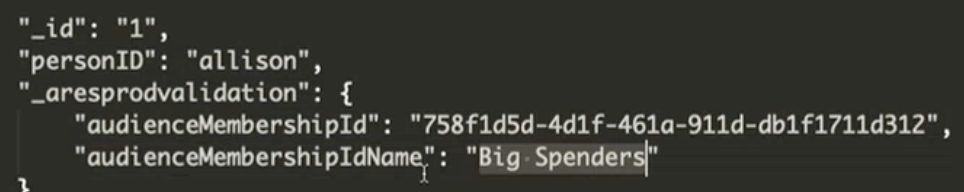

# Acquisire il pubblico AEP in Customer Journey Analytics (CJA)

Questo caso d’uso descrive come importare in un modo provvisorio e manuale i tipi di pubblico di Adobe Experience Platform (AEP) in CJA. I tipi di pubblico possono essere stati creati nel Generatore di segmenti di AEP, o Adobe Audience Manager, oppure in altri strumenti e sono memorizzati nel profilo cliente in tempo reale (RTCP, Real-time Customer Profile). I tipi di pubblico sono costituiti da un set di ID profilo ed eventuali attributi, eventi ecc. applicabili e possono essere portati in CJA Workspace per eseguire analisi.

## Prerequisiti

* Accesso ad Adobe Experience Platform (AEP), in particolare al servizio Real-time Customer Profile.
* Accesso per creare e gestire schemi e set di dati AEP.
* Accesso a AEP Query Service (e la capacità di scrivere query SQL) o a un altro strumento per eseguire alcune trasformazioni leggere.
* Accesso a Customer Journey Analytics. Per poter creare e modificare connessioni e visualizzazioni dati CJA, devi essere un amministratore di prodotto CJA.
* Capacità di utilizzare le API di Adobe (segmentazione, facoltativamente altre)

## Passaggio 1: scegliere il pubblico in Real-time Customer Profile {#audience}

Adobe Experience Platform [Real-time Customer Profile](https://experienceleague.adobe.com/docs/experience-platform/profile/home.html?lang=it) (RTCP) offre una visualizzazione olistica di ogni singolo cliente combinando dati provenienti da più canali, inclusi online, offline, CRM e di terze parti.

Probabilmente hai già dei tipi di pubblico in RTCP che possono provenire da varie origini. Scegli uno o più tipi di pubblico da inserire in CJA.

## Passaggio 2: creare un set di dati Unione profili da esportare

Per esportare il pubblico come set di dati da aggiunto a una connessione in CJA, devi creare un set di dati con uno [schema di unione](https://experienceleague.adobe.com/docs/experience-platform/profile/union-schemas/union-schema.html?lang=it#understanding-union-schemas) profili.

Gli schemi di unione sono composti da più schemi che condividono la stessa classe e sono stati abilitati per Profilo. Lo schema di unione consente di visualizzare una combinazione di tutti i campi contenuti negli schemi che condividono la stessa classe. Real-time Customer Profile utilizza lo schema di unione per creare una visualizzazione olistica di ogni cliente.

## Passaggio 3: esportare un pubblico nel set di dati di Unione profili tramite chiamata API {#export}

Prima di importare un pubblico in CJA, devi esportarlo con set di dati AEP. Questo può essere fatto solo utilizzando l’API di segmentazione, e in particolare l’[endpoint API per processi di esportazione](https://experienceleague.adobe.com/docs/experience-platform/segmentation/api/export-jobs.html?lang=it).

Puoi creare un processo di esportazione utilizzando l’ID pubblico desiderato e inserire i risultati nel set di dati Unione profili di AEP creato al passaggio 2. Anche se puoi esportare vari attributi o eventi per il pubblico, devi solo esportare il campo ID profilo specifico che corrisponde al campo ID persona utilizzato nella connessione CJA che userai (vedi il passaggio 5, più avanti).

## Passaggio 4: modificare l’output di esportazione

Per poter essere acquisiti in CJA, i risultati del processo di esportazione devono essere trasformati in un set di dati profilo distinto. Questa trasformazione può essere eseguita con [AEP Query Service](https://experienceleague.adobe.com/docs/experience-platform/query/home.html?lang=it) o con un altro strumento di trasformazione a tua scelta. Per effettuare la generazione dei rapporti in CJA, è necessario solo l’ID profilo (che corrisponde all’ID persona in CJA) e uno o più ID pubblico.

Il processo di esportazione standard, tuttavia, contiene anche altri dati ed è quindi necessario modificare l’output per rimuovere i dati estranei e spostare alcuni elementi. Inoltre, è necessario creare uno schema o set di dati prima di aggiungervi i dati trasformati.

Ecco un esempio dell’output di esportazione nel set di dati Unione profili, **prima** di qualsiasi modifica:

Tieni presente quanto segue:

* L’ID del pubblico si trova in `segmentmembership.ups.xxxxxxxx-xxxx-xxxx-xxxx-xxxxxxxxxxxx.status`.
* Lo stato deve essere “realized” (realizzato) o “entered” (entrato), ma non “exited” (uscito).

Questo è il formato del set di dati profilo che puoi essere inviato a CJA.

Di seguito sono riportati gli elementi dati necessari:

* Campo stringa `_aresprodvalidation`: fa riferimento all’ID della tua organizzazione. Il tuo specifico valore sarà diverso da questo esempio.
* Campo stringa `personID`: campo dello schema XDM standard nei set di dati profilo con cui viene identificata la persona. Utilizza l’ID profilo dall’esportazione.
* Campo stringa `audienceMembershipId`: ID del pubblico dall’esportazione. NOTA: puoi denominare questo campo in base alle tue esigenze (dal tuo schema).
* Aggiungi al pubblico un nome descrittivo (`audienceMembershipIdName`), ad esempio:

   

* Se necessario, aggiungi altri metadati di pubblico.

## Passaggio 5: aggiungere il set di dati profilo a una connessione esistente in CJA

Puoi [crea una nuova connessione](/help/connections/create-connection.md), ma nella maggior parte dei casi si vorrà aggiungere il set di dati profilo a una connessione esistente. Gli ID del pubblico “arricchiscono” i dati esistenti in CJA.

## Passaggio 6: modificare la visualizzazione dati CJA esistente (o crearne una nuova)

Aggiungi `audienceMembershipId`, `audienceMembershipIdName` e `personID` alla visualizzazione dati.

## Passaggio 7: creare un rapporto in Workspace

Ora puoi creare un rapporto in Workspace basato su `audienceMembershipId`, `audienceMembershipIdName` e `personID`.

## Note aggiuntive

* Segui questo processo su base regolare, per avere dati sul pubblico sempre aggiornati in CJA.
* Puoi importare più tipi di pubblico in una singola connessione CJA. Il processo sarà un po’ più complesso, ma è possibile. Dovrai apportare alcune modifiche al processo di cui sopra:
   1. Esegui questo processo per ogni pubblico desiderato nella raccolta di tipi di pubblico in RTCP.
   1. CJA supporta array/array di oggetti nei set di dati profilo. Utilizzare un [array di oggetti](https://experienceleague.adobe.com/docs/analytics-platform/using/cja-usecases/complex-data/object-arrays.html) per audienceMembershipId o audienceMembershipIdName è l’opzione migliore.
   1. Nella visualizzazione dati, crea una nuova dimensione utilizzando la trasformazione Substring (Sottostringa) nel campo `audienceMembershipId` per convertire la stringa di valori separati da virgola in un array. NOTA: attualmente un array può contenere un massimo di 10 valori.
   1. A questo punto è possibile creare rapporti sulla nuova dimensione `audienceMembershipIds` in CJA Workspace.
