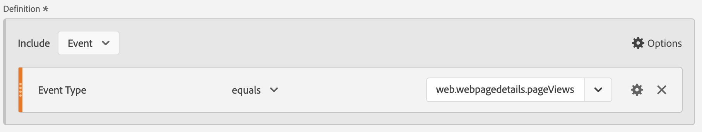
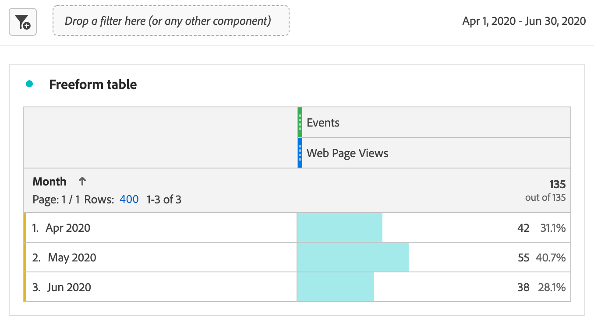
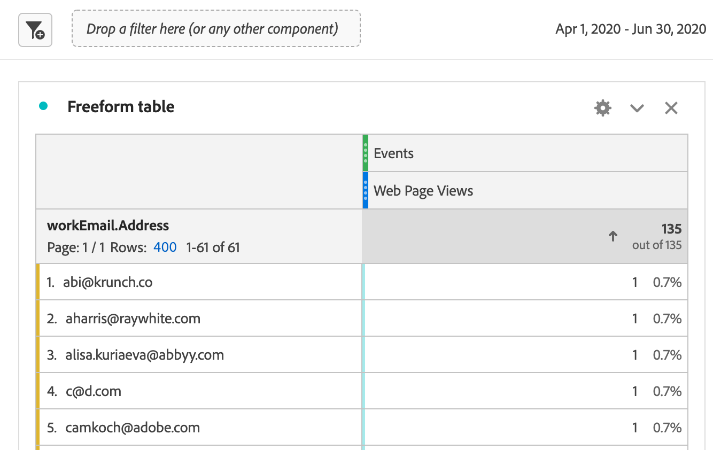

# Rapporto sui dati Marketo Engage

Puoi sfruttare i set di dati di Marketo Engage disponibili in Experience Platform per fornire preziose soluzioni di analisi e reporting agli esperti di marketing B2B. Quindi crea rapporti su questi set di dati in Customer Journey Analytics.

Tieni presente che:

* Il reporting di Marketo Engage è ideale per misurare e ottimizzare i programmi di marketing direttamente in Marketo ed è veloce, prescrittivo e di facile utilizzo per gli addetti al marketing.
* Customer Percorsi Analytics fornisce una soluzione di analisi molto più ampia e personalizzabile per percorsi di clienti che si estendono su più canali, prodotti e business unit, inclusi, ma non solo, i dati di Marketo.

Vedi [confronto dei rapporti](#reporting-comparison) per ulteriori dettagli.

>[!NOTE]
>
>È possibile considerare [Customer Journey Analytics B2B edition](/help/getting-started/cja-b2b-edition.md) per ottenere molto più valore dai dati di Marketo Engage. Puoi combinare i set di dati di Marketo Engage con i set di dati di account e di ricerca. E generare rapporti a livello di account e opportunità in Customer Journey Analytics B2B edition.
>

Per generare rapporti sui dati di Marketo Engage in Customer Journey Analytics, effettua le seguenti operazioni:

+++Seleziona strategia ID

Se desideri acquisire in Customer Journey Analytics i dati delle attività di Marketo, devi selezionare una strategia ID appropriata per garantire che i dati di Marketo possano essere collegati ai dati di Customer Journey Analytics.

I dati di Marketo non contengono un ECID in modo nativo, ma il campo ECID può essere aggiunto come campo personalizzato raccolto con la libreria `munchkin.js`. Questa aggiunta crea un identificatore condiviso tra Marketo e i dati web esistenti del Percorso del cliente Analytics.

Per collegare i dati di Marketo e Customer Journey Analytics, utilizza [unione basata su grafico](/help/stitching/gbs.md) nei set di dati rilevanti. Puoi utilizzare diversi ID disponibili, in base all’implementazione:

* ECID, fornito dal servizio Experience Platform Identity
* E-mail
* Munchkin ID, fornito da Marketo Engage
* ID Rivenditore
* Dunn &amp; Bradstreet Duns\#
* ID Demandbase
* (potenzialmente altri)

L’unione basata su grafico consente di effettuare le seguenti operazioni:

* Mantiene un ID persistente negli eventi web.
* Utilizza il grafo delle identità per risolvere le identità note (come e-mail), quando possibile.
* Se non esiste alcuna corrispondenza deterministica, l’unione basata su grafo viene riportata sull’ID persistente, invece di rilasciare l’evento.

L’unione basata su grafico è una soluzione valida per collegare dati Marketo e Customer Journey Analytics perché:

* I dati dell’evento web hanno un ID persistente su ogni riga (ad esempio, ECID).
* I dati Marketo contengono ID affidabili nei dati con Munckin ID, ECID ed e-mail.
* L’unione basata su grafico collega in modo deterministico ECID a Munchkin ID, e-mail o qualsiasi altro ID disponibile nei dati di Marketo.
* L’unione basata su grafico utilizza le regole di collegamento e gli spazi dei nomi del grafico delle identità configurati in modo esplicito.

Per verificare questa strategia ID, devi eseguire un progetto pilota di unione basata su grafico controllato.

1. Aggiungi ECID come campo personalizzato in Marketo e aggiungi il campo personalizzato al codice JavaScript lato client munckin.js per la raccolta dati di Marketo Engage.
1. Imposta una connessione temporanea del Percorso clienti che includa almeno un set di dati Marketo e un set di dati evento web.
1. Definisci un intervallo di dati ristretto per inserire una quantità di dati limitata ma rappresentativa.
1. Verifica l’unione tramite la configurazione di una visualizzazione dati e di rapporti in Workspace. Per ulteriori informazioni, consulta i passaggi seguenti.

+++

+++Mappare i campi dati di origine di Marketo alle relative destinazioni XDM

Mappa gli oggetti [Persons](https://experienceleague.adobe.com/en/docs/experience-platform/sources/connectors/adobe-applications/mapping/marketo) (Persone) e [Activities](https://experienceleague.adobe.com/en/docs/experience-platform/sources/connectors/adobe-applications/mapping/marketo) (Attività) ai rispettivi campi di destinazione dello schema XDM.

+++

+++Inserire dati Marketo in Adobe Experience Platform

Utilizza il [connettore Marketo Engage](https://experienceleague.adobe.com/en/docs/experience-platform/sources/connectors/adobe-applications/marketo/marketo) per portare i dati da Marketo ad Experience Platform e tenerli aggiornati utilizzando le applicazioni Experience Platform.

+++

+++ Configurare una connessione a questo set di dati in Customer Journey Analytics

Per creare rapporti sui set di dati di Experience Platform devi prima stabilire una connessione tra i set di dati in Experience Platform e Customer Journey Analytics. Vedi [Creare o modificare una connessione](https://experienceleague.adobe.com/it/docs/analytics-platform/using/cja-connections/create-connection).

+++

+++Creare una o più visualizzazioni dati

Una [visualizzazione dati](/help/data-views/data-views.md) è un contenitore specifico di Customer Journey Analytics che consente di determinare come interpretare i dati di una connessione. Specifica tutte le dimensioni e le metriche disponibili in Analysis Workspace; in questo caso, si tratta delle metriche e dimensioni specifiche di Marketo. Inoltre, specifica le colonne dalle quali le dimensioni e le metriche ottengono i loro dati. Le visualizzazioni dati sono definite in preparazione alle attività di reporting in Analysis Workspace.

+++ 

+++Rapporto in Analysis Workspace

Un caso d’uso che potresti esplorare è: quante visite alle pagine web da parte dei lead hai avuto nel periodo aprile-giugno 2020?

1. Apri [Analytics Workspace](/help/analysis-workspace/home.md) e crea un nuovo progetto.
I clienti con CDP B2B/B2P possono eseguire analisi in stile B2C in Customer Journey Analytics. Gli oggetti B2B non sono ancora disponibili.

1. Crea un [segmento](/help/components/segments/seg-create.md) per le visualizzazioni di pagine Web come segue - Tipo evento = web.webpagedetails.pageViews :

   

1. Estrai il segmento creato nella tabella a forma libera, visualizzazioni pagina web, quindi inserisci l’intervallo di date Mese. Questa azione ti offre visite alle pagine web per lead ogni mese:

   

1. Oppure, puoi ottenere le seguenti dimensioni: Person Key (Chiave persona) o Work Email Address (Indirizzo e-mail di lavoro). Questa azione ti offre le visite alle pagine web per ogni lead:

   

I dati di Marketo Engage in Customer Journey Analytics possono differire da quelli visualizzati nei rapporti presenti in Marketo Engage.

+++

## Confronto dei rapporti

Il seguente confronto tra i rapporti di Customer Journey Analytics e Marketo Engage descrive alcune differenze importanti nelle funzionalità di analisi, nella flessibilità, nelle fonti di verità e nei casi di utilizzo.

### Customer Journey Analytics

Customer Journey Analytics è uno strumento di analisi cross-channel avanzato basato su Adobe Experience Platform. Customer Journey Analytics è progettato per i team aziendali che necessitano di rapporti potenti, flessibili e personalizzabili tra origini dati digitali e offline.

#### Funzionalità chiave

* **Origini dati**: può combinare più set di dati (Web, CRM, e-mail, call center, offline, Marketo, ecc.) per il reporting a 360° del percorso del cliente.
* **Analisi self-service**: area di lavoro con dashboard e visualizzazioni altamente interattive e personalizzabili.
* **Attribuzione avanzata**: supporta modelli di attribuzione complessi, multi-touch e personalizzati in tutti i dati connessi, non solo nei programmi di marketing.
* **Analisi del pubblico e dei percorsi**: segmentazione approfondita, coorte e analisi dei percorsi tra percorsi di acquirenti.
* **Informazioni fruibili**: abilita l&#39;orchestrazione basata sui dati (ad esempio, invia le informazioni ai motori di marketing o personalizzazione).
* **Scala Enterprise**: adatta alle organizzazioni che necessitano di governance Enterprise, più marchi e un elevato volume di dati.

#### Casi d’uso tipici di Customer Journey Analytics

* Mappatura avanzata del percorso di clienti su più canali e punti di contatto.
* Segmentazione complessa e fusione di dati online e offline.
* Dashboard KPI personalizzati per report operativi e a livello esecutivo.
* Modellazione di attribuzione olistica (oltre al solo digitale o e-mail).

### Marketo Engage

Marketo Engage offre reporting in-app incentrato su KPI di automazione marketing, misurazione di programmi e campagne e analisi dell’impatto marketing. Tutti questi rapporti sono direttamente legati all’attività in Marketo.

#### Funzionalità chiave

* **Analisi di marketing native**: rapporti standard per e-mail, pagine di destinazione, campagne, lead, opportunità, pipeline e attribuzione di ricavi (primo, ultimo, multi-touch).
* **Analisi avanzata di BI (componente aggiuntivo)**: trascinamento della selezione, creazione report personalizzata point-and-click per l&#39;analisi dei dati di programma/account/lead (vedere la panoramica recente di Analytics avanzata di BI).
* **Dashboard predefiniti**: per le prestazioni della campagna, l&#39;efficacia del canale, il contributo pipeline/ricavi.
* **Analisi del programma e del canale**: attribuzione e ROI specifici dei percorsi gestiti da Marketo.
* **Incentrato sul marketing**: si concentra sugli utenti che necessitano di trasparenza nel funnel di marketing: statistiche e-mail, moduli, campagne intelligenti e impatto sui ricavi.

#### Casi d’uso tipici di Marketo Engage

* Monitora e ottimizza le prestazioni di e-mail, programmi e campagne.
* Attribuisci lead e pipeline alle tattiche di marketing.
* Monitora le tendenze del coinvolgimento e valuta i lead.
* Condividi informazioni con i team di vendita/marketing senza risorse di data engineering.
* Accedi a report pronti per l’uso e facili da usare per gli addetti al marketing.

Di seguito è riportata una tabella di confronto rapido sulle funzioni di reporting tra Marketo Engage e Customer Journey Analytics:

| Funzione | Marketo Engage | Customer Journey Analytics |
|---|---|---|
| **Elemento attivo principale** | Reporting incentrato su campagne e programmi di marketing. | Analisi e reporting olistici, omni-channel di percorso e comportamentali. |
| **Origini dati** | Dati generati in e tramite Marketo Engage. | Combina dati da qualsiasi dato abilitato per Experience Platform, inclusi Marketo, sito web, app mobile, canali offline e altro ancora. |
| **Attribuzione** | Attribuzione singola e multi-touch sui dati Marketo. | Attribuzione personalizzata cross-channel su tutti i dati disponibili all’interno della soluzione. |
| **Reporting personalizzato e flessibilità** | Advanced BI (componente aggiuntivo) per approfondimenti su programmi e account. | Estremamente flessibile nella modalità di creazione di aree di lavoro, dashboard o report personalizzati utilizzando tutti i dati disponibili. |
| **Analisi del pubblico** | Filtra e segmenta elenchi di programmi, coinvolgimento ed elenchi avanzati. | Visualizzazioni personalizzate e di percorso, percorsi del pubblico e analisi di sovrapposizione dei segmenti. |
| **Utenti previsti** | Addetti al marketing, operatori di marketing, addetti alla generazione della domanda, funzionari addetti alle entrate. | Analisti, data scientist, esperti di marketing, professionisti dell’esperienza del cliente. |
| **Deduplica delle metriche** | Per i rapporti sulle prestazioni delle e-mail, le metriche vengono deduplicate automaticamente per ID lead, ID campagna e ID risorsa e-mail. Se più e-mail vengono create dalla stessa risorsa e-mail e inviate allo stesso lead dallo stesso programma, queste e-mail verranno conteggiate come una sola. | Senza l&#39;applicazione di ulteriori filtri e metriche, i dati di reporting e-mail vengono riportati come conteggio totale delle prestazioni e-mail senza [deduplicazione metrica](/help/data-views/component-settings/metric-deduplication.md). |

{style="table-layout:fixed"}
