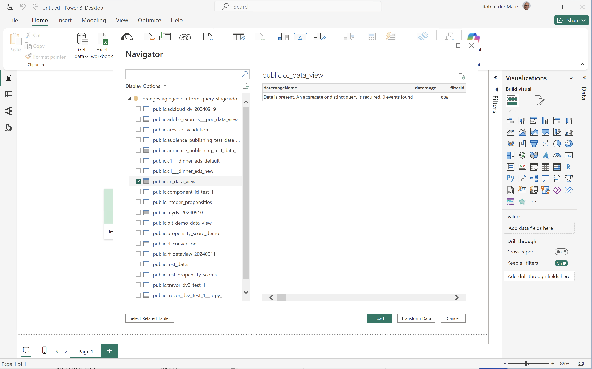

# Casi di utilizzo dell’estensione BI

Questo articolo fornisce una serie di casi d’uso che illustrano come utilizzare la funzionalità dell’estensione BI in diversi strumenti di business intelligence.

Sono documentati i seguenti casi d’uso:

1. [Connetti ed elenca le visualizzazioni dati](#connect-and-list-data-views).
1. [Tendenza giornaliera](#daily-trend).
1. [Tendenza oraria](#hourly-trend).
1. [Tendenza mensile](#monthly-trend).
1. [Classificazione dimensione singola](#single-dimension-ranked).
1. [Più dimensioni classificate](#multiple-dimension-ranked).
1. [Conta valori di dimensione distinti](#count-distinct-dimension-values).
1. [Utilizzare i nomi degli intervalli di date per filtrare](#use-date-range-names-to-filter).
1. [Utilizzare i nomi dei filtri per filtrare](#use-filter-names-to-filter).
1. [Utilizzare i valori di dimensione per filtrare](#use-dimension-values-to-filter).
1. [Ordina](#sort).
1. [Limiti](#limits).
1. [Appiattire o meno](#to-flatten-or-not).
1. [trasformazioni di Dimension e metriche](#dimension-and-metric-transformations).
1. [Visualizzazioni e interazioni](#visualizations-and-interactions).

Per ogni caso d&#39;uso sono disponibili le istruzioni per i seguenti strumenti di business intelligence nella sezione **Dettagli**:

* Power BI Desktop (versione 2.136.1478.0 a 64 bit (settembre 2024))
* Tableau Desktop (versione 2022.3.5 (20223.23.0310) a 64 bit)

Le istruzioni fanno riferimento a una visualizzazione dati di esempio denominata **[!UICONTROL public.ares_sql_validation]**, due dimensioni di esempio (**[!UICONTROL Product Name]** e **[!UICONTROL Product Category]**) e due metriche di esempio (**[!UICONTROL Purchases]** e **[!UICONTROL Purchase Revenue]**). Quando segui le istruzioni, modifica questi oggetti di esempio per il tuo ambiente specifico, se necessario.

## Connettere ed elencare le visualizzazioni dati

Questo caso d’uso imposta la connessione dallo strumento BI al Customer Journey Analytics ed elenca le visualizzazioni dati disponibili per verificare la connessione.

+++ Dettagli

>[!BEGINTABS]

>[!TAB Power BI desktop]

1. Accedi alle credenziali e ai parametri richiesti dall’interfaccia utente di Experience Platform Query Service.

   1. Passa alla sandbox di Experience Platform.
   1. Seleziona  **[!UICONTROL Queries]** dalla barra a sinistra.
   1. Selezionare la scheda **[!UICONTROL Credentials]** nell&#39;interfaccia **[!UICONTROL Queries]**.
   1. Selezionare `prod:cja` dal menu a discesa **[!UICONTROL Database]**.

      

1. Apri Power BI Desktop.
1. Dall&#39;interfaccia principale, selezionare **[!UICONTROL Get data from other sources]**.
1. Nella finestra di dialogo **[!UICONTROL Get Data]** (Crea elemento dati):
   
   1. Cerca e seleziona **[!UICONTROL PostgreSQL database]**.
   1. Seleziona **[!UICONTROL Connect]** (Aggiungi elemento dati).
1. Nella finestra di dialogo **[!UICONTROL PostgreSQL database]** (Crea elemento dati):
   
   1. Utilizzare  per copiare e incollare i valori **[!UICONTROL Host]** e **[!UICONTROL Port]** dall&#39;Experience Platform **[!UICONTROL Query]** **[!UICONTROL Expiring Credentials]**, separati da `:` come valore per **[!UICONTROL Server]**. Ad esempio: `examplecompany.platform-query.adobe.io:80`.
   1. Utilizza  per copiare e incollare il valore **[!UICONTROL Database]** dall&#39;Experience Platform **[!UICONTROL Query]** **[!UICONTROL Expiring Credentials]**. Aggiungere `?FLATTEN` al valore incollato. Ad esempio: `prod:cja?FLATTEN`.
   1. Seleziona **[!UICONTROL DirectQuery]** come [!UICONTROL Data connectivity mode].
   1. Seleziona **[!UICONTROL OK]**.
1. Nella finestra di dialogo **[!UICONTROL PostgreSQL database]** - **[!UICONTROL Database]**:
   
   1. Utilizzare  per copiare i valori **[!UICONTROL Username]** e **[!UICONTROL Password]** dal pannello Experience Platform **[!UICONTROL Query]** **[!UICONTROL Expiring Credentials]** nei campi **[!UICONTROL User name]** e **[!UICONTROL Password]**. Se si utilizza una [credenziale senza scadenza](https://experienceleague.adobe.com/en/docs/experience-platform/query/ui/credentials?lang=en#use-credential-to-connect), utilizzare la password delle credenziali senza scadenza.
   1. Verificare che il menu a discesa per **[!UICONTROL Select which level to apply these settings to]** sia impostato su **[!UICONTROL Server]** definito in precedenza.
   1. Seleziona **[!UICONTROL Connect]**.
1. Nella finestra di dialogo **[!UICONTROL Navigator]**, le visualizzazioni dati vengono recuperate. Questo recupero può richiedere del tempo. Una volta recuperato:
   
   1. Seleziona **[!UICONTROL public.ares_sql_validation]** dall&#39;elenco nel pannello a sinistra.
   1. Seleziona **[!UICONTROL Load]**.
1. Dopo un po&#39;, le metriche e le dimensioni disponibili vengono visualizzate nel riquadro **[!UICONTROL Data]**.
   

>[!TAB Tableau]

1. Accedi alle credenziali e ai parametri richiesti dall’interfaccia utente di Experience Platform Query Service.

   1. Passa alla sandbox di Experience Platform.
   1. Seleziona  **[!UICONTROL Queries]** dalla barra a sinistra.
   1. Selezionare la scheda **[!UICONTROL Credentials]** nell&#39;interfaccia **[!UICONTROL Queries]**.
   1. Selezionare `prod:cja` dal menu a discesa **[!UICONTROL Database]**.

      

1. Apri Tableau.
1. Seleziona **[!UICONTROL PostgreSQL]** dalla barra a sinistra sotto **[!UICONTROL To a Server]**. Se non disponibile, selezionare **[!UICONTROL More...]** e selezionare **[!UICONTROL PostgreSQL]** da **[!UICONTROL Installed Connectors]**.
   
1. Nella scheda **[!UICONTROL General]** della finestra di dialogo **[!UICONTROL PostgreSQL]**:
   
   1. Utilizza  per copiare e incollare **[!UICONTROL Host]** dall&#39;Experience Platform **[!UICONTROL Query]** **[!UICONTROL Expiring Credentials]** a **[!UICONTROL Server]**.
   1. Utilizza  per copiare e incollare **[!UICONTROL Port]** dall&#39;Experience Platform **[!UICONTROL Query]** **[!UICONTROL Expiring Credentials]** a **[!UICONTROL Port]**.
   1. Utilizza  per copiare e incollare **[!UICONTROL Database]** dall&#39;Experience Platform **[!UICONTROL Query]** **[!UICONTROL Expiring Credentials]** a **[!UICONTROL Database]**. Aggiungere `%3FFLATTEN` al valore incollato. Ad esempio: `prod:cja%3FFLATTEN`.
   1. Selezionare **[!UICONTROL Username and Password]** dal menu a discesa **[!UICONTROL Authentication]**.
   1. Utilizza  per copiare e incollare **[!UICONTROL Username]** dall&#39;Experience Platform **[!UICONTROL Query]** **[!UICONTROL Expiring Credentials]** a **[!UICONTROL Username]**.
   1. Utilizza  per copiare e incollare **[!UICONTROL Password]** dall&#39;Experience Platform **[!UICONTROL Query]** **[!UICONTROL Expiring Credentials]** a **[!UICONTROL Password]**. Se si utilizza una [credenziale senza scadenza](https://experienceleague.adobe.com/en/docs/experience-platform/query/ui/credentials?lang=en#use-credential-to-connect), utilizzare la password delle credenziali senza scadenza.
   1. Verificare che **[!UICONTROL Require SSL]** sia selezionato.
   1. Seleziona **[!UICONTROL Sign In]**.

   Viene visualizzata una finestra di dialogo **[!UICONTROL Progressing Request]** mentre Tableau Desktop convalida la connessione.
1. Nella finestra principale, nella visualizzazione Source dati, nel riquadro a sinistra:
   * Nome della connessione, sotto **[!UICONTROL Connections]**.
   * Il nome del database, sotto **[!UICONTROL Database]**.
   * Un elenco di tabelle, sotto **[!UICONTROL Table]**.
     
   1. Trascinare la voce **[!UICONTROL ares_sql_validation]** e rilasciare la voce nella visualizzazione principale che riporta **[!UICONTROL Drag tables]** qui.
1. Nella finestra principale vengono ora visualizzati i dettagli della visualizzazione dati **[!UICONTROL ares_sql_validation]**.
   

>[!ENDTABS]

+++

## Tendenza giornaliera

In questo caso d’uso, vuoi visualizzare una tabella e una visualizzazione a linee semplici che mostrino una tendenza giornaliera delle occorrenze dal 1° gennaio 2023 al 31 gennaio 2023.

+++ Dettagli

>[!BEGINTABS]

>[!TAB Power BI desktop]

1. Nel riquadro **[!UICONTROL Data]**:
   1. Selezionare la dimensione **[!UICONTROL daterangeday]**.
   1. Selezionare la metrica **[!UICONTROL occurrences]**.

   Viene visualizzata una tabella che mostra le occorrenze del mese corrente. Per una migliore visibilità, ingrandisci la visualizzazione della tabella.

1. Nel riquadro **[!UICONTROL Filters]**:

   1. Selezionare **[!UICONTROL daterangeday is (All)]** da **[!UICONTROL Filters on this visual]**.
   1. Seleziona **[!UICONTROL Advanced filtering]** come **[!UICONTROL Filter type]**.
   1. Definisci il filtro su **[!UICONTROL Show items when the value]** **[!UICONTROL is on or after]** `1/1/2023` **[!UICONTROL And]** **[!UICONTROL is before]** `1/2/2023.` Puoi utilizzare l&#39;icona del calendario per scegliere e selezionare le date.
   1. Seleziona **[!UICONTROL Apply filter]**.

   La tabella viene aggiornata con il filtro **[!UICONTROL daterangeday]** applicato.

1. Nel riquadro **[!UICONTROL Visualizations]**:

   1. Selezionare la visualizzazione **[!UICONTROL Line chart]**.

   Una visualizzazione con grafico a linee sostituisce la tabella utilizzando gli stessi dati della tabella.

   

1. Nella visualizzazione Grafico a linee:

   1. Seleziona .
   1. Dal menu di scelta rapida, selezionare **[!UICONTROL Show as a table]**.

   La vista principale viene aggiornata per mostrare sia una visualizzazione delle linee che una tabella.

   

>[!TAB Tableau]

1. Selezionare la scheda **[!UICONTROL Sheet 1]** in basso per passare da **[!UICONTROL Data source]**. Nella visualizzazione **[!UICONTROL Sheet 1]**:
   1. Trascinare la voce **[!UICONTROL Daterange]** dall&#39;elenco **[!UICONTROL Tables]** nel riquadro **[!UICONTROL Data]** e rilasciarla nello scaffale **[!UICONTROL Filters]**.
   1. Nella finestra di dialogo **[!UICONTROL Filters Field \[Daterange\]]**, seleziona **[!UICONTROL Range of Dates]** e **[!UICONTROL Next >]**.
   1. Nella finestra di dialogo **[!UICONTROL Filter \[Daterange]]**, selezionare **[!UICONTROL Range of dates]** e specificare un periodo compreso tra `01/01/2023` e `01/02/2023`.

      

   1. Trascinare **[!UICONTROL Daterangeday]** dall&#39;elenco **[!UICONTROL Tables]** nel riquadro **[!UICONTROL Data]** e rilasciare la voce nel campo accanto a **[!UICONTROL Columns]**.
      * Selezionare **[!UICONTROL Day]** dal menu a discesa **[!UICONTROL Daterangeday]**, in modo che il valore venga aggiornato a **[!UICONTROL DAY(Daterangeday)]**.
   1. Trascinare **[!UICONTROL Occurrences]** dall&#39;elenco **[!UICONTROL Tables (*Nomi misure *)]**nel riquadro **[!UICONTROL Data]**e rilasciare la voce nel campo accanto a **[!UICONTROL Rows]**.
      * I valori vengono automaticamente convertiti in **[!UICONTROL SUM(Occurrences)]**.
   1. Modificare **[!UICONTROL Standard]** in **[!UICONTROL Entire View]** dal menu a discesa nella barra degli strumenti.

      La visualizzazione del Foglio 1 dovrebbe essere simile a quella riportata di seguito.

      

1. Selezionare **[!UICONTROL Duplicate]** dal menu di scelta rapida della scheda **[!UICONTROL Sheet 1]** per creare un secondo foglio.
1. Selezionare **[!UICONTROL Rename]** dal menu di scelta rapida della scheda **[!UICONTROL Sheet 1]** per rinominare il foglio in `Graph`.
1. Selezionare **[!UICONTROL Rename]** dal menu di scelta rapida della scheda **[!UICONTROL Sheet 1 (2)]** per rinominare il foglio in `Data`.
1. Verificare che il foglio **[!UICONTROL Data]** sia selezionato. Nella visualizzazione Dati:
   1. Seleziona **[!UICONTROL Show me]** in alto a destra e seleziona **[!UICONTROL Text table]** (visualizzazione in alto a sinistra in alto) per modificare il contenuto della visualizzazione dati in una tabella.
   1. Trascina **[!UICONTROL DAY(Daterangeday)]** da **[!UICONTROL Columns]** a **[!UICONTROL Rows]**.
   1. Modificare **[!UICONTROL Standard]** in **[!UICONTROL Entire View]** dal menu a discesa nella barra degli strumenti.

      La visualizzazione **[!UICONTROL Day]** dovrebbe essere simile alla seguente.

      

1. Selezionare la scheda **[!UICONTROL Dashboard]** per creare una nuova visualizzazione **[!UICONTROL Dashboard 1]**. Nella visualizzazione **[!UICONTROL Dashboard 1]**:
   1. Trascinare e rilasciare il foglio **[!UICONTROL Graph]** dallo scaffale **[!UICONTROL Sheets]** nella visualizzazione **[!UICONTROL Dashboard 1]** che riporta *Rilasciare qui i fogli*.
   1. Trascinare il foglio **[!UICONTROL Data]** dallo scaffale **[!UICONTROL Sheets]** sotto il foglio **[!UICONTROL Graph]** nella visualizzazione **[!UICONTROL Dashboard 1]**.
   1. Selezionare il foglio **[!UICONTROL Data]** nella visualizzazione e modificare **[!UICONTROL Entire View]** in **[!UICONTROL Fix Width]**.

      La visualizzazione **[!UICONTROL Dashboard 1]** dovrebbe essere simile alla seguente.

      

>[!ENDTABS]

+++

## Tendenza oraria

Sintesi del caso d’uso

+++ Dettagli

>[!BEGINTABS]

>[!TAB Power BI desktop]

Passaggi

>[!TAB Tableau]

Passaggi

>[!ENDTABS]

+++

## Tendenza mensile

Sintesi del caso d’uso

+++ Dettagli

>[!BEGINTABS]

>[!TAB Power BI desktop]

Passaggi

>[!TAB Tableau]

Passaggi

>[!ENDTABS]

+++

## Classificazione dimensione singola

Sintesi del caso d’uso

+++ Dettagli

>[!BEGINTABS]

>[!TAB Power BI desktop]

Passaggi

>[!TAB Tableau]

Passaggi

>[!ENDTABS]

+++

## Classificazione di più dimensioni

Sintesi del caso d’uso

+++ Dettagli

>[!BEGINTABS]

>[!TAB Power BI desktop]

Passaggi

>[!TAB Tableau]

Passaggi

>[!ENDTABS]

+++

## Conta valori di dimensione distinti

Sintesi del caso d’uso

+++ Dettagli

>[!BEGINTABS]

>[!TAB Power BI desktop]

Passaggi

>[!TAB Tableau]

Passaggi

>[!ENDTABS]

+++

## Utilizzare i nomi degli intervalli di date per filtrare

Sintesi del caso d’uso

+++ Dettagli

>[!BEGINTABS]

>[!TAB Power BI desktop]

Passaggi

>[!TAB Tableau]

Passaggi

>[!ENDTABS]

+++

## Utilizzare i nomi dei filtri per filtrare

Sintesi del caso d’uso

+++ Dettagli

>[!BEGINTABS]

>[!TAB Power BI desktop]

Passaggi

>[!TAB Tableau]

Passaggi

>[!ENDTABS]

+++

## Utilizzare i valori di dimensione per filtrare

Sintesi del caso d’uso

+++ Dettagli

>[!BEGINTABS]

>[!TAB Power BI desktop]

Passaggi

>[!TAB Tableau]

Passaggi

>[!ENDTABS]

+++

## Ordina

Sintesi del caso d’uso

+++ Dettagli

>[!BEGINTABS]

>[!TAB Power BI desktop]

Passaggi

>[!TAB Tableau]

Passaggi

>[!ENDTABS]

+++

## Limiti

Sintesi del caso d’uso

+++ Dettagli

>[!BEGINTABS]

>[!TAB Power BI desktop]

Passaggi

>[!TAB Tableau]

Passaggi

>[!ENDTABS]

+++

## Per APPIATTIRE o meno

Sintesi del caso d’uso

+++ Dettagli

>[!BEGINTABS]

>[!TAB Power BI desktop]

Passaggi

>[!TAB Tableau]

Passaggi

>[!ENDTABS]

+++

## Trasformazioni di Dimension e metriche

Sintesi del caso d’uso

+++ Dettagli

>[!BEGINTABS]

>[!TAB Power BI desktop]

Passaggi

>[!TAB Tableau]

Passaggi

>[!ENDTABS]

+++

## Visualizzazioni e interazioni

Sintesi del caso d’uso

+++ Dettagli

>[!BEGINTABS]

>[!TAB Power BI desktop]

Passaggi

>[!TAB Tableau]

Passaggi

>[!ENDTABS]

+++

