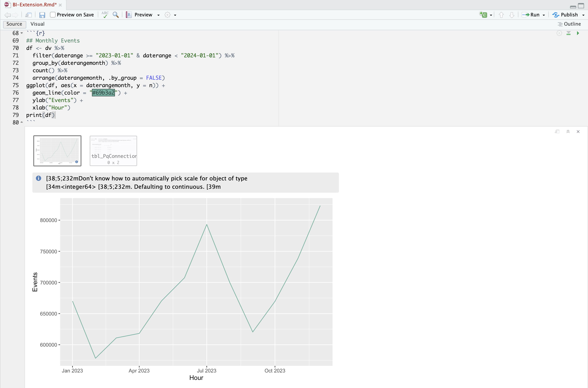
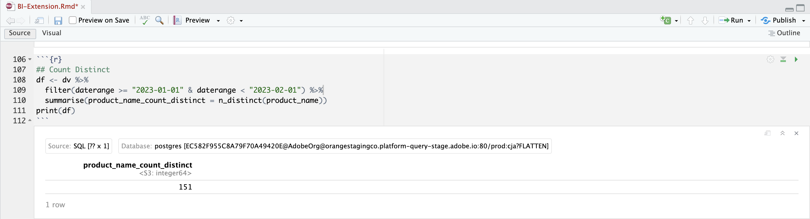

# Casi d’uso dell’estensione BI

Questo articolo illustra come eseguire una serie di casi d’uso (15) utilizzando l’estensione Customer Journey Analytics BI. Ogni caso d’uso descrive la funzionalità di Customer Journey Analytics, seguita dai dettagli di ciascuno degli strumenti di business intelligence supportati:

* **Desktop Power BI**. La versione utilizzata è la 2.137.1102.0 a 64 bit (ottobre 2024).
* **Desktop Tableau**. La versione utilizzata è 2024.1.5 (20241.24.0705.0334) a 64 bit.
* **Ricerca**. Versione online 25.0.23, disponibile tramite [looker.com](https://looker.com)
* **Jupyter Notebook**. La versione utilizzata è la 7.3.2.
* **StudioRS**. La versione utilizzata è 2024.12.0, build 467.

Sono documentati i seguenti casi d’uso:

* **Connetti**
   * [Connettere ed elencare le visualizzazioni dati](#connect-and-validate)

* **Report e analisi**
   * [Tendenza giornaliera](#daily-trend)
   * [Tendenza oraria](#hourly-trend)
   * [Tendenza mensile](#monthly-trend)
   * [Classificazione dimensione singola](#single-dimension-ranked)
   * [Classificazione di più dimensioni](#multiple-dimension-ranked)
   * [Conta valori di dimensione distinti](#count-distinct-dimension-values)
   * [Utilizzare i nomi degli intervalli di date per filtrare](#use-date-range-names-to-filter)
   * [Utilizzare i nomi dei segmenti per segmentare](#use-segment-names-to-segment)
   * [Utilizzare i valori di quota per segmentare](#use-dimension-values-to-segment)
   * [Ordina](#sort)
   * [Limiti](#limits)

* **Comprendere**

   * [Trasformazioni](#transformations)
   * [Visualizzazioni](#visualizations)
   * [Avvertenze](#caveats)

Il caso d'uso **connect** è incentrato sulla modalità di connessione degli strumenti BI tramite l'estensione Customer Journey Analytics BI.

I casi d'uso **per report e analisi** indicano come eseguire visualizzazioni di Customer Journey Analytics simili negli strumenti di business intelligence attualmente supportati.

I casi d'uso **comprendi** forniscono ulteriori dettagli su:

* Trasformazioni che si verificano quando si utilizzano strumenti di business intelligence per generare rapporti e analizzare.
* Somiglianze di visualizzazione e differenze tra gli strumenti di Customer Journey Analytics e BI.
* Avvertenze di ciascuno degli strumenti BI di cui dovresti essere a conoscenza.


## Connetti e convalida

Questo caso d’uso imposta la connessione dallo strumento BI a Customer Journey Analytics, elenca le visualizzazioni dati disponibili e seleziona una visualizzazione dati da utilizzare.

+++ Customer Journey Analytics

Le istruzioni fanno riferimento a un ambiente di esempio con i seguenti oggetti:

* Visualizzazione dati: **[!UICONTROL C&C - Data View]** 🅐.
* Dimensioni: **[!UICONTROL Product Name]** 🅑 e **[!UICONTROL Product Category]** 🅒.
* Metriche: **[!UICONTROL Purchase Revenue]** 🅓 e **[!UICONTROL Purchases]** 🅔.
* Filtro: **[!UICONTROL Fishing Products]** 🅕.


Nei casi d’uso, sostituisci questi oggetti di esempio con oggetti appropriati per il tuo ambiente specifico.

+++

+++ Strumenti BI

>[!BEGINTABS]

>[!TAB Desktop Power BI]

1. Accedi alle credenziali e ai parametri richiesti dall’interfaccia utente di Experience Platform Query Service.

   1. Passa alla sandbox di Experience Platform.
   1. Seleziona  **[!UICONTROL Queries]** dalla barra a sinistra.
   1. Selezionare la scheda **[!UICONTROL Credentials]** nell'interfaccia **[!UICONTROL Queries]**.
   1. Selezionare `prod:cja` dal menu a discesa **[!UICONTROL Database]**.

      

1. Avviare Power BI Desktop.
   1. Dall'interfaccia principale, selezionare **[!UICONTROL Get data from other sources]**.
   1. Nella finestra di dialogo **[!UICONTROL Get Data]** (Crea elemento dati):
      
      1. Cerca e seleziona **[!UICONTROL PostgreSQL database]**.
      1. Seleziona **[!UICONTROL Connect]** (Aggiungi elemento dati).
   1. Nella finestra di dialogo **[!UICONTROL PostgreSQL database]** (Crea elemento dati):
      
      1. Utilizzare  per copiare e incollare i valori **[!UICONTROL Host]** e **[!UICONTROL Port]** dal pannello Experience Platform **[!UICONTROL Query]** **[!UICONTROL Expiring Credentials]**, separati da `:` come valore per **[!UICONTROL Server]**. Ad esempio: `examplecompany.platform-query.adobe.io:80`.
      1. Utilizza  per copiare e incollare il valore **[!UICONTROL Database]** dal pannello **[!UICONTROL Query]** di Experience Platform **[!UICONTROL Expiring Credentials]**. Aggiungere `?FLATTEN` al valore incollato. Ad esempio: `prod:cja?FLATTEN`.
      1. Seleziona **[!UICONTROL DirectQuery]** come **[!UICONTROL Data connectivity mode]**.
      1. Seleziona **[!UICONTROL OK]**.
   1. Nella finestra di dialogo **[!UICONTROL PostgreSQL database]** - **[!UICONTROL Database]**:
      
      1. Utilizzare  per copiare i valori **[!UICONTROL Username]** e **[!UICONTROL Password]** dal pannello Experience Platform **[!UICONTROL Query]** **[!UICONTROL Expiring Credentials]** nei campi **[!UICONTROL User name]** e **[!UICONTROL Password]**. Se si utilizza una [credenziale senza scadenza](https://experienceleague.adobe.com/en/docs/experience-platform/query/ui/credentials?lang=en#use-credential-to-connect), utilizzare la password delle credenziali senza scadenza.
      1. Verificare che il menu a discesa per **[!UICONTROL Select which level to apply these settings to]** sia impostato su **[!UICONTROL Server]** definito in precedenza.
      1. Seleziona **[!UICONTROL Connect]**.
   1. Nella finestra di dialogo **[!UICONTROL Navigator]**, le visualizzazioni dati vengono recuperate. Questo recupero può richiedere del tempo. Una volta recuperato, in Power BI Desktop viene visualizzato quanto segue.
      
      1. Seleziona **[!UICONTROL public.cc_data_view]** dall'elenco nel pannello a sinistra.
      1. Sono disponibili due opzioni:
         1. Selezionare **[!UICONTROL Load]** per continuare e completare l'installazione.
         1. Seleziona **[!UICONTROL Transform Data]**. Viene visualizzata una finestra di dialogo in cui è possibile applicare le trasformazioni come parte della configurazione.
            
            * Seleziona **[!UICONTROL Close & Apply]**.
   1. Dopo un po', **[!UICONTROL public.cc_data_view]** viene visualizzato nel riquadro **[!UICONTROL Data]**. Seleziona  per visualizzare dimensioni e metriche.
      


### Per APPIATTIRE o meno

Power BI Desktop supporta i seguenti scenari per il parametro `FLATTEN`. Per ulteriori informazioni, vedere [Flatten nested data](https://experienceleague.adobe.com/it/docs/experience-platform/query/key-concepts/flatten-nested-data).

| Parametro FLATTEN | Esempio | Supportati | Osservazioni |
|---|---|:---:|---|
| Nessuno | `prod:cja` |  | |
| `?FLATTEN` | `prod:cja?FLATTEN` |  | **Opzione consigliata da utilizzare!** |
| `%3FFLATTEN` | `prod:cja%3FFLATTEN` |  | Power BI Desktop visualizza l'errore: **[!UICONTROL We couldn't authenticate with the credentials provided. Please try again.]** |

### Ulteriori informazioni

* [Prerequisiti](/help/data-views/bi-extension.md#prerequisites)
* [Guida alle credenziali](https://experienceleague.adobe.com/it/docs/experience-platform/query/ui/credentials)
* [Connetti Power BI a Query Service](https://experienceleague.adobe.com/it/docs/experience-platform/query/clients/power-bi).


>[!TAB Desktop Tableau]

1. Accedi alle credenziali e ai parametri richiesti dall’interfaccia utente di Experience Platform Query Service.

   1. Passa alla sandbox di Experience Platform.
   1. Seleziona  **[!UICONTROL Queries]** dalla barra a sinistra.
   1. Selezionare la scheda **[!UICONTROL Credentials]** nell'interfaccia **[!UICONTROL Queries]**.
   1. Selezionare `prod:cja` dal menu a discesa **[!UICONTROL Database]**.

      

1. Avvia Tableau.
   1. Seleziona **[!UICONTROL PostgreSQL]** dalla barra a sinistra sotto **[!UICONTROL To a Server]**. Se non disponibile, selezionare **[!UICONTROL More...]** e selezionare **[!UICONTROL PostgreSQL]** da **[!UICONTROL Installed Connectors]**.
      
   1. Nella scheda **[!UICONTROL PostgreSQL]** della finestra di dialogo **[!UICONTROL General]**:
      
      1. Utilizza  per copiare e incollare **[!UICONTROL Host]** dal pannello Experience Platform **[!UICONTROL Query]** **[!UICONTROL Expiring Credentials]** in **[!UICONTROL Server]**.
      1. Utilizza  per copiare e incollare **[!UICONTROL Port]** dal pannello Experience Platform **[!UICONTROL Query]** **[!UICONTROL Expiring Credentials]** in **[!UICONTROL Port]**.
      1. Utilizza  per copiare e incollare **[!UICONTROL Database]** dal pannello Experience Platform **[!UICONTROL Query]** **[!UICONTROL Expiring Credentials]** in **[!UICONTROL Database]**. Aggiungere `%3FFLATTEN` al valore incollato. Ad esempio: `prod:cja%3FFLATTEN`.
      1. Selezionare **[!UICONTROL Username and Password]** dal menu a discesa **[!UICONTROL Authentication]**.
      1. Utilizza  per copiare e incollare **[!UICONTROL Username]** dal pannello Experience Platform **[!UICONTROL Query]** **[!UICONTROL Expiring Credentials]** in **[!UICONTROL Username]**.
      1. Utilizza  per copiare e incollare **[!UICONTROL Password]** dal pannello Experience Platform **[!UICONTROL Query]** **[!UICONTROL Expiring Credentials]** in **[!UICONTROL Password]**. Se si utilizza una [credenziale senza scadenza](https://experienceleague.adobe.com/en/docs/experience-platform/query/ui/credentials?lang=en#use-credential-to-connect), utilizzare la password delle credenziali senza scadenza.
      1. Verificare che **[!UICONTROL Require SSL]** sia selezionato.
      1. Seleziona **[!UICONTROL Sign In]**.

      Viene visualizzata una finestra di dialogo **[!UICONTROL Progressing Request]** mentre Tableau Desktop convalida la connessione.
   1. Nella finestra principale, nella pagina **[!UICONTROL Data Source]**, nel riquadro a sinistra:
      * Nome della connessione, sotto **[!UICONTROL Connections]**.
      * Il nome del database, sotto **[!UICONTROL Database]**.
      * Un elenco di tabelle, sotto **[!UICONTROL Table]**.
        
      1. Trascinare la voce **[!UICONTROL cc_data_view]** e rilasciare la voce nella visualizzazione principale che riporta **[!UICONTROL Drag tables]** qui.
   1. Nella finestra principale vengono visualizzati i dettagli della visualizzazione dati **[!UICONTROL cc_data_view]**.
      

### Per APPIATTIRE o meno

Tableau Desktop supporta i seguenti scenari per il parametro `FLATTEN`. Per ulteriori informazioni, vedere [Flatten nested data](https://experienceleague.adobe.com/it/docs/experience-platform/query/key-concepts/flatten-nested-data).

| Parametro FLATTEN | Esempio | Supportati | Osservazioni |
|---|---|:---:|---|
| Nessuno | `prod:cja` |  | |
| `?FLATTEN` | `prod:cja?FLATTEN` |  | |
| `%3FFLATTEN` | `prod:cja%3FFLATTEN` |  | **Opzione consigliata da utilizzare**. `%3FFLATTEN` è la versione con codifica URL di `?FLATTEN`. |

### Ulteriori informazioni

* [Prerequisiti](/help/data-views/bi-extension.md#prerequisites)
* [Guida alle credenziali](https://experienceleague.adobe.com/it/docs/experience-platform/query/ui/credentials)
* [Connettere Tableau Desktop a Query Service](https://experienceleague.adobe.com/it/docs/experience-platform/query/clients/tableau).


>[!TAB Ricerca]

1. Accedi alle credenziali e ai parametri richiesti dall’interfaccia utente di Experience Platform Query Service.

   1. Passa alla sandbox di Experience Platform.
   1. Seleziona  **[!UICONTROL Queries]** dalla barra a sinistra.
   1. Selezionare la scheda **[!UICONTROL Credentials]** nell'interfaccia **[!UICONTROL Queries]**.
   1. Selezionare `prod:cja` dal menu a discesa **[!UICONTROL Database]**.

      

1. Accedi a Looker

   1. Seleziona **[!UICONTROL Admin]** nella barra a sinistra.
   1. Seleziona **[!UICONTROL Connections]**.
   1. Seleziona **[!UICONTROL Add Connection]** (Salva).
   1. In **[!UICONTROL Connect your database to Looker screen]**.

      

      1. Immetti **[!UICONTROL Name]** per la connessione, ad esempio `Example Looker Connection`.
      1. Assicurarsi che **[!UICONTROL All Projects]** sia selezionato come **[!UICONTROL Connection Scope]**.
      1. Selezionare **[!UICONTROL PostgreSQL 9.5+]** come Dialetto.
      1. Utilizzare  per copiare e incollare il valore **[!UICONTROL Host]** dal pannello Experience Platform **[!UICONTROL Query]** **[!UICONTROL Expiring Credentials]**, come valore per **[!UICONTROL Host]**. Ad esempio: `examplecompany.platform-query.adobe.io`.
      1. Utilizzare  per copiare e incollare il valore **[!UICONTROL Port]** dal pannello Experience Platform **[!UICONTROL Query]** **[!UICONTROL Expiring Credentials]**, come valore per **[!UICONTROL Port]**. Ad esempio: `80`.
      1. Utilizza  per copiare e incollare il valore **[!UICONTROL Database]** dal pannello Experience Platform **[!UICONTROL Query]** **[!UICONTROL Expiring Credentials]** come valore per **[!UICONTROL Database]**. Aggiungere `%3FFLATTEN` al valore incollato. Ad esempio: `prod:cja%3FFLATTEN`.
      1. Utilizza  per copiare e incollare il valore **[!UICONTROL Username]** dal pannello Experience Platform **[!UICONTROL Query]** **[!UICONTROL Expiring Credentials]** come valore per **[!UICONTROL Username]**.
      1. Utilizza  per copiare e incollare il valore **[!UICONTROL Password]** dal pannello Experience Platform **[!UICONTROL Query]** **[!UICONTROL Expiring Credentials]** come valore per **[!UICONTROL Password]**.
      1. Seleziona **[!UICONTROL Expand all]** alle **[!UICONTROL Optional Settings]**.
      1. Imposta **[!UICONTROL Max connections]** per nodo su `5`.
      1. Assicurarsi che **[!UICONTROL SSL]** sia abilitato.
      1. Selezionare **[!UICONTROL Test]** per verificare la connessione. Dovresti vedere un banner nella parte superiore dello schermo con un messaggio come **[!UICONTROL Success, can connect JDBC ....]**.
      1. Selezionare **[!UICONTROL Connect]** per stabilire e salvare la connessione.
   1. La nuova connessione viene visualizzata nell'interfaccia **[!UICONTROL Connections]**.
   1. Seleziona **←** da **[!UICONTROL Admin]** per passare alla navigazione principale nella barra a sinistra.
   1. Seleziona **[!UICONTROL Develop]** (Aggiungi set di dati).
   1. Seleziona **[!UICONTROL Projects]** (Salva).
   1. Selezionare **[!UICONTROL New Model]** nei progetti LookML.
   1. Per evitare di influenzare altri utenti. quando richiesto, seleziona Entra in modalità di sviluppo.
   1. Nell'esperienza **[!UICONTROL Create Model]**:
      1. In **[!UICONTROL ➊ Select Database Connection]**:
         1. Selezionare la connessione al database in **[!UICONTROL Select database connection]**. Ad esempio: **[!UICONTROL example_looker_connection]**.
         1. Assegna un nome al progetto in **[!UICONTROL Create a new LookML Project for this model]**. Per `example: example_looker_project`.
         1. Seleziona **[!UICONTROL Next]**.
      1. In **[!UICONTROL ➋ Select Tables]**:
         1. Selezionare **[!UICONTROL public]**, quindi assicurarsi che la visualizzazione dati di Customer Journey Analytics sia selezionata. Esempio:  **[!UICONTROL cc_data_view]**.
         1. Seleziona **[!UICONTROL Next]**.
      1. In **[!UICONTROL ➌ Select Primary Keys]**:
         1. Seleziona **[!UICONTROL Next]**.
      1. In **[!UICONTROL ➍ Select Explores to Create]**:
         1. Accertati di selezionare la vista. Ad esempio: **[!UICONTROL cc_data_view.view]**.
         1. Seleziona **[!UICONTROL Next]**.
      1. In **[!UICONTROL ➎ Enter Model Name]**:
         1. Assegna un nome al modello. Ad esempio: `example_looker_model`.
      1. Seleziona **[!UICONTROL Complete and Explore Data]**.

   Sei stato reindirizzato all'interfaccia **[!UICONTROL Explore]** di Looker, pronto per esplorare i dati.


### Per APPIATTIRE o meno

Looker supporta i seguenti scenari per il parametro `FLATTEN`. Per ulteriori informazioni, vedere [Flatten nested data](https://experienceleague.adobe.com/it/docs/experience-platform/query/key-concepts/flatten-nested-data).

| Parametro FLATTEN | Esempio | Supportati | Osservazioni |
|---|---|:---:|---|
| Nessuno | `prod:cja` |  | |
| `?FLATTEN` | `prod:cja?FLATTEN` |  | |
| `%3FFLATTEN` | `prod:cja%3FFLATTEN` |  | **Opzione consigliata da utilizzare**. `%3FFLATTEN` è la versione con codifica URL di `?FLATTEN`. |

### Ulteriori informazioni

* [Prerequisiti](/help/data-views/bi-extension.md#prerequisites)
* [Guida alle credenziali](https://experienceleague.adobe.com/it/docs/experience-platform/query/ui/credentials)


>[!TAB Blocco appunti Jupyter]

1. Accedi alle credenziali e ai parametri richiesti dall’interfaccia utente di Experience Platform Query Service.

   1. Passa alla sandbox di Experience Platform.
   1. Seleziona  **[!UICONTROL Queries]** dalla barra a sinistra.
   1. Selezionare la scheda **[!UICONTROL Credentials]** nell'interfaccia **[!UICONTROL Queries]**.
   1. Selezionare `prod:cja` dal menu a discesa **[!UICONTROL Database]**.

      

1. Assicurati di aver configurato un ambiente virtuale Python dedicato per l’esecuzione dell’ambiente Jupyter Notebook.
1. Verifica di aver installato le librerie richieste nell’ambiente virtuale:
   * ipython-sql: `pip install ipython-sql`.
   * psycopg2-binary: `pip install psycopg-binary`.
   * sqlalchemy: pip `install sqlalchemy`.

1. Avviare Jupyter Notebook dall'ambiente virtuale: `jupyter notebook`.
1. Crea un nuovo blocco appunti o scarica [questo blocco appunti di esempio](assets/BI-Extension.ipynb.zip).
1. Nella prima cella, immetti ed esegui:

   ```
   %config SqlMagic.style = '_DEPRECATED_DEFAULT'
   ```

1. In una nuova cella, immetti i parametri di configurazione per la connessione. Utilizza  per copiare e incollare i valori dal pannello Experience Platform **[!UICONTROL Query]** **[!UICONTROL Expiring Credentials]** nei valori richiesti per i parametri di configurazione. Ad esempio:

   ```
   import ipywidgets as widgets
   from IPython.display import display
   
   config_host = widgets.Text(description='Host:', value='example.platform-query-stage.adobe.io',
                           layout=widgets.Layout(width="600px"))
   display(config_host)
   config_port = widgets.IntText(description='Port:', value=80,
                              layout=widgets.Layout(width="200px"))
   display(config_port)
   config_db = widgets.Text(description='Database:', value='prod:cja',
                         layout=widgets.Layout(width="300px"))
   display(config_db)
   config_username = widgets.Text(description='Username:', value='EC582F955C8A79F70A49420E@AdobeOrg',
                               layout=widgets.Layout(width="600px"))
   display(config_username)
   config_password = widgets.Password(description='Password:', value='***',
                                   layout=widgets.Layout(width="600px"))
   display(config_password)
   ```

1. Eseguire la cella.
1. Utilizza  per copiare e incollare la password dal pannello Experience Platform **[!UICONTROL Query]** **[!UICONTROL Expiring Credentials]** nel campo **[!UICONTROL Password]** di Jupyter Notebook.

   

1. In una nuova cella, immettere le istruzioni per caricare l'estensione SQL, la libreria richiesta e connettersi a Customer Journey Analytics.

   ```python
   %load_ext sql
   from sqlalchemy import create_engine
   %sql postgresql://{config_username.value}:{config_password.value}@{config_host.value}:{config_port.value}/{config_db.value}?sslmode=require
   ```

   Eseguite la shell. Non dovrebbe essere visualizzato alcun output, ma la cella dovrebbe essere eseguita senza alcun avviso.

   

1. In una nuova chiamata, immetti le istruzioni per ottenere un elenco delle visualizzazioni dati disponibili in base alla connessione.

   ```python
   %%sql
   SELECT n.nspname as "Schema",
      c.relname as "Name",
      CASE c.relkind WHEN 'r' THEN 'table' WHEN 'v' THEN 'view' WHEN 'm' THEN 'materialized view' WHEN 'i' THEN 'index' WHEN 'S' THEN 'sequence' WHEN 's' THEN 'special' WHEN 't' THEN 'TOAST table' WHEN 'f' THEN 'foreign table' WHEN 'p' THEN 'partitioned table' WHEN 'I' THEN 'partitioned index' END as "Type",
      pg_catalog.pg_get_userbyid(c.relowner) as "Owner"
   FROM pg_catalog.pg_class c
   LEFT JOIN pg_catalog.pg_namespace n ON n.oid = c.relnamespace
   WHERE c.relkind IN ('v','')
      AND n.nspname <> 'pg_catalog'
      AND n.nspname !~ '^pg_toast'
      AND n.nspname <> 'information_schema'
      AND pg_catalog.pg_table_is_visible(c.oid)
      AND c.relname NOT LIKE '%test%'
      AND c.relname NOT LIKE '%ajo%'
   ORDER BY 1,2;
   ```

   Eseguite la shell. Dovresti visualizzare un output simile alla schermata seguente.

   

   Dovresti visualizzare **[!UICONTROL cc_data_view]** nell&#39;elenco delle visualizzazioni dati.

### Per APPIATTIRE o meno

Jupyter Notebook supporta i seguenti scenari per il parametro `FLATTEN`. Per ulteriori informazioni, vedere [Flatten nested data](https://experienceleague.adobe.com/it/docs/experience-platform/query/key-concepts/flatten-nested-data).

| Parametro FLATTEN | Esempio | Supportati | Osservazioni |
|---|---|:---:|---|
| Nessuno | `prod:cja` |  | |
| `?FLATTEN` | `prod:cja?FLATTEN` |  | |
| `%3FFLATTEN` | `prod:cja%3FFLATTEN` |  | **Opzione consigliata da utilizzare**. `%3FFLATTEN` è la versione con codifica URL di `?FLATTEN`. |

### Ulteriori informazioni

* [Prerequisiti](/help/data-views/bi-extension.md#prerequisites)
* [Guida alle credenziali](https://experienceleague.adobe.com/it/docs/experience-platform/query/ui/credentials)

>[!TAB StudioRS]

1. Accedi alle credenziali e ai parametri richiesti dall’interfaccia utente di Experience Platform Query Service.

   1. Passa alla sandbox di Experience Platform.
   1. Seleziona  **[!UICONTROL Queries]** dalla barra a sinistra.
   1. Selezionare la scheda **[!UICONTROL Credentials]** nell&#39;interfaccia **[!UICONTROL Queries]**.
   1. Selezionare `prod:cja` dal menu a discesa **[!UICONTROL Database]**.

      

1. Avviare Studio.
1. Crea un nuovo file Markdown R o scarica [questo file Markdown R di esempio](assets/BI-Extension.Rmd.zip).
1. Nel primo blocco immettere le istruzioni seguenti comprese tra ` ` ``{r} ` e ` `` ` `. Utilizza  per copiare e incollare i valori dal pannello Experience Platform **[!UICONTROL Query]** **[!UICONTROL Expiring Credentials]** nei valori richiesti per i vari parametri, come `host`, `dbname` e `user`. Ad esempio:

   ```R
   library(rstudioapi)
   library(DBI)
   library(dplyr)
   library(tidyr)
   library(RPostgres)
   library(ggplot2)
   
   host <- rstudioapi::showPrompt(title = "Host", message = "Host", default = "orangestagingco.platform-query-stage.adobe.io")
   dbname <- rstudioapi::showPrompt(title = "Database", message = "Database", default = "prod:cja?FLATTEN")
   user <- rstudioapi::showPrompt(title = "Username", message = "Username", default = "EC582F955C8A79F70A49420E@AdobeOrg")
   password <- rstudioapi::askForPassword(prompt = "Password")
   ```

1. Esegui il blocco. Viene richiesto di **[!UICONTROL Host]**, **[!UICONTROL Database]** e **[!UICONTROL User]**. È sufficiente accettare i valori forniti nel passaggio precedente.
1. Utilizza  per copiare e incollare la password dal pannello Experience Platform **[!UICONTROL Query]** **[!UICONTROL Expiring Credentials]** al prompt della finestra di dialogo **[!UICONTROL Password]** in Studio.

   

1. Creare un nuovo blocco e immettere le istruzioni seguenti tra ` ` `` {r} ` e ` `` ` `.

   ```R
   con <- dbConnect(
      RPostgres::Postgres(),
      host = host,
      port = 80,
      dbname = dbname,
      user = user,
      password = password,
      sslmode = 'require'
   )
   ```

1. Esegui il blocco. Se la connessione ha esito positivo, non verrà visualizzato alcun output.


1. Creare un nuovo blocco e immettere le istruzioni seguenti tra ` ` `` {r} ` e ` `` ` `.

   ```R
   views <- dbListTables(con)
   print(views)
   ```

1. Esegui il blocco. Dovresti vedere `character(0)` come unico output.


1. Creare un nuovo blocco e immettere le istruzioni seguenti tra ` ` `` {r} ` e ` `` ` `.

   ```R
   glimpse(dv)
   ```

1. Esegui il blocco. Dovresti visualizzare un output simile alla schermata seguente.

   

### Per APPIATTIRE o meno

Studio supporta i seguenti scenari per il parametro `FLATTEN`. Per ulteriori informazioni, vedere [Flatten nested data](https://experienceleague.adobe.com/it/docs/experience-platform/query/key-concepts/flatten-nested-data).

| Parametro FLATTEN | Esempio | Supportati | Osservazioni |
|---|---|:---:|---|
| Nessuno | `prod:cja` |  | |
| `?FLATTEN` | `prod:cja?FLATTEN` |  | **Opzione consigliata da utilizzare**. |
| `%3FFLATTEN` | `prod:cja%3FFLATTEN` |  | |

### Ulteriori informazioni

* [Prerequisiti](/help/data-views/bi-extension.md#prerequisites)
* [Guida alle credenziali](https://experienceleague.adobe.com/it/docs/experience-platform/query/ui/credentials)

>[!ENDTABS]

+++


## Tendenza giornaliera

In questo caso d’uso, desideri visualizzare una tabella e una visualizzazione a linee semplici che mostrino una tendenza giornaliera delle occorrenze (eventi) dal 1° gennaio 2023 al 31 gennaio 2023.

+++ Customer Journey Analytics

Un esempio di pannello **[!UICONTROL Daily Trend]** per il caso d&#39;uso:


+++

+++ Strumenti BI

>[!PREREQUISITES]
>
>Assicurarsi di aver convalidato una connessione [riuscita e di poter elencare e utilizzare le visualizzazioni dati](#connect-and-validate) per lo strumento BI per il quale si desidera provare questo caso d&#39;uso.
>

>[!BEGINTABS]

>[!TAB Desktop Power BI]

1. Nel riquadro **[!UICONTROL Data]**:
   1. Seleziona **[!UICONTROL daterangeday]** (Aggiungi set di dati).
   1. Seleziona **[!UICONTROL sum occurrences]** (Salva).

   Viene visualizzata una tabella che mostra le occorrenze del mese corrente. Per una migliore visibilità, ingrandisci la visualizzazione.

1. Nel riquadro **[!UICONTROL Filters]**:

   1. Selezionare **[!UICONTROL daterangeday is (All)]** da **[!UICONTROL Filters on this visual]**.
   1. Seleziona **[!UICONTROL Advanced filtering]** come **[!UICONTROL Filter type]**.
   1. Definisci il filtro su **[!UICONTROL Show items when the value]** **[!UICONTROL is on or after]** `1/1/2023` **[!UICONTROL And]** **[!UICONTROL is before]** `2/1/2023.` Puoi utilizzare l&#39;icona del calendario per scegliere e selezionare le date.
   1. Seleziona **[!UICONTROL Apply filter]**.

   La tabella viene aggiornata con il filtro **[!UICONTROL daterangeday]** applicato.

1. Nel riquadro **[!UICONTROL Visualizations]** selezionare la visualizzazione **[!UICONTROL Line chart]**.

   Una visualizzazione con grafico a linee sostituisce la tabella utilizzando gli stessi dati della tabella. Il desktop Power BI dovrebbe essere simile a quello riportato di seguito.

   

1. Nella visualizzazione Grafico a linee:

   1. Seleziona .
   1. Dal menu di scelta rapida, selezionare **[!UICONTROL Show as a table]**.

   La vista principale viene aggiornata per mostrare sia una visualizzazione delle linee che una tabella. Il desktop Power BI dovrebbe essere simile a quello riportato di seguito.

   

>[!TAB Desktop Tableau]

1. Selezionare la scheda **[!UICONTROL Sheet 1]** in basso per passare dalla visualizzazione **[!UICONTROL Data source]**. Nella visualizzazione **[!UICONTROL Sheet 1]**:
   1. Trascinare la voce **[!UICONTROL Daterange]** dall&#39;elenco **[!UICONTROL Tables]** nel riquadro **[!UICONTROL Data]** e rilasciarla nello scaffale **[!UICONTROL Filters]**.
   1. Nella finestra di dialogo **[!UICONTROL Filters Field \[Daterange\]]**, seleziona **[!UICONTROL Range of Dates]** e **[!UICONTROL Next >]**.
   1. Nella finestra di dialogo **[!UICONTROL Filter \[Daterange\]]**, selezionare **[!UICONTROL Range of dates]** e specificare un periodo compreso tra `01/01/2023` e `01/02/2023`.

      

   1. Trascinare **[!UICONTROL Daterangeday]** dall&#39;elenco **[!UICONTROL Tables]** nel riquadro **[!UICONTROL Data]** e rilasciare la voce nel campo accanto a **[!UICONTROL Columns]**.
      * Selezionare **[!UICONTROL Day]** dal menu a discesa **[!UICONTROL Daterangeday]**, in modo che il valore venga aggiornato a **[!UICONTROL DAY(Daterangeday)]**.
   1. Trascinare **[!UICONTROL Occurrences]** dall&#39;elenco **[!UICONTROL Tables (*Nomi misure *)]**&#x200B;nel riquadro **[!UICONTROL Data]**&#x200B;e rilasciare la voce nel campo accanto a **[!UICONTROL Rows]**. Il valore viene convertito automaticamente in **[!UICONTROL SUM(Occurrences)]**.
   1. Modificare **[!UICONTROL Standard]** in **[!UICONTROL Entire View]** dal menu a discesa **[!UICONTROL Fit]** nella barra degli strumenti.

      Il desktop Tableau dovrebbe essere simile al seguente.

      

1. Selezionare **[!UICONTROL Duplicate]** dal menu di scelta rapida della scheda **[!UICONTROL Sheet 1]** per creare un secondo foglio.
1. Selezionare **[!UICONTROL Rename]** dal menu di scelta rapida della scheda **[!UICONTROL Sheet 1]** per rinominare il foglio in `Graph`.
1. Selezionare **[!UICONTROL Rename]** dal menu di scelta rapida della scheda **[!UICONTROL Sheet 1 (2)]** per rinominare il foglio in `Data`.
1. Verificare che il foglio **[!UICONTROL Data]** sia selezionato. Nella visualizzazione **[!UICONTROL Data]**:
   1. Seleziona **[!UICONTROL Show me]** in alto a destra e seleziona **[!UICONTROL Text table]** (visualizzazione in alto a sinistra in alto) per modificare il contenuto della visualizzazione dati in una tabella.
   1. Selezionare **[!UICONTROL Swap Rows and Columns]** dalla barra degli strumenti.
   1. Modificare **[!UICONTROL Standard]** in **[!UICONTROL Entire View]** dal menu a discesa **[!UICONTROL Fit]** nella barra degli strumenti.

      Il desktop Tableau dovrebbe essere simile al seguente.

      

1. Selezionare il pulsante della scheda **[!UICONTROL New Dashboard]** (in basso) per creare una nuova visualizzazione **[!UICONTROL Dashboard 1]**. Nella visualizzazione **[!UICONTROL Dashboard 1]**:
   1. Trascinare e rilasciare il foglio **[!UICONTROL Graph]** dallo scaffale **[!UICONTROL Sheets]** nella visualizzazione **[!UICONTROL Dashboard 1]** che riporta *Rilasciare qui i fogli*.
   1. Trascinare il foglio **[!UICONTROL Data]** dallo scaffale **[!UICONTROL Sheets]** sotto il foglio **[!UICONTROL Graph]** nella visualizzazione **[!UICONTROL Dashboard 1]**.
   1. Selezionare il foglio **[!UICONTROL Data]** nella visualizzazione e modificare **[!UICONTROL Entire View]** in **[!UICONTROL Fix Width]**.

      Il desktop Tableau dovrebbe essere simile al seguente.

      


>[!TAB Ricerca]

1. Nell&#39;interfaccia **[!UICONTROL Explore]** di Looker, assicurati di avere una configurazione pulita. In caso contrario, selezionare  **[!UICONTROL Remove fields and filters]**.
1. Seleziona **[!UICONTROL + Filter]** (Aggiungi) sotto **[!UICONTROL Filters]** (Eventi).
1. Nella finestra di dialogo **[!UICONTROL Add Filter]** (Configurazione evento):
   1. Seleziona **[!UICONTROL ‣ Cc Data View]**
   1. Dall&#39;elenco dei campi, selezionare **[!UICONTROL ‣ Daterange Date]** e quindi **[!UICONTROL Daterange Date]**.
      
1. Specificare il filtro **[!UICONTROL Cc Data View Daterange Date]** come **[!UICONTROL is in range]** **[!UICONTROL 2023/01/01]** **[!UICONTROL until (before)]** **[!UICONTROL 2023/02/01]**.
1. Dalla sezione **[!UICONTROL Cc Data View]** nella barra a sinistra,
   1. Selezionare **[!UICONTROL ‣ Daterange Date]**, quindi **[!UICONTROL Date]** dall&#39;elenco di **[!UICONTROL DIMENSIONS]**.
   1. Seleziona **[!UICONTROL Count]** sotto **[!UICONTROL MEASURES]** nella barra a sinistra (in basso).
1. Seleziona **[!UICONTROL Run]**.
1. Selezionare **[!UICONTROL ‣ Visualization]** per visualizzare la visualizzazione delle linee.

Dovresti visualizzare una visualizzazione e una tabella simili a quelle mostrate di seguito.


>[!TAB Blocco appunti Jupyter]

1. Immettere le istruzioni seguenti in una nuova cella.

   ```python
   import seaborn as sns
   import matplotlib.pyplot as plt
   data = %sql SELECT daterangeday AS Date, COUNT(*) AS Events \
             FROM cc_data_view \
             WHERE daterange BETWEEN '2023-01-01' AND '2023-02-01' \
             GROUP BY 1 \
             ORDER BY Date ASC
   df = data.DataFrame()
   df = df.groupby('Date', as_index=False).sum()
   plt.figure(figsize=(15, 3))
   sns.lineplot(x='Date', y='Events', data=df)
   plt.show()
   display(data)
   ```

1. Eseguire la cella. Dovresti visualizzare un output simile alla schermata seguente.

   


>[!TAB StudioRS]

1. Immettere le istruzioni seguenti tra ` ` ``{r} ` e ` `` ` ` in un nuovo blocco.

   ```R
   ## Daily Events
   df <- dv %>%
      filter(daterange >= "2023-01-01" & daterange < "2023-02-01") %>%
      group_by(daterangeday) %>%
      count() %>%
      arrange(daterangeday, .by_group = FALSE)
   ggplot(df, aes(x = daterangeday, y = n)) +
      geom_line(color = "#69b3a2") +
      ylab("Events") +
      xlab("Date")
   print(df)
   ```

1. Esegui il blocco. Dovresti visualizzare un output simile alla schermata seguente.

   

>[!ENDTABS]

+++


## Tendenza oraria

In questo caso d’uso, vuoi visualizzare una tabella e una semplice visualizzazione delle linee che mostri una tendenza oraria di occorrenze(eventi) per il 1° gennaio 2023.

+++ Customer Journey Analytics

Un esempio di pannello **[!UICONTROL Hourly Trend]** per il caso d&#39;uso:


+++

+++ Strumenti BI

>[!PREREQUISITES]
>
>Verificare di aver convalidato [una connessione, di avere la possibilità di elencare le visualizzazioni dati e di utilizzare una visualizzazione dati](#connect-and-validate) per lo strumento BI per il quale si desidera provare questo caso d&#39;uso.
>

>[!BEGINTABS]

>[!TAB Desktop Power BI]

 Power BI **non** è in grado di gestire i campi data-ora, pertanto dimensioni come **[!UICONTROL daterangehour]** e **[!UICONTROL daterangeminute]** non sono supportate.

>[!TAB Desktop Tableau]

1. Selezionare la scheda **[!UICONTROL Sheet 1]** in basso per passare da **[!UICONTROL Data source]**. Nella visualizzazione **[!UICONTROL Sheet 1]**:
   1. Trascinare la voce **[!UICONTROL Daterange]** dall&#39;elenco **[!UICONTROL Tables]** nel riquadro **[!UICONTROL Data]** e rilasciarla nello scaffale **[!UICONTROL Filters]**.
   1. Nella finestra di dialogo **[!UICONTROL Filters Field \[Daterange\]]**, seleziona **[!UICONTROL Range of Dates]** e **[!UICONTROL Next >]**.
   1. Nella finestra di dialogo **[!UICONTROL Filter \[Daterange\]]**, selezionare **[!UICONTROL Range of dates]** e specificare un periodo compreso tra `01/01/2023` e `02/01/2023`.

      

   1. Trascinare **[!UICONTROL Daterangehour]** dall&#39;elenco **[!UICONTROL Tables]** nel riquadro **[!UICONTROL Data]** e rilasciare la voce nel campo accanto a **[!UICONTROL Columns]**.
      * Selezionare **[!UICONTROL More]** > **[!UICONTROL Hours]** dal menu a discesa **[!UICONTROL Daterangeday]**, in modo che il valore venga aggiornato a **[!UICONTROL HOUR(Daterangeday)]**.
   1. Trascinare **[!UICONTROL Occurrences]** dall&#39;elenco **[!UICONTROL Tables (*Nomi misure *)]**&#x200B;nel riquadro **[!UICONTROL Data]**&#x200B;e rilasciare la voce nel campo accanto a **[!UICONTROL Rows]**. Il valore viene convertito automaticamente in **[!UICONTROL SUM(Occurrences)]**.
   1. Modificare **[!UICONTROL Standard]** in **[!UICONTROL Entire View]** dal menu a discesa **[!UICONTROL Fit]** nella barra degli strumenti.

      Il desktop Tableau dovrebbe essere simile al seguente.

      

1. Selezionare **[!UICONTROL Duplicate]** dal menu di scelta rapida della scheda **[!UICONTROL Sheet 1]** per creare un secondo foglio.
1. Selezionare **[!UICONTROL Rename]** dal menu di scelta rapida della scheda **[!UICONTROL Sheet 1]** per rinominare il foglio in `Graph`.
1. Selezionare **[!UICONTROL Rename]** dal menu di scelta rapida della scheda **[!UICONTROL Sheet 1 (2)]** per rinominare il foglio in `Data`.
1. Verificare che il foglio **[!UICONTROL Data]** sia selezionato. Nella visualizzazione **[!UICONTROL Data]**:
   1. Seleziona **[!UICONTROL Show me]** in alto a destra e seleziona **[!UICONTROL Text table]** (visualizzazione in alto a sinistra in alto) per modificare il contenuto della visualizzazione dati in una tabella.
   1. Trascina **[!UICONTROL HOUR(Daterangeday)]** da **[!UICONTROL Columns]** a **[!UICONTROL Rows]**.
   1. Modificare **[!UICONTROL Standard]** in **[!UICONTROL Entire View]** dal menu a discesa **[!UICONTROL Fit]** nella barra degli strumenti.

      Il desktop Tableau dovrebbe essere simile al seguente.

      

1. Selezionare il pulsante della scheda **[!UICONTROL New Dashboard]** (in basso) per creare una nuova visualizzazione **[!UICONTROL Dashboard 1]**. Nella visualizzazione **[!UICONTROL Dashboard 1]**:
   1. Trascinare e rilasciare il foglio **[!UICONTROL Graph]** dallo scaffale **[!UICONTROL Sheets]** nella visualizzazione **[!UICONTROL Dashboard 1]** che riporta *Rilasciare qui i fogli*.
   1. Trascinare il foglio **[!UICONTROL Data]** dallo scaffale **[!UICONTROL Sheets]** sotto il foglio **[!UICONTROL Graph]** nella visualizzazione **[!UICONTROL Dashboard 1]**.
   1. Selezionare il foglio **[!UICONTROL Data]** nella visualizzazione e modificare **[!UICONTROL Entire View]** in **[!UICONTROL Fix Width]**.

      La visualizzazione **[!UICONTROL Dashboard 1]** dovrebbe essere simile alla seguente.

      


>[!TAB Ricerca]


1. Nell&#39;interfaccia **[!UICONTROL Explore]** di Looker, assicurati di avere una configurazione pulita. In caso contrario, selezionare  **[!UICONTROL Remove fields and filters]**.
1. Seleziona **[!UICONTROL + Filter]** (Aggiungi) sotto **[!UICONTROL Filters]** (Eventi).
1. Nella finestra di dialogo **[!UICONTROL Add Filter]** (Configurazione evento):
   1. Seleziona **[!UICONTROL ‣ Cc Data View]**
   1. Dall&#39;elenco dei campi, selezionare **[!UICONTROL ‣ Daterange Date]** e quindi **[!UICONTROL Daterange Date]**.
      
1. Specificare il filtro **[!UICONTROL Cc Data View Daterange Date]** come **[!UICONTROL is in range]** **[!UICONTROL 2023/01/01]** **[!UICONTROL until (before)]** **[!UICONTROL 2023/01/02]**.
1. Dalla sezione **[!UICONTROL Cc Data View]** nella barra a sinistra,
   1. Selezionare **[!UICONTROL ‣ Daterangehour Date]**, quindi **[!UICONTROL Time]** dall&#39;elenco di **[!UICONTROL DIMENSIONS]**.
   1. Seleziona **[!UICONTROL Count]** sotto **[!UICONTROL MEASURES]** nella barra a sinistra (in basso).
1. Seleziona **[!UICONTROL Run]**.
1. Selezionare **[!UICONTROL ‣ Visualization]** per visualizzare la visualizzazione delle linee.

Dovresti visualizzare una visualizzazione e una tabella simili a quelle mostrate di seguito.


>[!TAB Blocco appunti Jupyter]

1. Immettere le istruzioni seguenti in una nuova cella.

   ```python
   import seaborn as sns
   import matplotlib.pyplot as plt
   data = %sql SELECT daterangehour AS Hour, COUNT(*) AS Events \
               FROM cc_data_view \
               WHERE daterange BETWEEN '2023-01-01' AND '2023-01-02' \
               GROUP BY 1 \
                ORDER BY Hour ASC
   df = data.DataFrame()
   df = df.groupby('Hour', as_index=False).sum()
   plt.figure(figsize=(15, 3))
   sns.lineplot(x='Hour', y='Events', data=df)
   plt.show()
   display(data)
   ```

1. Eseguire la cella. Dovresti visualizzare un output simile alla schermata seguente.

   


>[!TAB StudioRS]

1. Immettere le istruzioni seguenti tra ` ` ``{r} ` e ` `` ` ` in un nuovo blocco.

   ```R
   ## Hourly Events
   df <- dv %>%
      filter(daterange >= "2023-01-01" & daterange < "2023-01-02") %>%
      group_by(daterangehour) %>%
      count() %>%
      arrange(daterangehour, .by_group = FALSE)
   ggplot(df, aes(x = daterangehour, y = n)) +
      geom_line(color = "#69b3a2") +
      ylab("Events") +
      xlab("Hour")
   print(df)
   ```

1. Esegui il blocco. Dovresti visualizzare un output simile alla schermata seguente.

   

>[!ENDTABS]

+++


## Tendenza mensile

In questo caso d’uso, vuoi visualizzare una tabella e una visualizzazione a linee semplici che mostrino una tendenza mensile di occorrenza (eventi) per il 2023.

+++ Customer Journey Analytics

Un esempio di pannello **[!UICONTROL Monthly Trend]** per il caso d&#39;uso:


+++

+++ Strumenti BI

>[!PREREQUISITES]
>
>Verificare di aver convalidato [una connessione, di avere la possibilità di elencare le visualizzazioni dati e di utilizzare una visualizzazione dati](#connect-and-validate) per lo strumento BI per il quale si desidera provare questo caso d&#39;uso.
>

>[!BEGINTABS]

>[!TAB Desktop Power BI]

1. Nel riquadro **[!UICONTROL Data]**:
   1. Seleziona **[!UICONTROL daterangemonth]** (Aggiungi set di dati).
   1. Seleziona **[!UICONTROL sum occurrences]** (Salva).

   Viene visualizzata una tabella che mostra le occorrenze del mese corrente. Per una migliore visibilità, ingrandisci la visualizzazione.

1. Nel riquadro **[!UICONTROL Filters]**:

   1. Selezionare **[!UICONTROL daterangemonth is (All)]** da **[!UICONTROL Filters on this visual]**.
   1. Seleziona **[!UICONTROL Advanced filtering]** come **[!UICONTROL Filter type]**.
   1. Definisci il filtro su **[!UICONTROL Show items when the value]** **[!UICONTROL is on or after]** `1/1/2023` **[!UICONTROL And]** **[!UICONTROL is before]** `1/1/2024.` Puoi utilizzare l&#39;icona del calendario per scegliere e selezionare le date.
   1. Seleziona **[!UICONTROL Apply filter]**.

   La tabella viene aggiornata con il filtro **[!UICONTROL daterangemonth]** applicato.

1. Nel riquadro **[!UICONTROL Visualizations]**:

   1. Selezionare la visualizzazione **[!UICONTROL Line chart]**.

   Una visualizzazione con grafico a linee sostituisce la tabella utilizzando gli stessi dati della tabella. Il desktop Power BI dovrebbe essere simile a quello riportato di seguito.

   

1. Nella visualizzazione Grafico a linee:

   1. Seleziona .
   1. Dal menu di scelta rapida, selezionare **[!UICONTROL Show as a table]**.

   La vista principale viene aggiornata per mostrare sia una visualizzazione delle linee che una tabella. Il desktop Power BI dovrebbe essere simile a quello riportato di seguito.

   

>[!TAB Desktop Tableau]

1. Selezionare la scheda **[!UICONTROL Sheet 1]** in basso per passare da **[!UICONTROL Data source]**. Nella visualizzazione **[!UICONTROL Sheet 1]**:
   1. Trascinare la voce **[!UICONTROL Daterange]** dall&#39;elenco **[!UICONTROL Tables]** nel riquadro **[!UICONTROL Data]** e rilasciarla nello scaffale **[!UICONTROL Filters]**.
   1. Nella finestra di dialogo **[!UICONTROL Filters Field \[Daterange\]]**, seleziona **[!UICONTROL Range of Dates]** e **[!UICONTROL Next >]**.
   1. Nella finestra di dialogo **[!UICONTROL Filter \[Daterange\]]**, selezionare **[!UICONTROL Range of dates]** e specificare un periodo compreso tra `01/01/2023` e `01/01/2024`.

      

   1. Trascinare **[!UICONTROL Daterangeday]** dall&#39;elenco **[!UICONTROL Tables]** nel riquadro **[!UICONTROL Data]** e rilasciare la voce nel campo accanto a **[!UICONTROL Columns]**.
      * Selezionare **[!UICONTROL MONTH]** dal menu a discesa **[!UICONTROL Daterangeday]**, in modo che il valore venga aggiornato a **[!UICONTROL MONTH(Daterangeday)]**.
   1. Trascinare **[!UICONTROL Occurrences]** dall&#39;elenco **[!UICONTROL Tables (*Nomi misure *)]**&#x200B;nel riquadro **[!UICONTROL Data]**&#x200B;e rilasciare la voce nel campo accanto a **[!UICONTROL Rows]**. Il valore viene convertito automaticamente in **[!UICONTROL SUM(Occurrences)]**.
   1. Modificare **[!UICONTROL Standard]** in **[!UICONTROL Entire View]** dal menu a discesa **[!UICONTROL Fit]** nella barra degli strumenti.

      Il desktop Tableau dovrebbe essere simile al seguente.

      

1. Selezionare **[!UICONTROL Duplicate]** dal menu di scelta rapida della scheda **[!UICONTROL Sheet 1]** per creare un secondo foglio.
1. Selezionare **[!UICONTROL Rename]** dal menu di scelta rapida della scheda **[!UICONTROL Sheet 1]** per rinominare il foglio in `Graph`.
1. Selezionare **[!UICONTROL Rename]** dal menu di scelta rapida della scheda **[!UICONTROL Sheet 1 (2)]** per rinominare il foglio in `Data`.
1. Verificare che il foglio **[!UICONTROL Data]** sia selezionato. Nella visualizzazione Dati:
   1. Seleziona **[!UICONTROL Show me]** in alto a destra e seleziona **[!UICONTROL Text table]** (visualizzazione in alto a sinistra in alto) per modificare il contenuto della visualizzazione dati in una tabella.
   1. Trascina **[!UICONTROL MONTH(Daterangeday)]** da **[!UICONTROL Columns]** a **[!UICONTROL Rows]**.
   1. Modificare **[!UICONTROL Standard]** in **[!UICONTROL Entire View]** dal menu a discesa **[!UICONTROL Fit]** nella barra degli strumenti.

      Il desktop Tableau dovrebbe essere simile al seguente.

      

1. Selezionare il pulsante della scheda **[!UICONTROL New Dashboard]** (in basso) per creare una nuova visualizzazione **[!UICONTROL Dashboard 1]**. Nella visualizzazione **[!UICONTROL Dashboard 1]**:
   1. Trascinare e rilasciare il foglio **[!UICONTROL Graph]** dallo scaffale **[!UICONTROL Sheets]** nella visualizzazione **[!UICONTROL Dashboard 1]** che riporta *Rilasciare qui i fogli*.
   1. Trascinare il foglio **[!UICONTROL Data]** dallo scaffale **[!UICONTROL Sheets]** sotto il foglio **[!UICONTROL Graph]** nella visualizzazione **[!UICONTROL Dashboard 1]**.
   1. Selezionare il foglio **[!UICONTROL Data]** nella visualizzazione e modificare **[!UICONTROL Entire View]** in **[!UICONTROL Fix Width]**.

      Il desktop Tableau dovrebbe essere simile al seguente.

      


>[!TAB Ricerca]

1. Nell&#39;interfaccia **[!UICONTROL Explore]** di Looker, assicurati di avere una configurazione pulita. In caso contrario, selezionare  **[!UICONTROL Remove fields and filters]**.
1. Seleziona **[!UICONTROL + Filter]** (Aggiungi) sotto **[!UICONTROL Filters]** (Eventi).
1. Nella finestra di dialogo **[!UICONTROL Add Filter]** (Configurazione evento):
   1. Seleziona **[!UICONTROL ‣ Cc Data View]**
   1. Dall&#39;elenco dei campi, selezionare **[!UICONTROL ‣ Daterange Date]** e quindi **[!UICONTROL Daterange Date]**.
      
1. Specificare il filtro **[!UICONTROL Cc Data View Daterange Date]** come **[!UICONTROL is in range]** **[!UICONTROL 2023/01/01]** **[!UICONTROL until (before)]** **[!UICONTROL 2024/01/01]**.
1. Dalla barra **[!UICONTROL Cc Data View]** a sinistra,
   1. Selezionare **[!UICONTROL ‣ Daterangemonth Date]**, quindi **[!UICONTROL Month]** dall&#39;elenco di **[!UICONTROL DIMENSIONS]**.
   1. Seleziona **[!UICONTROL Count]** sotto **[!UICONTROL MEASURES]** nella barra a sinistra (in basso).
1. Seleziona **[!UICONTROL Run]**.
1. Selezionare **[!UICONTROL ‣ Visualization]** per visualizzare la visualizzazione delle linee.

Dovresti visualizzare una visualizzazione e una tabella simili a quelle mostrate di seguito.


>[!TAB Blocco appunti Jupyter]

1. Immettere le istruzioni seguenti in una nuova cella.

   ```python
   import seaborn as sns
   import matplotlib.pyplot as plt
   data = %sql SELECT daterangemonth AS Month, COUNT(*) AS Events \
               FROM cc_data_view \
               WHERE daterange BETWEEN '2023-01-01' AND '2024-01-01' \
               GROUP BY 1 \
               ORDER BY Month ASC
   df = data.DataFrame()
   df = df.groupby('Month', as_index=False).sum()
   plt.figure(figsize=(15, 3))
   sns.lineplot(x='Month', y='Events', data=df)
   plt.show()
   display(data)
   ```

1. Eseguire la cella. Dovresti visualizzare un output simile alla schermata seguente.

   


>[!TAB StudioRS]

1. Immettere le istruzioni seguenti tra ` ` ``{r} ` e ` `` ` ` in un nuovo blocco.

   ```R
   ## Hourly Events
   df <- dv %>%
      filter(daterange >= "2023-01-01" & daterange < "2023-01-02") %>%
      group_by(daterangehour) %>%
      count() %>%
      arrange(daterangehour, .by_group = FALSE)
   ggplot(df, aes(x = daterangehour, y = n)) +
      geom_line(color = "#69b3a2") +
      ylab("Events") +
      xlab("Hour")
   print(df)
   ```

1. Esegui il blocco. Dovresti visualizzare un output simile alla schermata seguente.

   

>[!ENDTABS]

+++


## Classificazione dimensione singola

In questo caso d’uso, vuoi visualizzare una tabella e una semplice visualizzazione a barre che mostrino i ricavi di acquisto e di acquisto per i nomi dei prodotti oltre il 2023.

+++ Customer Journey Analytics

Un esempio di pannello **[!UICONTROL Single Dimension Ranked]** per il caso d&#39;uso:


+++

+++ Strumenti BI

>[!PREREQUISITES]
>
>Verificare di aver convalidato [una connessione, di avere la possibilità di elencare le visualizzazioni dati e di utilizzare una visualizzazione dati](#connect-and-validate) per lo strumento BI per il quale si desidera provare questo caso d&#39;uso.
>

>[!BEGINTABS]

>[!TAB Desktop Power BI]

1. Nel riquadro **[!UICONTROL Data]**:
   1. Seleziona **[!UICONTROL daterange]** (Aggiungi set di dati).
   1. Seleziona **[!UICONTROL product_name]** (Aggiungi set di dati).
   1. Seleziona **[!UICONTROL sum purchase_revenue]** (Aggiungi set di dati).
   1. Seleziona **[!UICONTROL sum purchases]** (Salva).

   Viene visualizzata una tabella vuota contenente solo le intestazioni di colonna per l’elemento selezionato. Per una migliore visibilità, ingrandisci la visualizzazione.

1. Nel riquadro **[!UICONTROL Filters]**:

   1. Selezionare **[!UICONTROL daterange is (All)]** da **[!UICONTROL Filters on this visual]**.
   1. Seleziona **[!UICONTROL Relative date]** come **[!UICONTROL Filter type]**.
   1. Definisci il filtro su **[!UICONTROL Show items when the value]** **[!UICONTROL is in the last]** `1` **[!UICONTROL calendar years]**.
   1. Seleziona **[!UICONTROL Apply filter]**.

   La tabella viene aggiornata con il filtro **[!UICONTROL daterange]** applicato.

1. Nel riquadro **[!UICONTROL Visualization]**:

   1. Utilizzare  per rimuovere **[!UICONTROL daterange]** da **[!UICONTROL Columns]**.
   1. Trascinare **[!UICONTROL Sum of purchases_revenue]** sotto **[!UICONTROL Sum of purchases]** in **[!UICONTROL Columns]**.

1. Nella visualizzazione Tabella:

   1. Selezionare **[!UICONTROL Sum of purchase_revenue]** per ordinare i nomi dei prodotti nell&#39;ordine decrescente dei ricavi di acquisto. Il desktop Power BI dovrebbe essere simile a quello riportato di seguito.

   

1. Nel riquadro **[!UICONTROL Filters]**:

   1. Seleziona **[!UICONTROL product_name is (All)]**.
   1. Imposta **[!UICONTROL Filter type]** su **[!UICONTROL Top N]**.
   1. Definisci il filtro su **[!UICONTROL Show items]** **[!UICONTROL Top]** `10` **[!UICONTROL By value]**.
   1. Trascinare **[!UICONTROL purchase_revenue]** in **[!UICONTROL By value]** **[!UICONTROL Add data fields here]**.
   1. Seleziona **[!UICONTROL Apply filter]**.

   La tabella viene aggiornata con i valori dei ricavi dall’acquisto sincronizzati con la visualizzazione a forma libera in Analysis Workspace.

1. Nel riquadro **[!UICONTROL Visualizations]**:

   1. Selezionare la visualizzazione **[!UICONTROL Line and stacked column chart]**.

   La tabella viene sostituita da una visualizzazione con istogramma a linee e in pila, che utilizza gli stessi dati della tabella.

1. Trascinare **[!UICONTROL purchases]** su **[!UICONTROL Line y-axis]** nel riquadro **[!UICONTROL Visualizations]**.

   L’istogramma a linee e in pila viene aggiornato. Il desktop Power BI dovrebbe essere simile a quello riportato di seguito.

   

1. Nella visualizzazione Grafico a linee e a colonne sovrapposte:

   1. Seleziona .
   1. Dal menu di scelta rapida, selezionare **[!UICONTROL Show as a table]**.

   La vista principale viene aggiornata per mostrare sia una visualizzazione delle linee che una tabella.

   

>[!TAB Desktop Tableau]

1. Selezionare la scheda **[!UICONTROL Sheet 1]** in basso per passare da **[!UICONTROL Data source]**. Nella visualizzazione **[!UICONTROL Sheet 1]**:
   1. Trascinare la voce **[!UICONTROL Daterange]** dall&#39;elenco **[!UICONTROL Tables]** nel riquadro **[!UICONTROL Data]** e rilasciarla nello scaffale **[!UICONTROL Filters]**.
   1. Nella finestra di dialogo **[!UICONTROL Filters Field \[Daterange\]]**, seleziona **[!UICONTROL Range of Dates]** e **[!UICONTROL Next >]**.
   1. Nella finestra di dialogo **[!UICONTROL Filter \[Daterange\]]**, selezionare **[!UICONTROL Range of dates]** e specificare un periodo compreso tra `01/01/2023` e `31/12/2023`. Selezionare **[!UICONTROL Apply]** e **[!UICONTROL OK]**.

      

   1. Trascinare **[!UICONTROL Product Name]** dall&#39;elenco **[!UICONTROL Tables]** nel riquadro **[!UICONTROL Data]** e rilasciare la voce nel campo accanto a **[!UICONTROL Rows]**.
   1. Trascinare **[!UICONTROL Purchases]** dall&#39;elenco **[!UICONTROL Tables (*Nomi misure *)]**&#x200B;nel riquadro **[!UICONTROL Data]**&#x200B;e rilasciare la voce nel campo accanto a **[!UICONTROL Rows]**. Il valore viene convertito automaticamente in **[!UICONTROL SUM(Purchases)]**.
   1. Trascinare **[!UICONTROL Purchase Revenue]** dall&#39;elenco **[!UICONTROL Tables (*Nomi misure *)]**&#x200B;nel riquadro **[!UICONTROL Data]**&#x200B;e rilasciare la voce nel campo accanto a **[!UICONTROL Columns]**&#x200B;e a sinistra da **[!UICONTROL SUM(Purchases)]**. Il valore viene convertito automaticamente in **[!UICONTROL SUM(Purchase Revenue)]**.
   1. Per ordinare entrambi i grafici in ordine decrescente di ricavi da acquisto, passa il puntatore del mouse sul titolo **[!UICONTROL Purchase Revenue]** e seleziona l&#39;icona di ordinamento.
   1. Per limitare il numero di voci nei grafici, selezionare **[!UICONTROL SUM(Purchase Revenue)]** in **[!UICONTROL Rows]** e dal menu a discesa selezionare **[!UICONTROL Filter]**.
   1. Nella finestra di dialogo **[!UICONTROL Filter \[Purchase Revenue\]]**, seleziona **[!UICONTROL Range of values]** e immetti i valori appropriati. Ad esempio: `1,000,000` - `2,000,000`. Selezionare **[!UICONTROL Apply]** e **[!UICONTROL OK]**.
   1. Per convertire i due grafici a barre in un grafico a doppia combinazione, selezionare **[!UICONTROL SUM(Purchases)]** in **[!UICONTROL Rows]** e dal menu a discesa selezionare **[!UICONTROL Dual Axis]**. I grafici a barre diventano un grafico a dispersione.
   1. Per modificare il grafico a dispersione in un grafico a barre:
      1. Selezionare **[!UICONTROL SUM(Purchases)]** nell&#39;area **[!UICONTROL Marks]** e selezionare **[!UICONTROL Line]** dal menu a discesa.
      1. Selezionare **[!UICONTROL SUM(Purchase Revenue)]** nell&#39;area **[!UICONTROL Marks]** e selezionare **[!UICONTROL Bar]** dal menu a discesa.

   Il desktop Tableau dovrebbe essere simile al seguente.

   

1. Selezionare **[!UICONTROL Duplicate]** dal menu di scelta rapida della scheda **[!UICONTROL Sheet 1]** per creare un secondo foglio.
1. Selezionare **[!UICONTROL Rename]** dal menu di scelta rapida della scheda **[!UICONTROL Sheet 1]** per rinominare il foglio in `Data`.
1. Selezionare **[!UICONTROL Rename]** dal menu di scelta rapida della scheda **[!UICONTROL Sheet 1 (2)]** per rinominare il foglio in `Graph`.
1. Verificare che il foglio **[!UICONTROL Data]** sia selezionato.
   1. Seleziona **[!UICONTROL Show me]** in alto a destra e seleziona **[!UICONTROL Text table]** (visualizzazione in alto a sinistra) per modificare il contenuto dei due grafici in una tabella.
   1. Per ordinare i ricavi di acquisto in ordine decrescente, posizionare il cursore del mouse su **[!UICONTROL Purchase Revenue]** nella tabella e selezionare .
   1. Selezionare **[!UICONTROL Entire View]** dal menu a discesa **[!UICONTROL Fit]**.

   Il desktop Tableau dovrebbe essere simile al seguente.

   

1. Selezionare il pulsante della scheda **[!UICONTROL New Dashboard]** (in basso) per creare una nuova visualizzazione **[!UICONTROL Dashboard 1]**. Nella visualizzazione **[!UICONTROL Dashboard 1]**:
   1. Trascinare e rilasciare il foglio **[!UICONTROL Graph]** dallo scaffale **[!UICONTROL Sheets]** nella visualizzazione **[!UICONTROL Dashboard 1]** che riporta *Rilasciare qui i fogli*.
   1. Trascinare il foglio **[!UICONTROL Data]** dallo scaffale **[!UICONTROL Sheets]** sotto il foglio **[!UICONTROL Graph]** nella visualizzazione **[!UICONTROL Dashboard 1]**.
   1. Selezionare il foglio **[!UICONTROL Data]** nella visualizzazione e modificare **[!UICONTROL Entire View]** in **[!UICONTROL Fix Width]**.

   La visualizzazione **[!UICONTROL Dashboard 1]** dovrebbe essere simile alla seguente.

   


>[!TAB Ricerca]

1. Nell&#39;interfaccia **[!UICONTROL Explore]** di Looker, assicurati di avere una configurazione pulita. In caso contrario, selezionare  **[!UICONTROL Remove fields and filters]**.
1. Seleziona **[!UICONTROL + Filter]** (Aggiungi) sotto **[!UICONTROL Filters]** (Eventi).
1. Nella finestra di dialogo **[!UICONTROL Add Filter]** (Configurazione evento):
   1. Seleziona **[!UICONTROL ‣ Cc Data View]**
   1. Dall&#39;elenco dei campi, selezionare **[!UICONTROL ‣ Daterange Date]** e quindi **[!UICONTROL Daterange Date]**.
      
1. Specificare il filtro **[!UICONTROL Cc Data View Daterange Date]** come **[!UICONTROL is in range]** **[!UICONTROL 2023/01/01]** **[!UICONTROL until (before)]** **[!UICONTROL 2024/01/01]**.
1. Dalla sezione **[!UICONTROL ‣ Cc Data View]** nella barra a sinistra, seleziona **[!UICONTROL Product Name]**.
1. Dalla sezione **[!UICONTROL ‣ Custom Fields]** nella barra a sinistra:
   1. Selezionare **[!UICONTROL Custom Measure]** dal menu a discesa **[!UICONTROL + Add]**.
   1. Nella finestra di dialogo **[!UICONTROL Create custom measure]** (Crea elemento dati):
      1. Selezionare **[!UICONTROL Purchase Revenue]** dal menu a discesa **[!UICONTROL Field to measure]**.
      1. Selezionare **[!UICONTROL Sum]** dal menu a discesa **[!UICONTROL Measure type]**.
      1. Immettere un nome di campo personalizzato per **[!UICONTROL Name]**. Ad esempio: `Purchase Revenue`.
      1. Seleziona la scheda **[!UICONTROL Field details]**.
      1. Selezionare **[!UICONTROL Decimals]** dal menu a discesa **[!UICONTROL Format]** e assicurarsi che `0` sia immesso in **[!UICONTROL Decimals]**.
         
      1. Seleziona **[!UICONTROL Save]**.
   1. Selezionare ancora **[!UICONTROL Custom Measure]** dal menu a discesa **[!UICONTROL + Add]**. Nella finestra di dialogo della misura **[!UICONTROL Create custom]**:
      1. Selezionare **[!UICONTROL Purchases]** dal menu a discesa **[!UICONTROL Field to measure]**.
      1. Selezionare **[!UICONTROL Sum]** dal menu a discesa **[!UICONTROL Measure type]**.
      1. Immettere un nome di campo personalizzato per **[!UICONTROL Name]**. Ad esempio: `Sum of Purchases`.
      1. Seleziona la scheda **[!UICONTROL Field details]**.
      1. Selezionare **[!UICONTROL Decimals]** dal menu a discesa **[!UICONTROL Format]** e assicurarsi che `0` sia immesso in **[!UICONTROL Decimals]**.
      1. Seleziona **[!UICONTROL Save]**.
   1. Entrambi i campi vengono aggiunti automaticamente alla visualizzazione Dati.
1. Selezionare **[!UICONTROL + Filter]** per aggiungere un altro **[!UICONTROL Filters]** e per limitare i dati.
1. Nella finestra di dialogo **[!UICONTROL Add Filter]**, seleziona **[!UICONTROL ‣ Custom Fields]**, quindi **[!UICONTROL Purchase Revenue]**.
1. Effettuare le selezioni appropriate e immettere i valori proposti, in modo che il filtro legga **[!UICONTROL is between inclusive]** `1000000` **[!UICONTROL AND]** `2000000`.
1. Seleziona **[!UICONTROL Run]**.
1. Selezionare **[!UICONTROL ‣ Visualization]** per visualizzare la visualizzazione delle linee.
1. Seleziona **[!UICONTROL Edit]** in **[!UICONTROL Visualization]** per aggiornare la visualizzazione. Nella finestra di dialogo popup:
   1. Seleziona la scheda **[!UICONTROL Series]**.
   1. Scorri verso il basso per vedere **[!UICONTROL Purchases]** e cambia **[!UICONTROL Type]** in **[!UICONTROL Line]**.
   1. Seleziona la scheda **[!UICONTROL Y]**.
   1. Trascina **[!UICONTROL Purchases]** dal contenitore **[!UICONTROL Left 1]** al punto in cui si legge **[!UICONTROL *Trascina qui la serie per creare un nuovo asse sinistro *]**. Questa azione crea un contenitore **[!UICONTROL Left 2]**.
      
   1. Seleziona  accanto a **[!UICONTROL Edit]** per nascondere la finestra di dialogo a comparsa

Dovresti visualizzare una visualizzazione e una tabella simili a quelle mostrate di seguito.


>[!TAB Blocco appunti Jupyter]

1. Immettere le istruzioni seguenti in una nuova cella.

   ```
   import seaborn as sns
   import matplotlib.pyplot as plt
   data = %sql SELECT product_name AS `Product Name`, SUM(purchase_revenue) AS `Purchase Revenue`, SUM(purchases) AS `Purchases` \
               FROM cc_data_view \
               WHERE daterange BETWEEN '2023-01-01' AND '2024-01-01' \
               GROUP BY 1 \
               LIMIT 10;
   df = data.DataFrame()
   df = df.groupby('Product Name', as_index=False).sum()
   plt.figure(figsize=(15, 3))
   sns.barplot(x='Purchase Revenue', y='Product Name', data=df)
   plt.show()
   display(data)
   ```

1. Eseguire la cella. Dovresti visualizzare un output simile alla schermata seguente.

   


>[!TAB StudioRS]

1. Immettere le istruzioni seguenti tra ` ` ``{r} ` e ` `` ` ` in un nuovo blocco.

   ```R
   library(tidyr)
   
   ## Single dimension ranked
   df <- dv %>%
      filter(daterange >= "2023-01-01" & daterange < "2024-01-01") %>%
      group_by(product_name) %>%
      summarise(purchase_revenue = sum(purchase_revenue), purchases = sum(purchases)) %>%
      arrange(product_name, .by_group = FALSE)
   dfV <- df %>%
      head(5)
   ggplot(dfV, aes(x = purchase_revenue, y = product_name)) +
      geom_col(position = "dodge") +
      geom_text(aes(label = purchase_revenue), vjust = -0.5)
   print(df)
   ```

1. Esegui il blocco. Dovresti visualizzare un output simile alla schermata seguente.

   

>[!ENDTABS]

+++


## Classificazione di più dimensioni

In questo caso d’uso, vuoi visualizzare una tabella che suddivida i ricavi e gli acquisti di acquisto per i nomi dei prodotti all’interno delle categorie di prodotti nel corso del 2023. Inoltre, è necessario utilizzare alcune visualizzazioni per illustrare sia la distribuzione della categoria di prodotto che i contributi dei nomi dei prodotti all’interno di ogni categoria di prodotto.

+++ Customer Journey Analytics

Un esempio di pannello **[!UICONTROL Multiple Dimension Ranked]** per il caso d&#39;uso:


+++

+++ Strumenti BI

>[!PREREQUISITES]
>
>Verificare di aver convalidato [una connessione, di avere la possibilità di elencare le visualizzazioni dati e di utilizzare una visualizzazione dati](#connect-and-validate) per lo strumento BI per il quale si desidera provare questo caso d&#39;uso.
>

>[!BEGINTABS]

>[!TAB Desktop Power BI]

1. Per fare in modo che l&#39;intervallo di date venga applicato a tutte le visualizzazioni, trascina **[!UICONTROL daterangeday]** dal riquadro **[!UICONTROL Data]** a **[!UICONTROL Filters on this page]**.
   1. Selezionare **[!UICONTROL daterangeday is (All)]** da **[!UICONTROL Filters on this page]**.
   1. Seleziona **[!UICONTROL Relative date]** come **[!UICONTROL Filter type]**.
   1. Definisci il filtro su **[!UICONTROL Show items when the value]** **[!UICONTROL is in the last]** `1` **[!UICONTROL calendar years]**.
   1. Seleziona **[!UICONTROL Apply filter]**.

1. Nel riquadro **[!UICONTROL Data]**:
   1. Seleziona **[!UICONTROL datarangeday]** (Aggiungi set di dati).
   1. Seleziona **[!UICONTROL product_category]** (Aggiungi set di dati).
   1. Seleziona **[!UICONTROL product_name]** (Salva).
   1. Seleziona **[!UICONTROL sum purchase_revenue]**
   1. Seleziona **[!UICONTROL sum purchases]**

1. Per modificare il grafico a barre verticale in un oggetto Table, verificare che la tabella sia selezionata e selezionare **[!UICONTROL Matrix]** dal riquadro **[!UICONTROL Visualizations]**.
   * Trascina **[!UICONTROL product_name]** da **[!UICONTROL Columns]** e rilascia il campo sotto **[!UICONTROL product_categor]**&#x200B;y in **[!UICONTROL Rows]** nel riquadro **[!UICONTROL Visualization]**.

1. Per limitare il numero di prodotti visualizzati nella tabella, selezionare **[!UICONTROL product_name is (All)]** nel riquadro **[!UICONTROL Filters]**.

   1. Seleziona **[!UICONTROL Advanced filtering]**.
   1. Selezionare **[!UICONTROL Filter type]** **[!UICONTROL Top N]** **[!UICONTROL Show items]** **[!UICONTROL Top]** `15` **[!UICONTROL By Value]**.
   1. Trascinare **[!UICONTROL purchases]** dal riquadro **[!UICONTROL Data]** in **[!UICONTROL Add data fields here]**.
   1. Seleziona **[!UICONTROL Apply filter]**.

1. Per migliorare la leggibilità, seleziona **[!UICONTROL View]** dal menu principale, quindi seleziona **[!UICONTROL Page View]** > **[!UICONTROL Actual size]** e ridimensiona la visualizzazione della tabella.

1. Per suddividere ogni categoria nella tabella, selezionare **[!UICONTROL +]** a livello di categoria del prodotto. Il desktop Power BI dovrebbe essere simile a quello riportato di seguito.

   

1. Selezionare **[!UICONTROL Home]** dal menu principale e selezionare **[!UICONTROL New visual]**. Al report viene aggiunta una nuova visualizzazione.

1. Nel riquadro **[!UICONTROL Data]**:
   1. Seleziona **[!UICONTROL product_category]** (Aggiungi set di dati).
   1. Seleziona **[!UICONTROL product_name]** (Aggiungi set di dati).
   1. Seleziona **[!UICONTROL purchase_revenue]** (Salva).

1. Per modificare l&#39;elemento visivo, selezionare il grafico a barre e selezionare **[!UICONTROL Treemap]** dal riquadro **[!UICONTROL Visualizations]**.
1. Verificare che **[!UICONTROL product_category]** sia elencato sotto **[!UICONTROL Category]** e che **[!UICONTROL product_name]** sia elencato sotto **[!UICONTROL Details]** nel riquadro **[!UICONTROL Visualizations]**.

   Il desktop Power BI dovrebbe essere simile a quello riportato di seguito.

   

1. Selezionare **[!UICONTROL Home]** dal menu principale e selezionare **[!UICONTROL New visual]**. Al report viene aggiunta una nuova visualizzazione.

1. Nel riquadro **[!UICONTROL Data]**:
   1. Seleziona **[!UICONTROL product_category]** (Aggiungi set di dati).
   1. Seleziona **[!UICONTROL purchase_revenue]** (Aggiungi set di dati).
   1. Seleziona **[!UICONTROL purchase]** (Salva).

1. Nel riquadro **[!UICONTROL Visualizations]**:
   1. Per modificare la visualizzazione, selezionare **[!UICONTROL Line and stacked column chart]**.
   1. Trascina **[!UICONTROL sum_of_purchases]** da **[!UICONTROL Column y-axis]** a **[!UICONTROL Line y-axis]**.

1. Nel rapporto, ridistribuisci le singole visualizzazioni.

   Il desktop Power BI dovrebbe essere simile a quello riportato di seguito.

   


>[!TAB Desktop Tableau]

1. Selezionare la scheda **[!UICONTROL Sheet 1]** in basso per passare da **[!UICONTROL Data source]**. Nella visualizzazione **[!UICONTROL Sheet 1]**:
   1. Trascinare la voce **[!UICONTROL Daterange]** dall&#39;elenco **[!UICONTROL Tables]** nel riquadro **[!UICONTROL Data]** e rilasciarla nello scaffale **[!UICONTROL Filters]**.
   1. Nella finestra di dialogo **[!UICONTROL Filters Field \[Daterange\]]**, seleziona **[!UICONTROL Range of Dates]** e **[!UICONTROL Next >]**.
   1. Nella finestra di dialogo **[!UICONTROL Filter \[Daterange\]]**, selezionare **[!UICONTROL Relative dates]**, selezionare **[!UICONTROL Years]** e specificare **[!UICONTROL Previous year]**. Selezionare **[!UICONTROL Apply]** e **[!UICONTROL OK]**.

      Il desktop Tableau dovrebbe essere simile al seguente.

      Dimension 

   1. Trascinare **[!UICONTROL Product Category]** e rilasciare accanto a **[!UICONTROL Columns]**.
   1. Trascinare **[!UICONTROL Purchase Revenue]** e rilasciare accanto a **[!UICONTROL Rows]**. Il valore diventa **[!UICONTROL SUM(Purchase Revenue)]**.
   1. Trascinare Purchases e rilasciare accanto a **[!UICONTROL Rows]**. Il valore diventa **[!UICONTROL SUM(Purchases)]**.
   1. Selezionare **[!UICONTROL SUM(Purchases)]** e dal menu a discesa selezionare **[!UICONTROL Dual Axis]**.
   1. Selezionare **[!UICONTROL SUM(Purchases)]** in **[!UICONTROL Marks]** e selezionare **[!UICONTROL Line]** dal menu a discesa.
   1. Selezionare **[!UICONTROL SUM(Purchase Revenue)]** in **[!UICONTROL Marks]** e selezionare **[!UICONTROL Bar]** dal menu a discesa.
   1. Seleziona **[!UICONTROL Entire View]** dal menu **[!UICONTROL Fit]**.
   1. Seleziona il titolo **[!UICONTROL Purchase Revenue]** nel grafico e assicurati che i ricavi dell&#39;acquisto siano in ordine crescente.

      Il desktop Tableau dovrebbe essere simile al seguente.

      

1. Rinomina il foglio **[!UICONTROL Sheet 1]** corrente in `Category`.
1. Selezionare **[!UICONTROL New Worksheet]** per creare un nuovo foglio e rinominarlo in `Data`.

   1. Trascinare la voce **[!UICONTROL Daterange]** dall&#39;elenco **[!UICONTROL Tables]** nel riquadro **[!UICONTROL Data]** e rilasciarla nello scaffale **[!UICONTROL Filters]**.
   1. Nella finestra di dialogo **[!UICONTROL Filters Field \[Daterange\]]**, seleziona **[!UICONTROL Range of Dates]** e **[!UICONTROL Next >]**.
   1. Nella finestra di dialogo **[!UICONTROL Filter \[Daterange\]]**, selezionare **[!UICONTROL Relative dates]**, selezionare **[!UICONTROL Years]** e specificare **[!UICONTROL Previous year]**. Selezionare **[!UICONTROL Apply]** e **[!UICONTROL OK]**.
   1. Trascina **[!UICONTROL Purchase Revenue]** dal riquadro **[!UICONTROL Data]** a **[!UICONTROL Columns]**. Il valore diventa **[!UICONTROL SUM(Purchase Revenue)]**.
   1. Trascina **[!UICONTROL Purchase]** dal riquadro **[!UICONTROL Data]** a **[!UICONTROL Columns]**, accanto a **[!UICONTROL Purchase Revenue]**. Il valore diventa **[!UICONTROL SUM(Purchases)]**.
   1. Trascina **[!UICONTROL Product Category]** dal riquadro **[!UICONTROL Data]** a **[!UICONTROL Rows]**.
   1. Trascina **[!UICONTROL Product Name]** dal riquadro **[!UICONTROL Data]** a **[!UICONTROL Rows]**, accanto a **[!UICONTROL Product Category]**.
   1. Per trasformare le due barre orizzontali in una tabella, selezionare **[!UICONTROL Text Table]** da **[!UICONTROL Show Me]**.
   1. Per limitare il numero di prodotti, selezionare **[!UICONTROL Purchases]** in **[!UICONTROL Measure Values]**. Dal menu a discesa, selezionare **[!UICONTROL Filter]**.
   1. Nella finestra di dialogo **[!UICONTROL Filter \[Purchases\]]**, seleziona **[!UICONTROL At least]** e immetti `7000`. Selezionare **[!UICONTROL Apply]** e **[!UICONTROL OK]**.
   1. Selezionare **[!UICONTROL Fit Width]** dal menu a discesa Adatta **[!UICONTROL the]**.

      Il desktop Tableau dovrebbe essere simile al seguente.

      

1. Selezionare **[!UICONTROL New worksheet]** per creare un nuovo foglio e rinominarlo in **[!UICONTROL Treemap]**.
   1. Trascinare la voce **[!UICONTROL Daterange]** dall&#39;elenco **[!UICONTROL Tables]** nel riquadro **[!UICONTROL Data]** e rilasciarla nello scaffale **[!UICONTROL Filters]**.
   1. Nella finestra di dialogo **[!UICONTROL Filters Field \[Daterange\]]**, seleziona **[!UICONTROL Range of Dates]** e **[!UICONTROL Next >]**.
   1. Nella finestra di dialogo **[!UICONTROL Filter \[Daterange\]]**, selezionare **[!UICONTROL Relative dates]**, selezionare **[!UICONTROL Years]** e specificare **[!UICONTROL Previous year]**. Selezionare **[!UICONTROL Apply]** e **[!UICONTROL OK]**.
   1. Trascina **[!UICONTROL Purchase Revenue]** dal riquadro **[!UICONTROL Data]** a **[!UICONTROL Rows]**. I valori diventano **[!UICONTROL SUM(Purchase Revenue)]**.
   1. Trascina **[!UICONTROL Purchase]** dal riquadro **[!UICONTROL Data]** a **[!UICONTROL Rows]**, accanto a **[!UICONTROL Purchase Revenue]**. Il valore diventa **[!UICONTROL SUM(Purchases)]**.
   1. Trascina **[!UICONTROL Product Category]** dal riquadro **[!UICONTROL Data]** a **[!UICONTROL Columns]**.
   1. Trascina **[!UICONTROL Product Name]** dal riquadro **[!UICONTROL Data]** a **[!UICONTROL Columns]**.
   1. Per trasformare i due grafici a barre verticali in una mappa ad albero, selezionare **[!UICONTROL Treemap]** da **[!UICONTROL Show Me]**.
   1. Per limitare il numero di prodotti, selezionare **[!UICONTROL Purchases]** in **[!UICONTROL Measure Values]**. Dal menu a discesa, selezionare **[!UICONTROL Filter]**.
   1. Nella finestra di dialogo **[!UICONTROL Filter \[Purchases\]]**, seleziona **[!UICONTROL At least]** e immetti `7000`. Selezionare **[!UICONTROL Apply]** e **[!UICONTROL OK]**.
   1. Selezionare **[!UICONTROL Fit Width]** dal menu a discesa **[!UICONTROL Fit]**.

      Il desktop Tableau dovrebbe essere simile al seguente.

      

1. Selezionare il pulsante della scheda **[!UICONTROL New Dashboard]** (in basso) per creare una nuova visualizzazione **[!UICONTROL Dashboard 1]**. Nella visualizzazione **[!UICONTROL Dashboard 1]**:
   1. Trascinare e rilasciare il foglio **[!UICONTROL Category]** dallo scaffale **[!UICONTROL Sheets]** nella visualizzazione **[!UICONTROL Dashboard 1]** che riporta *Rilasciare qui i fogli*.
   1. Trascinare il foglio **[!UICONTROL Treemap]** dallo scaffale **[!UICONTROL Sheets]** sotto il foglio **[!UICONTROL Category]** nella visualizzazione **[!UICONTROL Dashboard 1]**.
   1. Trascinare il foglio **[!UICONTROL Data]** dallo scaffale **[!UICONTROL Sheets]** sotto il foglio **[!UICONTROL Treemap]** nella visualizzazione **[!UICONTROL Dashboard 1]**.
   1. Ridimensionare ciascun foglio nella vista.

   La visualizzazione **[!UICONTROL Dashboard 1]** dovrebbe essere simile alla seguente.

   


>[!TAB Ricerca]

1. Nell&#39;interfaccia **[!UICONTROL Explore]** di Looker, assicurati di avere una configurazione pulita. In caso contrario, selezionare  **[!UICONTROL Remove fields and filters]**.
1. Seleziona **[!UICONTROL + Filter]** (Aggiungi) sotto **[!UICONTROL Filters]** (Eventi).
1. Nella finestra di dialogo **[!UICONTROL Add Filter]** (Configurazione evento):
   1. Seleziona **[!UICONTROL ‣ Cc Data View]**
   1. Dall&#39;elenco dei campi, selezionare **[!UICONTROL ‣ Daterange Date]** e quindi **[!UICONTROL Daterange Date]**.
      
1. Specificare il filtro **[!UICONTROL Cc Data View Daterange Date]** come **[!UICONTROL is in range]** **[!UICONTROL 2023/01/01]** **[!UICONTROL until (before)]** **[!UICONTROL 2024/01/01]**.
1. Dalla sezione **[!UICONTROL ‣ Cc Data View]** nella barra a sinistra:
   1. Seleziona **[!UICONTROL Product Category]** (Aggiungi set di dati).
   1. Seleziona **[!UICONTROL Product Name]** (Salva).
1. Dalla sezione **[!UICONTROL ‣ Custom Fields]** nella barra a sinistra:
   1. Selezionare **[!UICONTROL Custom Measure]** dal menu a discesa **[!UICONTROL + Add]**.
   1. Nella finestra di dialogo **[!UICONTROL Create custom measure]** (Crea elemento dati):
      1. Selezionare **[!UICONTROL Purchase Revenue]** dal menu a discesa **[!UICONTROL Field to measure]**.
      1. Selezionare **[!UICONTROL Sum]** dal menu a discesa **[!UICONTROL Measure type]**.
      1. Immettere un nome di campo personalizzato per **[!UICONTROL Name]**. Ad esempio: `Sum of Purchase Revenue`.
      1. Seleziona la scheda **[!UICONTROL Field details]**.
      1. Selezionare **[!UICONTROL Decimals]** dal menu a discesa **[!UICONTROL Format]** e assicurarsi che `0` sia immesso in **[!UICONTROL Decimals]**.
         
      1. Seleziona **[!UICONTROL Save]**.
   1. Selezionare ancora **[!UICONTROL Custom Measure]** dal menu a discesa **[!UICONTROL + Add]**. Nella finestra di dialogo della misura **[!UICONTROL Create custom]**:
      1. Selezionare **[!UICONTROL Purchases]** dal menu a discesa **[!UICONTROL Field to measure]**.
      1. Selezionare **[!UICONTROL Sum]** dal menu a discesa **[!UICONTROL Measure type]**.
      1. Immettere un nome di campo personalizzato per **[!UICONTROL Name]**. Ad esempio: `Sum of Purchases`.
      1. Seleziona la scheda **[!UICONTROL Field details]**.
      1. Selezionare **[!UICONTROL Decimals]** dal menu a discesa **[!UICONTROL Format]** e assicurarsi che `0` sia immesso in **[!UICONTROL Decimals]**.
      1. Seleziona **[!UICONTROL Save]**.
   1. Entrambi i campi vengono aggiunti automaticamente alla visualizzazione Dati.
1. Nella sezione **[!UICONTROL Filters]**, selezionare **[!UICONTROL + Filter]**. Nella finestra di dialogo **[!UICONTROL Add Filter]**. Selezionare **[!UICONTROL ‣ Custom Fields]**, quindi **[!UICONTROL Purchase Revenue]**.
1. Selezionare **[!UICONTROL is >]** e immettere `800000` per limitare i risultati.
1. Seleziona **[!UICONTROL Run]**.
1. Selezionare **[!UICONTROL ‣ Visualization]** per visualizzare la visualizzazione delle linee.
1. Seleziona **[!UICONTROL Edit]** in **[!UICONTROL Visualization]** per aggiornare la visualizzazione. Nella finestra di dialogo popup:
   1. Seleziona la scheda **[!UICONTROL Plot]**.
   1. Scorri verso il basso e seleziona **[!UICONTROL Edit Chart Config]**.
   1. Modifica il JSON in **[!UICONTROL Chart Config (Override)]** come nella schermata seguente, quindi seleziona **[!UICONTROL Preview]**.

      

   1. Seleziona **[!UICONTROL Apply]**.
   1. Seleziona  accanto a **[!UICONTROL Edit]** per nascondere la finestra di dialogo a comparsa

Dovresti visualizzare una visualizzazione e una tabella simili a quelle mostrate di seguito.


>[!TAB Blocco appunti Jupyter]

1. Immettere le istruzioni seguenti in una nuova cella.

   ```
   import seaborn as sns
   import matplotlib.pyplot as plt
   data = %sql SELECT product_category AS `Product Category`, product_name AS `Product Name`, SUM(purchase_revenue) AS `Purchase Revenue`, SUM(purchases) AS `Purchases` \
               FROM cc_data_view \
               WHERE daterange BETWEEN '2023-01-01' AND '2024-01-01' \
               GROUP BY 1, 2 \
               ORDER BY `Purchase Revenue` DESC \
               LIMIT 10;
   df = data.DataFrame()
   df = df.groupby(['Product Category', 'Product Name'], as_index=False).sum()
   plt.figure(figsize=(8, 8))
   sns.scatterplot(x='Product Category', y='Product Name', size='Purchase Revenue', sizes=(10, 200), hue='Purchases', palette='husl', data=df)
   plt.show()
   display(data)
   ```

1. Eseguire la cella. Dovresti visualizzare un output simile alla schermata seguente.

   


>[!TAB StudioRS]

1. Immettere le istruzioni seguenti tra ` ` ``{r} ` e ` `` ` ` in un nuovo blocco.

   ```R
   ## Multiple dimensions ranked
   df <- dv %>%
      filter(daterange >= "2023-01-01" & daterange < "2024-01-01") %>%
      group_by(product_category, product_name) %>%
      summarise(purchase_revenue = sum(purchase_revenue), purchases = sum(purchases), .groups = "keep") %>%
      arrange(desc(purchase_revenue), .by_group = FALSE)
   print(df)
   ```

1. Esegui il blocco. Dovresti visualizzare un output simile alla schermata seguente.

   


>[!ENDTABS]

+++


## Conta valori di dimensione distinti

In questo caso d’uso, vuoi ottenere il numero distinto di nomi di prodotto che sono stati segnalati durante gennaio 2023.

+++ Customer Journey Analytics

Per generare report su un numero distinto di nomi di prodotto, è stata impostata una metrica calcolata in Customer Journey Analytics, con **[!UICONTROL Title]** `Product Name (Count Distinct)` e **[!UICONTROL External Id]** `product_name_count_distinct`.


È quindi possibile utilizzare tale metrica in un pannello di esempio **[!UICONTROL Count Distinct Dimension Values]** per il caso d&#39;uso:


+++

+++ Strumenti BI

>[!PREREQUISITES]
>
>Verificare di aver convalidato [una connessione, di avere la possibilità di elencare le visualizzazioni dati e di utilizzare una visualizzazione dati](#connect-and-validate) per lo strumento BI per il quale si desidera provare questo caso d&#39;uso.
>

>[!BEGINTABS]

>[!TAB Desktop Power BI]

1. Per fare in modo che l&#39;intervallo di date venga applicato a tutte le visualizzazioni, trascina **[!UICONTROL daterangeday]** dal riquadro **[!UICONTROL Data]** a **[!UICONTROL Filters]** in questa pagina.
   1. Selezionare **[!UICONTROL daterangeday is (All)]** da **[!UICONTROL Filters on this page]**.
   1. Seleziona **[!UICONTROL Advanced filtering]** come **[!UICONTROL Filter type]**.
   1. Definisci il filtro su **[!UICONTROL Show items when the value]** **[!UICONTROL is on or after]** `1/1/2023` **[!UICONTROL And]** **[!UICONTROL is before]** `2/1/2023`.
   1. Seleziona **[!UICONTROL Apply filter]**.

1. Nel riquadro **[!UICONTROL Data]**:
   1. Seleziona **[!UICONTROL datarangeday]**.
   1. Selezionare **[!UICONTROL sum cm_product_name_count_distinct]**, che è la metrica calcolata definita in Customer Journey Analytics.

1. Per modificare il grafico a barre verticale in un oggetto Table, verificare che il grafico sia selezionato e selezionare **[!UICONTROL Table]** dal riquadro **[!UICONTROL Visualizations]**.

   Il desktop Power BI dovrebbe essere simile a quello riportato di seguito.

   

1. Seleziona la visualizzazione della tabella. Dal menu di scelta rapida, selezionare **[!UICONTROL Copy]** > **[!UICONTROL Copy visual]**.
1. Incolla la visualizzazione utilizzando **[!UICONTROL ctrl-v]**. La copia esatta della visualizzazione si sovrappone a quella originale. Spostala a destra nell’area del rapporto.
1. Per modificare la visualizzazione copiata da una tabella a una scheda, selezionare **[!UICONTROL Card]** da **[!UICONTROL Visualizations]**.

   Il desktop Power BI dovrebbe essere simile a quello riportato di seguito.

   

In alternativa, puoi utilizzare la funzionalità di conteggio dei valori univoci di Power BI.

1. Selezionare la dimensione **[!UICONTROL product_name]**.
1. Applica la funzione **[!UICONTROL Count (Distinct)]** alla dimensione **[!UICONTROL product_name]** in **[!UICONTROL Columns]**.

   


>[!TAB Desktop Tableau]

1. Selezionare la scheda **[!UICONTROL Sheet 1]** in basso per passare da **[!UICONTROL Data source]**. Nella visualizzazione **[!UICONTROL Sheet 1]**:
   1. Trascinare la voce **[!UICONTROL Daterange]** dall&#39;elenco **[!UICONTROL Tables]** nel riquadro **[!UICONTROL Data]** e rilasciarla nello scaffale **[!UICONTROL Filters]**.
   1. Nella finestra di dialogo **[!UICONTROL Filter Field \[Daterange\]]**, seleziona **[!UICONTROL Range of Dates]** e **[!UICONTROL Next >]**.
   1. Nella finestra di dialogo **[!UICONTROL Filter \[Daterange\]]**, selezionare **[!UICONTROL Range of dates]**, quindi selezionare `01/01/2023` - `31/1/2023`. Selezionare **[!UICONTROL Apply]** e **[!UICONTROL OK]**.
   1. Trascina **[!UICONTROL Cm Product Name Count Distinct]** in **[!UICONTROL Rows]**. Il valore diventa **[!UICONTROL SUM(Cm Product Name Count Distinct)]**. Questo campo è la metrica calcolata definita in Customer Journey Analytics.
   1. Trascinare **[!UICONTROL Daterangeday]** e rilasciare accanto a **[!UICONTROL Columns]**. Selezionare **[!UICONTROL Daterangeday]** e dal menu a discesa selezionare **[!UICONTROL Day]**.
   1. Per modificare la visualizzazione delle linee in una tabella, selezionare **[!UICONTROL Text Table]** da **[!UICONTROL Show Me]**.
   1. Selezionare **[!UICONTROL Swap Rows and Columns]** dalla barra degli strumenti.
   1. Selezionare **[!UICONTROL Fit Width]** dal menu a discesa **[!UICONTROL Fit]**.

      Il desktop Tableau dovrebbe essere simile al seguente.

      Dimension 

1. Selezionare **[!UICONTROL Duplicate]** dal menu di scelta rapida della scheda **[!UICONTROL Sheet 1]** per creare un secondo foglio.
1. Selezionare **[!UICONTROL Rename]** dal menu di scelta rapida della scheda **[!UICONTROL Sheet 1]** per rinominare il foglio in `Data`.
1. Selezionare **[!UICONTROL Rename]** dal menu di scelta rapida della scheda **[!UICONTROL Sheet 1 (2)]** per rinominare il foglio in `Card`.

1. Verificare di aver selezionato la visualizzazione **[!UICONTROL Card]**.
1. Selezionare **[!UICONTROL DAY(Daterangeday)]** e dal menu a discesa selezionare **[!UICONTROL Month]**. Il valore diventa **[!UICONTROL MONTH(Daterangeday)]**.
1. Selezionare **[!UICONTROL SUM(Cm Product Name Count Distinct)]** in **[!UICONTROL Marks]** e dal menu a discesa selezionare **[!UICONTROL Format]**.
1. Per modificare la dimensione del carattere, nel riquadro **[!UICONTROL Format SUM(CM Product Name Count Distinct)]** selezionare **[!UICONTROL Font]** in **[!UICONTROL Default]** e **[!UICONTROL 72]** per la dimensione del carattere.
1. Per allineare il numero, selezionare **[!UICONTROL Automatic]** accanto a **[!UICONTROL Alignment]** e impostare **[!UICONTROL Horizontal]** su Centrato.
1. Per utilizzare numeri interi, selezionare **[!UICONTROL 123.456]** accanto a **[!UICONTROL Numbers]** e selezionare **[!UICONTROL Number (Custom)]**. Imposta **[!UICONTROL Decimal places]** su `0`.

   Il desktop Tableau dovrebbe essere simile al seguente.

   Dimension 

1. Selezionare il pulsante della scheda **[!UICONTROL New Dashboard]** (in basso) per creare una nuova visualizzazione **[!UICONTROL Dashboard 1]**. Nella visualizzazione **[!UICONTROL Dashboard 1]**:
   1. Trascinare e rilasciare il foglio **[!UICONTROL Card]** dallo scaffale **[!UICONTROL Sheets]** nella visualizzazione **[!UICONTROL Dashboard 1]** che riporta *Rilasciare qui i fogli*.
   1. Trascinare il foglio **[!UICONTROL Data]** dallo scaffale **[!UICONTROL Sheets]** sotto il foglio **[!UICONTROL Card]** nella visualizzazione **[!UICONTROL Dashboard 1]**.

   La visualizzazione **[!UICONTROL Dashboard 1]** dovrebbe essere simile alla seguente.

   


In alternativa, puoi utilizzare la funzionalità di conteggio dei valori univoci di Tableau Desktop.

1. Utilizza **[!UICONTROL Product Name]** invece di **[!UICONTROL Cm Product Name Count Distinct]**.
1. Applica **[!UICONTROL Measure]** > **[!UICONTROL Count (Distinct)]** il **[!UICONTROL Product Name]** in **[!UICONTROL Marks]**.

   


>[!TAB Ricerca]

1. Nell&#39;interfaccia **[!UICONTROL Explore]** di Looker, assicurati di avere una configurazione pulita. In caso contrario, selezionare  **[!UICONTROL Remove fields and filters]**.
1. Seleziona **[!UICONTROL + Filter]** (Aggiungi) sotto **[!UICONTROL Filters]** (Eventi).
1. Nella finestra di dialogo **[!UICONTROL Add Filter]** (Configurazione evento):
   1. Seleziona **[!UICONTROL ‣ Cc Data View]**
   1. Dall&#39;elenco dei campi, selezionare **[!UICONTROL ‣ Daterange Date]** e quindi **[!UICONTROL Daterange Date]**.
      
1. Specificare il filtro **[!UICONTROL Cc Data View Daterange Date]** come **[!UICONTROL is in range]** **[!UICONTROL 2023/01/01]** **[!UICONTROL until (before)]** **[!UICONTROL 2023/02/01]**.
1. Dalla sezione **[!UICONTROL ‣ Cc Data View]** nella barra a sinistra:
   1. Selezionare **[!UICONTROL Daterange Date]**, quindi **[!UICONTROL Date]**.
   1. Selezionare **[!UICONTROL Aggregate ‣ Count Distinct]** dal menu di scelta rapida **⋮ Altro** in **[!UICONTROL Product Name]**.
      
1. Seleziona **[!UICONTROL Run]**.
1. Selezionare **[!UICONTROL ‣ Visualization]** e selezionare 6︎⃣ dalla barra degli strumenti per visualizzare una visualizzazione con valore singolo.

Dovresti visualizzare una visualizzazione e una tabella simili a quelle mostrate di seguito.


>[!TAB Blocco appunti Jupyter]

1. Immettere le istruzioni seguenti in una nuova cella.

   ```
   data = %sql SELECT COUNT(DISTINCT(product_name)) AS `Product Name` \
      FROM cc_data_view \
      WHERE daterange BETWEEN '2023-01-01' AND '2023-02-01';
   display(data)
   ```

1. Eseguire la cella. Dovresti visualizzare un output simile alla schermata seguente.

   


>[!TAB StudioRS]

1. Immettere le istruzioni seguenti tra ` ` ``{r} ` e ` `` ` ` in un nuovo blocco.

   ```R
   ## Count Distinct
   df <- dv %>%
      filter(daterange >= "2023-01-01" & daterange < "2023-02-01") %>%
      summarise(product_name_count_distinct = n_distinct(product_name))
   print(df)
   ```

1. Esegui il blocco. Dovresti visualizzare un output simile alla schermata seguente.

   


>[!ENDTABS]

+++


## Utilizzare i nomi degli intervalli di date per filtrare

In questo caso d’uso desideri utilizzare un intervallo di date definito in Customer Journey Analytics per filtrare e segnalare le occorrenze (eventi) dell’ultimo anno.

+++ Customer Journey Analytics

Per creare rapporti utilizzando un intervallo di date, è necessario impostare un intervallo di date in Customer Journey Analytics, con **[!UICONTROL Title]** `Last Year 2023`.


È quindi possibile utilizzare tale intervallo di date in un pannello di esempio **[!UICONTROL Using Date Range Names To Filter]** per il caso d&#39;uso:


L’intervallo di date definito nella visualizzazione a forma libera sovrascrive l’intervallo di date applicato al pannello.

+++

+++ Strumenti BI

>[!PREREQUISITES]
>
>Verificare di aver convalidato [una connessione, di avere la possibilità di elencare le visualizzazioni dati e di utilizzare una visualizzazione dati](#connect-and-validate) per lo strumento BI per il quale si desidera provare questo caso d&#39;uso.
>

>[!BEGINTABS]

>[!TAB Desktop Power BI]

1. Nel riquadro **[!UICONTROL Data]**:
   1. Seleziona **[!UICONTROL daterangemonth]** (Aggiungi set di dati).
   1. Seleziona **[!UICONTROL daterangeName]** (Aggiungi set di dati).
   1. Seleziona **[!UICONTROL sum occurrences]** (Salva).

   Visualizzazione che visualizza **[!UICONTROL Error fetching data for this visual]**.

1. Nel riquadro **[!UICONTROL Filters]**:

   1. Selezionare **[!UICONTROL daterangeName is (All)]** da **[!UICONTROL Filters on this visual]**.
   1. Seleziona **[!UICONTROL Basic filtering]** come **[!UICONTROL Filter type]**.
   1. Sotto il campo **[!UICONTROL Search]**, selezionare **[!UICONTROL Last Year 2023]**, che è il nome dell&#39;intervallo di date definito in Customer Journey Analytics.
   1. Selezionare  per rimuovere **[!UICONTROL daterangeName]** da **[!UICONTROL Columns]**.

   La tabella viene aggiornata con il filtro **[!UICONTROL daterangeName]** applicato. Il desktop Power BI dovrebbe essere simile a quello riportato di seguito.

   

>[!TAB Desktop Tableau]

1. Selezionare la scheda **[!UICONTROL Sheet 1]** in basso per passare da **[!UICONTROL Data source]**. Nella visualizzazione **[!UICONTROL Sheet 1]**:
   1. Trascinare la voce **[!UICONTROL Daterange Name]** dall&#39;elenco **[!UICONTROL Tables]** nello scaffale **[!UICONTROL Filters]**.
   1. Nella finestra di dialogo **[!UICONTROL Filter \[Daterange Name\]]** assicurarsi che **[!UICONTROL Select from list]** sia selezionato e selezionare **[!UICONTROL Last Year 2023]** dall&#39;elenco. Selezionare **[!UICONTROL Apply]** e **[!UICONTROL OK]**.
   1. Trascinare la voce **[!UICONTROL Daterangemonth]** dall&#39;elenco **[!UICONTROL Tables]** e rilasciare la voce nel campo accanto a **[!UICONTROL Rows]**. Selezionare **[!UICONTROL Daterangemonth]** e selezionare **[!UICONTROL Month]**. Il valore diventa **[!UICONTROL MONTH(Daterangemonth)]**.
   1. Trascinare la voce **[!UICONTROL Occurrences]** dall&#39;elenco **[!UICONTROL Tables]** e rilasciare la voce nel campo accanto a **[!UICONTROL Columns]**. Il valore diventa **[!UICONTROL SUM(Occurrences)]**.
   1. Selezionare **[!UICONTROL Text Table]** da **[!UICONTROL Show Me]**.
   1. Selezionare **[!UICONTROL Swap Rows and Columns]** dalla barra degli strumenti.
   1. Selezionare **[!UICONTROL Fit Width]** dal menu a discesa **[!UICONTROL Fit]**.

      Il desktop Tableau dovrebbe essere simile al seguente.

      Dimension 

>[!TAB Ricerca]

1. Nell&#39;interfaccia **[!UICONTROL Explore]** di Looker, assicurati di avere una configurazione pulita. In caso contrario, selezionare  **[!UICONTROL Remove fields and filters]**.
1. Seleziona **[!UICONTROL + Filter]** (Aggiungi) sotto **[!UICONTROL Filters]** (Eventi).
1. Nella finestra di dialogo **[!UICONTROL Add Filter]** (Configurazione evento):
   1. Seleziona **[!UICONTROL ‣ Cc Data View]**
   1. Dall&#39;elenco dei campi, selezionare **[!UICONTROL ‣ Daterange Name]**.
1. Specificare il filtro **[!UICONTROL Cc Data View Daterange Name]** come **[!UICONTROL is]** e selezionare **[!UICONTROL Last Year 2023]** dall&#39;elenco di valori.
1. Dalla sezione **[!UICONTROL ‣ Cc Data View]** nella barra a sinistra:
   1. Selezionare **[!UICONTROL Daterange Month]**, quindi **[!UICONTROL Month]**.
   1. Seleziona **[!UICONTROL Count]** sotto **[!UICONTROL MEASURES]** nella barra a sinistra (in basso).
1. Seleziona **[!UICONTROL Run]** (Aggiungi set di dati).
1. Seleziona **[!UICONTROL ‣ Visualization]** (Salva).

Dovresti visualizzare una visualizzazione e una tabella simili a quelle mostrate di seguito.


>[!TAB Blocco appunti Jupyter]

1. Immettere le istruzioni seguenti in una nuova cella.

   ```python
   data = %sql SELECT daterangeName FROM cc_data_view;
   style = {'description_width': 'initial'}
   daterange_name = widgets.Dropdown(
      options=[d for d, in data],
      description='Date Range Name:',
      style=style
   )
   display(daterange_name)
   ```

1. Eseguire la cella. Dovresti visualizzare un output simile alla schermata seguente.

   

1. Selezionare **[!UICONTROL Fishing Products]** dal menu a discesa.

1. Immettere le istruzioni seguenti in una nuova cella.

   ```python
   import seaborn as sns
   import matplotlib.pyplot as plt
   data = %sql SELECT daterangemonth AS Month, COUNT(*) AS Events \
               FROM cc_data_view \
               WHERE daterangeName = '{daterange_name.value}' \
               GROUP BY 1 \
               ORDER BY Month ASC
   df = data.DataFrame()
   df = df.groupby('Month', as_index=False).sum()
   plt.figure(figsize=(15, 3))
   sns.lineplot(x='Month', y='Events', data=df)
   plt.show()
   display(data)
   ```

1. Eseguire la cella. Dovresti visualizzare un output simile alla schermata seguente.

   


>[!TAB StudioRS]

1. Immettere le istruzioni seguenti tra ` ` ``{r} ` e ` `` ` ` in un nuovo blocco. Assicurati di utilizzare il nome dell’intervallo di date appropriato. Ad esempio: `Last Year 2023`.

   ```R
   ## Monthly Events for Last Year
   df <- dv %>%
      filter(daterangeName == "Last Year 2023") %>%
      group_by(daterangemonth) %>%
      count() %>%
      arrange(daterangemonth, .by_group = FALSE)
   ggplot(df, aes(x = daterangemonth, y = n)) +
      geom_line(color = "#69b3a2") +
      ylab("Events") +
      xlab("Hour")
   print(df)
   ```

1. Esegui il blocco. Dovresti visualizzare un output simile alla schermata seguente.

   

>[!ENDTABS]

+++


## Utilizzare i nomi dei segmenti per segmentare

In questo caso d’uso, vuoi utilizzare un segmento esistente per la categoria di prodotti della pesca, che hai definito in Customer Journey Analytics. Per segmentare e creare rapporti sui nomi dei prodotti e sulle occorrenze (eventi) durante gennaio 2023.

+++ Customer Journey Analytics

Esamina il segmento che desideri utilizzare in Customer Journey Analytics.


È quindi possibile utilizzare tale segmento in un pannello di esempio **[!UICONTROL Using Segment Names To Segment]** per il caso d&#39;uso:


+++

+++ Strumenti BI

>[!PREREQUISITES]
>
>Verificare di aver convalidato [una connessione, di avere la possibilità di elencare le visualizzazioni dati e di utilizzare una visualizzazione dati](#connect-and-validate) per lo strumento BI per il quale si desidera provare questo caso d&#39;uso.
>

>[!BEGINTABS]

>[!TAB Desktop Power BI]

1. Nel riquadro **[!UICONTROL Data]**:
   1. Seleziona **[!UICONTROL daterange]** (Aggiungi set di dati).
   1. Seleziona **[!UICONTROL filterName]** (Aggiungi set di dati).
   1. Seleziona **[!UICONTROL product_name]** (Aggiungi set di dati).
   1. Seleziona **[!UICONTROL sum occurrences]** (Salva).

Visualizzazione che visualizza **[!UICONTROL Error fetching data for this visual]**.

1. Nel riquadro **[!UICONTROL Filters]**:

   1. Selezionare **[!UICONTROL filterName is (All)]** da **[!UICONTROL Filters on this visual]**.
   1. Seleziona **[!UICONTROL Basic filtering]** come **[!UICONTROL Filter type]**.
   1. Sotto il campo **[!UICONTROL Search]**, selezionare **[!UICONTROL Fishing Products]**, che è il nome del filtro esistente definito in Customer Journey Analytics.
   1. Selezionare **[!UICONTROL daterange is (All)]** da **[!UICONTROL Filters on this visual]**.
   1. Seleziona **[!UICONTROL Advanced filtering]** come **[!UICONTROL Filter type]**.
   1. Definisci il filtro su **[!UICONTROL Show items when the value]** **[!UICONTROL is on or after]** `1/1/2023` **[!UICONTROL And]** **[!UICONTROL is before]** `2/1/2023`.
   1. Selezionare  per rimuovere **[!UICONTROL filterName]** da **[!UICONTROL Columns]**.
   1. Selezionare  per rimuovere **[!UICONTROL daterange]** da **[!UICONTROL Columns]**.

   La tabella viene aggiornata con il filtro **[!UICONTROL filterName]** applicato. Il desktop Power BI dovrebbe essere simile a quello riportato di seguito.

   


>[!TAB Desktop Tableau]

1. Selezionare la scheda **[!UICONTROL Sheet 1]** in basso per passare da **[!UICONTROL Data source]**. Nella visualizzazione **[!UICONTROL Sheet 1]**:
   1. Trascinare la voce **[!UICONTROL Filter Name]** dall&#39;elenco **[!UICONTROL Tables]** nello scaffale **[!UICONTROL Filters]**.
   1. Nella finestra di dialogo **[!UICONTROL Filter \[Filter Name\]]** assicurarsi che **[!UICONTROL Select from list]** sia selezionato e selezionare **[!UICONTROL Fishing Products]** dall&#39;elenco. Selezionare **[!UICONTROL Apply]** e **[!UICONTROL OK]**.
   1. Trascinare la voce **[!UICONTROL Daterange]** dall&#39;elenco **[!UICONTROL Tables]** nello scaffale **[!UICONTROL Filters]**.
   1. Nella finestra di dialogo **[!UICONTROL Filter Field \[Daterange\]]**, seleziona **[!UICONTROL Range of Dates]** e **[!UICONTROL Next >]**.
   1. Nella finestra di dialogo **[!UICONTROL Filter \[Daterang\]]**, selezionare **[!UICONTROL Range of dates]**, quindi selezionare `01/01/2023` - `01/02/2023`. Selezionare **[!UICONTROL Apply]** e **[!UICONTROL OK]**.
   1. Trascinare **[!UICONTROL Product Name]** dall&#39;elenco **[!UICONTROL Tables]** a **[!UICONTROL Rows]**.
   1. Trascinare la voce **[!UICONTROL Occurrences]** dall&#39;elenco **[!UICONTROL Tables]** e rilasciare la voce nel campo accanto a **[!UICONTROL Columns]**. Il valore diventa **[!UICONTROL SUM(Occurrences)]**.
   1. Selezionare **[!UICONTROL Text Table]** da **[!UICONTROL Show Me]**.
   1. Selezionare **[!UICONTROL Fit Width]** dal menu a discesa **[!UICONTROL Fit]**.

      Il desktop Tableau dovrebbe essere simile al seguente.

      Dimension 

>[!TAB Ricerca]

1. Nell&#39;interfaccia **[!UICONTROL Explore]** di Looker, assicurati di avere una configurazione pulita. In caso contrario, selezionare  **[!UICONTROL Remove fields and filters]**.
1. Seleziona **[!UICONTROL + Filter]** (Aggiungi) sotto **[!UICONTROL Filters]** (Eventi).
1. Nella finestra di dialogo **[!UICONTROL Add Filter]** (Configurazione evento):
   1. Seleziona **[!UICONTROL ‣ Cc Data View]**
   1. Dall&#39;elenco dei campi, selezionare **[!UICONTROL ‣ Daterange Date]** e quindi **[!UICONTROL Daterange Date]**.
      
1. Specificare il filtro **[!UICONTROL Cc Data View Daterange Date]** come **[!UICONTROL is in range]** **[!UICONTROL 2023/01/01]** **[!UICONTROL until (before)]** **[!UICONTROL 2023/02/01]**.
1. Seleziona **[!UICONTROL + Filter]** sotto **[!UICONTROL Filters]** per aggiungere un altro filtro.
1. Nella finestra di dialogo **[!UICONTROL Add Filter]** (Crea elemento dati):
   1. Seleziona **[!UICONTROL ‣ Cc Data View]**
   1. Dall&#39;elenco dei campi, selezionare **[!UICONTROL ‣ Filter name]**.
1. Assicurarsi che **[!UICONTROL is]** sia selezionato il filtro.
1. Selezionare **[!UICONTROL Fishing Products]** dall&#39;elenco dei valori possibili.
1. Dalla sezione **[!UICONTROL ‣ Cc Data View]** nella barra a sinistra:
   1. Seleziona **[!UICONTROL Product Name]**.
   1. Seleziona **[!UICONTROL Count]** sotto **[!UICONTROL MEASURES]** nella barra a sinistra (in basso).
1. Seleziona **[!UICONTROL Run]** (Aggiungi set di dati).
1. Seleziona **[!UICONTROL ‣ Visualization]** (Salva).

Dovresti visualizzare una visualizzazione e una tabella simili a quelle mostrate di seguito.


>[!TAB Blocco appunti Jupyter]

1. Immettere le istruzioni seguenti in una nuova cella.

   ```python
   data = %sql SELECT filterName FROM cc_data_view;
   style = {'description_width': 'initial'}
   filter_name = widgets.Dropdown(
      options=[d for d, in data],
      description='Filter Name:',
      style=style
   )
   display(filter_name)
   ```

1. Eseguire la cella. Dovresti visualizzare un output simile alla schermata seguente.

   

1. Selezionare **[!UICONTROL Fishing Products]** dal menu a discesa.

1. Immettere le istruzioni seguenti in una nuova cella.

   ```python
   import seaborn as sns
   import matplotlib.pyplot as plt
   data = %sql SELECT product_name AS `Product Name`, COUNT(*) AS Events \
               FROM cc_data_view \
               WHERE daterange BETWEEN '2023-01-01' AND '2023-02-01' \
                  AND filterName = '{filter_name.value}' \
               GROUP BY 1 \
               LIMIT 10;
   df = data.DataFrame()
   df = df.groupby('Product Name', as_index=False).sum()
   plt.figure(figsize=(15, 3))
   sns.barplot(x='Events', y='Product Name', data=df)
   plt.show()
   display(data)
   ```

1. Eseguire la cella. Dovresti visualizzare un output simile alla schermata seguente.

   


>[!TAB StudioRS]

1. Immettere le istruzioni seguenti tra ` ` ``{r} ` e ` `` ` ` in un nuovo blocco. Assicurati di utilizzare il nome del filtro appropriato. Ad esempio: `Fishing Products`.

   ```R
   ## Dimension filtered by name
   df <- dv %>%
      filter(daterange >= "2023-01-01" & daterange < "2023-02-01" & filterName == "Fishing Products") %>%
      group_by(product_name) %>%
      count() %>%
      arrange(desc(n), .by_group = FALSE)
   print(df)
   ```

1. Esegui il blocco. Dovresti visualizzare un output simile alla schermata seguente.

   


>[!ENDTABS]

+++


## Utilizzare i valori di quota per segmentare

Il valore dinamico **[!UICONTROL Hunting]** per **[!UICONTROL Product Category]** viene utilizzato per segmentare i prodotti della categoria di caccia. In alternativa, per gli strumenti di business intelligence che non supportano il recupero dinamico dei valori delle categorie di prodotti, puoi creare un nuovo segmento in Customer Journey Analytics che esegue la segmentazione dei prodotti della categoria di prodotti di caccia.
Quindi desideri utilizzare il nuovo segmento per generare rapporti sui nomi dei prodotti e sulle occorrenze (eventi) per i prodotti della categoria caccia nel mese di gennaio 2023.

+++ Customer Journey Analytics

Crea un nuovo segmento con **[!UICONTROL Title]** `Hunting Products` in Customer Journey Analytics.


È quindi possibile utilizzare tale segmento in un pannello di esempio **[!UICONTROL Using Dimension Values To Filter]** per il caso d&#39;uso:


+++

+++ Strumenti BI

>[!PREREQUISITES]
>
>Verificare di aver convalidato [una connessione, di avere la possibilità di elencare le visualizzazioni dati e di utilizzare una visualizzazione dati](#connect-and-validate) per lo strumento BI per il quale si desidera provare questo caso d&#39;uso.
>

>[!BEGINTABS]

>[!TAB Desktop Power BI]

1. Selezionare **[!UICONTROL Home]** dal menu, quindi selezionare **[!UICONTROL Refresh]** dalla barra degli strumenti. È necessario aggiornare la connessione per raccogliere il nuovo filtro appena definito in Customer Journey Analytics.

1. Nel riquadro **[!UICONTROL Data]**:
   1. Seleziona **[!UICONTROL daterange]** (Aggiungi set di dati).
   1. Seleziona **[!UICONTROL product_category]** (Aggiungi set di dati).
   1. Seleziona **[!UICONTROL product_name]** (Aggiungi set di dati).
   1. Seleziona **[!UICONTROL sum occurrences]** (Salva).

Visualizzazione che visualizza **[!UICONTROL Error fetching data for this visual]**.

1. Nel riquadro **[!UICONTROL Filters]**:
   1. Selezionare **[!UICONTROL filterName is (All)]** da **[!UICONTROL Filters on this visual]**.
   1. Seleziona **[!UICONTROL Basic filtering]** come **[!UICONTROL Filter type]**.
   1. Selezionare **[!UICONTROL daterange is (All)]** da **[!UICONTROL Filters on this visual]**.
   1. Seleziona **[!UICONTROL Advanced filtering]** come **[!UICONTROL Filter type]**.
   1. Definisci il filtro su **[!UICONTROL Show items when the value]** **[!UICONTROL is on or after]** `1/1/2023` **[!UICONTROL And]** **[!UICONTROL is before]** `2/1/2023`.
   1. Selezionare **[!UICONTROL Basic filter]** come **[!UICONTROL Filter type]** per **[!UICONTROL product_category]** e selezionare **[!UICONTROL Hunting]** dall&#39;elenco dei valori possibili.
   1. Selezionare  per rimuovere **[!UICONTROL filterName]** da **[!UICONTROL Columns]**.
   1. Selezionare  per rimuovere **[!UICONTROL daterange]** da **[!UICONTROL Columns]**.

   La tabella viene aggiornata con il filtro **[!UICONTROL product_category]** applicato. Il desktop Power BI dovrebbe essere simile a quello riportato di seguito.

   


>[!TAB Desktop Tableau]

 Tableau Desktop non supporta il recupero dell&#39;elenco dinamico di categorie di prodotti da Customer Journey Analytics. Questo caso d&#39;uso utilizza invece il filtro appena creato per **[!UICONTROL Hunting Products]** e utilizza i criteri di nome del filtro.

1. Nella visualizzazione **[!UICONTROL Data Source]**, sotto **[!UICONTROL Data]**, dal menu di scelta rapida in **[!UICONTROL cc_data_view(prod:cja%3FFLATTEN)]**, selezionare **[!UICONTROL Refresh]**. È necessario aggiornare la connessione per raccogliere il nuovo filtro appena definito in Customer Journey Analytics.
1. Selezionare la scheda **[!UICONTROL Sheet 1]** in basso per passare da **[!UICONTROL Data source]**. Nella visualizzazione **[!UICONTROL Sheet 1]**:
   1. Trascinare la voce **[!UICONTROL Filter Name]** dall&#39;elenco **[!UICONTROL Tables]** nello scaffale **[!UICONTROL Filters]**.
   1. Nella finestra di dialogo **[!UICONTROL Filter \[Filter Name\]]** assicurarsi che **[!UICONTROL Select from list]** sia selezionato e selezionare **[!UICONTROL Hunting Products]** dall&#39;elenco. Selezionare **[!UICONTROL Apply]** e **[!UICONTROL OK]**.
   1. Trascinare la voce **[!UICONTROL Daterange]** dall&#39;elenco **[!UICONTROL Tables]** nello scaffale **[!UICONTROL Filters]**.
   1. Nella finestra di dialogo **[!UICONTROL Filter Field \[Daterange\]]**, seleziona **[!UICONTROL Range of Dates]** e **[!UICONTROL Next >]**.
   1. Nella finestra di dialogo **[!UICONTROL Filter \[Daterange\]]**, selezionare **[!UICONTROL Range of dates]**, quindi selezionare `01/01/2023` - `1/2/2023`. Selezionare **[!UICONTROL Apply]** e **[!UICONTROL OK]**.
   1. Trascinare **[!UICONTROL Product Name]** dall&#39;elenco **[!UICONTROL Tables]** a **[!UICONTROL Rows]**.
   1. Trascinare la voce **[!UICONTROL Occurrences]** dall&#39;elenco **[!UICONTROL Tables]** e rilasciare la voce nel campo accanto a **[!UICONTROL Columns]**. Il valore diventa **[!UICONTROL SUM(Occurrences)]**.
   1. Selezionare **[!UICONTROL Text Table]** da **[!UICONTROL Show Me]**.
   1. Selezionare **[!UICONTROL Fit Width]** dal menu a discesa **[!UICONTROL Fit]**.

      Il desktop Tableau dovrebbe essere simile al seguente.

      Dimension 

>[!TAB Ricerca]

1. Nell’1. Nell&#39;interfaccia **[!UICONTROL Explore]** di Looker, aggiorna la connessione. Selezionare  **[!UICONTROL Clear cache and refresh]**.
1. Nell&#39;interfaccia **[!UICONTROL Explore]** di Looker, assicurati di avere una configurazione pulita. In caso contrario, selezionare  **[!UICONTROL Remove fields and filters]**.
1. Seleziona **[!UICONTROL + Filter]** (Aggiungi) sotto **[!UICONTROL Filters]** (Eventi).
1. Nella finestra di dialogo **[!UICONTROL Add Filter]** (Configurazione evento):
   1. Seleziona **[!UICONTROL ‣ Cc Data View]**
   1. Dall&#39;elenco dei campi, selezionare **[!UICONTROL ‣ Daterange Date]** e quindi **[!UICONTROL Daterange Date]**.
      
1. Specificare il filtro **[!UICONTROL Cc Data View Daterange Date]** come **[!UICONTROL is in range]** **[!UICONTROL 2023/01/01]** **[!UICONTROL until (before)]** **[!UICONTROL 2023/02/01]**.
1. Seleziona **[!UICONTROL + Filter]** sotto **[!UICONTROL Filters]** per aggiungere un altro filtro.
1. Nella finestra di dialogo **[!UICONTROL Add Filter]** (Crea elemento dati):
   1. Seleziona **[!UICONTROL ‣ Cc Data View]**
   1. Dall&#39;elenco dei campi, selezionare **[!UICONTROL ‣ Product Category]**.
1. Assicurarsi **[!UICONTROL is]** come selezione per il filtro.

Le ricerche di  non mostrano l&#39;elenco dei valori possibili per **[!UICONTROL Product Category]**.


>[!TAB Blocco appunti Jupyter]

1. Immettere le istruzioni seguenti in una nuova cella.

   ```python
   data = %sql SELECT DISTINCT product_category FROM cc_data_view WHERE daterange BETWEEN '2023-01-01' AND '2024-01-01';
   style = {'description_width': 'initial'}
   category_filter = widgets.Dropdown(
      options=[d for d, in data],
      description='Product Category:',
      style=style
   )
   display(category_filter)
   ```

1. Eseguire la cella. Dovresti visualizzare un output simile alla schermata seguente.

   

1. Selezionare **[!UICONTROL Hunting]** dal menu a discesa.

1. Immettere le istruzioni seguenti in una nuova cella.

   ```python
   import seaborn as sns
   import matplotlib.pyplot as plt
   data = %sql SELECT product_name AS `Product Name`, COUNT(*) AS Events \
               FROM cc_data_view \
               WHERE daterange BETWEEN '2023-01-01' AND '2023-02-01' \
               AND product_category = '{category_filter.value}' \
               GROUP BY 1 \
               ORDER BY Events DESC \
               LIMIT 10;
   df = data.DataFrame()
   df = df.groupby('Product Name', as_index=False).sum()
   plt.figure(figsize=(15, 3))
   sns.barplot(x='Events', y='Product Name', data=df)
   plt.show()
   display(data)
   ```

1. Eseguire la cella. Dovresti visualizzare un output simile alla schermata seguente.

   


>[!TAB StudioRS]

1. Immettere le istruzioni seguenti tra ` ` ``{r} ` e ` `` ` ` in un nuovo blocco. Assicurati di utilizzare una categoria appropriata. Ad esempio, `Hunting`.

   ```R
   ## Dimension 1 Filtered by Dimension 2 value
   df <- dv %>%
      filter(daterange >= "2023-01-01" & daterange < "2023-02-01" & product_category == "Hunting") %>%
      group_by(product_name) %>%
      count() %>%
      arrange(desc(n), .by_group = FALSE)
   print(df)
   ```

1. Esegui il blocco. Dovresti visualizzare un output simile alla schermata seguente.

   

>[!ENDTABS]

+++


## Ordina

In questo caso d’uso, desideri generare rapporti sui ricavi e sugli acquisti per nomi di prodotto nel mese di gennaio 2023, ordinati in ordine decrescente di ricavi di acquisto.

+++ Customer Journey Analytics

Un esempio di pannello **[!UICONTROL Sort]** per il caso d&#39;uso:


+++

+++ Strumenti BI

>[!PREREQUISITES]
>
>Verificare di aver convalidato [una connessione, di avere la possibilità di elencare le visualizzazioni dati e di utilizzare una visualizzazione dati](#connect-and-validate) per lo strumento BI per il quale si desidera provare questo caso d&#39;uso.
>

>[!BEGINTABS]

>[!TAB Desktop Power BI]

1. Nel riquadro **[!UICONTROL Data]**:
   1. Seleziona **[!UICONTROL daterange]** (Aggiungi set di dati).
   1. Seleziona **[!UICONTROL product_namr]** (Aggiungi set di dati).
   1. Seleziona **[!UICONTROL sum purchase_revenue]** (Aggiungi set di dati).
   1. Seleziona **[!UICONTROL sum purchases]** (Salva).

1. Nel riquadro **[!UICONTROL Filters]**:
   1. Selezionare **[!UICONTROL daterange is (All)]** da **[!UICONTROL Filters on this visual]**.
   1. Seleziona **[!UICONTROL Advanced filtering]** come **[!UICONTROL Filter type]**.
   1. Definisci il filtro su **[!UICONTROL Show items when the value]** **[!UICONTROL is on or after]** `1/1/2023` **[!UICONTROL And]** **[!UICONTROL is before]** `2/1/2023`.

1. Nel riquadro Visualizzazioni:
   1. Selezionare  per rimuovere l&#39;intervallo di dati dalle colonne.
   1. Trascina **[!UICONTROL Sum of purchase_revenue]** alla fine di **[!UICONTROL Column]** elementi.

1. Nel report, selezionare **[!UICONTROL Sum of purchase_revenue]** per ordinare la tabella in ordine decrescente di ricavi da acquisto.

   Il desktop Power BI dovrebbe essere simile a quello riportato di seguito.

   

La query eseguita da Power BI Desktop tramite l&#39;estensione BI non include un&#39;istruzione `sort`. L&#39;assenza di un&#39;istruzione `sort` implica che l&#39;ordinamento viene eseguito lato client.

```sql
select "_"."product_name",
    "_"."a0",
    "_"."a1"
from 
(
    select "rows"."product_name" as "product_name",
        sum("rows"."purchases") as "a0",
        sum("rows"."purchase_revenue") as "a1"
    from 
    (
        select "_"."daterangeName",
            "_"."daterange",
            "_"."filterId",
            "_"."filterName",
            "_"."timestamp",
            "_"."affiliate_name",
            "_"."affiliate_url",
            "_"."commerce.order.priceTotal",
            "_"."customer_city",
            "_"."customer_region",
            "_"."daterangeday",
            "_"."daterangefifteenminute",
            "_"."daterangefiveminute",
            "_"."daterangehour",
            "_"."daterangeminute",
            "_"."daterangemonth",
            "_"."daterangequarter",
            "_"."daterangesecond",
            "_"."daterangethirtyminute",
            "_"."daterangeweek",
            "_"."daterangeyear",
            "_"."hitdatetime",
            "_"."page_name",
            "_"."page_url",
            "_"."product_category",
            "_"."product_name",
            "_"."product_short_review",
            "_"."product_subCategory",
            "_"."referrer_url",
            "_"."search_engine",
            "_"."search_keywords",
            "_"."store_city",
            "_"."store_name",
            "_"."store_region",
            "_"."store_type",
            "_"."timepartdayofmonth",
            "_"."timepartdayofweek",
            "_"."timepartdayofyear",
            "_"."timeparthourofday",
            "_"."timepartminuteofhour",
            "_"."timepartmonthofyear",
            "_"."timepartquarterofyear",
            "_"."timepartweekofyear",
            "_"."cm_session_end_rate_defaultmetric",
            "_"."cm_session_person_defaultmetric",
            "_"."cm_session_start_rate_defaultmetric",
            "_"."cm_timespent_person_defaultmetric",
            "_"."cm_timespent_session_defaultmetric",
            "_"."cm_product_name_count_distinct",
            "_"."ad_views",
            "_"."adobe_sessionends",
            "_"."adobe_sessionstarts",
            "_"."adobe_timespent",
            "_"."exchange_buybacks",
            "_"."exchange_cost",
            "_"."exchange_purchases",
            "_"."exchange_revenue",
            "_"."occurrences",
            "_"."page_views",
            "_"."product_quantity",
            "_"."product_reviews",
            "_"."product_views",
            "_"."purchase_revenue",
            "_"."purchases",
            "_"."visitors",
            "_"."visits"
        from "public"."cc_data_view" "_"
        where "_"."daterange" < date '2023-02-01' and "_"."daterange" >= date '2023-01-01'
    ) "rows"
    group by "product_name"
) "_"
where not "_"."a0" is null or not "_"."a1" is null
limit 1000001
```


>[!TAB Desktop Tableau]

1. Selezionare la scheda **[!UICONTROL Sheet 1]** in basso per passare da **[!UICONTROL Data source]**. Nella visualizzazione **[!UICONTROL Sheet 1]**:
   1. Trascinare la voce **[!UICONTROL Daterange]** dall&#39;elenco **[!UICONTROL Tables]** nello scaffale **[!UICONTROL Filters]**.
   1. Nella finestra di dialogo **[!UICONTROL Filter Field \[Daterange\]]**, seleziona **[!UICONTROL Range of Dates]** e **[!UICONTROL Next >]**.
   1. Nella finestra di dialogo **[!UICONTROL Filter \[Daterange\]]**, selezionare **[!UICONTROL Range of dates]**, quindi selezionare `01/01/2023` - `1/2/2023`. Selezionare **[!UICONTROL Apply]** e **[!UICONTROL OK]**.
   1. Trascinare **[!UICONTROL Product Name]** dall&#39;elenco **[!UICONTROL Tables]** e rilasciare la voce nel campo accanto a **[!UICONTROL Rows]**.
   1. Trascinare la voce **[!UICONTROL Purchases]** dall&#39;elenco **[!UICONTROL Tables]** e rilasciare la voce nel campo accanto a **[!UICONTROL Columns]**. Il valore diventa **[!UICONTROL SUM(Purchases)]**.
   1. Trascinare la voce **[!UICONTROL Purchase Revenue]** dall&#39;elenco **[!UICONTROL Tables]** e rilasciare la voce nel campo accanto a **[!UICONTROL Columns]**, accanto a **[!UICONTROL SUM(Purchases)]**. Il valore diventa **[!UICONTROL SUM(Purchase Revenue)]**.
   1. Selezionare **[!UICONTROL Text Table]** da **[!UICONTROL Show Me]**.
   1. Selezionare **[!UICONTROL Fit Width]** dal menu a discesa **[!UICONTROL Fit]**.
   1. Selezionare l&#39;intestazione di colonna **[!UICONTROL Purchase Revenue]** e ordinare la tabella in base a questa colonna in ordine decrescente.

      Il desktop Tableau dovrebbe essere simile al seguente.

      

La query eseguita da Tableau Desktop tramite l&#39;estensione BI non include un&#39;istruzione `sort`. L&#39;assenza di questa istruzione `sort` implica che l&#39;ordinamento viene eseguito lato client.

```sql
SELECT CAST("cc_data_view"."product_name" AS TEXT) AS "product_name",
  SUM("cc_data_view"."occurrences") AS "sum:occurrences:ok",
  SUM("cc_data_view"."purchase_revenue") AS "sum:purchase_revenue:ok",
  SUM("cc_data_view"."purchases") AS "sum:purchases:ok"
FROM "public"."cc_data_view" "cc_data_view"
WHERE (("cc_data_view"."daterange" >= (DATE '2023-01-01')) AND ("cc_data_view"."daterange" <= (DATE '2023-02-01')))
GROUP BY 1
```

>[!TAB Ricerca]

1. Nell&#39;interfaccia **[!UICONTROL Explore]** di Looker, aggiorna la connessione. Selezionare  **[!UICONTROL Clear cache and refresh]**.
1. Nell&#39;interfaccia **[!UICONTROL Explore]** di Looker, assicurati di avere una configurazione pulita. In caso contrario, selezionare  **[!UICONTROL Remove fields and filters]**.
1. Seleziona **[!UICONTROL + Filter]** (Aggiungi) sotto **[!UICONTROL Filters]** (Eventi).
1. Nella finestra di dialogo **[!UICONTROL Add Filter]** (Configurazione evento):
   1. Seleziona **[!UICONTROL ‣ Cc Data View]**
   1. Dall&#39;elenco dei campi, selezionare **[!UICONTROL ‣ Daterange Date]** e quindi **[!UICONTROL Daterange Date]**.
      
1. Specificare il filtro **[!UICONTROL Cc Data View Daterange Date]** come **[!UICONTROL is in range]** **[!UICONTROL 2023/01/01]** **[!UICONTROL until (before)]** **[!UICONTROL 2023/02/01]**.
1. Dalla sezione **[!UICONTROL ‣ Cc Data View]** nella barra a sinistra, seleziona **[!UICONTROL Product Name]**.
1. Dalla sezione **[!UICONTROL ‣ Custom Fields]** nella barra a sinistra:
   1. Selezionare **[!UICONTROL Custom Measure]** dal menu a discesa **[!UICONTROL + Add]**.
   1. Nella finestra di dialogo **[!UICONTROL Create custom measure]** (Crea elemento dati):
      1. Selezionare **[!UICONTROL Purchase Revenue]** dal menu a discesa **[!UICONTROL Field to measure]**.
      1. Selezionare **[!UICONTROL Sum]** dal menu a discesa **[!UICONTROL Measure type]**.
      1. Immettere un nome di campo personalizzato per **[!UICONTROL Name]**. Ad esempio: `Sum of Purchase Revenue`.
      1. Seleziona la scheda **[!UICONTROL Field details]**.
      1. Selezionare **[!UICONTROL Decimals]** dal menu a discesa **[!UICONTROL Format]** e assicurarsi che `0` sia immesso in **[!UICONTROL Decimals]**.
         
      1. Seleziona **[!UICONTROL Save]**.
1. Assicurarsi di selezionare **[!UICONTROL ↓]** (**[!UICONTROL Descending, Sort Order: 1]**) nella colonna **[!UICONTROL Purchase Revenue]**.
1. Seleziona **[!UICONTROL Run]** (Aggiungi set di dati).
1. Seleziona **[!UICONTROL ‣ Visualization]** (Salva).

Dovresti visualizzare una visualizzazione e una tabella simili a quelle mostrate di seguito.


La query generata da Looker tramite l&#39;estensione BI include `ORDER BY`, il che implica che l&#39;ordinamento viene eseguito tramite Looker e l&#39;estensione BI.

```sql
-- Looker Query Context '{"user_id":6,"history_slug":"fc83573987b999306eaf6e1a3f2cde70","instance_slug":"71d4667f0b76c0011463658f45c3f7a3"}' 
SELECT
    cc_data_view."product_name"  AS "cc_data_view.product_name",
    COALESCE(SUM(CAST(( cc_data_view."purchase_revenue"  ) AS DOUBLE PRECISION)), 0) AS "purchase_revenue"
FROM
    "public"."cc_data_view" AS "cc_data_view"
WHERE ((( cc_data_view."daterange"  ) >= (DATE_TRUNC('day', DATE '2024-01-31')) AND ( cc_data_view."daterange"  ) < (DATE_TRUNC('day', DATE '2023-02-01'))))
GROUP BY
    1
ORDER BY
    2 DESC
FETCH NEXT 500 ROWS ONLY
```


>[!TAB Blocco appunti Jupyter]

1. Immettere le istruzioni seguenti in una nuova cella.

   ```python
   data = %sql SELECT product_name AS `Product Name`, SUM(purchase_revenue) AS `Purchase Revenue`, SUM(purchases) AS `Purchases` \
               FROM cc_data_view \
               WHERE daterange BETWEEN '2023-01-01' AND '2023-02-01' \
               GROUP BY 1 \
               ORDER BY `Purchase Revenue` DESC \
               LIMIT 5;
   display(data)
   ```

1. Eseguire la cella. Dovresti visualizzare un output simile alla schermata seguente.

   

La query viene eseguita dall’estensione BI come definito in Jupyter Notebook.


>[!TAB StudioRS]

1. Immettere le istruzioni seguenti tra ` ` ``{r} ` e ` `` ` ` in un nuovo blocco.

   ```R
   ## Dimension 1 Sorted
   df <- dv %>%
      filter(daterange >= "2023-01-01" & daterange < "2023-02-01") %>%
      group_by(product_name) %>%
      summarise(purchase_revenue = sum(purchase_revenue), purchases = sum(purchases), .groups = "keep") %>%
      arrange(desc(purchase_revenue), .by_group = FALSE)
   print(df)
   ```

1. Esegui il blocco. Dovresti visualizzare un output simile alla schermata seguente.

   

La query generata da Studio utilizzando l&#39;estensione BI include `ORDER BY`, il che implica che l&#39;ordine viene applicato tramite Studio e l&#39;estensione BI.

```sql
SELECT
  "product_name",
  SUM("purchase_revenue") AS "purchase_revenue",
  SUM("purchases") AS "purchases"
FROM (
  SELECT "cc_data_view".*
  FROM "cc_data_view"
  WHERE ("daterange" >= '2023-01-01' AND "daterange" < '2023-02-01')
) AS "q01"
GROUP BY "product_name"
ORDER BY "purchase_revenue" DESC
LIMIT 1000
```

>[!ENDTABS]

+++

## Limiti

In questo caso d’uso, vuoi segnalare le prime 5 occorrenze dei nomi di prodotto nel 2023.

+++ Customer Journey Analytics

Un esempio di pannello **[!UICONTROL Limit]** per il caso d&#39;uso:


+++

+++ Strumenti BI

>[!PREREQUISITES]
>
>Verificare di aver convalidato [una connessione, di avere la possibilità di elencare le visualizzazioni dati e di utilizzare una visualizzazione dati](#connect-and-validate) per lo strumento BI per il quale si desidera provare questo caso d&#39;uso.
>

>[!BEGINTABS]

>[!TAB Desktop Power BI]

1. Nel riquadro **[!UICONTROL Data]**:
   1. Seleziona **[!UICONTROL daterange]** (Aggiungi set di dati).
   1. Seleziona **[!UICONTROL product_name]** (Aggiungi set di dati).
   1. Seleziona **[!UICONTROL sum occurrences]** (Salva).

1. Nel riquadro **[!UICONTROL Filters]**:
   1. Selezionare **[!UICONTROL daterange is (All)]** da **[!UICONTROL Filters on this visual]**.
   1. Seleziona **[!UICONTROL Relative date]** come **[!UICONTROL Filter type]**.
   1. Definisci il filtro su **[!UICONTROL Show items when the value]** **[!UICONTROL is in the last]** `1` **[!UICONTROL calendar years]**.
   1. Seleziona **[!UICONTROL Apply filter]**.
   1. Selezionare **[!UICONTROL product_name is (All)]** da **[!UICONTROL Filters on this visual]**.
   1. Seleziona **[!UICONTROL Top N]** come **[!UICONTROL Filter type]**.
   1. Selezionare **[!UICONTROL Show Items]** **[!UICONTROL Top]** `5` **[!UICONTROL By value]**.
   1. Trascinare **[!UICONTROL sum occurrences]** dal riquadro **[!UICONTROL Data]** e rilasciarlo su **[!UICONTROL Add data fields here]**.
   1. Seleziona **[!UICONTROL Apply filter]**.

1. Nel riquadro di visualizzazione:
   * Selezionare  per rimuovere l&#39;intervallo di dati dalle colonne.

   Il desktop Power BI dovrebbe essere simile a quello riportato di seguito.

   

La query eseguita da Power BI Desktop tramite l&#39;estensione BI include un&#39;istruzione `limit` ma non quella prevista. Il limite alle prime 5 occorrenze viene applicato da Power BI Desktop utilizzando risultati espliciti del nome del prodotto.

```sql
select "_"."product_name",
    "_"."a0"
from 
(
    select "rows"."product_name" as "product_name",
        sum("rows"."occurrences") as "a0"
    from 
    (
        select "_"."daterangeName",
            "_"."daterange",
            "_"."filterId",
            "_"."filterName",
            "_"."timestamp",
            "_"."affiliate_name",
            "_"."affiliate_url",
            "_"."commerce.order.priceTotal",
            "_"."customer_city",
            "_"."customer_region",
            "_"."daterangeday",
            "_"."daterangefifteenminute",
            "_"."daterangefiveminute",
            "_"."daterangehour",
            "_"."daterangeminute",
            "_"."daterangemonth",
            "_"."daterangequarter",
            "_"."daterangesecond",
            "_"."daterangethirtyminute",
            "_"."daterangeweek",
            "_"."daterangeyear",
            "_"."hitdatetime",
            "_"."page_name",
            "_"."page_url",
            "_"."product_category",
            "_"."product_name",
            "_"."product_short_review",
            "_"."product_subCategory",
            "_"."referrer_url",
            "_"."search_engine",
            "_"."search_keywords",
            "_"."store_city",
            "_"."store_name",
            "_"."store_region",
            "_"."store_type",
            "_"."timepartdayofmonth",
            "_"."timepartdayofweek",
            "_"."timepartdayofyear",
            "_"."timeparthourofday",
            "_"."timepartminuteofhour",
            "_"."timepartmonthofyear",
            "_"."timepartquarterofyear",
            "_"."timepartweekofyear",
            "_"."cm_session_end_rate_defaultmetric",
            "_"."cm_session_person_defaultmetric",
            "_"."cm_session_start_rate_defaultmetric",
            "_"."cm_timespent_person_defaultmetric",
            "_"."cm_timespent_session_defaultmetric",
            "_"."cm_product_name_count_distinct",
            "_"."ad_views",
            "_"."adobe_sessionends",
            "_"."adobe_sessionstarts",
            "_"."adobe_timespent",
            "_"."exchange_buybacks",
            "_"."exchange_cost",
            "_"."exchange_purchases",
            "_"."exchange_revenue",
            "_"."occurrences",
            "_"."page_views",
            "_"."product_quantity",
            "_"."product_reviews",
            "_"."product_views",
            "_"."purchase_revenue",
            "_"."purchases",
            "_"."visitors",
            "_"."visits"
        from "public"."cc_data_view" "_"
        where (("_"."product_name" in ('Saltwater Monofilament Line', 'Pop-Up Beach Tent', 'Instant Pop-Up Tent', 'Envelop Sleeping Bag', 'Waterproof Tackle Bag')) and "_"."daterange" < date '2024-01-01') and "_"."daterange" >= date '2023-01-01'
    ) "rows"
    group by "product_name"
) "_"
where not "_"."a0" is null
limit 1000001
```

>[!TAB Desktop Tableau]

1. Selezionare la scheda **[!UICONTROL Sheet 1]** in basso per passare da **[!UICONTROL Data source]**. Nella visualizzazione **[!UICONTROL Sheet 1]**:
   1. Trascinare la voce **[!UICONTROL Daterange]** dall&#39;elenco **[!UICONTROL Tables]** nello scaffale **[!UICONTROL Filters]**.
   1. Nella finestra di dialogo **[!UICONTROL Filter Field \[Daterange\]]**, seleziona **[!UICONTROL Range of Dates]** e **[!UICONTROL Next >]**.
   1. Nella finestra di dialogo **[!UICONTROL Filter \[Daterange\]]**, selezionare **[!UICONTROL Relative dates]**, **[!UICONTROL Years]** e **[!UICONTROL Previous years]**. Selezionare **[!UICONTROL Apply]** e **[!UICONTROL OK]**.
   1. Trascinare **[!UICONTROL Product Name]** dall&#39;elenco **[!UICONTROL Tables]** a **[!UICONTROL Rows]**.
   1. Trascinare la voce **[!UICONTROL Occurrences]** dall&#39;elenco **[!UICONTROL Tables]** e rilasciare la voce nel campo accanto a **[!UICONTROL Columns]**. Il valore diventa **[!UICONTROL SUM(Occurrences)]**.
   1. Selezionare **[!UICONTROL Text Table]** da **[!UICONTROL Show Me]**.
   1. Selezionare **[!UICONTROL Fit Width]** dal menu a discesa **[!UICONTROL Fit]**.
   1. Selezionare **[!UICONTROL Product Name]** in **[!UICONTROL Rows]**. Selezionare **[!UICONTROL Filter]** dal menu a discesa.
      1. Nella finestra di dialogo **[!UICONTROL Filter \[Product Name\]]**, seleziona la scheda **[!UICONTROL Top]**.
      1. Selezionare **[!UICONTROL By field:]** **[!UICONTROL Top]** `5` **[!UICONTROL by Occurrences]** **[!UICONTROL Sum]**.
      1. Selezionare **[!UICONTROL Apply]** e **[!UICONTROL OK]**.

          La tabella non verrà più visualizzata. Se si selezionano i primi 5 nomi di prodotto in base alle occorrenze, **non** funziona correttamente utilizzando questo filtro.
      1. Selezionare **[!UICONTROL Product Name]** nello scaffale **[!UICONTROL Filter]** e dal menu a discesa selezionare **[!UICONTROL Remove]**. Viene visualizzata di nuovo la tabella.
   1. Selezionare **[!UICONTROL SUM(Occurrences)]** nello scaffale **[!UICONTROL Marks]**. Selezionare **[!UICONTROL Filter]** dal menu a discesa.
      1. Nella finestra di dialogo **[!UICONTROL Filter \[Occurrences\]]**, seleziona **[!UICONTROL At least]**.
      1. Immetti `47.799` come valore. Questo valore assicura che nella tabella vengano visualizzati solo i primi 5 elementi. Selezionare **[!UICONTROL Apply]** e **[!UICONTROL OK]**.

         Il desktop Tableau dovrebbe essere simile al seguente.

         

Come mostrato sopra, questa query eseguita da Tableau Desktop, quando si definisce un filtro delle prime 5 occorrenze sui nomi dei prodotti, ha esito negativo.

```sql
SELECT CAST("cc_data_view"."product_name" AS TEXT) AS "product_name",
  SUM("cc_data_view"."occurrences") AS "sum:occurrences:ok"
FROM "public"."cc_data_view" "cc_data_view"
  INNER JOIN (
  SELECT CAST("cc_data_view"."product_name" AS TEXT) AS "product_name",
    SUM("cc_data_view"."occurrences") AS "$__alias__0"
  FROM "public"."cc_data_view" "cc_data_view"
  GROUP BY 1
  ORDER BY 2 DESC,
    1 ASC
  LIMIT 5
) "t0" ON (CAST("cc_data_view"."product_name" AS TEXT) = "t0"."product_name")
WHERE (("cc_data_view"."daterange" >= (TIMESTAMP '2023-01-01 00:00:00.000')) AND ("cc_data_view"."daterange" < (TIMESTAMP '2024-01-01 00:00:00.000')))
GROUP BY 1
```

Di seguito è riportata la query eseguita da Tableau Desktop durante la definizione di un filtro Top 5 per le occorrenze. Il limite non è visibile nella query e applicato sul lato client.

```sql
SELECT CAST("cc_data_view"."product_name" AS TEXT) AS "product_name",
  SUM("cc_data_view"."occurrences") AS "sum:occurrences:ok"
FROM "public"."cc_data_view" "cc_data_view"
WHERE (("cc_data_view"."daterange" >= (TIMESTAMP '2023-01-01 00:00:00.000')) AND ("cc_data_view"."daterange" < (TIMESTAMP '2024-01-01 00:00:00.000')))
GROUP BY 1
```

>[!TAB Ricerca]

1. Nell&#39;interfaccia **[!UICONTROL Explore]** di Looker, aggiorna la connessione. Selezionare  **[!UICONTROL Clear cache and refresh]**.
1. Nell&#39;interfaccia **[!UICONTROL Explore]** di Looker, assicurati di avere una configurazione pulita. In caso contrario, selezionare  **[!UICONTROL Remove fields and filters]**.
1. Seleziona **[!UICONTROL + Filter]** (Aggiungi) sotto **[!UICONTROL Filters]** (Eventi).
1. Nella finestra di dialogo **[!UICONTROL Add Filter]** (Configurazione evento):
   1. Seleziona **[!UICONTROL ‣ Cc Data View]**
   1. Dall&#39;elenco dei campi, selezionare **[!UICONTROL ‣ Daterange Date]** e quindi **[!UICONTROL Daterange Date]**.
      
1. Specificare il filtro **[!UICONTROL Cc Data View Daterange Date]** come **[!UICONTROL is in range]** **[!UICONTROL 2023/01/01]** **[!UICONTROL until (before)]** **[!UICONTROL 2024/01/01]**.
1. Dalla sezione **[!UICONTROL ‣ Cc Data View]** nella barra a sinistra:
   1. Seleziona **[!UICONTROL Product Name]**.
   1. Seleziona **[!UICONTROL Count]** sotto **[!UICONTROL MEASURES]** nella barra a sinistra (in basso).
1. Assicurarsi di selezionare **[!UICONTROL ↓]** (**[!UICONTROL Descending, Sort Order: 1]**) nella colonna **[!UICONTROL Purchase Revenue]**.
1. Assicurarsi di selezionare **[!UICONTROL ↓]** (**[!UICONTROL Descending, Sort Order: 1]**) nella colonna **[!UICONTROL Purchase Revenue]**.
1. Seleziona **[!UICONTROL Run]** (Aggiungi set di dati).
1. Seleziona **[!UICONTROL ‣ Visualization]** (Salva).

Dovresti visualizzare una visualizzazione e una tabella simili a quelle mostrate di seguito.


La query generata da Looker tramite l&#39;estensione BI include `FETCH NEXT 5 ROWS ONLY`, il che implica che il limite viene eseguito tramite Looker e l&#39;estensione BI.

```sql
-- Looker Query Context '{"user_id":6,"history_slug":"a8f3b1ebd5712413ca1ae695090f70db","instance_slug":"71d4667f0b76c0011463658f45c3f7a3"}' 
SELECT
    cc_data_view."product_name"  AS "cc_data_view.product_name",
    COUNT(*) AS "cc_data_view.count"
FROM
    "public"."cc_data_view" AS "cc_data_view"
WHERE ((( cc_data_view."daterange"  ) >= (DATE_TRUNC('day', DATE '2023-01-31')) AND ( cc_data_view."daterange"  ) < (DATE_TRUNC('day', DATE '2024-01-01'))))
GROUP BY
    1
ORDER BY
    2 DESC
FETCH NEXT 5 ROWS ONLY
```


>[!TAB Blocco appunti Jupyter]

1. Immettere le istruzioni seguenti in una nuova cella.

   ```python
   data = %sql SELECT product_name AS `Product Name`, COUNT(*) AS Events \
               FROM cc_data_view \
               WHERE daterange BETWEEN '2023-01-01' AND '2023-02-01' \
               GROUP BY 1 \
               ORDER BY `Events` DESC \
               LIMIT 5;
   display(data)
   ```

1. Eseguire la cella. Dovresti visualizzare un output simile alla schermata seguente.

   

La query viene eseguita dall’estensione BI come definito in Jupyter Notebook.

>[!TAB StudioRS]

1. Immettere le istruzioni seguenti tra ` ` ``{r} ` e ` `` ` ` in un nuovo blocco.

   ```R
   ## Dimension 1 Limited
   df <- dv %>%
      filter(daterange >= "2023-01-01" & daterange < "2024-01-01") %>%
      group_by(product_name) %>%
      count() %>%
      arrange(desc(n), .by_group = FALSE) %>%
      head(5)
   print(df)
   ```

1. Esegui il blocco. Dovresti visualizzare un output simile alla schermata seguente.

   

La query generata da Studio utilizzando l&#39;estensione BI include `LIMIT 5`, il che implica che il limite viene applicato tramite Studio e l&#39;estensione BI.

```sql
SELECT "product_name", COUNT(*) AS "n"
FROM (
  SELECT "cc_data_view".*
  FROM "cc_data_view"
  WHERE ("daterange" >= '2023-01-01' AND "daterange" < '2024-01-01')
) AS "q01"
GROUP BY "product_name"
ORDER BY "n" DESC
LIMIT 5
```

>[!ENDTABS]

+++

## Trasformazioni

Desideri comprendere le trasformazioni di oggetti Customer Journey Analytics come dimensioni, metriche, filtri, metriche calcolate e intervalli di date da parte dei vari strumenti di business intelligence.

+++ Customer Journey Analytics

In Customer Journey Analytics, puoi definire in una [visualizzazione dati](/help/data-views/data-views.md) quali e come i componenti dei set di dati vengono esposti come [dimensioni](/help/components/dimensions/overview.md) e [metriche](/help/components/apply-create-metrics.md). Tale definizione di dimensione e metriche viene esposta agli strumenti BI utilizzando l’estensione BI.
Componenti come [Filtri](/help/components/segments/seg-overview.md), [Metriche calcolate](/help/components/calc-metrics/calc-metr-overview.md) e [Intervalli di date](/help/components/date-ranges/overview.md) vengono utilizzati come parte dei progetti Workspace. Questi componenti vengono esposti anche agli strumenti BI utilizzando l’estensione BI.

+++

+++ Strumenti BI

>[!PREREQUISITES]
>
>Verificare di aver convalidato [una connessione, di avere la possibilità di elencare le visualizzazioni dati e di utilizzare una visualizzazione dati](#connect-and-validate) per lo strumento BI per il quale si desidera provare questo caso d&#39;uso.
>

>[!BEGINTABS]

>[!TAB Desktop Power BI]

Gli oggetti Customer Journey Analytics sono disponibili nel riquadro **[!UICONTROL Data]** e vengono recuperati dalla tabella selezionata in Power BI Desktop. Ad esempio, **[!UICONTROL public.cc_data_view]**. Il nome della tabella è uguale all’ID esterno definito per la visualizzazione dati in Customer Journey Analytics. Ad esempio, visualizzazione dati con **[!UICONTROL Title]** `C&C - Data View` e **[!UICONTROL External ID]** `cc_data_view`.

**Dimensioni**
Le dimensioni di Customer Journey Analytics sono identificate da [!UICONTROL Component ID]. [!UICONTROL Component ID] è definito nella visualizzazione dati di Customer Journey Analytics. La dimensione **[!UICONTROL Product Name]** in Customer Journey Analytics, ad esempio, ha [!UICONTROL Component ID] **[!UICONTROL product_name]**, che è il nome della dimensione in Power BI Desktop.
Le dimensioni dell&#39;intervallo di date da Customer Journey Analytics, come **[!UICONTROL Day]**, **[!UICONTROL Week]**, **[!UICONTROL Month]** e altre sono disponibili come **[!UICONTROL daterangeday]**, **[!UICONTROL daterangeweek]**, **[!UICONTROL daterangemonth]** e altre.

**Metriche**
Le metriche di Customer Journey Analytics sono identificate da [!UICONTROL Component ID]. [!UICONTROL Component ID] è definito nella visualizzazione dati di Customer Journey Analytics. Ad esempio, la metrica **[!UICONTROL Purchase Revenue]** in Customer Journey Analytics ha un [!UICONTROL Component ID] **[!UICONTROL purchase_revenue]**, che è il nome della metrica in Power BI Desktop. Un **[!UICONTROL ∑]** indica le metriche. Quando utilizzi una metrica in una visualizzazione, questa viene rinominata **[!UICONTROL Sum of *metrica *]**.

**Filtri**
I filtri definiti in Customer Journey Analytics sono disponibili come parte del campo **[!UICONTROL filterName]**. Quando si utilizza un campo **[!UICONTROL filterName]** in Power BI Desktop, è possibile specificare il filtro da utilizzare.

**Metriche calcolate**
Le metriche calcolate definite in Customer Journey Analytics sono identificate dai [!UICONTROL External ID] definiti per la metrica calcolata. La metrica calcolata **[!UICONTROL Product Name (Count Distinct)]**, ad esempio, contiene [!UICONTROL External ID] **[!UICONTROL product_name_count_distinct]** ed è visualizzata come **[!UICONTROL cm_product_name_count_distinc]**&#x200B;t in Power BI Desktop.

**Intervalli di date**
Gli intervalli di date definiti in Customer Journey Analytics sono disponibili come parte del campo **[!UICONTROL daterangeName]**. Quando si utilizza un campo **[!UICONTROL daterangeName]**, è possibile specificare l&#39;intervallo di date da utilizzare.

**Trasformazioni personalizzate**
Power BI Desktop fornisce funzionalità di trasformazione personalizzate utilizzando [Espressioni di analisi dei dati (DAX)](https://learn.microsoft.com/en-us/dax/dax-overview). Ad esempio, desideri eseguire il caso d&#39;uso [Classificazione singola della dimensione](#single-dimension-ranked) con i nomi dei prodotti in minuscolo.

1. Nella vista Rapporto, seleziona la visualizzazione a barre.
1. Selezionare **[!UICONTROL product_name]** nel riquadro Dati.
1. Selezionare **[!UICONTROL New column]** nella barra degli strumenti.
1. Nell&#39;editor formule, definire una nuova colonna denominata `product_name_lower`, ad esempio `product_name_lower = LOWER('public.cc_data_view[product_name])`.
   
1. Assicurarsi di selezionare la nuova colonna **[!UICONTROL product_name_lower]** nel riquadro **[!UICONTROL Data]** anziché la colonna **[!UICONTROL product_name]**.
1. Seleziona **[!UICONTROL Report as Table]** da  nella visualizzazione tabella.

   Il desktop Power BI dovrebbe essere simile a quello riportato di seguito.
   

La trasformazione personalizzata risulta in un aggiornamento delle query SQL. Vedere l&#39;utilizzo della funzione `lower` nell&#39;esempio SQL seguente:

```sql
select "_"."product_name_lower",
    "_"."a0",
    "_"."a1"
from 
(
    select "rows"."product_name_lower" as "product_name_lower",
        sum("rows"."purchases") as "a0",
        sum("rows"."purchase_revenue") as "a1"
    from 
    (
        select "_"."daterange" as "daterange",
            "_"."product_name" as "product_name",
            "_"."purchase_revenue" as "purchase_revenue",
            "_"."purchases" as "purchases",
            lower("_"."product_name") as "product_name_lower"
        from 
        (
            select "_"."daterange",
                "_"."product_name",
                "_"."purchase_revenue",
                "_"."purchases"
            from 
            (
                select "daterange",
                    "product_name",
                    "purchase_revenue",
                    "purchases"
                from "public"."cc_data_view" "$Table"
            ) "_"
            where ("_"."daterange" < date '2024-01-01' and "_"."daterange" >= date '2023-01-01') and ("_"."product_name" in ('4G Cellular Trail Camera', '4K Wildlife Trail Camera', 'Wireless Trail Camera', '8-Person Cabin Tent', '20MP No-Glow Trail Camera', 'HD Wildlife Camera', '4-Season Mountaineering Tent', 'Trail Camera', '16MP Trail Camera with Solar Panel', '10-Person Family Tent'))
        ) "_"
    ) "rows"
    group by "product_name_lower"
) "_"
where not "_"."a0" is null or not "_"."a1" is null
limit 1000001
```

>[!TAB Desktop Tableau]

Gli oggetti Customer Journey Analytics sono disponibili nella barra laterale **[!UICONTROL Data]** ogni volta che si lavora in un foglio. E vengono recuperati dalla tabella selezionata come parte della pagina **[!UICONTROL Data source]** in Tableau. Ad esempio, **[!UICONTROL cc_data_view]**. Il nome della tabella è uguale all’ID esterno definito per la visualizzazione dati in Customer Journey Analytics. Ad esempio, visualizzazione dati con **[!UICONTROL Title]** `C&C - Data View` e **[!UICONTROL External ID]** `cc_data_view`.

**Dimensioni**
Le dimensioni di Customer Journey Analytics sono identificate da [!UICONTROL Component name]. [!UICONTROL Component name] è definito nella visualizzazione dati di Customer Journey Analytics. La dimensione **[!UICONTROL Product Name]** in Customer Journey Analytics, ad esempio, ha [!UICONTROL Component name] **[!UICONTROL Product Name]**, che è il nome della dimensione in Tableau. Tutte le dimensioni sono identificate da **[!UICONTROL Abc]**.
Le dimensioni dell&#39;intervallo di date da Customer Journey Analytics, come **[!UICONTROL Day]**, **[!UICONTROL Week]**, **[!UICONTROL Month]** e altre sono disponibili come **[!UICONTROL Daterangeday]**, **[!UICONTROL Daterangeweek]**, **[!UICONTROL Daterangemonth]** e altre. Quando utilizzi una dimensione intervallo di date, devi selezionare una definizione appropriata di data o ora da applicare a tale dimensione intervallo di date dal menu a discesa. Ad esempio, **[!UICONTROL Year]**, **[!UICONTROL Quarter]**, **[!UICONTROL Month]**, **[!UICONTROL Day]**.

**Metriche**
Le metriche di Customer Journey Analytics sono identificate da [!UICONTROL Component Name]. [!UICONTROL Component Name] è definito nella visualizzazione dati di Customer Journey Analytics. Ad esempio, la metrica **[!UICONTROL Purchase Revenue]** in Customer Journey Analytics ha un [!UICONTROL Component Name] **[!UICONTROL Purchase Revenue]**, che è il nome della metrica in Tableau. Tutte le metriche sono identificate da **[!UICONTROL #]**. Quando utilizzi una metrica in una visualizzazione, questa viene rinominata **[!UICONTROL Sum(*metrica *)]**.

**Filtri**
I filtri definiti in Customer Journey Analytics sono disponibili come parte del campo **[!UICONTROL Filter Name]**. Quando si utilizza un campo **[!UICONTROL Filter Name]** in Tableau, è possibile specificare il filtro da utilizzare.

**Metriche calcolate**
Le metriche calcolate definite in Customer Journey Analytics sono identificate dai [!UICONTROL Title] definiti per la metrica calcolata. Ad esempio, la metrica calcolata **[!UICONTROL Product Name (Count Distinct)]** ha [!UICONTROL Title] **[!UICONTROL Product Name (Count Distinct)]** ed è visualizzata come **[!UICONTROL Cm Product Name Count Distinct]** in Tableau.

**Intervalli di date**
Gli intervalli di date definiti in Customer Journey Analytics sono disponibili come parte del campo **[!UICONTROL Daterange Name]**. Quando si utilizza un campo **[!UICONTROL Daterange Name]**, è possibile specificare l&#39;intervallo di date da utilizzare.

**Trasformazioni personalizzate**
Tableau Desktop fornisce funzionalità di trasformazione personalizzate utilizzando [Campi calcolati](https://help.tableau.com/current/pro/desktop/en-us/calculations_calculatedfields_create.htm). Ad esempio, desideri eseguire il caso d&#39;uso [Classificazione singola della dimensione](#single-dimension-ranked) con i nomi dei prodotti in minuscolo.

1. Selezionare **[!UICONTROL Analysis]** > **[!UICONTROL Create Calculated Field]** dal menu principale.
   1. Definire **[!UICONTROL Lowercase Product Name]** utilizzando la funzione `LOWER([Product Name])`.
      
   1. Seleziona **[!UICONTROL OK]**.
1. Selezionare il foglio **[!UICONTROL Data]**.
   1. Trascina **[!UICONTROL Lowercase Product Name]** da **[!UICONTROL Tables]** e rilascia la voce nel campo accanto a **[!UICONTROL Rows]**.
   1. Rimuovi **[!UICONTROL Product Name]** da **[!UICONTROL Rows]**.
1. Selezionare la visualizzazione **[!UICONTROL Dashboard 1]**.

Il desktop Tableau dovrebbe essere simile al seguente.


La trasformazione personalizzata risulta in un aggiornamento delle query SQL. Vedere l&#39;utilizzo della funzione `LOWER` nell&#39;esempio SQL seguente:

```sql
SELECT LOWER(CAST(CAST("cc_data_view"."product_name" AS TEXT) AS TEXT)) AS "Calculation_1562467608097775616",
  SUM("cc_data_view"."purchase_revenue") AS "sum:purchase_revenue:ok",
  SUM("cc_data_view"."purchases") AS "sum:purchases:ok"
FROM "public"."cc_data_view" "cc_data_view"
WHERE (("cc_data_view"."daterange" >= (DATE '2023-01-01')) AND ("cc_data_view"."daterange" <= (DATE '2023-12-31')))
GROUP BY 1
HAVING ((SUM("cc_data_view"."purchase_revenue") >= 999999.99999998999) AND (SUM("cc_data_view"."purchase_revenue") <= 2000000.00000002))
```

>[!TAB Ricerca]

Gli oggetti Customer Journey Analytics sono disponibili nell&#39;interfaccia **[!UICONTROL Explore]**. e vengono recuperati come parte della configurazione della connessione, del progetto e del modello in Looker. Ad esempio, **[!UICONTROL cc_data_view]**. Il nome della visualizzazione è uguale all’ID esterno definito per la visualizzazione dati in Customer Journey Analytics. Ad esempio, visualizzazione dati con **[!UICONTROL Title]** `C&C - Data View` e **[!UICONTROL External ID]** `cc_data_view`.

**Dimensioni**
Le dimensioni di Customer Journey Analytics sono elencate come **[!UICONTROL DIMENSION]** nella barra a sinistra di **[!UICONTROL Cc Data View]**. La dimensione è definita nella visualizzazione dati di Customer Journey Analytics. La dimensione **[!UICONTROL Product Name]** in Customer Journey Analytics, ad esempio, ha **[!UICONTROL DIMENSION]** **[!UICONTROL Product Name]**, che è il nome della dimensione in Looker.
Le dimensioni dell&#39;intervallo di date da Customer Journey Analytics, come **[!UICONTROL Day]**, **[!UICONTROL Week]**, **[!UICONTROL Month]** e altre sono disponibili come **[!UICONTROL Daterangeday Date]**, **[!UICONTROL Daterangeweek Date]**, **[!UICONTROL Daterangemonth Date]** e altre.  Quando utilizzi una dimensione di intervallo di date, devi selezionare una definizione appropriata di data o ora. Ad esempio, **[!UICONTROL Year]**, **[!UICONTROL Quarter]**, **[!UICONTROL Month]**, **[!UICONTROL Date]**.

**Metriche**
Le metriche di Customer Journey Analytics sono elencate come **[!UICONTROL DIMENSION]** in nella barra a sinistra di **[!UICONTROL Cc Data View]**. La metrica **[!UICONTROL Purchase Revenue]** in Customer Journey Analytics, ad esempio, ha **[!UICONTROL DIMENSION]** **[!UICONTROL Purchase Revenue]**. Per utilizzare effettivamente come metrica, crea un campo misura personalizzato, come illustrato negli esempi precedenti, oppure utilizza il collegamento su una dimensione. Ad esempio, **[!UICONTROL ⋮]**, selezionare **[!UICONTROL Aggregate]**, quindi selezionare **[!UICONTROL Sum]**.

**Filtri**
I filtri definiti in Customer Journey Analytics sono disponibili come parte del campo **[!UICONTROL Filter Name]**. Quando si utilizza un campo **[!UICONTROL Filter Name]** in Looker, è possibile specificare il filtro da utilizzare.

**Metriche calcolate**
Le metriche calcolate definite in Customer Journey Analytics sono identificate dai [!UICONTROL Title] definiti per la metrica calcolata. Ad esempio, la metrica calcolata **[!UICONTROL Product Name (Count Distinct)]** ha [!UICONTROL Title] **[!UICONTROL Product Name (Count Distinct)]** ed è visualizzata come **[!UICONTROL Cm Product Name Count Distinct]** in Looker.

**Intervalli di date**
Gli intervalli di date definiti in Customer Journey Analytics sono disponibili come parte del campo **[!UICONTROL Daterange Name]**. Quando si utilizza un campo **[!UICONTROL Daterange Name]**, è possibile specificare l&#39;intervallo di date da utilizzare.

**Trasformazioni personalizzate**
Looker fornisce funzionalità di trasformazione personalizzate utilizzando generatori di campi personalizzati, come mostrato sopra. Ad esempio, desideri eseguire il caso d&#39;uso [Classificazione singola della dimensione](#single-dimension-ranked) con i nomi dei prodotti in minuscolo.

1. Dalla sezione **[!UICONTROL ‣ Custom Fields]** nella barra a sinistra:
   1. Selezionare **[!UICONTROL Custom Dimension]** dal menu a discesa **[!UICONTROL + Add]**.
   1. Immettere `lower(${cc_data_view.product_name})` nell&#39;area di testo **[!UICONTROL Expression]**. Quando si inizia a digitare `Product Name`, viene fornita la sintassi corretta.
      
   1. Immetti `product name` come **[!UICONTROL Name]**.
   1. Seleziona **[!UICONTROL Save]**.

Dovresti vedere una tabella simile a quella mostrata di seguito.


La trasformazione personalizzata risulta in un aggiornamento delle query SQL. Vedere l&#39;utilizzo della funzione `LOWER` nell&#39;esempio SQL seguente:

```sql
SELECT
    LOWER((cc_data_view."product_name")) AS "product_name",
    COALESCE(SUM(CAST(( cc_data_view."purchase_revenue"  ) AS DOUBLE PRECISION)), 0) AS "sum_of_purchase_revenue",
    COALESCE(SUM(CAST(( cc_data_view."purchases"  ) AS DOUBLE PRECISION)), 0) AS "sum_of_purchases"
FROM public.cc_data_view  AS cc_data_view
WHERE ((( cc_data_view."daterange"  ) >= (DATE_TRUNC('day', DATE '2023-01-01')) AND ( cc_data_view."daterange"  ) < (DATE_TRUNC('day', DATE '2024-01-01'))))
GROUP BY
    1
ORDER BY
    2 DESC
FETCH NEXT 500 ROWS ONLY
```

>[!TAB Blocco appunti Jupyter]

Gli oggetti Customer Journey Analytics (dimensioni, metriche, filtri, metriche calcolate e intervalli di date) sono disponibili come parte delle query SQL incorporate create. Vedi gli esempi precedenti.

**Trasformazioni personalizzate**

1. Immettere le istruzioni seguenti in una nuova cella.

   ```python
   data = %sql SELECT LOWER(product_category) AS `Product Category`, COUNT(*) AS EVENTS \
               FROM cc_data_view \
               WHERE daterange BETWEEN '2023-01-01' AND '2024-01-01' \
               GROUP BY 1 \
               ORDER BY `Events` DESC \
               LIMIT 5;
   display(data)
   ```

1. Eseguire la cella. Dovresti visualizzare un output simile alla schermata seguente.

   

La query viene eseguita dall’estensione BI come definito in Jupyter Notebook.

>[!TAB StudioRS]

I componenti Customer Journey Analytics (dimensioni, metriche, filtri, metriche calcolate e intervalli di date) sono disponibili come oggetti denominati simili nel linguaggio R. Consulta i componenti utilizzando il componente Consulta gli esempi precedenti.

**Trasformazioni personalizzate**

1. Immettere le istruzioni seguenti tra ` ` ``{r} ` e ` `` ` ` in un nuovo blocco.

   ```R
   df <- dv %>%
      filter(daterange >= "2023-01-01" & daterange <= "2024-01-01") %>%
      mutate(d2=lower(product_category)) %>%
      group_by(d2) %>%
      count() %>%
      arrange(d2, .by_group = FALSE)
   print(df)
   ```

1. Esegui il blocco. Dovresti visualizzare un output simile alla schermata seguente.

   

La query generata da Studio utilizzando l&#39;estensione BI include `lower`, il che implica che la trasformazione personalizzata viene eseguita da Studio e dall&#39;estensione BI.

```sql
SELECT "d2", COUNT(*) AS "n"
FROM (
  SELECT "cc_data_view".*, lower("product_category") AS "d2"
  FROM "cc_data_view"
  WHERE ("daterange" >= '2023-01-01' AND "daterange" <= '2024-01-01')
) AS "q01"
GROUP BY "d2"
ORDER BY "d2"
LIMIT 1000
```

>[!ENDTABS]

+++


## Visualizzazioni

Desideri comprendere in che modo le visualizzazioni disponibili in Customer Journey Analytics possono essere create in modo simile utilizzando le visualizzazioni disponibili negli strumenti di business intelligence.

+++ Customer Journey Analytics

In Customer Journey Analytics sono disponibili diverse visualizzazioni. Consulta [Visualizzazioni](/help/analysis-workspace/visualizations/freeform-analysis-visualizations.md) per un&#39;introduzione e una panoramica di tutte le visualizzazioni possibili.

+++

+++ Strumenti BI

>[!BEGINTABS]

>[!TAB Desktop Power BI]

### Confronto

Per la maggior parte delle visualizzazioni di Customer Journey Analytics, Power BI Desktop offre esperienze equivalenti. Vedi la tabella seguente.

| Icona | Visualizzazione Customer Journey Analytics | Visualizzazione desktop di Power BI |
| :---: | --- | ---| 
|  | [Superfici](/help/analysis-workspace/visualizations/area.md) | [Grafico ad area, grafico ad area sovrapposta e grafico ad area 100%](https://learn.microsoft.com/en-us/power-bi/visuals/power-bi-visualization-types-for-reports-and-q-and-a#area-charts-basic-layered-and-stacked) |
|  | [Barre](/help/analysis-workspace/visualizations/bar.md) | [Istogramma cluster](https://learn.microsoft.com/en-us/power-bi/visuals/power-bi-visualization-types-for-reports-and-q-and-a#bar-and-column-charts) |
|  | [Barre sovrapposte](/help/analysis-workspace/visualizations/bar.md) | [Istogramma in pila e istogramma in pila al 100%](https://learn.microsoft.com/en-us/power-bi/visuals/power-bi-visualization-types-for-reports-and-q-and-a#bar-and-column-charts) |
| </p> | [Bullet](/help/analysis-workspace/visualizations/bullet-graph.md) |  |
|  | [Tabella coorte](/help/analysis-workspace/visualizations/cohort-table/cohort-analysis.md) |  |
|  | [Combinato](/help/analysis-workspace/visualizations/combo-charts.md) | [Grafico a linee e istogramma in pila e Grafico a linee e istogramma in cluster](https://learn.microsoft.com/en-us/power-bi/visuals/power-bi-visualization-types-for-reports-and-q-and-a#combo-charts) |
|  | [Anello](/help/analysis-workspace/visualizations/donut.md) | [Grafico ad anello](https://learn.microsoft.com/en-us/power-bi/visuals/power-bi-visualization-types-for-reports-and-q-and-a#doughnut-charts) |
|  | [Fallout](/help/analysis-workspace/visualizations/fallout/fallout-flow.md) | [Funnel](https://learn.microsoft.com/en-us/power-bi/visuals/power-bi-visualization-types-for-reports-and-q-and-a#funnel-charts). |
|  | [Flusso](/help/analysis-workspace/visualizations/c-flow/flow.md) | Albero di scomposizione? |
| </p> | [Tabella a forma libera](/help/analysis-workspace/visualizations/freeform-table/freeform-table.md) | [Tabella](https://learn.microsoft.com/en-us/power-bi/visuals/power-bi-visualization-types-for-reports-and-q-and-a#tables) e [Matrice](https://learn.microsoft.com/en-us/power-bi/visuals/power-bi-visualization-types-for-reports-and-q-and-a#matrix) |
|  | [Istogramma](/help/analysis-workspace/visualizations/histogram.md) |  |
|  | [Barre orizzontali](/help/analysis-workspace/visualizations/horizontal-bar.md) | [Grafico a barre cluster](https://learn.microsoft.com/en-us/power-bi/visuals/power-bi-visualization-types-for-reports-and-q-and-a#bar-and-column-charts) |
|  | [Barra orizzontale sovrapposta](/help/analysis-workspace/visualizations/horizontal-bar.md) | [Grafico a barre in pila e Grafico a barre in pila 100%](https://learn.microsoft.com/en-us/power-bi/visuals/power-bi-visualization-types-for-reports-and-q-and-a#bar-and-column-charts) |
|  | [Area di lavoro percorso](/help/analysis-workspace/visualizations/journey-canvas/journey-canvas.md) | [Struttura di decomposizione](https://learn.microsoft.com/en-us/power-bi/visuals/power-bi-visualization-types-for-reports-and-q-and-a#decomposition-tree) |
|  | [Riepilogo delle metriche chiave](/help/analysis-workspace/visualizations/key-metric.md) |  |
|  | [Linee](/help/analysis-workspace/visualizations/line.md) | [Grafico a linee](https://learn.microsoft.com/en-us/power-bi/visuals/power-bi-visualization-types-for-reports-and-q-and-a#line-charts) |
|  | [A dispersione](/help/analysis-workspace/visualizations/scatterplot.md) | [Grafico a dispersione](https://learn.microsoft.com/en-us/power-bi/visuals/power-bi-visualization-types-for-reports-and-q-and-a#scatter) |
|  | [Intestazione sezione](/help/analysis-workspace/visualizations/section-header.md) | [Casella di testo](https://learn.microsoft.com/en-us/power-bi/paginated-reports/report-design/textbox/add-move-or-delete-a-text-box-report-builder-and-service) |
|  | [Variazione di riepilogo](/help/analysis-workspace/visualizations/summary-number-change.md) | [Scheda](https://learn.microsoft.com/en-us/power-bi/visuals/power-bi-visualization-types-for-reports-and-q-and-a#cards) |
| </p> | [Numero di riepilogo](/help/analysis-workspace/visualizations/summary-number-change.md) | [Scheda](https://learn.microsoft.com/en-us/power-bi/visuals/power-bi-visualization-types-for-reports-and-q-and-a#cards) |
|  | [Testo](/help/analysis-workspace/visualizations/text.md) | [Casella di testo](https://learn.microsoft.com/en-us/power-bi/paginated-reports/report-design/textbox/add-move-or-delete-a-text-box-report-builder-and-service) |
|  | [Mappa ad albero](/help/analysis-workspace/visualizations/treemap.md)<p> | [Mappa ad albero](https://learn.microsoft.com/en-us/power-bi/visuals/power-bi-visualization-types-for-reports-and-q-and-a#treemaps) |
|  | [Venn](/help/analysis-workspace/visualizations/venn.md) | |


### Drill-down

Power BI supporta la [modalità di drilling](https://learn.microsoft.com/en-us/power-bi/consumer/end-user-drill) per esplorare dettagli approfonditi su determinate visualizzazioni. Nell’esempio seguente, analizzi i ricavi di acquisto per categorie di prodotti. Dal menu di scelta rapida di una barra che rappresenta una categoria di prodotti, è possibile selezionare **[!UICONTROL Drill down]**.


Il drill-down aggiorna la visualizzazione con i ricavi di acquisto per i prodotti della categoria di prodotto selezionata.


Il drill-down genera la seguente query SQL che utilizza una clausola `WHERE`:

```sql
select "_"."product_category" as "c25",
    "_"."product_name" as "c26",
    "_"."a0" as "a0"
from 
(
    select "_"."product_category",
        "_"."product_name",
        "_"."a0"
    from 
    (
        select "_"."product_category",
            "_"."product_name",
            "_"."a0"
        from 
        (
            select "rows"."product_category" as "product_category",
                "rows"."product_name" as "product_name",
                sum("rows"."purchase_revenue") as "a0"
            from 
            (
                select "_"."product_category",
                    "_"."product_name",
                    "_"."purchase_revenue"
                from "public"."cc_data_view" "_"
                where ("_"."daterange" >= date '2023-01-01' and "_"."product_category" = 'Fishing') and "_"."daterange" < date '2024-01-01'
            ) "rows"
            group by "product_category",
                "product_name"
        ) "_"
        where not "_"."a0" is null
    ) "_"
) "_"
order by "_"."product_category",
        "_"."product_name"
limit 1001
```

>[!TAB Desktop Tableau]

### Confronto

Per la maggior parte delle visualizzazioni di Customer Journey Analytics, Tableau Desktop offre esperienze equivalenti. Vedi la tabella seguente.

| Icona | Visualizzazione Customer Journey Analytics | Visualizzazione desktop di Power BI |
| :---: | --- | ---| 
|  | [Superfici](/help/analysis-workspace/visualizations/area.md) | [Grafico a superficie](https://help.tableau.com/current/pro/desktop/en-us/qs_area_charts.htm) |
|  | [Barre](/help/analysis-workspace/visualizations/bar.md) | [Grafico a barre](https://help.tableau.com/current/pro/desktop/en-us/buildexamples_bar.htm) |
|  | [Barre sovrapposte](/help/analysis-workspace/visualizations/bar.md) |  |
| </p> | [Bullet](/help/analysis-workspace/visualizations/bullet-graph.md) | [Grafico bullet](https://help.tableau.com/current/pro/desktop/en-us/qs_bullet_graphs.htm) |
|  | [Tabella coorte](/help/analysis-workspace/visualizations/cohort-table/cohort-analysis.md) |  |
|  | [Combinato](/help/analysis-workspace/visualizations/combo-charts.md) | [Grafici combinati](https://help.tableau.com/current/pro/desktop/en-us/qs_combo_charts.htm) |
|  | [Anello](/help/analysis-workspace/visualizations/donut.md) | |
|  | [Fallout](/help/analysis-workspace/visualizations/fallout/fallout-flow.md) | |
|  | [Flusso](/help/analysis-workspace/visualizations/c-flow/flow.md) |  |
| </p> | [Tabella a forma libera](/help/analysis-workspace/visualizations/freeform-table/freeform-table.md) | [Tabella testo](https://help.tableau.com/current/pro/desktop/en-us/buildexamples_text.htm) |
|  | [Istogramma](/help/analysis-workspace/visualizations/histogram.md) | [Istogramma](https://help.tableau.com/current/pro/desktop/en-us/buildexamples_histogram.htm) |
|  | [Barre orizzontali](/help/analysis-workspace/visualizations/horizontal-bar.md) | [Grafico a barre](https://help.tableau.com/current/pro/desktop/en-us/buildexamples_bar.htm) |
|  | [Barra orizzontale sovrapposta](/help/analysis-workspace/visualizations/horizontal-bar.md) | [Grafico a barre](https://help.tableau.com/current/pro/desktop/en-us/buildexamples_bar.htm) |
|  | [Area di lavoro percorso](/help/analysis-workspace/visualizations/journey-canvas/journey-canvas.md) | |
|  | [Riepilogo delle metriche chiave](/help/analysis-workspace/visualizations/key-metric.md) |  |
|  | [Linee](/help/analysis-workspace/visualizations/line.md) | [Grafico a linee](https://help.tableau.com/current/pro/desktop/en-us/buildexamples_line.htm) |
|  | [A dispersione](/help/analysis-workspace/visualizations/scatterplot.md) | [Scatter Plot (Dispersione)](https://help.tableau.com/current/pro/desktop/en-us/buildexamples_scatter.htm) |
|  | [Intestazione sezione](/help/analysis-workspace/visualizations/section-header.md) |  |
|  | [Variazione di riepilogo](/help/analysis-workspace/visualizations/summary-number-change.md) | |
| </p> | [Numero di riepilogo](/help/analysis-workspace/visualizations/summary-number-change.md) | |
|  | [Testo](/help/analysis-workspace/visualizations/text.md) | |
|  | [Mappa ad albero](/help/analysis-workspace/visualizations/treemap.md)<p> | [Mappa ad albero](https://help.tableau.com/current/pro/desktop/en-us/buildexamples_treemap.htm) |
|  | [Venn](/help/analysis-workspace/visualizations/venn.md) | |


### Drill-down

Tableau supporta la [modalità di drilling](https://learn.microsoft.com/en-us/power-bi/consumer/end-user-drill) attraverso [gerarchie](https://help.tableau.com/current/pro/desktop/en-us/qs_hierarchies.htm). Nell&#39;esempio seguente viene creata una gerarchia quando si seleziona il campo **[!UICONTROL Product Name]** in **[!UICONTROL Tables]** e lo si trascina sopra **[!UICONTROL Product Category]**. Quindi, dal menu di scelta rapida di una barra che rappresenta una categoria di prodotti, è possibile selezionare **[!UICONTROL + Drill down]**.


Il drill-down aggiorna la visualizzazione con i ricavi di acquisto per i prodotti della categoria di prodotto selezionata.


Il drill-down determina la seguente query SQL che utilizza una clausola GROUP BY:

```sql
SELECT CAST("cc_data_view"."product_category" AS TEXT) AS "product_category",
  CAST("cc_data_view"."product_name" AS TEXT) AS "product_name",
  SUM("cc_data_view"."purchase_revenue") AS "sum:purchase_revenue:ok"
FROM "public"."cc_data_view" "cc_data_view"
WHERE (("cc_data_view"."daterange" >= (TIMESTAMP '2023-01-01 00:00:00.000')) AND ("cc_data_view"."daterange" < (TIMESTAMP '2024-01-01 00:00:00.000')))
GROUP BY 1,
  2
```

La query **non** limita i risultati alla categoria di prodotto selezionata; solo la visualizzazione mostra la categoria di prodotto selezionata.


In alternativa, è possibile creare un dashboard di espansione in cui un elemento visivo è il risultato della selezione in un altro elemento visivo. Nell&#39;esempio seguente, la visualizzazione **[!UICONTROL Product Categories]** viene utilizzata come filtro per aggiornare la tabella **[!UICONTROL Product Names]**. Questo filtro di visualizzazione è solo client e non genera una query SQL aggiuntiva.


>[!TAB Ricerca]

### Confronto

Per la maggior parte delle visualizzazioni di Customer Journey Analytics, Looker offre esperienze equivalenti. Vedi la tabella seguente.

| Icona | Visualizzazione Customer Journey Analytics | Visualizzazione desktop di Power BI |
| :---: | --- | ---| 
|  | [Superfici](/help/analysis-workspace/visualizations/area.md) | [Grafico a superficie](https://cloud.google.com/looker/docs/area-options) |
|  | [Barre](/help/analysis-workspace/visualizations/bar.md) | [Grafico a barre](https://cloud.google.com/looker/docs/bar-options) |
|  | [Barre sovrapposte](/help/analysis-workspace/visualizations/bar.md) | [Grafico a barre](https://cloud.google.com/looker/docs/bar-options) |
| </p> | [Bullet](/help/analysis-workspace/visualizations/bullet-graph.md) | [Grafico bullet](https://cloud.google.com/looker/docs/bullet-chart) |
|  | [Tabella coorte](/help/analysis-workspace/visualizations/cohort-table/cohort-analysis.md) |  |
|  | [Combinato](/help/analysis-workspace/visualizations/combo-charts.md) | [Personalizzazione delle visualizzazioni](https://cloud.google.com/looker/docs/creating-visualizations#customizing_visualizations_with_chart_settings) |
|  | [Anello](/help/analysis-workspace/visualizations/donut.md) | [Anello](https://cloud.google.com/looker/docs/donut-multiples-options) |
|  | [Fallout](/help/analysis-workspace/visualizations/fallout/fallout-flow.md) | [Funnel](https://cloud.google.com/looker/docs/funnel-options) |
|  | [Flusso](/help/analysis-workspace/visualizations/c-flow/flow.md) | [Chiave santa](https://cloud.google.com/looker/docs/sankey) |
| </p> | [Tabella a forma libera](/help/analysis-workspace/visualizations/freeform-table/freeform-table.md) | [Tabella](https://cloud.google.com/looker/docs/table-options) |
|  | [Istogramma](/help/analysis-workspace/visualizations/histogram.md) | |
|  | [Barre orizzontali](/help/analysis-workspace/visualizations/horizontal-bar.md) | [Grafico a barre](https://cloud.google.com/looker/docs/bar-options) |
|  | [Barra orizzontale sovrapposta](/help/analysis-workspace/visualizations/horizontal-bar.md) | [Grafico a barre](https://cloud.google.com/looker/docs/bar-options) |
|  | [Area di lavoro percorso](/help/analysis-workspace/visualizations/journey-canvas/journey-canvas.md) |  |
|  | [Riepilogo delle metriche chiave](/help/analysis-workspace/visualizations/key-metric.md) |  |
|  | [Linee](/help/analysis-workspace/visualizations/line.md) | [Grafico a linee](https://cloud.google.com/looker/docs/line-options) |
|  | [A dispersione](/help/analysis-workspace/visualizations/scatterplot.md) | [Grafico a dispersione](https://cloud.google.com/looker/docs/scatter-options) |
|  | [Intestazione sezione](/help/analysis-workspace/visualizations/section-header.md) |  |
|  | [Variazione di riepilogo](/help/analysis-workspace/visualizations/summary-number-change.md) | [Valore singolo](https://cloud.google.com/looker/docs/single-value-options) |
| </p> | [Numero di riepilogo](/help/analysis-workspace/visualizations/summary-number-change.md) | [Valore singolo](https://cloud.google.com/looker/docs/single-value-options) |
|  | [Testo](/help/analysis-workspace/visualizations/text.md) | [Valore singolo](https://cloud.google.com/looker/docs/single-value-options) |
|  | [Mappa ad albero](/help/analysis-workspace/visualizations/treemap.md) | [Mappa ad albero](https://cloud.google.com/looker/docs/treemap) |
|  | [Diagramma di Venn](/help/analysis-workspace/visualizations/venn.md) | [Diagramma di Venn](https://cloud.google.com/looker/docs/venn) |

>[!TAB Blocco appunti Jupyter]

Il confronto delle funzionalità di visualizzazione di **matplotlib.pyplot**, l&#39;interfaccia basata sullo stato di matplotlib, va oltre lo scopo di questo articolo. Vedi gli esempi precedenti per l&#39;ispirazione e la documentazione [matplotlib.pyplot](https://matplotlib.org/3.5.3/api/_as_gen/matplotlib.pyplot.html).


>[!TAB StudioRS]

Confrontare le funzionalità di visualizzazione di **ggplot2**, il pacchetto di visualizzazione dei dati in R, va oltre lo scopo di questo articolo. Vedi gli esempi precedenti per l&#39;ispirazione e la documentazione [ggplot2](https://ggplot2.tidyverse.org/articles/ggplot2.html).

>[!ENDTABS]


+++


## Avvertenze

Ciascuno degli strumenti BI supportati ha alcune avvertenze sull’utilizzo dell’estensione Customer Journey Analytics BI.

+++ Strumenti BI

>[!BEGINTABS]

>[!TAB Desktop Power BI]

* Il filtro dell&#39;intervallo di date avanzato di Power BI Desktop è esclusivo.  Per la data di fine, devi selezionarne una oltre il giorno per il quale desideri generare il rapporto. Ad esempio, **[!UICONTROL is on or after]** `1/1/2023` **[!UICONTROL and before]** `1/2/2023`.
* Power BI Desktop viene impostato automaticamente su **[!UICONTROL Import]** quando si crea una connessione. Assicurarsi di utilizzare **[!UICONTROL Direct Query]**.
* Power BI Desktop espone le trasformazioni dei dati tramite Power Query.  Power Query funziona principalmente con connessioni di tipo Importa, pertanto molte trasformazioni applicate come funzioni di data o di stringa generano un errore che indica che è necessario passare a una connessione di tipo Importa.  Se devi trasformare i dati in fase di query, utilizza dimensioni e metriche derivate in modo che Power BI non debba eseguire le trasformazioni stesse.
* Power BI Desktop non è in grado di gestire le colonne di tipo data-ora, pertanto le dimensioni **[!UICONTROL daterange*X *]**&#x200B;come **[!UICONTROL daterangehour]**&#x200B;e **[!UICONTROL daterangeminute]**&#x200B;non sono supportate.
* Per impostazione predefinita, Power BI Desktop tenta di effettuare più connessioni utilizzando un numero maggiore di sessioni di Query Service.  Accedi alle impostazioni di Power BI per il progetto e disabilita le query parallele.
* Power BI Desktop esegue tutte le operazioni di ordinamento e limitazione sul lato client. Power BI Desktop ha anche una semantica diversa per il filtro *X* superiore che include valori associati. Pertanto, non puoi creare lo stesso ordinamento e le stesse limitazioni disponibili in Analysis Workspace.
* Le versioni precedenti di Power BI Desktop, nell’ottobre 2024, hanno interrotto le origini dati PostgreSQL. Assicurati di utilizzare la versione indicata in questo articolo.

>[!TAB Desktop Tableau]

* L’intervallo di date del desktop Tableau è esclusivo. Per la data di fine, devi selezionarne una oltre il giorno per il quale desideri generare il rapporto.
* Per impostazione predefinita, quando si aggiunge una dimensione data o data-ora come **[!UICONTROL Daterangemonth]** alle righe di un foglio, Tableau Desktop racchiude il campo in una funzione **[!UICONTROL YEAR()]**.  Per ottenere ciò che desideri, devi selezionare tale dimensione e dal menu a discesa selezionare la funzione data che desideri utilizzare.  Modificare ad esempio **[!UICONTROL Year]** in **[!UICONTROL Month]** quando si tenta di utilizzare **[!UICONTROL Daterangemonth]**.
* Limitare i risultati al primo *X* non è ovvio in Tableau Desktop. È possibile limitare i risultati in modo esplicito o utilizzando un campo calcolato e la funzione **[!UICONTROL INDEX()]**.  L&#39;aggiunta di un filtro *X* principale a una dimensione genera istruzioni SQL complesse utilizzando un inner join non supportato.

>[!TAB Ricerca]

* Il Looker dispone di un numero massimo di connessioni per nodo che devono essere comprese tra 5 e 100.  Impossibile impostare questo valore su 1.  Questa impostazione implica che una connessione Looker utilizzi sempre almeno 5 delle sessioni disponibili di Query Service.
* Looker consente di creare un progetto con una visualizzazione basata su una visualizzazione dati di Customer Journey Analytics. Looker crea quindi un modello basato sulle dimensioni e sulle metriche, disponibili nella visualizzazione Dati, utilizzando LookerML.  Questa vista Progetto non si aggiorna automaticamente per corrispondere all&#39;origine.  Se apporti modifiche o aggiunte a dimensioni, metriche, metriche calcolate o segmenti della visualizzazione dati di CJA, tali modifiche non vengono visualizzate automaticamente in Looker.  È necessario aggiornare manualmente la visualizzazione Progetto o creare un nuovo progetto.
* L&#39;esperienza utente di Looker in campi di data o data e ora come **[!UICONTROL Daterange Date]** o **[!UICONTROL Daterangeday Date]** è confusa.
* L’intervallo di date del ricercatore è esclusivo invece di inclusivo.  **[!UICONTROL until (before)]** è in grigio, quindi questo aspetto potrebbe mancare.  Per il giorno di fine, devi selezionarne uno oltre il giorno per il quale desideri generare il rapporto.
* Looker non tratta automaticamente le metriche come metriche.  Quando selezioni una metrica, per impostazione predefinita Looker tenta di trattare la metrica come una dimensione nella query.  Per trattare una metrica come una metrica, devi creare un campo personalizzato come illustrato in precedenza. Come collegamento è possibile selezionare **[!UICONTROL ⋮]**, selezionare **[!UICONTROL Aggregate]**, quindi selezionare **[!UICONTROL Sum]**.

>[!TAB Blocco appunti Jupyter]

* L’avvertenza principale per Jupyter Notebook è che lo strumento non ha un’interfaccia utente drag-and-drop come altri strumenti di business intelligence. Puoi creare buoni effetti visivi, ma devi scrivere del codice per farlo.

>[!TAB StudioRS]

* R dplyr funziona con uno schema piatto ed è quindi necessaria l&#39;opzione **[!UICONTROL FLATTEN]**.
* L&#39;avvertenza principale per RSudio è che lo strumento non è un&#39;interfaccia utente di trascinamento come gli altri strumenti di business intelligence. Puoi creare buoni effetti visivi, ma devi scrivere del codice per farlo.

>[!ENDTABS]

+++
