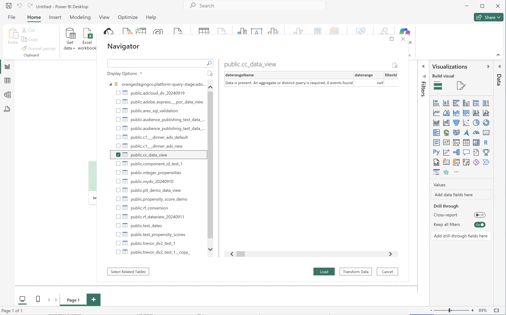

# Connetti e convalida


Questo caso d’uso imposta la connessione dallo strumento BI a Customer Journey Analytics, elenca le visualizzazioni dati disponibili e seleziona una visualizzazione dati da utilizzare.

+++ Customer Journey Analytics

Le istruzioni fanno riferimento a un ambiente di esempio con i seguenti oggetti:

* Visualizzazione dati: **[!UICONTROL C&C - Visualizzazione dati]** 🅐.
* Dimensioni: **[!UICONTROL Nome prodotto]** 🅑 e **[!UICONTROL Categoria prodotto]** 🅒.
* Metriche: **[!UICONTROL Ricavi da acquisto]** 🅓 e **[!UICONTROL Acquisti]** 🅔.
* Filtro: **[!UICONTROL Prodotti della pesca]** 🅕.


Nei casi d’uso, sostituisci questi oggetti di esempio con oggetti appropriati per il tuo ambiente specifico.

+++

+++ Strumenti BI

>[!BEGINTABS]

>[!TAB Desktop Power BI]

1. Accedi alle credenziali e ai parametri richiesti dall’interfaccia utente di Experience Platform Query Service.

   1. Passa alla sandbox di Experience Platform.
   1. Seleziona  **[!UICONTROL Query]** dalla barra a sinistra.
   1. Selezionare la scheda **[!UICONTROL Credenziali]** nell'interfaccia **[!UICONTROL Query]**.
   1. Selezionare `prod:cja` dal menu a discesa **[!UICONTROL Database]**.

      

1. Avviare Power BI Desktop.
   1. Dall'interfaccia principale, selezionare **[!UICONTROL Ottieni dati da altre origini]**.
   1. Nella finestra di dialogo **[!UICONTROL Ottieni dati]**:
      
      1. Cerca e seleziona **[!UICONTROL Database PostgreSQL]**.
      1. Seleziona **[!UICONTROL Connetti]**.
   1. Nella finestra di dialogo **[!UICONTROL Database PostgreSQL]**:
      
      1. Utilizza  per copiare e incollare i valori **[!UICONTROL Host]** e **[!UICONTROL Porta]** dal pannello **[!UICONTROL Query]** **[!UICONTROL Credenziali in scadenza]** di Experience Platform, separati da `:` come valore per **[!UICONTROL Server]**. Ad esempio: `examplecompany.platform-query.adobe.io:80`.
      1. Utilizza  per copiare e incollare il valore **[!UICONTROL Database]** dal pannello **[!UICONTROL Query]** **[!UICONTROL Credenziali in scadenza]** di Experience Platform. Aggiungere `?FLATTEN` al valore incollato. Ad esempio: `prod:cja?FLATTEN`.
      1. Selezionare **[!UICONTROL DirectQuery]** come **[!UICONTROL Modalità di connettività dati]**.
      1. Selezionare **[!UICONTROL OK]**.
   1. Nella finestra di dialogo **[!UICONTROL Database PostgreSQL]** - **[!UICONTROL Database]**:
      
      1. Utilizza  per copiare i valori **[!UICONTROL Nome utente]** e **[!UICONTROL Password]** dal pannello Experience Platform **[!UICONTROL Query]** **[!UICONTROL Credenziali in scadenza]** nei campi **[!UICONTROL Nome utente]** e **[!UICONTROL Password]**. Se si utilizza una [credenziale senza scadenza](https://experienceleague.adobe.com/en/docs/experience-platform/query/ui/credentials?lang=en#use-credential-to-connect), utilizzare la password delle credenziali senza scadenza.
      1. Verificare che il menu a discesa per **[!UICONTROL Selezionare il livello a cui applicare queste impostazioni]** sia impostato sul **[!UICONTROL server]** definito in precedenza.
      1. Seleziona **[!UICONTROL Connetti]**.
   1. Nella finestra di dialogo **[!UICONTROL Navigator]**, le visualizzazioni dati vengono recuperate. Questo recupero può richiedere del tempo. Una volta recuperato, in Power BI Desktop viene visualizzato quanto segue.
      
      1. Seleziona **[!UICONTROL public.cc_data_view]** dall'elenco nel pannello a sinistra.
      1. Sono disponibili due opzioni:
         1. Seleziona **[!UICONTROL Carica]** per continuare e completare l'installazione.
         1. Selezionare **[!UICONTROL Trasforma dati]**. Viene visualizzata una finestra di dialogo in cui è possibile applicare le trasformazioni come parte della configurazione.
            
            * Seleziona **[!UICONTROL Chiudi e applica]**.
   1. Dopo un po', nel riquadro **[!UICONTROL Dati]** viene visualizzato **[!UICONTROL public.cc_data_view]**. Seleziona  per visualizzare dimensioni e metriche.
      


## Per APPIATTIRE o meno

Power BI Desktop supporta i seguenti scenari per il parametro `FLATTEN`. Per ulteriori informazioni, vedere [Flatten nested data](https://experienceleague.adobe.com/it/docs/experience-platform/query/key-concepts/flatten-nested-data).

| Parametro FLATTEN | Esempio | Supportati | Osservazioni |
|---|---|:---:|---|
| Nessuno | `prod:cja` |  | |
| `?FLATTEN` | `prod:cja?FLATTEN` |  | **Opzione consigliata da utilizzare!** |
| `%3FFLATTEN` | `prod:cja%3FFLATTEN` |  | Power BI Desktop visualizza l'errore: **[!UICONTROL Impossibile eseguire l'autenticazione con le credenziali fornite. Riprova.]** |

### Ulteriori informazioni

* [Prerequisiti](/help/data-views/bi-extension.md#prerequisites)
* [Guida alle credenziali](https://experienceleague.adobe.com/it/docs/experience-platform/query/ui/credentials)
* [Connetti Power BI a Query Service](https://experienceleague.adobe.com/it/docs/experience-platform/query/clients/power-bi).


>[!TAB Desktop Tableau]

1. Accedi alle credenziali e ai parametri richiesti dall’interfaccia utente di Experience Platform Query Service.

   1. Passa alla sandbox di Experience Platform.
   1. Seleziona  **[!UICONTROL Query]** dalla barra a sinistra.
   1. Selezionare la scheda **[!UICONTROL Credenziali]** nell'interfaccia **[!UICONTROL Query]**.
   1. Selezionare `prod:cja` dal menu a discesa **[!UICONTROL Database]**.

      

1. Avvia Tableau.
   1. Seleziona **[!UICONTROL PostgreSQL]** dalla barra a sinistra sotto **[!UICONTROL A un server]**. Se non disponibile, selezionare **[!UICONTROL Altro...]** e selezionare **[!UICONTROL PostgreSQL]** dai **[!UICONTROL Connettori installati]**.
      
   1. Nella scheda **[!UICONTROL Generale]** della finestra di dialogo **[!UICONTROL PostgreSQL]**:
      
      1. Utilizza  per copiare e incollare l'**[!UICONTROL Host]** dal pannello **[!UICONTROL Query]** **[!UICONTROL Credenziali in scadenza]** di Experience Platform nel **[!UICONTROL Server]**.
      1. Utilizza  per copiare e incollare la **[!UICONTROL Porta]** dal pannello Experience Platform **[!UICONTROL Query]** **[!UICONTROL Credenziali in scadenza]** alla **[!UICONTROL Porta]**.
      1. Utilizza  per copiare e incollare il **[!UICONTROL Database]** dal pannello Experience Platform **[!UICONTROL Query]** **[!UICONTROL Credenziali in scadenza]** nel **[!UICONTROL Database]**. Aggiungere `%3FFLATTEN` al valore incollato. Ad esempio: `prod:cja%3FFLATTEN`.
      1. Selezionare **[!UICONTROL Nome utente e password]** dal menu a discesa **[!UICONTROL Autenticazione]**.
      1. Utilizza  per copiare e incollare il **[!UICONTROL Nome utente]** dal pannello **[!UICONTROL Query]** **[!UICONTROL Credenziali in scadenza]** di Experience Platform nel **[!UICONTROL Nome utente]**.
      1. Utilizza  per copiare e incollare la **[!UICONTROL Password]** dal pannello **[!UICONTROL Query]** **[!UICONTROL Credenziali in scadenza]** di Experience Platform nella **[!UICONTROL Password]**. Se si utilizza una [credenziale senza scadenza](https://experienceleague.adobe.com/en/docs/experience-platform/query/ui/credentials?lang=en#use-credential-to-connect), utilizzare la password delle credenziali senza scadenza.
      1. Verificare che sia selezionato **[!UICONTROL Richiedi SSL]**.
      1. Seleziona **[!UICONTROL Accedi]**.

      Viene visualizzata una finestra di dialogo **[!UICONTROL Richiesta in corso]** mentre Tableau Desktop convalida la connessione.
   1. Nella finestra principale, puoi vedere nella pagina **[!UICONTROL Data Source]**, nel riquadro a sinistra:
      * Il nome della connessione, sotto **[!UICONTROL Connessioni]**.
      * Il nome del database, sotto **[!UICONTROL Database]**.
      * Un elenco di tabelle, sotto **[!UICONTROL Tabella]**.
        
      1. Trascina la voce **[!UICONTROL cc_data_view]** e rilascia la voce nella visualizzazione principale che riporta **[!UICONTROL Trascina qui le tabelle]**.
   1. Nella finestra principale vengono visualizzati i dettagli della visualizzazione dati **[!UICONTROL cc_data_view]**.
      

## Per APPIATTIRE o meno

Tableau Desktop supporta i seguenti scenari per il parametro `FLATTEN`. Per ulteriori informazioni, vedere [Flatten nested data](https://experienceleague.adobe.com/it/docs/experience-platform/query/key-concepts/flatten-nested-data).

| Parametro FLATTEN | Esempio | Supportati | Osservazioni |
|---|---|:---:|---|
| Nessuno | `prod:cja` |  | |
| `?FLATTEN` | `prod:cja?FLATTEN` |  | |
| `%3FFLATTEN` | `prod:cja%3FFLATTEN` |  | **Opzione consigliata da utilizzare**. `%3FFLATTEN` è la versione con codifica URL di `?FLATTEN`. |

## Ulteriori informazioni

* [Prerequisiti](/help/data-views/bi-extension.md#prerequisites)
* [Guida alle credenziali](https://experienceleague.adobe.com/it/docs/experience-platform/query/ui/credentials)
* [Connettere Tableau Desktop a Query Service](https://experienceleague.adobe.com/it/docs/experience-platform/query/clients/tableau).


>[!TAB Ricerca]

1. Accedi alle credenziali e ai parametri richiesti dall’interfaccia utente di Experience Platform Query Service.

   1. Passa alla sandbox di Experience Platform.
   1. Seleziona  **[!UICONTROL Query]** dalla barra a sinistra.
   1. Selezionare la scheda **[!UICONTROL Credenziali]** nell'interfaccia **[!UICONTROL Query]**.
   1. Selezionare `prod:cja` dal menu a discesa **[!UICONTROL Database]**.

      

1. Accedi a Looker

   1. Seleziona **[!UICONTROL Amministratore]** dalla barra a sinistra.
   1. Seleziona **[!UICONTROL Connessioni]**.
   1. Selezionare **[!UICONTROL Aggiungi connessione]**.
   1. In **[!UICONTROL Connetti il database alla schermata Looker]**.

      

      1. Immetti un **[!UICONTROL Nome]** per la connessione, ad esempio `Example Looker Connection`.
      1. Assicurarsi che **[!UICONTROL Tutti i progetti]** sia selezionato come **[!UICONTROL Ambito connessione]**.
      1. Selezionare **[!UICONTROL PostgreSQL 9.5+]** come Dialetto.
      1. Utilizza  per copiare e incollare il valore **[!UICONTROL Host]** dal pannello **[!UICONTROL Query]** **[!UICONTROL Credenziali in scadenza]** di Experience Platform come valore per **[!UICONTROL Host]**. Ad esempio: `examplecompany.platform-query.adobe.io`.
      1. Utilizza  per copiare e incollare il valore **[!UICONTROL Porta]** dal pannello **[!UICONTROL Query]** **[!UICONTROL Credenziali in scadenza]** di Experience Platform come valore per **[!UICONTROL Porta]**. Ad esempio: `80`.
      1. Utilizza  per copiare e incollare il valore **[!UICONTROL Database]** dal pannello Experience Platform **[!UICONTROL Query]** **[!UICONTROL Credenziali in scadenza]** come valore per **[!UICONTROL Database]**. Aggiungere `%3FFLATTEN` al valore incollato. Ad esempio: `prod:cja%3FFLATTEN`.
      1. Utilizza  per copiare e incollare il valore **[!UICONTROL Nome utente]** dal pannello **[!UICONTROL Query]** **[!UICONTROL Credenziali in scadenza]** di Experience Platform come valore per **[!UICONTROL Nome utente]**.
      1. Utilizza  per copiare e incollare il valore **[!UICONTROL Password]** dal pannello **[!UICONTROL Query]** **[!UICONTROL Credenziali in scadenza]** di Experience Platform come valore per **[!UICONTROL Password]**.
      1. Seleziona **[!UICONTROL Espandi tutto]** in **[!UICONTROL Impostazioni facoltative]**.
      1. Imposta **[!UICONTROL Numero massimo di connessioni]** per nodo su `5`.
      1. Verificare che **[!UICONTROL SSL]** sia abilitato.
      1. Seleziona **[!UICONTROL Test]** per verificare la connessione. Dovresti vedere un banner nella parte superiore della schermata con un messaggio come **[!UICONTROL Operazione riuscita, può connettere JDBC ....]**.
      1. Seleziona **[!UICONTROL Connetti]** per stabilire e salvare la connessione.
   1. La nuova connessione viene visualizzata nell'interfaccia **[!UICONTROL Connessioni]**.
   1. Seleziona **←** da **[!UICONTROL Amministratore]** per passare alla navigazione principale nella barra a sinistra.
   1. Selezionare **[!UICONTROL Sviluppo]**.
   1. Seleziona **[!UICONTROL Progetti]**.
   1. Selezionare **[!UICONTROL Nuovo modello]** nei progetti LookML.
   1. Per evitare di influenzare altri utenti. quando richiesto, seleziona Entra in modalità di sviluppo.
   1. Nell'esperienza **[!UICONTROL Crea modello]**:
      1. In **[!UICONTROL ➊Selezionare Connessione Database]**:
         1. Selezionare la connessione al database in **[!UICONTROL Seleziona connessione al database]**. Esempio: **[!UICONTROL example_looker_connection]**.
         1. Assegna un nome al progetto in **[!UICONTROL Crea un nuovo progetto LookML per questo modello]**. Per `example: example_looker_project`.
         1. Seleziona **[!UICONTROL Avanti]**.
      1. In **[!UICONTROL ➋Seleziona Tabelle]**:
         1. Seleziona **[!UICONTROL public]**, quindi assicurati che la visualizzazione dati di Customer Journey Analytics sia selezionata. Ad esempio:  **[!UICONTROL cc_data_view]**.
         1. Seleziona **[!UICONTROL Avanti]**.
      1. In **[!UICONTROL ➌Seleziona Chiavi Primarie]**:
         1. Seleziona **[!UICONTROL Avanti]**.
      1. In **[!UICONTROL ➍selezionare Esplora da creare]**:
         1. Accertati di selezionare la vista. Ad esempio: **[!UICONTROL cc_data_view.view]**.
         1. Seleziona **[!UICONTROL Avanti]**.
      1. In **[!UICONTROL ➎Immettere Il Nome Modello]**:
         1. Assegna un nome al modello. Ad esempio: `example_looker_model`.
      1. Selezionare **[!UICONTROL Completa ed esplora dati]**.

   Sei stato reindirizzato all'interfaccia **[!UICONTROL Esplora]** di Looker, pronto per esplorare i dati.


## Per APPIATTIRE o meno

Looker supporta i seguenti scenari per il parametro `FLATTEN`. Per ulteriori informazioni, vedere [Flatten nested data](https://experienceleague.adobe.com/it/docs/experience-platform/query/key-concepts/flatten-nested-data).

| Parametro FLATTEN | Esempio | Supportati | Osservazioni |
|---|---|:---:|---|
| Nessuno | `prod:cja` |  | |
| `?FLATTEN` | `prod:cja?FLATTEN` |  | |
| `%3FFLATTEN` | `prod:cja%3FFLATTEN` |  | **Opzione consigliata da utilizzare**. `%3FFLATTEN` è la versione con codifica URL di `?FLATTEN`. |

## Ulteriori informazioni

* [Prerequisiti](/help/data-views/bi-extension.md#prerequisites)
* [Guida alle credenziali](https://experienceleague.adobe.com/it/docs/experience-platform/query/ui/credentials)


>[!TAB Blocco appunti Jupyter]

1. Accedi alle credenziali e ai parametri richiesti dall’interfaccia utente di Experience Platform Query Service.

   1. Passa alla sandbox di Experience Platform.
   1. Seleziona  **[!UICONTROL Query]** dalla barra a sinistra.
   1. Selezionare la scheda **[!UICONTROL Credenziali]** nell'interfaccia **[!UICONTROL Query]**.
   1. Selezionare `prod:cja` dal menu a discesa **[!UICONTROL Database]**.

      

1. Assicurati di aver configurato un ambiente virtuale Python dedicato per l’esecuzione dell’ambiente Jupyter Notebook.
1. Verifica di aver installato le librerie richieste nell’ambiente virtuale:
   * ipython-sql: `pip install ipython-sql`.
   * psycopg2-binary: `pip install psycopg-binary`.
   * sqlalchemy: pip `install sqlalchemy`.

1. Avviare Jupyter Notebook dall'ambiente virtuale: `jupyter notebook`.
1. Crea un nuovo blocco appunti o scarica [questo blocco appunti di esempio](../assets/BI-Extension.ipynb.zip).
1. Nella prima cella, immetti ed esegui:

   ```
   %config SqlMagic.style = '_DEPRECATED_DEFAULT'
   ```

1. In una nuova cella, immetti i parametri di configurazione per la connessione. Utilizza  per copiare e incollare i valori dal pannello Experience Platform **[!UICONTROL Query]** **[!UICONTROL Credenziali in scadenza]** nei valori richiesti per i parametri di configurazione. Ad esempio:

   ```
   import ipywidgets as widgets
   from IPython.display import display
   
   config_host = widgets.Text(description='Host:', value='example.platform-query-stage.adobe.io',
                           layout=widgets.Layout(width="600px"))
   display(config_host)
   config_port = widgets.IntText(description='Port:', value=80,
                              layout=widgets.Layout(width="200px"))
   display(config_port)
   config_db = widgets.Text(description='Database:', value='prod:cja',
                         layout=widgets.Layout(width="300px"))
   display(config_db)
   config_username = widgets.Text(description='Username:', value='EC582F955C8A79F70A49420E@AdobeOrg',
                               layout=widgets.Layout(width="600px"))
   display(config_username)
   config_password = widgets.Password(description='Password:', value='***',
                                   layout=widgets.Layout(width="600px"))
   display(config_password)
   ```

1. Eseguire la cella.
1. Utilizza  per copiare e incollare la password dal pannello **[!UICONTROL Query]** **[!UICONTROL Credenziali in scadenza]** di Experience Platform nel campo **[!UICONTROL Password]** di Jupyter Notebook.

   

1. In una nuova cella, immettere le istruzioni per caricare l'estensione SQL, la libreria richiesta e connettersi a Customer Journey Analytics.

   ```python
   %load_ext sql
   from sqlalchemy import create_engine
   %sql postgresql://{config_username.value}:{config_password.value}@{config_host.value}:{config_port.value}/{config_db.value}?sslmode=require
   ```

   Eseguite la shell. Non dovrebbe essere visualizzato alcun output, ma la cella dovrebbe essere eseguita senza alcun avviso.

   

1. In una nuova chiamata, immetti le istruzioni per ottenere un elenco delle visualizzazioni dati disponibili in base alla connessione.

   ```python
   %%sql
   SELECT n.nspname as "Schema",
      c.relname as "Name",
      CASE c.relkind WHEN 'r' THEN 'table' WHEN 'v' THEN 'view' WHEN 'm' THEN 'materialized view' WHEN 'i' THEN 'index' WHEN 'S' THEN 'sequence' WHEN 's' THEN 'special' WHEN 't' THEN 'TOAST table' WHEN 'f' THEN 'foreign table' WHEN 'p' THEN 'partitioned table' WHEN 'I' THEN 'partitioned index' END as "Type",
      pg_catalog.pg_get_userbyid(c.relowner) as "Owner"
   FROM pg_catalog.pg_class c
   LEFT JOIN pg_catalog.pg_namespace n ON n.oid = c.relnamespace
   WHERE c.relkind IN ('v','')
      AND n.nspname <> 'pg_catalog'
      AND n.nspname !~ '^pg_toast'
      AND n.nspname <> 'information_schema'
      AND pg_catalog.pg_table_is_visible(c.oid)
      AND c.relname NOT LIKE '%test%'
      AND c.relname NOT LIKE '%ajo%'
   ORDER BY 1,2;
   ```

   Eseguite la shell. Dovresti visualizzare un output simile alla schermata seguente.

   

   Dovresti visualizzare la **[!UICONTROL cc_data_view]** nell&#39;elenco delle visualizzazioni dati.

## Per APPIATTIRE o meno

Jupyter Notebook supporta i seguenti scenari per il parametro `FLATTEN`. Per ulteriori informazioni, vedere [Flatten nested data](https://experienceleague.adobe.com/it/docs/experience-platform/query/key-concepts/flatten-nested-data).

| Parametro FLATTEN | Esempio | Supportati | Osservazioni |
|---|---|:---:|---|
| Nessuno | `prod:cja` |  | |
| `?FLATTEN` | `prod:cja?FLATTEN` |  | |
| `%3FFLATTEN` | `prod:cja%3FFLATTEN` |  | **Opzione consigliata da utilizzare**. `%3FFLATTEN` è la versione con codifica URL di `?FLATTEN`. |

## Ulteriori informazioni

* [Prerequisiti](/help/data-views/bi-extension.md#prerequisites)
* [Guida alle credenziali](https://experienceleague.adobe.com/it/docs/experience-platform/query/ui/credentials)

>[!TAB StudioRS]

1. Accedi alle credenziali e ai parametri richiesti dall’interfaccia utente di Experience Platform Query Service.

   1. Passa alla sandbox di Experience Platform.
   1. Seleziona  **[!UICONTROL Query]** dalla barra a sinistra.
   1. Selezionare la scheda **[!UICONTROL Credenziali]** nell&#39;interfaccia **[!UICONTROL Query]**.
   1. Selezionare `prod:cja` dal menu a discesa **[!UICONTROL Database]**.

      

1. Avviare Studio.
1. Crea un nuovo file Markdown R o scarica [questo file Markdown R di esempio](../assets/BI-Extension.Rmd.zip).
1. Nel primo blocco immettere le istruzioni seguenti comprese tra ` ` ``{r} ` e ` `` ` `. Utilizza  per copiare e incollare i valori dal pannello **[!UICONTROL Query]** **[!UICONTROL Credenziali in scadenza]** di Experience Platform nei valori richiesti per i vari parametri, come `host`, `dbname` e `user`. Ad esempio:

   ```R
   library(rstudioapi)
   library(DBI)
   library(dplyr)
   library(tidyr)
   library(RPostgres)
   library(ggplot2)
   
   host <- rstudioapi::showPrompt(title = "Host", message = "Host", default = "orangestagingco.platform-query-stage.adobe.io")
   dbname <- rstudioapi::showPrompt(title = "Database", message = "Database", default = "prod:cja?FLATTEN")
   user <- rstudioapi::showPrompt(title = "Username", message = "Username", default = "EC582F955C8A79F70A49420E@AdobeOrg")
   password <- rstudioapi::askForPassword(prompt = "Password")
   ```

1. Esegui il blocco. Ti viene richiesto di **[!UICONTROL Host]**, **[!UICONTROL Database]** e **[!UICONTROL Utente]**. È sufficiente accettare i valori forniti nel passaggio precedente.
1. Utilizza  per copiare e incollare la password dal pannello Experience Platform **[!UICONTROL Query]** **[!UICONTROL Credenziali in scadenza]** alla finestra di dialogo **[!UICONTROL Password]** in RStudio.

   

1. Creare un nuovo blocco e immettere le istruzioni seguenti tra ` ` `` {r} ` e ` `` ` `.

   ```R
   con <- dbConnect(
      RPostgres::Postgres(),
      host = host,
      port = 80,
      dbname = dbname,
      user = user,
      password = password,
      sslmode = 'require'
   )
   ```

1. Esegui il blocco. Se la connessione ha esito positivo, non verrà visualizzato alcun output.


1. Creare un nuovo blocco e immettere le istruzioni seguenti tra ` ` `` {r} ` e ` `` ` `.

   ```R
   views <- dbListTables(con)
   print(views)
   ```

1. Esegui il blocco. Dovresti vedere `character(0)` come unico output.


1. Creare un nuovo blocco e immettere le istruzioni seguenti tra ` ` `` {r} ` e ` `` ` `.

   ```R
   glimpse(dv)
   ```

1. Esegui il blocco. Dovresti visualizzare un output simile alla schermata seguente.

   

## Per APPIATTIRE o meno

Studio supporta i seguenti scenari per il parametro `FLATTEN`. Per ulteriori informazioni, vedere [Flatten nested data](https://experienceleague.adobe.com/it/docs/experience-platform/query/key-concepts/flatten-nested-data).

| Parametro FLATTEN | Esempio | Supportati | Osservazioni |
|---|---|:---:|---|
| Nessuno | `prod:cja` |  | |
| `?FLATTEN` | `prod:cja?FLATTEN` |  | **Opzione consigliata da utilizzare**. |
| `%3FFLATTEN` | `prod:cja%3FFLATTEN` |  | |

## Ulteriori informazioni

* [Prerequisiti](/help/data-views/bi-extension.md#prerequisites)
* [Guida alle credenziali](https://experienceleague.adobe.com/it/docs/experience-platform/query/ui/credentials)

>[!ENDTABS]

+++
