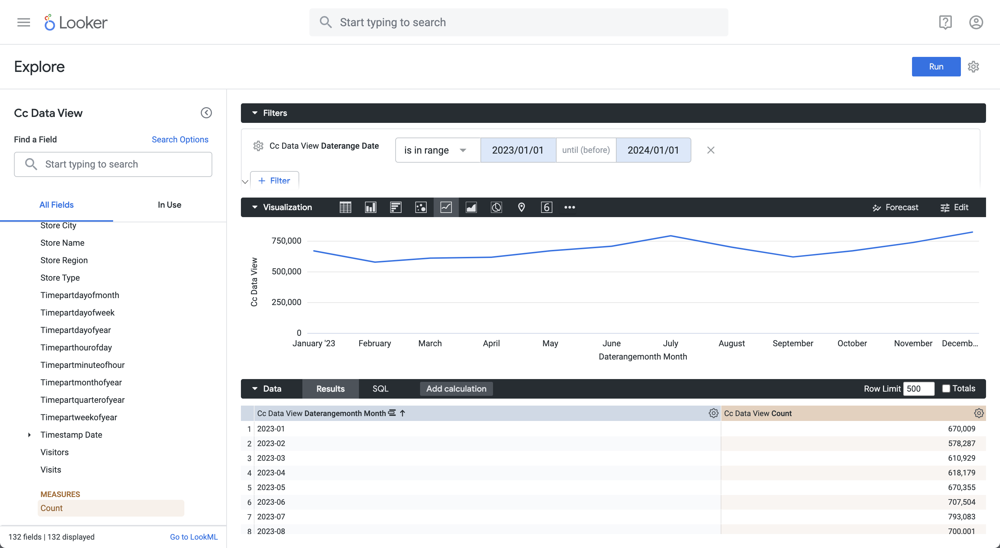
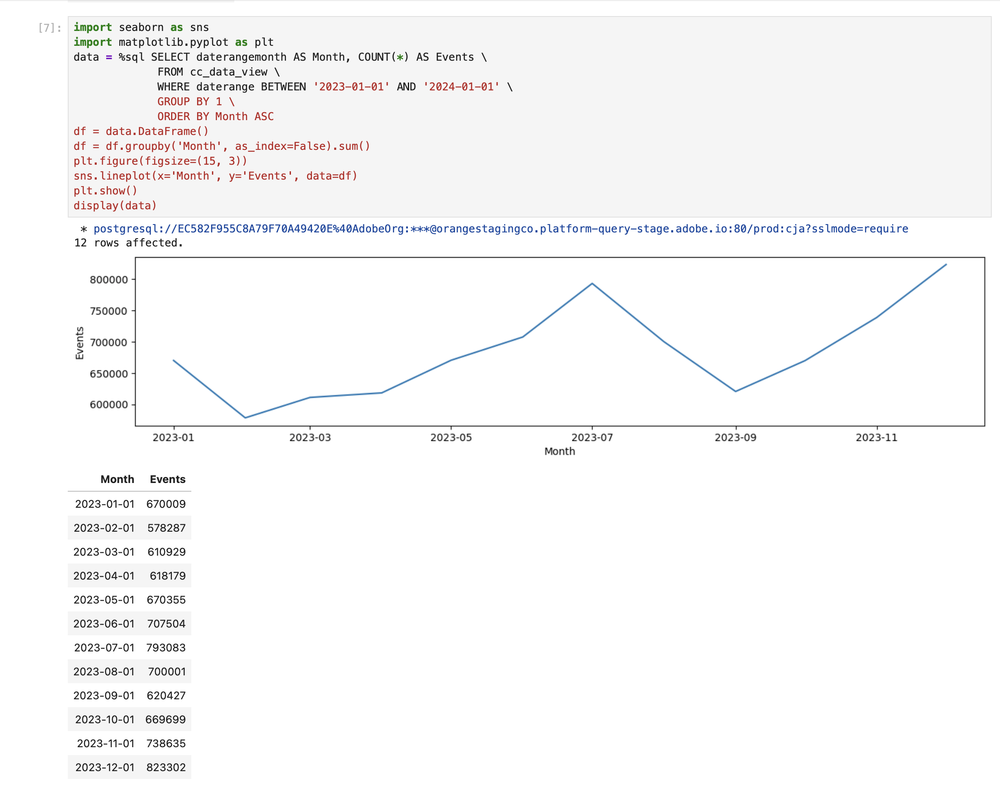

# Tendenza mensile


In questo caso d’uso, vuoi visualizzare una tabella e una visualizzazione a linee semplici che mostrino una tendenza mensile di occorrenza (eventi) per il 2023.

+++ Customer Journey Analytics

Un esempio di pannello **[!UICONTROL Tendenza mensile]** per il caso d&#39;uso:


+++

+++ Strumenti BI

>[!PREREQUISITES]
>
>Verificare di aver convalidato [una connessione, di avere la possibilità di elencare le visualizzazioni dati e di utilizzare una visualizzazione dati](connect-and-validate.md) per lo strumento BI per il quale si desidera provare questo caso d&#39;uso.
>

>[!BEGINTABS]

>[!TAB Desktop Power BI]

1. Nel riquadro **[!UICONTROL Dati]**:
   1. Seleziona **[!UICONTROL daterangemonth]**.
   1. Seleziona **[!UICONTROL somma occorrenze]**.

   Viene visualizzata una tabella che mostra le occorrenze del mese corrente. Per una migliore visibilità, ingrandisci la visualizzazione.

1. Nel riquadro **[!UICONTROL Filtri]**:

   1. Seleziona **[!UICONTROL daterangemonth is (All)]** from **[!UICONTROL Filters on this visual]** (Filtri per questo elemento visivo).
   1. Selezionare **[!UICONTROL Filtro avanzato]** come **[!UICONTROL Tipo filtro]**.
   1. Definisci il filtro per **[!UICONTROL Visualizzare gli elementi quando il valore]** **[!UICONTROL è uguale o successivo]** `1/1/2023` **[!UICONTROL And]** **[!UICONTROL è precedente]** `1/1/2024.` Puoi utilizzare l&#39;icona del calendario per scegliere e selezionare le date.
   1. Selezionare **[!UICONTROL Applica filtro]**.

   La tabella viene aggiornata con il filtro **[!UICONTROL daterangemonth]** applicato.

1. Nel riquadro **[!UICONTROL Visualizzazioni]**:

   1. Seleziona la visualizzazione **[!UICONTROL Grafico a linee]**.

   Una visualizzazione con grafico a linee sostituisce la tabella utilizzando gli stessi dati della tabella. Il desktop Power BI dovrebbe essere simile a quello riportato di seguito.

   

1. Nella visualizzazione Grafico a linee:

   1. Seleziona .
   1. Dal menu di scelta rapida, selezionare **[!UICONTROL Mostra come tabella]**.

   La vista principale viene aggiornata per mostrare sia una visualizzazione delle linee che una tabella. Il desktop Power BI dovrebbe essere simile a quello riportato di seguito.

   

>[!TAB Desktop Tableau]

1. Selezionare la scheda **[!UICONTROL Foglio 1]** nella parte inferiore per passare da **[!UICONTROL Origine dati]**. Nella visualizzazione **[!UICONTROL Foglio 1]**:
   1. Trascina la voce **[!UICONTROL Daterange]** dall&#39;elenco **[!UICONTROL Tabelle]** nel riquadro **[!UICONTROL Dati]** e rilasciala nello scaffale **[!UICONTROL Filtri]**.
   1. Nella finestra di dialogo **[!UICONTROL Campo filtri \[Daterange\]]**, seleziona **[!UICONTROL Intervallo di date]** e seleziona **[!UICONTROL Avanti >]**.
   1. Nella finestra di dialogo **[!UICONTROL Filtro \[Daterange\]]**, seleziona **[!UICONTROL Intervallo di date]** e specifica un periodo compreso tra `01/01/2023` e `01/01/2024`.

      

   1. Trascina **[!UICONTROL Daterangeday]** dall&#39;elenco **[!UICONTROL Tabelle]** nel riquadro **[!UICONTROL Dati]** e rilascia la voce nel campo accanto a **[!UICONTROL Colonne]**.
      * Seleziona **[!UICONTROL MESE]** dal menu a discesa **[!UICONTROL Daterangeday]**, in modo che il valore venga aggiornato a **[!UICONTROL MESE(Daterangeday)]**.
   1. Trascina e rilascia **[!UICONTROL Occorrenze]** dall&#39;elenco **[!UICONTROL Tabelle (*Nomi misure*)]** nel riquadro **[!UICONTROL Dati]** e rilascia la voce nel campo accanto a **[!UICONTROL Righe]**. Il valore viene convertito automaticamente in **[!UICONTROL SUM(Occurrences)]**.
   1. Modificare **[!UICONTROL Standard]** in **[!UICONTROL Vista intera]** dal menu a discesa **[!UICONTROL Adatta]** nella barra degli strumenti.

      Il desktop Tableau dovrebbe essere simile al seguente.

      

1. Selezionare **[!UICONTROL Duplica]** dal menu di scelta rapida della scheda **[!UICONTROL Foglio 1]** per creare un secondo foglio.
1. Selezionare **[!UICONTROL Rinomina]** dal menu di scelta rapida della scheda **[!UICONTROL Foglio 1]** per rinominare il foglio in `Graph`.
1. Selezionare **[!UICONTROL Rinomina]** dal menu di scelta rapida della scheda **[!UICONTROL Foglio 1 (2)]** per rinominare il foglio in `Data`.
1. Verifica che il foglio **[!UICONTROL Dati]** sia selezionato. Nella visualizzazione Dati:
   1. Seleziona **[!UICONTROL Mostra]** in alto a destra e seleziona **[!UICONTROL Tabella di testo]** (visualizzazione in alto a sinistra) per modificare il contenuto della visualizzazione dati in una tabella.
   1. Trascina **[!UICONTROL MONTH(Daterangeday)]** da **[!UICONTROL Columns]** a **[!UICONTROL Rows]**.
   1. Modificare **[!UICONTROL Standard]** in **[!UICONTROL Vista intera]** dal menu a discesa **[!UICONTROL Adatta]** nella barra degli strumenti.

      Il desktop Tableau dovrebbe essere simile al seguente.

      

1. Seleziona il pulsante della scheda **[!UICONTROL Nuovo dashboard]** (in basso) per creare una nuova visualizzazione **[!UICONTROL Dashboard 1]**. Nella visualizzazione **[!UICONTROL Dashboard 1]**:
   1. Trascina e rilascia il foglio del **[!UICONTROL Grafico]** dallo scaffale **[!UICONTROL Fogli]** nella visualizzazione **[!UICONTROL Dashboard 1]** che contiene *Rilascia qui i fogli*.
   1. Trascina e rilascia il foglio **[!UICONTROL Dati]** dallo scaffale **[!UICONTROL Fogli]** sotto il foglio **[!UICONTROL Grafico]** nella visualizzazione **[!UICONTROL Dashboard 1]**.
   1. Selezionare il foglio **[!UICONTROL Dati]** nella visualizzazione e modificare **[!UICONTROL Vista intera]** in **[!UICONTROL Larghezza fissa]**.

      Il desktop Tableau dovrebbe essere simile al seguente.

      


>[!TAB Ricerca]

1. Nell&#39;interfaccia **[!UICONTROL Esplora]** di Looker, assicurati di avere una configurazione pulita. In caso contrario, selezionare  **[!UICONTROL Rimuovi campi e filtri]**.
1. Seleziona **[!UICONTROL + Filtro]** sotto **[!UICONTROL Filtri]**.
1. Nella finestra di dialogo **[!UICONTROL Aggiungi filtro]**:
   1. Seleziona **[!UICONTROL ‣ Visualizzazione Dati Cc]**
   1. Dall&#39;elenco dei campi, selezionare **[!UICONTROL ‣ Data intervallo]** e quindi **[!UICONTROL Data intervallo]**.
      
1. Specifica Il Filtro **[!UICONTROL Cc Data Daterange Visualizzazione Dati]** Perché **[!UICONTROL È Compreso Nell&#39;Intervallo]** **[!UICONTROL 2023/01/01]** **[!UICONTROL Fino A (Prima)]** **[!UICONTROL 2024/01/01]**.
1. Dalla barra **[!UICONTROL Cc Data View]** a sinistra,
   1. Seleziona **[!UICONTROL ‣ Data del mese di calendario]**, quindi **[!UICONTROL Mese]** dall&#39;elenco di **[!UICONTROL DIMENSIONI]**.
   1. Seleziona **[!UICONTROL Conteggio]** sotto **[!UICONTROL MISURE]** nella barra a sinistra (in basso).
1. Seleziona **[!UICONTROL Esegui]**.
1. Selezionare **[!UICONTROL ‣ Visualizzazione]** per visualizzare la visualizzazione delle linee.

Dovresti visualizzare una visualizzazione e una tabella simili a quelle mostrate di seguito.




>[!TAB Blocco appunti Jupyter]

1. Immettere le istruzioni seguenti in una nuova cella.

   ```python
   import seaborn as sns
   import matplotlib.pyplot as plt
   data = %sql SELECT daterangemonth AS Month, COUNT(*) AS Events \
               FROM cc_data_view \
               WHERE daterange BETWEEN '2023-01-01' AND '2024-01-01' \
               GROUP BY 1 \
               ORDER BY Month ASC
   df = data.DataFrame()
   df = df.groupby('Month', as_index=False).sum()
   plt.figure(figsize=(15, 3))
   sns.lineplot(x='Month', y='Events', data=df)
   plt.show()
   display(data)
   ```

1. Eseguire la cella. Dovresti visualizzare un output simile alla schermata seguente.

   


>[!TAB StudioRS]

1. Immettere le istruzioni seguenti tra ` ```{r} ` e ` ``` ` in un nuovo blocco.

   ```R
   ## Hourly Events
   df <- dv %>%
      filter(daterange >= "2023-01-01" & daterange < "2023-01-02") %>%
      group_by(daterangehour) %>%
      count() %>%
      arrange(daterangehour, .by_group = FALSE)
   ggplot(df, aes(x = daterangehour, y = n)) +
      geom_line(color = "#69b3a2") +
      ylab("Events") +
      xlab("Hour")
   print(df)
   ```

1. Esegui il blocco. Dovresti visualizzare un output simile alla schermata seguente.

   

>[!ENDTABS]

+++
