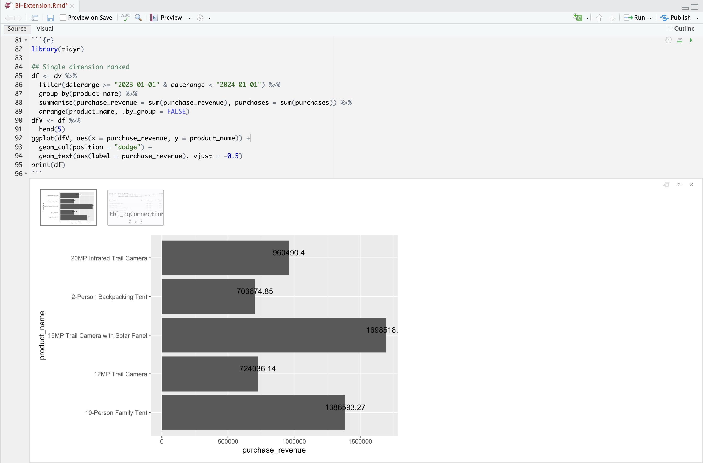

# Classificazione dimensione singola


In questo caso d’uso, vuoi visualizzare una tabella e una semplice visualizzazione a barre che mostrino i ricavi di acquisto e di acquisto per i nomi dei prodotti oltre il 2023.

+++ Customer Journey Analytics

Un esempio di **[!UICONTROL pannello con classificazione Dimension singola]** per il caso d&#39;uso:


+++

+++ Strumenti BI

>[!PREREQUISITES]
>
>Verificare di aver convalidato [una connessione, di avere la possibilità di elencare le visualizzazioni dati e di utilizzare una visualizzazione dati](connect-and-validate.md) per lo strumento BI per il quale si desidera provare questo caso d&#39;uso.
>

>[!BEGINTABS]

>[!TAB Desktop Power BI]

1. Nel riquadro **[!UICONTROL Dati]**:
   1. Seleziona **[!UICONTROL daterange]**.
   1. Seleziona **[!UICONTROL product_name]**.
   1. Seleziona **[!UICONTROL somma ricavi_acquisto]**.
   1. Seleziona **[!UICONTROL somma acquisti]**.

   Viene visualizzata una tabella vuota contenente solo le intestazioni di colonna per l’elemento selezionato. Per una migliore visibilità, ingrandisci la visualizzazione.

1. Nel riquadro **[!UICONTROL Filtri]**:

   1. Seleziona **[!UICONTROL l&#39;intervallo di dati è (Tutto)]** da **[!UICONTROL Filtri per questo elemento visivo]**.
   1. Seleziona **[!UICONTROL Data relativa]** come **[!UICONTROL Tipo filtro]**.
   1. Definisci il filtro per **[!UICONTROL mostrare gli elementi quando il valore]** **[!UICONTROL è negli ultimi]** `1` **[!UICONTROL anni di calendario]**.
   1. Selezionare **[!UICONTROL Applica filtro]**.

   La tabella viene aggiornata con il filtro **[!UICONTROL daterange]** applicato.

1. Nel riquadro **[!UICONTROL Visualizzazione]**:

   1. Utilizza  per rimuovere **[!UICONTROL daterange]** da **[!UICONTROL Colonne]**.
   1. Trascina e rilascia **[!UICONTROL Somma di purchases_revenue]** sotto **[!UICONTROL Somma degli acquisti]** in **[!UICONTROL Colonne]**.

1. Nella visualizzazione Tabella:

   1. Seleziona **[!UICONTROL Somma di purchase_revenue]** per ordinare i nomi dei prodotti in ordine decrescente di ricavi da acquisto. Il desktop Power BI dovrebbe essere simile a quello riportato di seguito.

   

1. Nel riquadro **[!UICONTROL Filtri]**:

   1. Seleziona **[!UICONTROL product_name is (All)]**.
   1. Imposta **[!UICONTROL Tipo filtro]** su **[!UICONTROL Top N]**.
   1. Definisci il filtro in base a **[!UICONTROL Mostra elementi]** **[!UICONTROL Primi]** `10` **[!UICONTROL In base al valore]**.
   1. Trascina e rilascia **[!UICONTROL purchase_revenue]** in **[!UICONTROL Per valore]** **[!UICONTROL Aggiungi i campi dati qui]**.
   1. Selezionare **[!UICONTROL Applica filtro]**.

   La tabella viene aggiornata con i valori dei ricavi dall’acquisto sincronizzati con la visualizzazione a forma libera in Analysis Workspace.

1. Nel riquadro **[!UICONTROL Visualizzazioni]**:

   1. Seleziona la visualizzazione **[!UICONTROL Grafico a linee e istogramma in pila]**.

   La tabella viene sostituita da una visualizzazione con istogramma a linee e in pila, che utilizza gli stessi dati della tabella.

1. Trascina e rilascia **[!UICONTROL acquisti]** su **[!UICONTROL Asse y di linea]** nel riquadro **[!UICONTROL Visualizzazioni]**.

   L’istogramma a linee e in pila viene aggiornato. Il desktop Power BI dovrebbe essere simile a quello riportato di seguito.

   

1. Nella visualizzazione Grafico a linee e a colonne sovrapposte:

   1. Seleziona .
   1. Dal menu di scelta rapida, selezionare **[!UICONTROL Mostra come tabella]**.

   La vista principale viene aggiornata per mostrare sia una visualizzazione delle linee che una tabella.

   

>[!TAB Desktop Tableau]

1. Selezionare la scheda **[!UICONTROL Foglio 1]** nella parte inferiore per passare da **[!UICONTROL Origine dati]**. Nella visualizzazione **[!UICONTROL Foglio 1]**:
   1. Trascina la voce **[!UICONTROL Daterange]** dall&#39;elenco **[!UICONTROL Tabelle]** nel riquadro **[!UICONTROL Dati]** e rilasciala nello scaffale **[!UICONTROL Filtri]**.
   1. Nella finestra di dialogo **[!UICONTROL Campo filtri \[Daterange\]]**, seleziona **[!UICONTROL Intervallo di date]** e seleziona **[!UICONTROL Avanti >]**.
   1. Nella finestra di dialogo **[!UICONTROL Filtro \[Daterange\]]**, seleziona **[!UICONTROL Intervallo di date]** e specifica un periodo compreso tra `01/01/2023` e `31/12/2023`. Selezionare **[!UICONTROL Applica]** e **[!UICONTROL OK]**.

      

   1. Trascina **[!UICONTROL Nome prodotto]** dall&#39;elenco **[!UICONTROL Tabelle]** nel riquadro **[!UICONTROL Dati]** e rilascia la voce nel campo accanto a **[!UICONTROL Righe]**.
   1. Trascina e rilascia **[!UICONTROL Acquisti]** dall&#39;elenco **[!UICONTROL Tabelle (*Nomi misure*)]** nel riquadro **[!UICONTROL Dati]** e rilascia la voce nel campo accanto a **[!UICONTROL Righe]**. Il valore viene convertito automaticamente in **[!UICONTROL SUM(Purchases)]**.
   1. Trascina e rilascia **[!UICONTROL Ricavi acquisti]** dall&#39;elenco **[!UICONTROL Tabelle (*Nomi misure*)]** nel riquadro **[!UICONTROL Dati]**, quindi rilascia la voce nel campo accanto a **[!UICONTROL Colonne]** e lascia **[!UICONTROL SOMMA(Acquisti)]**. Il valore viene convertito automaticamente in **[!UICONTROL SUM(Purchase Revenue)]**.
   1. Per ordinare entrambi i grafici in ordine decrescente di ricavi da acquisto, passa il cursore del mouse sul titolo **[!UICONTROL Ricavi da acquisto]** e seleziona l&#39;icona di ordinamento.
   1. Per limitare il numero di voci nei grafici, selezionare **[!UICONTROL SUM(Purchase Revenue)]** in **[!UICONTROL Rows]** e dal menu a discesa selezionare **[!UICONTROL Filter]**.
   1. Nella finestra di dialogo **[!UICONTROL Filtro \[Ricavi acquisti\]]** seleziona **[!UICONTROL Intervallo di valori]** e immetti i valori appropriati. Ad esempio: `1,000,000` - `2,000,000`. Selezionare **[!UICONTROL Applica]** e **[!UICONTROL OK]**.
   1. Per convertire i due grafici a barre in un grafico a doppia combinazione, selezionare **[!UICONTROL SUM(Purchases)]** in **[!UICONTROL Rows]** e dal menu a discesa selezionare **[!UICONTROL Dual Axis]**. I grafici a barre diventano un grafico a dispersione.
   1. Per modificare il grafico a dispersione in un grafico a barre:
      1. Selezionare **[!UICONTROL SUM(Purchases)]** nell&#39;area **[!UICONTROL Marks]** e selezionare **[!UICONTROL Line]** dal menu a discesa.
      1. Seleziona **[!UICONTROL SUM(Purchase Revenue)]** nell&#39;area **[!UICONTROL Marks]** e seleziona **[!UICONTROL Bar]** dal menu a discesa.

   Il desktop Tableau dovrebbe essere simile al seguente.

   

1. Selezionare **[!UICONTROL Duplica]** dal menu di scelta rapida della scheda **[!UICONTROL Foglio 1]** per creare un secondo foglio.
1. Selezionare **[!UICONTROL Rinomina]** dal menu di scelta rapida della scheda **[!UICONTROL Foglio 1]** per rinominare il foglio in `Data`.
1. Selezionare **[!UICONTROL Rinomina]** dal menu di scelta rapida della scheda **[!UICONTROL Foglio 1 (2)]** per rinominare il foglio in `Graph`.
1. Verifica che il foglio **[!UICONTROL Dati]** sia selezionato.
   1. Seleziona **[!UICONTROL Mostra]** in alto a destra e seleziona **[!UICONTROL Tabella di testo]** (visualizzazione superiore sinistra) per modificare il contenuto dei due grafici in una tabella.
   1. Per ordinare i ricavi di acquisto in ordine decrescente, posiziona il cursore del mouse su **[!UICONTROL Ricavi di acquisto]** nella tabella e seleziona .
   1. Selezionare **[!UICONTROL Vista intera]** dal menu a discesa **[!UICONTROL Adatta]**.

   Il desktop Tableau dovrebbe essere simile al seguente.

   

1. Seleziona il pulsante della scheda **[!UICONTROL Nuovo dashboard]** (in basso) per creare una nuova visualizzazione **[!UICONTROL Dashboard 1]**. Nella visualizzazione **[!UICONTROL Dashboard 1]**:
   1. Trascina e rilascia il foglio del **[!UICONTROL Grafico]** dallo scaffale **[!UICONTROL Fogli]** nella visualizzazione **[!UICONTROL Dashboard 1]** che contiene *Rilascia qui i fogli*.
   1. Trascina e rilascia il foglio **[!UICONTROL Dati]** dallo scaffale **[!UICONTROL Fogli]** sotto il foglio **[!UICONTROL Grafico]** nella visualizzazione **[!UICONTROL Dashboard 1]**.
   1. Selezionare il foglio **[!UICONTROL Dati]** nella visualizzazione e modificare **[!UICONTROL Vista intera]** in **[!UICONTROL Larghezza fissa]**.

   La visualizzazione **[!UICONTROL Dashboard 1]** dovrebbe essere simile a quella riportata di seguito.

   


>[!TAB Ricerca]

1. Nell&#39;interfaccia **[!UICONTROL Esplora]** di Looker, assicurati di avere una configurazione pulita. In caso contrario, selezionare  **[!UICONTROL Rimuovi campi e filtri]**.
1. Seleziona **[!UICONTROL + Filtro]** sotto **[!UICONTROL Filtri]**.
1. Nella finestra di dialogo **[!UICONTROL Aggiungi filtro]**:
   1. Seleziona **[!UICONTROL ‣ Visualizzazione Dati Cc]**
   1. Dall&#39;elenco dei campi, selezionare **[!UICONTROL ‣ Data intervallo]** e quindi **[!UICONTROL Data intervallo]**.
      
1. Specifica Il Filtro **[!UICONTROL Cc Data Daterange Visualizzazione Dati]** Perché **[!UICONTROL È Compreso Nell&#39;Intervallo]** **[!UICONTROL 2023/01/01]** **[!UICONTROL Fino A (Prima)]** **[!UICONTROL 2024/01/01]**.
1. Dalla sezione **[!UICONTROL ‣ Visualizzazione dati Cc]** nella barra a sinistra, seleziona **[!UICONTROL Nome prodotto]**.
1. Dalla sezione **[!UICONTROL ‣ Campi personalizzati]** nella barra a sinistra:
   1. Selezionare **[!UICONTROL Misura personalizzata]** dal menu a discesa **[!UICONTROL + Aggiungi]**.
   1. Nella finestra di dialogo **[!UICONTROL Crea misura personalizzata]**:
      1. Seleziona **[!UICONTROL Ricavi acquisti]** dal menu a discesa **[!UICONTROL Campo da misurare]**.
      1. Selezionare **[!UICONTROL Somma]** dal menu a discesa **[!UICONTROL Tipo di misura]**.
      1. Immettere un nome di campo personalizzato per **[!UICONTROL Nome]**. Ad esempio: `Purchase Revenue`.
      1. Selezionare la scheda **[!UICONTROL Dettagli campo]**.
      1. Seleziona **[!UICONTROL Decimali]** dal menu a discesa **[!UICONTROL Formato]** e assicurati che `0` sia inserito in **[!UICONTROL Decimali]**.
         
      1. Seleziona **[!UICONTROL Salva]**.
   1. Seleziona ancora **[!UICONTROL Misura personalizzata]** dal menu a discesa **[!UICONTROL + Aggiungi]**. Nella finestra di dialogo **[!UICONTROL Crea misura personalizzata]**:
      1. Seleziona **[!UICONTROL Acquisti]** dal menu a discesa **[!UICONTROL Campo da misurare]**.
      1. Selezionare **[!UICONTROL Somma]** dal menu a discesa **[!UICONTROL Tipo di misura]**.
      1. Immettere un nome di campo personalizzato per **[!UICONTROL Nome]**. Ad esempio: `Sum of Purchases`.
      1. Selezionare la scheda **[!UICONTROL Dettagli campo]**.
      1. Seleziona **[!UICONTROL Decimali]** dal menu a discesa **[!UICONTROL Formato]** e assicurati che `0` sia inserito in **[!UICONTROL Decimali]**.
      1. Seleziona **[!UICONTROL Salva]**.
   1. Entrambi i campi vengono aggiunti automaticamente alla visualizzazione Dati.
1. Selezionare **[!UICONTROL + Filtro]** per aggiungere altri **[!UICONTROL Filtri]** e limitare i dati.
1. Nella finestra di dialogo **[!UICONTROL Aggiungi filtro]**, seleziona **[!UICONTROL ‣ Campi personalizzati]**, quindi **[!UICONTROL Ricavi di acquisto]**.
1. Effettuare le selezioni appropriate e immettere i valori proposti, in modo che il filtro legga **[!UICONTROL compreso tra]** `1000000` **[!UICONTROL AND]** `2000000` inclusi.
1. Seleziona **[!UICONTROL Esegui]**.
1. Selezionare **[!UICONTROL ‣ Visualizzazione]** per visualizzare la visualizzazione delle linee.
1. Seleziona **[!UICONTROL Modifica]** in **[!UICONTROL Visualizzazione]** per aggiornare la visualizzazione. Nella finestra di dialogo popup:
   1. Selezionare la scheda **[!UICONTROL Serie]**.
   1. Scorri verso il basso per visualizzare **[!UICONTROL Acquisti]** e cambia **[!UICONTROL Tipo]** in **[!UICONTROL Riga]**.
   1. Selezionare la scheda **[!UICONTROL Y]**.
   1. Trascina **[!UICONTROL Purchases]** dal contenitore **[!UICONTROL Left 1]** nel punto in cui si legge **[!UICONTROL *Trascina qui la serie per creare un nuovo asse sinistro *]**. Questa azione crea un contenitore&#x200B;**[!UICONTROL &#x200B; Left 2 &#x200B;]**.
      
   1. Seleziona  accanto a **[!UICONTROL Modifica]** per nascondere la finestra di dialogo a comparsa

Dovresti visualizzare una visualizzazione e una tabella simili a quelle mostrate di seguito.


>[!TAB Blocco appunti Jupyter]

1. Immettere le istruzioni seguenti in una nuova cella.

   ```
   import seaborn as sns
   import matplotlib.pyplot as plt
   data = %sql SELECT product_name AS `Product Name`, SUM(purchase_revenue) AS `Purchase Revenue`, SUM(purchases) AS `Purchases` \
               FROM cc_data_view \
               WHERE daterange BETWEEN '2023-01-01' AND '2024-01-01' \
               GROUP BY 1 \
               LIMIT 10;
   df = data.DataFrame()
   df = df.groupby('Product Name', as_index=False).sum()
   plt.figure(figsize=(15, 3))
   sns.barplot(x='Purchase Revenue', y='Product Name', data=df)
   plt.show()
   display(data)
   ```

1. Eseguire la cella. Dovresti visualizzare un output simile alla schermata seguente.

   


>[!TAB StudioRS]

1. Immettere le istruzioni seguenti tra ` ` ``{r} ` e ` `` ` ` in un nuovo blocco.

   ```R
   library(tidyr)
   
   ## Single dimension ranked
   df <- dv %>%
      filter(daterange >= "2023-01-01" & daterange < "2024-01-01") %>%
      group_by(product_name) %>%
      summarise(purchase_revenue = sum(purchase_revenue), purchases = sum(purchases)) %>%
      arrange(product_name, .by_group = FALSE)
   dfV <- df %>%
      head(5)
   ggplot(dfV, aes(x = purchase_revenue, y = product_name)) +
      geom_col(position = "dodge") +
      geom_text(aes(label = purchase_revenue), vjust = -0.5)
   print(df)
   ```

1. Esegui il blocco. Dovresti visualizzare un output simile alla schermata seguente.

   

>[!ENDTABS]

+++

