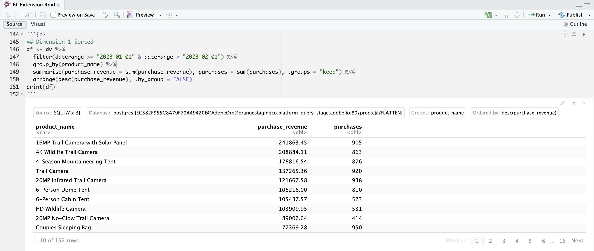

# Ordina


In questo caso d’uso, desideri generare rapporti sui ricavi e sugli acquisti per nomi di prodotto nel mese di gennaio 2023, ordinati in ordine decrescente di ricavi di acquisto.

+++ Customer Journey Analytics

Esempio di pannello **[!UICONTROL Ordina]** per il caso d&#39;uso:


+++

+++ Strumenti BI

>[!PREREQUISITES]
>
>Verificare di aver convalidato [una connessione, di avere la possibilità di elencare le visualizzazioni dati e di utilizzare una visualizzazione dati](connect-and-validate.md) per lo strumento BI per il quale si desidera provare questo caso d&#39;uso.
>

>[!BEGINTABS]

>[!TAB Desktop Power BI]

1. Nel riquadro **[!UICONTROL Dati]**:
   1. Seleziona **[!UICONTROL daterange]**.
   1. Seleziona **[!UICONTROL product_name]**.
   1. Seleziona **[!UICONTROL somma ricavi_acquisto]**.
   1. Seleziona **[!UICONTROL somma acquisti]**.

1. Nel riquadro **[!UICONTROL Filtri]**:
   1. Seleziona **[!UICONTROL l&#39;intervallo di dati è (Tutto)]** da **[!UICONTROL Filtri per questo elemento visivo]**.
   1. Selezionare **[!UICONTROL Filtro avanzato]** come **[!UICONTROL Tipo filtro]**.
   1. Definisci il filtro per **[!UICONTROL mostrare gli elementi quando il valore]** **[!UICONTROL è attivo o successivo]** `1/1/2023` **[!UICONTROL And]** **[!UICONTROL è precedente]** `2/1/2023`.

1. Nel riquadro Visualizzazioni:
   1. Selezionare  per rimuovere l&#39;intervallo di dati dalle colonne.
   1. Trascina **[!UICONTROL Somma di purchase_revenue]** nella parte inferiore di **[!UICONTROL Column]** elementi.

1. Nel rapporto, seleziona **[!UICONTROL Somma di purchase_revenue]** per ordinare la tabella in ordine decrescente di ricavi da acquisto.

   Il desktop Power BI dovrebbe essere simile a quello riportato di seguito.

   

La query eseguita da Power BI Desktop tramite l&#39;estensione BI non include un&#39;istruzione `sort`. L&#39;assenza di un&#39;istruzione `sort` implica che l&#39;ordinamento viene eseguito lato client.

```sql
select "_"."product_name",
    "_"."a0",
    "_"."a1"
from 
(
    select "rows"."product_name" as "product_name",
        sum("rows"."purchases") as "a0",
        sum("rows"."purchase_revenue") as "a1"
    from 
    (
        select "_"."daterangeName",
            "_"."daterange",
            "_"."filterId",
            "_"."filterName",
            "_"."timestamp",
            "_"."affiliate_name",
            "_"."affiliate_url",
            "_"."commerce.order.priceTotal",
            "_"."customer_city",
            "_"."customer_region",
            "_"."daterangeday",
            "_"."daterangefifteenminute",
            "_"."daterangefiveminute",
            "_"."daterangehour",
            "_"."daterangeminute",
            "_"."daterangemonth",
            "_"."daterangequarter",
            "_"."daterangesecond",
            "_"."daterangethirtyminute",
            "_"."daterangeweek",
            "_"."daterangeyear",
            "_"."hitdatetime",
            "_"."page_name",
            "_"."page_url",
            "_"."product_category",
            "_"."product_name",
            "_"."product_short_review",
            "_"."product_subCategory",
            "_"."referrer_url",
            "_"."search_engine",
            "_"."search_keywords",
            "_"."store_city",
            "_"."store_name",
            "_"."store_region",
            "_"."store_type",
            "_"."timepartdayofmonth",
            "_"."timepartdayofweek",
            "_"."timepartdayofyear",
            "_"."timeparthourofday",
            "_"."timepartminuteofhour",
            "_"."timepartmonthofyear",
            "_"."timepartquarterofyear",
            "_"."timepartweekofyear",
            "_"."cm_session_end_rate_defaultmetric",
            "_"."cm_session_person_defaultmetric",
            "_"."cm_session_start_rate_defaultmetric",
            "_"."cm_timespent_person_defaultmetric",
            "_"."cm_timespent_session_defaultmetric",
            "_"."cm_product_name_count_distinct",
            "_"."ad_views",
            "_"."adobe_sessionends",
            "_"."adobe_sessionstarts",
            "_"."adobe_timespent",
            "_"."exchange_buybacks",
            "_"."exchange_cost",
            "_"."exchange_purchases",
            "_"."exchange_revenue",
            "_"."occurrences",
            "_"."page_views",
            "_"."product_quantity",
            "_"."product_reviews",
            "_"."product_views",
            "_"."purchase_revenue",
            "_"."purchases",
            "_"."visitors",
            "_"."visits"
        from "public"."cc_data_view" "_"
        where "_"."daterange" < date '2023-02-01' and "_"."daterange" >= date '2023-01-01'
    ) "rows"
    group by "product_name"
) "_"
where not "_"."a0" is null or not "_"."a1" is null
limit 1000001
```


>[!TAB Desktop Tableau]

1. Selezionare la scheda **[!UICONTROL Foglio 1]** nella parte inferiore per passare da **[!UICONTROL Origine dati]**. Nella visualizzazione **[!UICONTROL Foglio 1]**:
   1. Trascina la voce **[!UICONTROL Daterange]** dall&#39;elenco **[!UICONTROL Tabelle]** nello scaffale **[!UICONTROL Filtri]**.
   1. Nella finestra di dialogo **[!UICONTROL Campo filtro \[Daterange\]]**, seleziona **[!UICONTROL Intervallo di date]** e seleziona **[!UICONTROL Avanti >]**.
   1. Nella finestra di dialogo **[!UICONTROL Filtro \[Daterange\]]**, selezionare **[!UICONTROL Intervallo di date]**, quindi selezionare `01/01/2023` - `1/2/2023`. Selezionare **[!UICONTROL Applica]** e **[!UICONTROL OK]**.
   1. Trascina **[!UICONTROL Nome prodotto]** dall&#39;elenco **[!UICONTROL Tabelle]** e rilascia la voce nel campo accanto a **[!UICONTROL Righe]**.
   1. Trascina la voce **[!UICONTROL Acquisti]** dall&#39;elenco **[!UICONTROL Tabelle]** e rilascia la voce nel campo accanto a **[!UICONTROL Colonne]**. Il valore diventa **[!UICONTROL SUM(Purchases)]**.
   1. Trascina la voce **[!UICONTROL Ricavi acquisti]** dall&#39;elenco **[!UICONTROL Tabelle]** e rilascia la voce nel campo accanto a **[!UICONTROL Colonne]**, accanto a **[!UICONTROL SOMMA(Acquisti)]**. Il valore diventa **[!UICONTROL SUM(Purchase Revenue)]**.
   1. Seleziona **[!UICONTROL Tabella di testo]** da **[!UICONTROL Mostra]**.
   1. Selezionare **[!UICONTROL Adatta larghezza]** dal menu a discesa **[!UICONTROL Adatta]**.
   1. Selezionare l&#39;intestazione di colonna **[!UICONTROL Ricavi acquisti]** e ordinare la tabella in questa colonna in ordine decrescente.

      Il desktop Tableau dovrebbe essere simile al seguente.

      

La query eseguita da Tableau Desktop tramite l&#39;estensione BI non include un&#39;istruzione `sort`. L&#39;assenza di questa istruzione `sort` implica che l&#39;ordinamento viene eseguito lato client.

```sql
SELECT CAST("cc_data_view"."product_name" AS TEXT) AS "product_name",
  SUM("cc_data_view"."occurrences") AS "sum:occurrences:ok",
  SUM("cc_data_view"."purchase_revenue") AS "sum:purchase_revenue:ok",
  SUM("cc_data_view"."purchases") AS "sum:purchases:ok"
FROM "public"."cc_data_view" "cc_data_view"
WHERE (("cc_data_view"."daterange" >= (DATE '2023-01-01')) AND ("cc_data_view"."daterange" <= (DATE '2023-02-01')))
GROUP BY 1
```

>[!TAB Ricerca]

1. Nell&#39;interfaccia **[!UICONTROL Esplora]** di Looker, aggiorna la connessione. Selezionare  **[!UICONTROL Cancella cache e aggiorna]**.
1. Nell&#39;interfaccia **[!UICONTROL Esplora]** di Looker, assicurati di avere una configurazione pulita. In caso contrario, selezionare  **[!UICONTROL Rimuovi campi e filtri]**.
1. Seleziona **[!UICONTROL + Filtro]** sotto **[!UICONTROL Filtri]**.
1. Nella finestra di dialogo **[!UICONTROL Aggiungi filtro]**:
   1. Seleziona **[!UICONTROL ‣ Visualizzazione Dati Cc]**
   1. Dall&#39;elenco dei campi, selezionare **[!UICONTROL ‣ Data intervallo]** e quindi **[!UICONTROL Data intervallo]**.
      
1. Specifica Il Filtro **[!UICONTROL Cc Data Daterange Visualizzazione Dati]** Perché **[!UICONTROL È Compreso Nell&#39;Intervallo]** **[!UICONTROL 2023/01/01]** **[!UICONTROL Fino A (Prima)]** **[!UICONTROL 2023/02/01]**.
1. Dalla sezione **[!UICONTROL ‣ Visualizzazione dati Cc]** nella barra a sinistra, seleziona **[!UICONTROL Nome prodotto]**.
1. Dalla sezione **[!UICONTROL ‣ Campi personalizzati]** nella barra a sinistra:
   1. Selezionare **[!UICONTROL Misura personalizzata]** dal menu a discesa **[!UICONTROL + Aggiungi]**.
   1. Nella finestra di dialogo **[!UICONTROL Crea misura personalizzata]**:
      1. Seleziona **[!UICONTROL Ricavi acquisti]** dal menu a discesa **[!UICONTROL Campo da misurare]**.
      1. Selezionare **[!UICONTROL Somma]** dal menu a discesa **[!UICONTROL Tipo di misura]**.
      1. Immettere un nome di campo personalizzato per **[!UICONTROL Nome]**. Ad esempio: `Sum of Purchase Revenue`.
      1. Selezionare la scheda **[!UICONTROL Dettagli campo]**.
      1. Seleziona **[!UICONTROL Decimali]** dal menu a discesa **[!UICONTROL Formato]** e assicurati che `0` sia inserito in **[!UICONTROL Decimali]**.
         
      1. Seleziona **[!UICONTROL Salva]**.
1. Accertati di selezionare **[!UICONTROL ↓]** (**[!UICONTROL Decrescente, Ordinamento: 1]**) nella colonna **[!UICONTROL Ricavi acquisti]**.
1. Seleziona **[!UICONTROL Esegui]**.
1. Selezionare **[!UICONTROL ‣ Visualizzazione]**.

Dovresti visualizzare una visualizzazione e una tabella simili a quelle mostrate di seguito.


La query generata da Looker tramite l&#39;estensione BI include `ORDER BY`, il che implica che l&#39;ordinamento viene eseguito tramite Looker e l&#39;estensione BI.

```sql
-- Looker Query Context '{"user_id":6,"history_slug":"fc83573987b999306eaf6e1a3f2cde70","instance_slug":"71d4667f0b76c0011463658f45c3f7a3"}' 
SELECT
    cc_data_view."product_name"  AS "cc_data_view.product_name",
    COALESCE(SUM(CAST(( cc_data_view."purchase_revenue"  ) AS DOUBLE PRECISION)), 0) AS "purchase_revenue"
FROM
    "public"."cc_data_view" AS "cc_data_view"
WHERE ((( cc_data_view."daterange"  ) >= (DATE_TRUNC('day', DATE '2024-01-31')) AND ( cc_data_view."daterange"  ) < (DATE_TRUNC('day', DATE '2023-02-01'))))
GROUP BY
    1
ORDER BY
    2 DESC
FETCH NEXT 500 ROWS ONLY
```


>[!TAB Blocco appunti Jupyter]

1. Immettere le istruzioni seguenti in una nuova cella.

   ```python
   data = %sql SELECT product_name AS `Product Name`, SUM(purchase_revenue) AS `Purchase Revenue`, SUM(purchases) AS `Purchases` \
               FROM cc_data_view \
               WHERE daterange BETWEEN '2023-01-01' AND '2023-02-01' \
               GROUP BY 1 \
               ORDER BY `Purchase Revenue` DESC \
               LIMIT 5;
   display(data)
   ```

1. Eseguire la cella. Dovresti visualizzare un output simile alla schermata seguente.

   

La query viene eseguita dall’estensione BI come definito in Jupyter Notebook.


>[!TAB StudioRS]

1. Immettere le istruzioni seguenti tra ` ```{r} ` e ` ``` ` in un nuovo blocco.

   ```R
   ## Dimension 1 Sorted
   df <- dv %>%
      filter(daterange >= "2023-01-01" & daterange < "2023-02-01") %>%
      group_by(product_name) %>%
      summarise(purchase_revenue = sum(purchase_revenue), purchases = sum(purchases), .groups = "keep") %>%
      arrange(desc(purchase_revenue), .by_group = FALSE)
   print(df)
   ```

1. Esegui il blocco. Dovresti visualizzare un output simile alla schermata seguente.

   

La query generata da Studio utilizzando l&#39;estensione BI include `ORDER BY`, il che implica che l&#39;ordine viene applicato tramite Studio e l&#39;estensione BI.

```sql
SELECT
  "product_name",
  SUM("purchase_revenue") AS "purchase_revenue",
  SUM("purchases") AS "purchases"
FROM (
  SELECT "cc_data_view".*
  FROM "cc_data_view"
  WHERE ("daterange" >= '2023-01-01' AND "daterange" < '2023-02-01')
) AS "q01"
GROUP BY "product_name"
ORDER BY "purchase_revenue" DESC
LIMIT 1000
```

>[!ENDTABS]

+++
