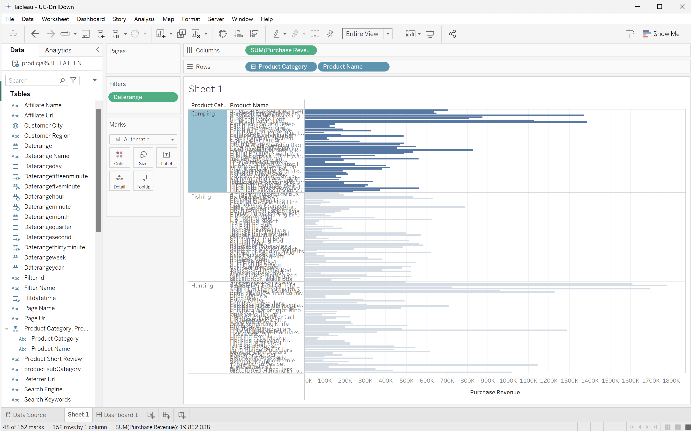

# Visualizzazioni


Desideri comprendere in che modo le visualizzazioni disponibili in Customer Journey Analytics possono essere create in modo simile utilizzando le visualizzazioni disponibili negli strumenti di business intelligence.

+++ Customer Journey Analytics

In Customer Journey Analytics sono disponibili diverse visualizzazioni. Consulta [Visualizzazioni](/help/analysis-workspace/visualizations/freeform-analysis-visualizations.md) per un&#39;introduzione e una panoramica di tutte le visualizzazioni possibili.

+++

+++ Strumenti BI

>[!BEGINTABS]

>[!TAB Desktop Power BI]

## Confronto

Per la maggior parte delle visualizzazioni di Customer Journey Analytics, Power BI Desktop offre esperienze equivalenti. Vedi la tabella seguente.

| Icona | Visualizzazione Customer Journey Analytics | Visualizzazione desktop di Power BI |
| :---: | --- | ---|
|  | [Superfici](/help/analysis-workspace/visualizations/area.md) | [Grafico ad area, grafico ad area sovrapposta e grafico ad area 100%](https://learn.microsoft.com/en-us/power-bi/visuals/power-bi-visualization-types-for-reports-and-q-and-a#area-charts-basic-layered-and-stacked) |
|  | [Barre](/help/analysis-workspace/visualizations/bar.md) | [Istogramma cluster](https://learn.microsoft.com/en-us/power-bi/visuals/power-bi-visualization-types-for-reports-and-q-and-a#bar-and-column-charts) |
|  | [Barre sovrapposte](/help/analysis-workspace/visualizations/bar.md) | [Istogramma in pila e istogramma in pila al 100%](https://learn.microsoft.com/en-us/power-bi/visuals/power-bi-visualization-types-for-reports-and-q-and-a#bar-and-column-charts) |
| </p> | [Bullet](/help/analysis-workspace/visualizations/bullet-graph.md) |  |
|  | [Tabella coorte](/help/analysis-workspace/visualizations/cohort-table/cohort-analysis.md) |  |
|  | [Combinato](/help/analysis-workspace/visualizations/combo-charts.md) | [Grafico a linee e istogramma in pila e Grafico a linee e istogramma in cluster](https://learn.microsoft.com/en-us/power-bi/visuals/power-bi-visualization-types-for-reports-and-q-and-a#combo-charts) |
|  | [Anello](/help/analysis-workspace/visualizations/donut.md) | [Grafico ad anello](https://learn.microsoft.com/en-us/power-bi/visuals/power-bi-visualization-types-for-reports-and-q-and-a#doughnut-charts) |
|  | [Fallout](/help/analysis-workspace/visualizations/fallout/fallout-flow.md) | [Funnel](https://learn.microsoft.com/en-us/power-bi/visuals/power-bi-visualization-types-for-reports-and-q-and-a#funnel-charts). |
|  | [Flusso](/help/analysis-workspace/visualizations/c-flow/flow.md) | Albero di scomposizione? |
| </p> | [Tabella a forma libera](/help/analysis-workspace/visualizations/freeform-table/freeform-table.md) | [Tabella](https://learn.microsoft.com/en-us/power-bi/visuals/power-bi-visualization-types-for-reports-and-q-and-a#tables) e [Matrice](https://learn.microsoft.com/en-us/power-bi/visuals/power-bi-visualization-types-for-reports-and-q-and-a#matrix) |
|  | [Istogramma](/help/analysis-workspace/visualizations/histogram.md) |  |
|  | [Barre orizzontali](/help/analysis-workspace/visualizations/horizontal-bar.md) | [Grafico a barre cluster](https://learn.microsoft.com/en-us/power-bi/visuals/power-bi-visualization-types-for-reports-and-q-and-a#bar-and-column-charts) |
|  | [Barra orizzontale sovrapposta](/help/analysis-workspace/visualizations/horizontal-bar.md) | [Grafico a barre in pila e Grafico a barre in pila 100%](https://learn.microsoft.com/en-us/power-bi/visuals/power-bi-visualization-types-for-reports-and-q-and-a#bar-and-column-charts) |
|  | [Area di lavoro percorso](/help/analysis-workspace/visualizations/journey-canvas/journey-canvas.md) | [Struttura di decomposizione](https://learn.microsoft.com/en-us/power-bi/visuals/power-bi-visualization-types-for-reports-and-q-and-a#decomposition-tree) |
|  | [Riepilogo delle metriche chiave](/help/analysis-workspace/visualizations/key-metric.md) |  |
|  | [Linee](/help/analysis-workspace/visualizations/line.md) | [Grafico a linee](https://learn.microsoft.com/en-us/power-bi/visuals/power-bi-visualization-types-for-reports-and-q-and-a#line-charts) |
|  | [A dispersione](/help/analysis-workspace/visualizations/scatterplot.md) | [Grafico a dispersione](https://learn.microsoft.com/en-us/power-bi/visuals/power-bi-visualization-types-for-reports-and-q-and-a#scatter) |
|  | [Intestazione sezione](/help/analysis-workspace/visualizations/section-header.md) | [Casella di testo](https://learn.microsoft.com/en-us/power-bi/paginated-reports/report-design/textbox/add-move-or-delete-a-text-box-report-builder-and-service) |
|  | [Variazione di riepilogo](/help/analysis-workspace/visualizations/summary-number-change.md) | [Scheda](https://learn.microsoft.com/en-us/power-bi/visuals/power-bi-visualization-types-for-reports-and-q-and-a#cards) |
| </p> | [Numero di riepilogo](/help/analysis-workspace/visualizations/summary-number-change.md) | [Scheda](https://learn.microsoft.com/en-us/power-bi/visuals/power-bi-visualization-types-for-reports-and-q-and-a#cards) |
|  | [Testo](/help/analysis-workspace/visualizations/text.md) | [Casella di testo](https://learn.microsoft.com/en-us/power-bi/paginated-reports/report-design/textbox/add-move-or-delete-a-text-box-report-builder-and-service) |
|  | [Mappa ad albero](/help/analysis-workspace/visualizations/treemap.md)<p> | [Mappa ad albero](https://learn.microsoft.com/en-us/power-bi/visuals/power-bi-visualization-types-for-reports-and-q-and-a#treemaps) |
|  | [Venn](/help/analysis-workspace/visualizations/venn.md) | |


## Drill-down

Power BI supporta la [modalità di drilling](https://learn.microsoft.com/en-us/power-bi/consumer/end-user-drill) per esplorare dettagli approfonditi su determinate visualizzazioni. Nell’esempio seguente, analizzi i ricavi di acquisto per categorie di prodotti. Dal menu di scelta rapida di una barra che rappresenta una categoria di prodotti, è possibile selezionare **[!UICONTROL Espandi]**.


Il drill-down aggiorna la visualizzazione con i ricavi di acquisto per i prodotti della categoria di prodotto selezionata.


Il drill-down genera la seguente query SQL che utilizza una clausola `WHERE`:

```sql
select "_"."product_category" as "c25",
    "_"."product_name" as "c26",
    "_"."a0" as "a0"
from 
(
    select "_"."product_category",
        "_"."product_name",
        "_"."a0"
    from 
    (
        select "_"."product_category",
            "_"."product_name",
            "_"."a0"
        from 
        (
            select "rows"."product_category" as "product_category",
                "rows"."product_name" as "product_name",
                sum("rows"."purchase_revenue") as "a0"
            from 
            (
                select "_"."product_category",
                    "_"."product_name",
                    "_"."purchase_revenue"
                from "public"."cc_data_view" "_"
                where ("_"."daterange" >= date '2023-01-01' and "_"."product_category" = 'Fishing') and "_"."daterange" < date '2024-01-01'
            ) "rows"
            group by "product_category",
                "product_name"
        ) "_"
        where not "_"."a0" is null
    ) "_"
) "_"
order by "_"."product_category",
        "_"."product_name"
limit 1001
```

>[!TAB Desktop Tableau]

## Confronto

Per la maggior parte delle visualizzazioni di Customer Journey Analytics, Tableau Desktop offre esperienze equivalenti. Vedi la tabella seguente.

| Icona | Visualizzazione Customer Journey Analytics | Visualizzazione desktop di Power BI |
| :---: | --- | ---|
|  | [Superfici](/help/analysis-workspace/visualizations/area.md) | [Grafico a superficie](https://help.tableau.com/current/pro/desktop/en-us/qs_area_charts.htm) |
|  | [Barre](/help/analysis-workspace/visualizations/bar.md) | [Grafico a barre](https://help.tableau.com/current/pro/desktop/en-us/buildexamples_bar.htm) |
|  | [Barre sovrapposte](/help/analysis-workspace/visualizations/bar.md) |  |
| </p> | [Bullet](/help/analysis-workspace/visualizations/bullet-graph.md) | [Grafico bullet](https://help.tableau.com/current/pro/desktop/en-us/qs_bullet_graphs.htm) |
|  | [Tabella coorte](/help/analysis-workspace/visualizations/cohort-table/cohort-analysis.md) |  |
|  | [Combinato](/help/analysis-workspace/visualizations/combo-charts.md) | [Grafici combinati](https://help.tableau.com/current/pro/desktop/en-us/qs_combo_charts.htm) |
|  | [Anello](/help/analysis-workspace/visualizations/donut.md) | |
|  | [Fallout](/help/analysis-workspace/visualizations/fallout/fallout-flow.md) | |
|  | [Flusso](/help/analysis-workspace/visualizations/c-flow/flow.md) |  |
| </p> | [Tabella a forma libera](/help/analysis-workspace/visualizations/freeform-table/freeform-table.md) | [Tabella testo](https://help.tableau.com/current/pro/desktop/en-us/buildexamples_text.htm) |
|  | [Istogramma](/help/analysis-workspace/visualizations/histogram.md) | [Istogramma](https://help.tableau.com/current/pro/desktop/en-us/buildexamples_histogram.htm) |
|  | [Barre orizzontali](/help/analysis-workspace/visualizations/horizontal-bar.md) | [Grafico a barre](https://help.tableau.com/current/pro/desktop/en-us/buildexamples_bar.htm) |
|  | [Barra orizzontale sovrapposta](/help/analysis-workspace/visualizations/horizontal-bar.md) | [Grafico a barre](https://help.tableau.com/current/pro/desktop/en-us/buildexamples_bar.htm) |
|  | [Area di lavoro percorso](/help/analysis-workspace/visualizations/journey-canvas/journey-canvas.md) | |
|  | [Riepilogo delle metriche chiave](/help/analysis-workspace/visualizations/key-metric.md) |  |
|  | [Linee](/help/analysis-workspace/visualizations/line.md) | [Grafico a linee](https://help.tableau.com/current/pro/desktop/en-us/buildexamples_line.htm) |
|  | [A dispersione](/help/analysis-workspace/visualizations/scatterplot.md) | [Scatter Plot (Dispersione)](https://help.tableau.com/current/pro/desktop/en-us/buildexamples_scatter.htm) |
|  | [Intestazione sezione](/help/analysis-workspace/visualizations/section-header.md) |  |
|  | [Variazione di riepilogo](/help/analysis-workspace/visualizations/summary-number-change.md) | |
| </p> | [Numero di riepilogo](/help/analysis-workspace/visualizations/summary-number-change.md) | |
|  | [Testo](/help/analysis-workspace/visualizations/text.md) | |
|  | [Mappa ad albero](/help/analysis-workspace/visualizations/treemap.md)<p> | [Mappa ad albero](https://help.tableau.com/current/pro/desktop/en-us/buildexamples_treemap.htm) |
|  | [Venn](/help/analysis-workspace/visualizations/venn.md) | |


## Drill-down

Tableau supporta la [modalità di drilling](https://learn.microsoft.com/en-us/power-bi/consumer/end-user-drill) attraverso [gerarchie](https://help.tableau.com/current/pro/desktop/en-us/qs_hierarchies.htm). Nell&#39;esempio seguente viene creata una gerarchia quando si seleziona il campo **[!UICONTROL Nome prodotto]** all&#39;interno di **[!UICONTROL Tabelle]** e lo si trascina sopra **[!UICONTROL Categoria prodotto]**. Quindi, dal menu di scelta rapida di una barra che rappresenta una categoria di prodotti, è possibile selezionare **[!UICONTROL + Drill down]**.


Il drill-down aggiorna la visualizzazione con i ricavi di acquisto per i prodotti della categoria di prodotto selezionata.


Il drill-down determina la seguente query SQL che utilizza una clausola GROUP BY:

```sql
SELECT CAST("cc_data_view"."product_category" AS TEXT) AS "product_category",
  CAST("cc_data_view"."product_name" AS TEXT) AS "product_name",
  SUM("cc_data_view"."purchase_revenue") AS "sum:purchase_revenue:ok"
FROM "public"."cc_data_view" "cc_data_view"
WHERE (("cc_data_view"."daterange" >= (TIMESTAMP '2023-01-01 00:00:00.000')) AND ("cc_data_view"."daterange" < (TIMESTAMP '2024-01-01 00:00:00.000')))
GROUP BY 1,
  2
```

La query **non** limita i risultati alla categoria di prodotto selezionata; solo la visualizzazione mostra la categoria di prodotto selezionata.



In alternativa, è possibile creare un dashboard di espansione in cui un elemento visivo è il risultato della selezione in un altro elemento visivo. Nell&#39;esempio seguente, la visualizzazione **[!UICONTROL Categorie prodotto]** viene utilizzata come filtro per aggiornare la tabella **[!UICONTROL Nomi prodotto]**. Questo filtro di visualizzazione è solo client e non genera una query SQL aggiuntiva.


>[!TAB Ricerca]

## Confronto

Per la maggior parte delle visualizzazioni di Customer Journey Analytics, Looker offre esperienze equivalenti. Vedi la tabella seguente.

| Icona | Visualizzazione Customer Journey Analytics | Visualizzazione desktop di Power BI |
| :---: | --- | ---|
|  | [Superfici](/help/analysis-workspace/visualizations/area.md) | [Grafico a superficie](https://cloud.google.com/looker/docs/area-options) |
|  | [Barre](/help/analysis-workspace/visualizations/bar.md) | [Grafico a barre](https://cloud.google.com/looker/docs/bar-options) |
|  | [Barre sovrapposte](/help/analysis-workspace/visualizations/bar.md) | [Grafico a barre](https://cloud.google.com/looker/docs/bar-options) |
| </p> | [Bullet](/help/analysis-workspace/visualizations/bullet-graph.md) | [Grafico bullet](https://cloud.google.com/looker/docs/bullet-chart) |
|  | [Tabella coorte](/help/analysis-workspace/visualizations/cohort-table/cohort-analysis.md) |  |
|  | [Combinato](/help/analysis-workspace/visualizations/combo-charts.md) | [Personalizzazione delle visualizzazioni](https://cloud.google.com/looker/docs/creating-visualizations#customizing_visualizations_with_chart_settings) |
|  | [Anello](/help/analysis-workspace/visualizations/donut.md) | [Anello](https://cloud.google.com/looker/docs/donut-multiples-options) |
|  | [Fallout](/help/analysis-workspace/visualizations/fallout/fallout-flow.md) | [Funnel](https://cloud.google.com/looker/docs/funnel-options) |
|  | [Flusso](/help/analysis-workspace/visualizations/c-flow/flow.md) | [Chiave santa](https://cloud.google.com/looker/docs/sankey) |
| </p> | [Tabella a forma libera](/help/analysis-workspace/visualizations/freeform-table/freeform-table.md) | [Tabella](https://cloud.google.com/looker/docs/table-options) |
|  | [Istogramma](/help/analysis-workspace/visualizations/histogram.md) | |
|  | [Barre orizzontali](/help/analysis-workspace/visualizations/horizontal-bar.md) | [Grafico a barre](https://cloud.google.com/looker/docs/bar-options) |
|  | [Barra orizzontale sovrapposta](/help/analysis-workspace/visualizations/horizontal-bar.md) | [Grafico a barre](https://cloud.google.com/looker/docs/bar-options) |
|  | [Area di lavoro percorso](/help/analysis-workspace/visualizations/journey-canvas/journey-canvas.md) |  |
|  | [Riepilogo delle metriche chiave](/help/analysis-workspace/visualizations/key-metric.md) |  |
|  | [Linee](/help/analysis-workspace/visualizations/line.md) | [Grafico a linee](https://cloud.google.com/looker/docs/line-options) |
|  | [A dispersione](/help/analysis-workspace/visualizations/scatterplot.md) | [Grafico a dispersione](https://cloud.google.com/looker/docs/scatter-options) |
|  | [Intestazione sezione](/help/analysis-workspace/visualizations/section-header.md) |  |
|  | [Variazione di riepilogo](/help/analysis-workspace/visualizations/summary-number-change.md) | [Valore singolo](https://cloud.google.com/looker/docs/single-value-options) |
| </p> | [Numero di riepilogo](/help/analysis-workspace/visualizations/summary-number-change.md) | [Valore singolo](https://cloud.google.com/looker/docs/single-value-options) |
|  | [Testo](/help/analysis-workspace/visualizations/text.md) | [Valore singolo](https://cloud.google.com/looker/docs/single-value-options) |
|  | [Mappa ad albero](/help/analysis-workspace/visualizations/treemap.md) | [Mappa ad albero](https://cloud.google.com/looker/docs/treemap) |
|  | [Diagramma di Venn](/help/analysis-workspace/visualizations/venn.md) | [Diagramma di Venn](https://cloud.google.com/looker/docs/venn) |

>[!TAB Blocco appunti Jupyter]

Il confronto delle funzionalità di visualizzazione di **matplotlib.pyplot**, l&#39;interfaccia basata sullo stato di matplotlib, va oltre lo scopo di questo articolo. Vedi gli esempi precedenti per l&#39;ispirazione e la documentazione [matplotlib.pyplot](https://matplotlib.org/3.5.3/api/_as_gen/matplotlib.pyplot.html).


>[!TAB StudioRS]

Confrontare le funzionalità di visualizzazione di **ggplot2**, il pacchetto di visualizzazione dei dati in R, va oltre lo scopo di questo articolo. Vedi gli esempi precedenti per l&#39;ispirazione e la documentazione [ggplot2](https://ggplot2.tidyverse.org/articles/ggplot2.html).

>[!ENDTABS]

