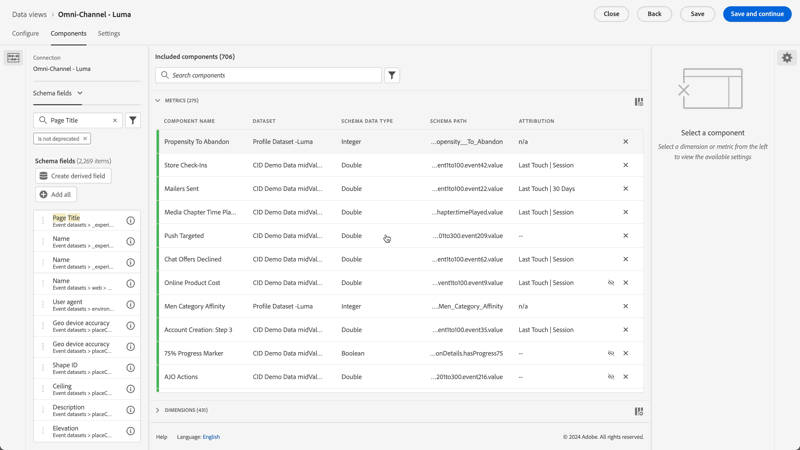
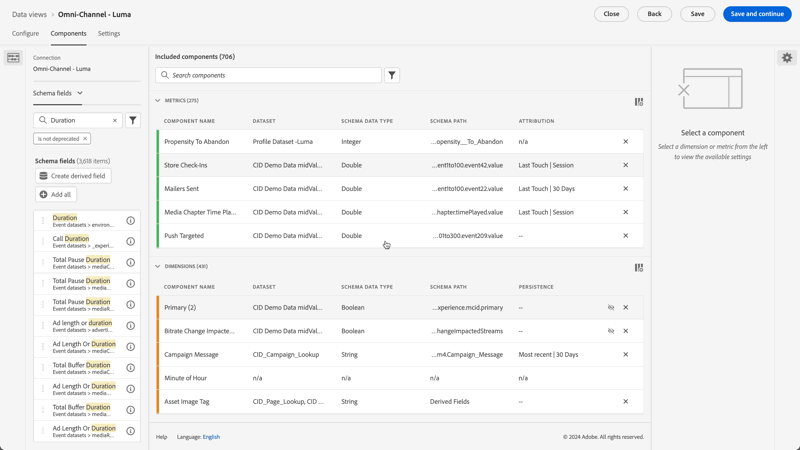
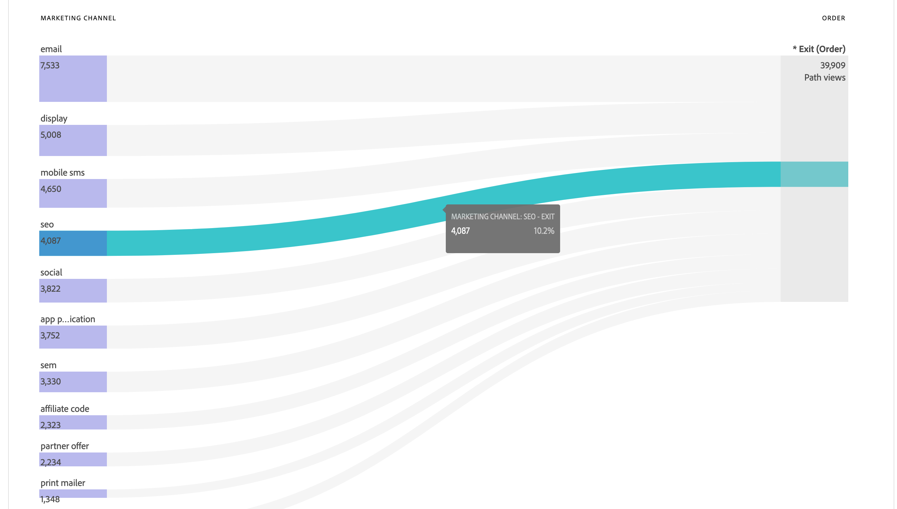
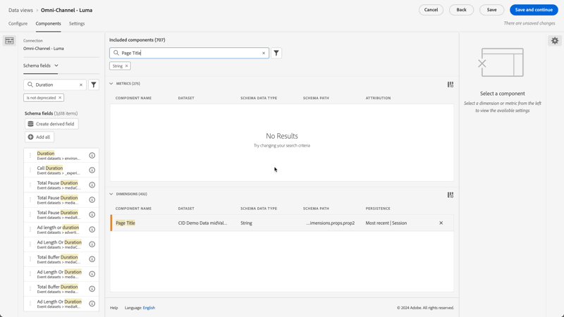
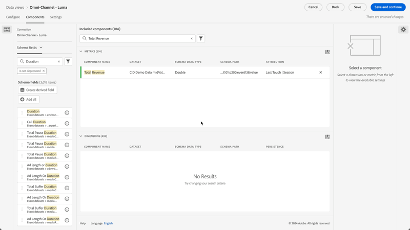

# Casi d’uso per le visualizzazioni dati

Questi casi d’uso illustrano la flessibilità e la potenza delle visualizzazioni dati in Customer Journey Analytics.

## Utilizzare le metriche delle dimensioni di binding

Per ulteriori dettagli, vedere il caso d&#39;uso [Use Dimensions Metrics](binding-dimensions-metrics.md).

## Utilizzare i dati di riepilogo

Per ulteriori dettagli, vedi il caso d&#39;uso [Dati di riepilogo](summary-data.md).

## Casi d’uso dell’estensione BI

Consulta i [casi d&#39;uso dell&#39;estensione BI](bi-extension-usecases.md) su come eseguire una serie di casi d&#39;uso utilizzando l&#39;estensione Customer Journey Analytics BI.

## Creare una metrica da un campo schema di tipo stringa {#string}

Ad esempio, quando crei una visualizzazione dati, puoi creare una metrica [!UICONTROL Ordini] da un campo schema [!UICONTROL Titolo pagina] che è una stringa.

1. Nella scheda **[!UICONTROL Componenti]**, trascina **[!UICONTROL Titolo pagina]** nella sezione **[!UICONTROL Metriche]** in [!UICONTROL Componenti inclusi].
1. Evidenzia la metrica appena trascinata e rinominala in `Orders` nelle **[!UICONTROL Impostazioni componente]** in
1. Apri la sezione **[!UICONTROL Includi/Escludi valori]** e specifica quanto segue:
   1. Abilita **[!UICONTROL Imposta valori di inclusione/esclusione]**.
   1. Seleziona **[!UICONTROL Se tutti i criteri sono soddisfatti]** da **[!UICONTROL Corrispondenza]**.
   1. Specifica `confirmation`. Il testo per il **[!UICONTROL titolo_pagina]** indica che la pagina è correlata all&#39;inserimento di un ordine. Dopo aver esaminato tutti i titoli delle pagine che rispondono a tali criteri, verrà conteggiato `1` per ogni istanza. Il risultato è una nuova metrica (non una metrica calcolata). Una metrica con valori inclusi/esclusi può essere utilizzata ovunque sia possibile utilizzare qualsiasi altra metrica. Queste metriche funzionano con l’attribuzione, i segmenti e ovunque sia possibile utilizzare le metriche standard.

   {width=100%}
1. Puoi inoltre specificare un modello di attribuzione per questa metrica, ad esempio [!UICONTROL Ultimo contatto], con un [!UICONTROL intervallo di lookback] di [!UICONTROL Sessione].
Puoi anche creare un&#39;altra metrica [!UICONTROL Ordini] dallo stesso campo e specificare un modello di attribuzione diverso. Ad esempio [!UICONTROL Primo contatto] e un altro [!UICONTROL intervallo di lookback], ad esempio [!UICONTROL 30 giorni].

Un altro esempio potrebbe essere quello di utilizzare l’ID persona, una dimensione, come metrica per determinare quanti ID persona ha la tua azienda.

## Usa numeri interi come dimensioni {#integers}

In precedenza, i numeri interi venivano trattati automaticamente come metriche in Customer Journey Analytics. Ora i valori numerici (compresi gli eventi personalizzati da Adobe Analytics) possono essere trattati come dimensioni. Ecco un esempio:

1. Trascina il numero intero **[!UICONTROL Durata]** nella sezione **[!UICONTROL Dimensioni]** in [!UICONTROL Componenti inclusi]:
1. Ora puoi aggiungere **[!UICONTROL Bucket di valori]** per presentare questa dimensione sotto forma di bucket nei rapporti. Senza bucket, ogni istanza di questa dimensione apparirebbe come una voce di riga nei rapporti di Workspace.
   {width=100%}

## Utilizzare dimensioni numeriche come metriche nei diagrammi di flusso {#numeric}

È possibile utilizzare una dimensione numerica per inserire le metriche nella visualizzazione [!UICONTROL  Flusso].

1. Nella scheda Visualizzazioni dati [Componenti](https://experienceleague.adobe.com/en/docs/analytics-platform/using/cja-dataviews/create-dataview), trascina il campo schema [!UICONTROL Canali di marketing] nell&#39;area [!UICONTROL Metriche] in [!UICONTROL Componenti inclusi].
2. Nel reporting di Workspace, questo flusso mostra [!UICONTROL Canali marketing] che fluiscono in [!UICONTROL Ordini]:

## Applicare filtri agli eventi secondari {#sub-event}

Questa funzionalità è specifica per i campi basati su array. La funzionalità di inclusione/esclusione consente di filtrare a livello di evento secondario, mentre i segmenti generati nel Generatore di segmenti forniscono solo segmentazione a livello di evento. Puoi filtrare gli eventi secondari utilizzando inclusione/esclusione nelle visualizzazioni dati e quindi fare riferimento a tale nuova metrica/dimensione in un segmento a livello di evento.

Ad esempio, utilizza la funzionalità di inclusione/esclusione nelle visualizzazioni dati per concentrarti solo sui prodotti che hanno generato vendite superiori a 50 $. Pertanto, se un ordine include un acquisto di prodotti da 50 $ e un acquisto di prodotti da 25 $, la funzionalità di inclusione/esclusione rimuove l’acquisto di prodotti da 25 $ e non l’intero ordine.

1. Nella scheda Visualizzazioni dati [Componenti](https://experienceleague.adobe.com/en/docs/analytics-platform/using/cja-dataviews/create-dataview), trascina il campo dello schema **[!UICONTROL Ricavi]** nell&#39;area **[!UICONTROL Metriche]** in [!UICONTROL Componenti inclusi].
1. Seleziona la metrica e configura quanto segue a destra:
a. In **[!UICONTROL Formato]**, selezionare **[!UICONTROL Valuta]**.
b. In **[!UICONTROL Valuta]**, selezionare **[!UICONTROL USD]**.
c. In **[!UICONTROL Includi/Escludi valori]**, selezionare la casella di controllo accanto a **[!UICONTROL Imposta valori di inclusione/esclusione]**.
d. In **[!UICONTROL Corrispondenza]**, selezionare **[!UICONTROL Se tutti i criteri sono soddisfatti]**.
e. In **[!UICONTROL Criteri]**, selezionare **[!UICONTROL è maggiore di o uguale a]**.
f. Specificare `50` come valore.

Con queste nuove impostazioni verranno visualizzati solo i ricavi di alto valore, escludendo tutto ciò che è inferiore a 50 dollari.

## Utilizza l&#39;impostazione [!UICONTROL Nessuna opzione valore] {#no-value}

La tua azienda potrebbe aver dedicato del tempo a insegnare agli utenti ad aspettarsi &quot;Non specificato&quot; per le dimensioni nei rapporti. Il valore predefinito per le dimensioni nelle visualizzazioni dati è *Nessun valore*. Tuttavia, puoi specificare per ogni dimensione come deve essere segnalato Nessun valore. Vedere le opzioni **[!UICONTROL Nessun valore]** per un componente dimensione.

{width=100%}

## Creare più metriche con impostazioni di attribuzione diverse {#attribution}

Utilizzando la funzionalità **[!UICONTROL Duplica]** in alto a destra, puoi creare diverse metriche Ricavi totali con impostazioni di attribuzione diverse, ad esempio **[!UICONTROL Primo contatto]**, **[!UICONTROL Ultimo contatto]** e **[!UICONTROL Algoritmica]**.

Non dimenticare di rinominare ogni metrica per riflettere le differenze, ad esempio `Total Revenue (Algorithmic)`

{width=100%}

Per informazioni sulle altre impostazioni di visualizzazione dati, vedi [Creare le visualizzazioni dati](/help/data-views/create-dataview.md).
Per una panoramica concettuale delle visualizzazioni dati, vedi [Panoramica delle visualizzazioni dati](/help/data-views/data-views.md).

## Rapporti sulla nuova sessione e sulla sessione di ritorno {#new-repeat}

Puoi determinare se una sessione è effettivamente la prima sessione in assoluto per un utente o una sessione di ritorno. In base all’intervallo di reporting definito per questa visualizzazione dati e a un intervallo di lookback di 13 mesi. Questo reporting consente di determinare, ad esempio:

* Quale percentuale degli ordini proviene da nuove sessioni o da sessioni di ritorno?

* Il targeting di un canale di marketing o di una campagna interessa nuovi utenti o di ritorno? In che modo questa scelta influisce sui tassi di conversione?

Una dimensione e due metriche facilitano questo reporting:

* [Tipo di sessione](https://experienceleague.adobe.com/en/docs/analytics-platform/using/cja-dataviews/component-reference) - Questa dimensione ha due valori: [!UICONTROL Nuovo] e [!UICONTROL Restituzione]. L&#39;elemento di riga [!UICONTROL New] include tutti i comportamenti (ovvero le metriche rispetto a questa dimensione) di una sessione che è stata determinata come prima sessione definita da una persona. Tutto il resto è incluso nella riga [!UICONTROL Restituzione] (supponendo che tutto appartenga a una sessione). Se le metriche non fanno parte di alcuna sessione, rientrano nel bucket “Non applicabile” per questa dimensione.

* [Prime sessioni](https://experienceleague.adobe.com/en/docs/analytics-platform/using/cja-dataviews/component-reference). La metrica Prime sessioni è definita come prima sessione definita da una persona all’interno dell’intervallo di reporting.

* [Sessioni di ritorno](https://experienceleague.adobe.com/en/docs/analytics-platform/using/cja-dataviews/component-reference) La metrica Sessioni di ritorno è il numero di sessioni che non sono state le prime sessioni di un utente.—>

Per accedere ai componenti:

1. Passa all’editor della visualizzazione dati.
1. Seleziona la scheda **[!UICONTROL Componenti]**, quindi seleziona **[!UICONTROL Componenti standard]** dalla barra a sinistra.
1. Trascina i componenti **[!UICONTROL Tipo di sessione]**, **[!UICONTROL Sessioni nuove]** e **[!UICONTROL Sessioni di ritorno]** nella visualizzazione dati.

Le nuove sessioni vengono riportate accuratamente quasi sempre. Le uniche eccezioni sono:

* Quando si è verificata una prima sessione prima dell’intervallo di lookback di 13 mesi.  Questa sessione è stata ignorata.
* Quando una sessione si estende sia nell’intervallo di lookback che nell’intervallo di reporting. Ad esempio, esegui un rapporto dal 1° giugno 2022 al 15 giugno 2022. L’intervallo di lookback si estenderebbe dal 1° maggio 2021 al 31 maggio 2022. Se una sessione inizia il 30 maggio 2022 e termina il 1° giugno 2022, viene inclusa nell’intervallo di lookback. E tutte le sessioni nell’intervallo di reporting sono conteggiate come sessioni di ritorno.

## Utilizzare le funzionalità data e data-ora {#date}

Gli schemi in Adobe Experience Platform contengono i campi [!UICONTROL Date] e [!UICONTROL Date-Time]. Le visualizzazioni dati di Customer Journey Analytics ora supportano questi campi. Quando trascini questi campi in una visualizzazione dati come dimensione, puoi specificarne il [formato](/help/data-views/component-settings/format.md). Questa impostazione di formato determina il modo in cui verranno visualizzati i campi nei rapporti. Esempio:

* Per il formato Data, se selezioni **[!UICONTROL Giorno]** con il formato **[!UICONTROL Mese, Giorno, Anno]**, un output di esempio nel reporting potrebbe essere simile al seguente: 23 agosto 2022.

* Per il formato data-ora, se selezioni **[!UICONTROL Minuto del giorno]** con il formato **[!UICONTROL Ora:Minute]**, l&#39;output potrebbe essere simile al seguente: 20:20.

Sono supportate le date successive al 1° gennaio 1900 (con la singola eccezione del 1° gennaio 1970) e i valori data-ora successivi al 1° gennaio 2000 00:00:00.

### Casi d’uso per data e ora

* Data: una società di viaggi raccoglie la data di partenza per i viaggi come campo di dati. La società desidera generare un rapporto che confronta il [!UICONTROL giorno della settimana] per tutte le date di partenza raccolte, in modo da capire quale sia più popolare. E la società vorrebbe fare lo stesso per il [!UICONTROL mese dell&#39;anno].

* Data e ora: una società di vendita al dettaglio raccoglie l’ora per ciascuno dei suoi acquisti in-store POS (Point-of-Sale). In un dato mese, l&#39;azienda desidera comprendere i periodi di acquisto più impegnativi entro [!UICONTROL Ora del giorno].

>[!MORELIKETHIS]
>
>[Data e data-ora nell&#39;impostazione del componente Formato](/help/data-views/component-settings/format.md)
>

