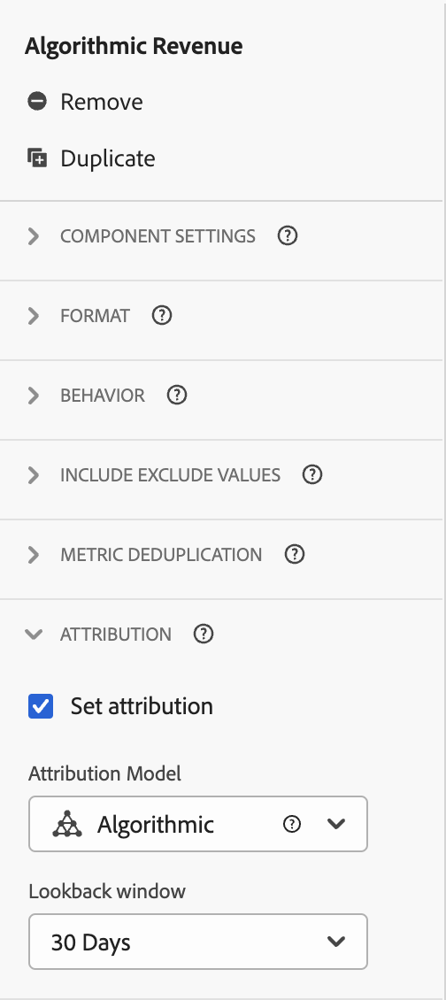

# Casi d’uso per le visualizzazioni dati

Questi casi d’uso mostrano la flessibilità e la potenza delle visualizzazioni dati in Customer Journey Analytics.

## 1. Creare una metrica da un campo schema di tipo stringa {#string}

Ad esempio, quando crei una visualizzazione dati, puoi creare una metrica [!UICONTROL Orders] da una campo schema [!UICONTROL pageTitle] di tipo stringa. Ecco come si fa:

1. Nella scheda Components (Componenti), trascina [!UICONTROL pageTitle] nella sezione [!UICONTROL Metrics] in [!UICONTROL Included Components].
   
1. Evidenzia la metrica appena trascinata e rinominala in [!UICONTROL Component Settings], a destra:
   
1. Apri la finestra di dialogo [!UICONTROL Include/Exclude Values] a destra e specifica quanto segue:
   

   Il termine “confirmation” (conferma) indica che si tratta di un ordine. Dopo aver esaminato tutti i titoli delle pagine che rispondono a tali criteri, viene conteggiato “1” per ogni istanza. Il risultato è una nuova metrica (non una metrica calcolata). Una metrica con valori inclusi o esclusi può essere utilizzata ovunque sia possibile utilizzare qualsiasi altra metrica. Funziona con Attribution IQ, con i filtri e ovunque sia possibile utilizzare le metriche standard.
1. Puoi anche specificare un modello di attribuzione per questa metrica, ad esempio [!UICONTROL Last Touch], con [!UICONTROL Lookback window] impostato su [!UICONTROL Session].
Inoltre, puoi crearne un’altra metrica [!UICONTROL Orders] dallo stesso campo e specificare un altro modello di attribuzione (ad esempio [!UICONTROL First Touch]) e un altro valore di [!UICONTROL Lookback window] (ad esempio [!UICONTROL 30 days]).

Oppure, potresti voler utilizzare l’ID visitatore, una dimensione, come metrica per determinare quanti ID visitatore ha la tua azienda.

## 2. Utilizzare numeri interi come dimensioni {#integers}

In precedenza, i numeri interi venivano trattati automaticamente come metriche nel Customer Journey Analytics. Ora i valori numerici (compresi gli eventi personalizzati da Adobe Analytics) possono essere trattati come dimensioni. Ecco un esempio:

1. Trascina il numero intero [!UICONTROL call_length_min] nella sezione [!UICONTROL Dimensions] in [!UICONTROL Included Components]:

   

1. Ora puoi aggiungere [!UICONTROL Value Bucketing] per presentare questa dimensione sotto forma di bucket nei rapporti. (Senza bucket, ogni istanza della dimensione si presenta come una voce distinta nei rapporti di Workspace.)

   

## 3. Utilizzare le dimensioni numeriche come “metriche” nei diagrammi di flusso {#numeric}

Puoi utilizzare una dimensione numerica per inserire “metriche” nella visualizzazione [!UICONTROL  Flow].

1. Nella scheda [Components](https://experienceleague.adobe.com/docs/analytics-platform/using/cja-dataviews/create-dataview.html?lang=it#configure-component-settings) (Componenti) delle visualizzazioni dati, trascina il campo schema [!UICONTROL Marketing Channels] nell’area [!UICONTROL Metrics] in [!UICONTROL Included components].
2. Nei rapporti di Workspace, questo flusso mostra come [!UICONTROL Marketing Channels] scorre in [!UICONTROL Orders]:

## 4. Applicare filtri agli eventi secondari {#sub-event}

Questa funzionalità è specifica per i campi basati su array. La funzionalità di inclusione/esclusione consente di filtrare a livello di evento secondario; i filtri (segmenti) generati nel generatore di filtri consentono invece di filtrare solo a livello di evento. Pertanto, puoi filtrare gli eventi secondari mediante inclusione/esclusione nelle visualizzazioni dati, e quindi fare riferimento a tale nuova metrica o dimensione in un filtro a livello di evento.

Ad esempio, utilizza la funzionalità di inclusione/esclusione nelle visualizzazioni dati per concentrarti solo sui prodotti che hanno generato vendite per più di 50 dollari. Se un ordine include l’acquisto di un prodotto da 50 dollari e un prodotto da 25 dollari, non verrà rimosso l’intero ordine ma solo l’acquisto del prodotto da 25 dollari.

1. Nella scheda [Components](https://experienceleague.adobe.com/docs/analytics-platform/using/cja-dataviews/create-dataview.html?lang=it#configure-component-settings) (Componenti) delle visualizzazioni dati, trascina il campo schema [!UICONTROL Revenue] nell’area [!UICONTROL Metrics] in [!UICONTROL Included components].
1. Seleziona la metrica e configura quanto segue a destra:
a. Per [!UICONTROL Format], seleziona [!UICONTROL Currency].
b. Per [!UICONTROL Currency], seleziona USD.
c. Per [!UICONTROL Include/Exclude Values], seleziona la casella di controllo accanto a [!UICONTROL Set include/exclude values].
d. Per [!UICONTROL Match], seleziona [!UICONTROL If all criteria are met].
e. Per [!UICONTROL Criteria], seleziona [!UICONTROL is greater than or equal].
f. Specifica il valore “50”.

Con queste nuove impostazioni verranno visualizzati solo i ricavi di alto valore, escludendo tutto ciò che è inferiore a 50 dollari.

## 5. Utilizzare l’impostazione [!UICONTROL No Value Options] {#no-value}

La tua azienda può aver dedicato del tempo a insegnare agli utenti ad aspettarsi “Unspecified” (Non specificato) nei rapporti. Il valore predefinito nelle visualizzazioni dati è “No Value” (Nessun valore). Ora nell’interfaccia utente delle visualizzazioni dati puoi [cambiare “No Value” in “Unspecified”](https://experienceleague.adobe.com/docs/analytics-platform/using/cja-dataviews/create-dataview.html?lang=it#configure-no-value-options-settings). 

Oppure, nel caso della dimensione per la registrazione a un programma di iscrizione, puoi cambiare “No Value” in “Non registrato al programma di iscrizione”.

## 6. Creare più metriche con impostazioni [!UICONTROL Attribution] diverse {#attribution}

Con la funzione [!UICONTROL Duplicate] in alto a destra, crea alcune metriche Ricavi con impostazioni di attribuzione diverse, come [!UICONTROL First Touch], [!UICONTROL Last Touch] e [!UICONTROL Algorithmic].

Non dimenticare di rinominare ogni metrica in base alle differenze, ad esempio “Ricavi algoritmici”:

Per informazioni sulle altre impostazioni di visualizzazione dati, vedi [Creare le visualizzazioni dati](/help/data-views/create-dataview.md).
Per una panoramica concettuale delle visualizzazioni dati, vedi [Panoramica delle visualizzazioni dati](/help/data-views/data-views.md).

## 7. Nuova sessione e reporting sulle sessioni di ritorno {#new-repeat}

Puoi determinare se una sessione è effettivamente la prima sessione in assoluto per un utente o una sessione di ritorno, in base all’intervallo di reporting definito per questa visualizzazione dati e a un intervallo di lookback di 13 mesi. Questo reporting consente di determinare, ad esempio:

* Quale percentuale degli ordini proviene da sessioni nuove o da sessioni di ritorno?

* Il targeting di un canale di marketing o di una campagna interessa nuovi utenti o di ritorno? In che modo questa scelta influisce sui tassi di conversione?

Una dimensione e due metriche facilitano questo reporting:

* [Tipo di sessione](https://experienceleague.adobe.com/docs/analytics-platform/using/cja-dataviews/component-reference.html#optional): questa dimensione ha due valori: 1) [!UICONTROL New] e 2) [!UICONTROL Returning]. L’elemento riga [!UICONTROL New] include tutti i comportamenti (ovvero le metriche rispetto a questa dimensione) di una sessione che è stata determinata come prima sessione definita da una persona. Tutto il resto è incluso nell’elemento riga [!UICONTROL Returning] (supponendo che tutto appartenga a una sessione). Se le metriche non fanno parte di alcuna sessione, rientrano nel bucket “Non applicabile” per questa dimensione.

* [Prime sessioni](https://experienceleague.adobe.com/docs/analytics-platform/using/cja-dataviews/component-reference.html#optional). La metrica Prime sessioni è definita come prima sessione definita da una persona all’interno dell’intervallo di reporting.

* [Sessioni di ritorno](https://experienceleague.adobe.com/docs/analytics-platform/using/cja-dataviews/component-reference.html#optional) La metrica Sessioni di ritorno è il numero di sessioni che non sono state le prime sessioni di un utente—>

Per accedere a questi componenti:

1. Passa all’editor della visualizzazione dati.
1. Fai clic sul pulsante **[!UICONTROL Components]** > **[!UICONTROL Optional Standard components]** nella barra a sinistra.
1. Trascina questi componenti nella vista dati.

Il 95%-99% del tempo, le nuove sessioni saranno segnalate con precisione. Le uniche eccezioni sono:

* Quando si è verificata una prima sessione prima dell’intervallo di lookback di 13 mesi. Questa sessione verrà ignorata.

* Quando una sessione si estende sia nell’intervallo di lookback che nell’intervallo di reporting. Supponiamo che tu esegua un rapporto dal 1° giugno al 15 giugno 2022. L’intervallo di lookback includerebbe il periodo dal 1° maggio 2021 al 31 maggio 2022. Se una sessione dovesse iniziare il 30 maggio 2022 e terminare il 1° giugno 2022, poiché la sessione è inclusa nell’intervallo di lookback, tutte le sessioni nell’intervallo di reporting vengono conteggiate come sessioni di ritorno.

## 8. Utilizzare le funzionalità data e data-ora {#date}

Gli schemi in Adobe Experience Platform contengono campi [!UICONTROL Date] e [!UICONTROL Date-Time]. Le visualizzazioni dati di Customer Journey Analytics ora supportano questi campi. Quando trascini questi campi in una visualizzazione dati come dimensione, puoi specificarne il [formato](/help/data-views/component-settings/format.md). Questa impostazione di formato determina il modo in cui verranno visualizzati i campi nei rapporti. Esempio:

* Per il formato Data, se selezioni **[!UICONTROL Day]** con il formato **[!UICONTROL Month, Day, Year]**, l’output in un rapporto potrebbe presentarsi simile al seguente: Agosto 23, 2022.

* Per il formato data-ora, se selezioni **[!UICONTROL Minute of Day]** con il formato **[!UICONTROL Hour:Minute]**, l’output potrebbe essere simile al seguente: 20:20.

Attualmente sono supportate le date successive al 1° gennaio 1900 (con l’eccezione unica del 1° gennaio 1970) e i valori data-ora successivi al 1° gennaio 2000 00:00:00.

### Casi d’uso per data e ora

* Data: un’agenzia turistica raccoglie la data di partenza per i viaggi come campo di dati. Vorrebbe generare un rapporto in cui [!UICONTROL Day of Week] venga confrontato per tutte le date di partenza raccolte, per capire quale sia più popolare. Vorrebbe fare lo stesso per [!UICONTROL Month of Year].

* Data e ora: una società di vendita al dettaglio raccoglie l’ora di ogni acquisto dei propri punti vendita (POS) in-store. Vorrebbe capire quali sono i momenti in cui avvengono più acquisti in un determinato mese, per [!UICONTROL Hour of Day].

>[!MORELIKETHIS]
>[Data e data-ora nell’impostazione del componente Formato](/help/data-views/component-settings/format.md)

