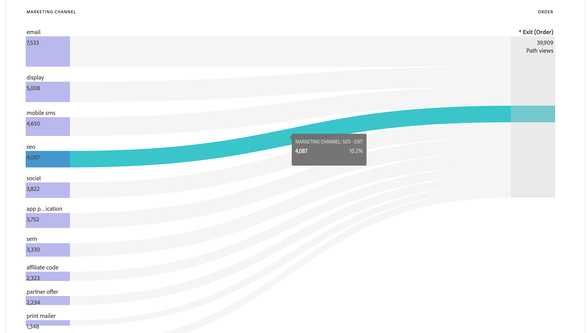

# Casi d’uso per le visualizzazioni dati

Questi casi d’uso illustrano la flessibilità e la potenza delle visualizzazioni dati nel Customer Journey Analytics.

## Utilizzare le metriche delle dimensioni di binding

Per ulteriori dettagli, vedere il caso d&#39;uso [Use Dimensions Metrics](binding-dimensions-metrics.md).

## Utilizzare i dati di riepilogo

Per ulteriori dettagli, vedi il caso d&#39;uso [Dati di riepilogo](summary-data.md).

## Creare una metrica da un campo schema di tipo stringa {#string}

Ad esempio, durante la creazione di una visualizzazione dati, è possibile creare una metrica [!UICONTROL Orders] da un campo schema [!UICONTROL Page Title] che è una stringa.

1. Nella scheda **[!UICONTROL Components]** trascinare **[!UICONTROL Page Title]** nella sezione **[!UICONTROL Metrics]** in [!UICONTROL Included components].
1. Evidenzia la metrica appena trascinata e rinominala in `Orders` in **[!UICONTROL Component Settings]** in
1. Apri la sezione **[!UICONTROL Include/Exclude Values]** e specifica quanto segue:
   1. Abilita **[!UICONTROL Set include exclude values]**.
   1. Selezionare **[!UICONTROL If all criteria are met]** da **[!UICONTROL Match]**.
   1. Specificare `confirmation`. Questo testo per page_title indica che la pagina è correlata al posizionamento di un ordine. Dopo aver esaminato tutti i titoli delle pagine che rispondono a tali criteri, verrà conteggiato `1` per ogni istanza. Il risultato è una nuova metrica (non una metrica calcolata). Una metrica con valori inclusi o esclusi può essere utilizzata ovunque sia possibile utilizzare qualsiasi altra metrica. Funziona con Attribution IQ, con i filtri e ovunque sia possibile utilizzare le metriche standard.

   {width=100%}
1. Puoi anche specificare un modello di attribuzione per questa metrica, ad esempio [!UICONTROL Last Touch], con [!UICONTROL Lookback window] impostato su [!UICONTROL Session].
È inoltre possibile creare un&#39;altra metrica [!UICONTROL Orders] dallo stesso campo e specificare un modello di attribuzione diverso. Ad esempio [!UICONTROL First Touch] e un [!UICONTROL Lookback window] diverso, ad esempio [!UICONTROL 30 days].

Un altro esempio potrebbe essere quello di utilizzare l’ID persona, una dimensione, come metrica per determinare quanti ID persona ha la tua azienda.

## Usa numeri interi come dimensioni {#integers}

In precedenza, i numeri interi venivano trattati automaticamente come metriche nel Customer Journey Analytics. Ora i valori numerici (compresi gli eventi personalizzati da Adobe Analytics) possono essere trattati come dimensioni. Ecco un esempio:

1. Trascina il numero intero **[!UICONTROL Duration]** nella sezione **[!UICONTROL Dimensions]** in [!UICONTROL Included Components]:
1. Ora puoi aggiungere **[!UICONTROL Value Bucketing]** per presentare questa dimensione sotto forma di bucket nei rapporti. Senza bucket, ogni istanza di questa dimensione apparirebbe come una voce di riga nei rapporti di Workspace.
   {width=100%}

## Utilizzare dimensioni numeriche come metriche nei diagrammi di flusso {#numeric}

È possibile utilizzare una dimensione numerica per inserire metriche nella visualizzazione [!UICONTROL  Flow].

1. Nella scheda [Components](https://experienceleague.adobe.com/en/docs/analytics-platform/using/cja-dataviews/create-dataview) (Componenti) delle visualizzazioni dati, trascina il campo schema [!UICONTROL Marketing Channels] nell’area [!UICONTROL Metrics] in [!UICONTROL Included components].
2. Nei rapporti di Workspace, questo flusso mostra come [!UICONTROL Marketing Channels] scorre in [!UICONTROL Orders]:

## Applicare filtri agli eventi secondari {#sub-event}

Questa funzionalità è specifica per i campi basati su array. La funzionalità di inclusione/esclusione consente di filtrare a livello di evento secondario, mentre i filtri (segmenti) generati nel generatore di filtri consentono di filtrare solo a livello di evento. Pertanto, puoi filtrare gli eventi secondari utilizzando inclusione/esclusione nelle visualizzazioni dati, e quindi fare riferimento a tale nuova metrica/dimensione in un filtro a livello di evento.

Ad esempio, utilizza la funzionalità di inclusione/esclusione nelle visualizzazioni dati per concentrarti solo sui prodotti che hanno generato vendite superiori a 50 $. Pertanto, se un ordine include un acquisto di prodotti da 50 $ e un acquisto di prodotti da 25 $, la funzionalità di inclusione/esclusione rimuove l’acquisto di prodotti da 25 $ e non l’intero ordine.

1. Nella scheda [Components](https://experienceleague.adobe.com/en/docs/analytics-platform/using/cja-dataviews/create-dataview) (Componenti) delle visualizzazioni dati, trascina il campo schema **[!UICONTROL Revenue]** nell’area **[!UICONTROL Metrics]** in [!UICONTROL Included components].
1. Seleziona la metrica e configura quanto segue a destra:
a. Per **[!UICONTROL Format]**, seleziona **[!UICONTROL Currency]**.
b. In **[!UICONTROL Currency]**, selezionare **[!UICONTROL USD]**.
c. Per **[!UICONTROL Include/Exclude Values]**, seleziona la casella di controllo accanto a **[!UICONTROL Set include/exclude values]**.
d. Per **[!UICONTROL Match]**, seleziona **[!UICONTROL If all criteria are met]**.
e. Per **[!UICONTROL Criteria]**, seleziona **[!UICONTROL is greater than or equal]**.
f. Specificare `50` come valore.

Con queste nuove impostazioni verranno visualizzati solo i ricavi di alto valore, escludendo tutto ciò che è inferiore a 50 dollari.

## Usa l&#39;impostazione [!UICONTROL No value options] {#no-value}

La tua azienda potrebbe aver dedicato del tempo a insegnare agli utenti ad aspettarsi &quot;Non specificato&quot; per le dimensioni nei rapporti. Il valore predefinito per le dimensioni nelle Visualizzazioni dati è &quot;No value&quot; (Nessun valore). Tuttavia, puoi specificare per ogni dimensione come deve essere segnalato Nessun valore. Consulta le opzioni Nessun valore per un componente dimensione.

{width=100%}

## Creare più metriche con impostazioni di attribuzione diverse {#attribution}

Con la funzione **[!UICONTROL Duplicate]** in alto a destra, puoi creare diverse metriche Ricavi totali con impostazioni di attribuzione diverse, come **[!UICONTROL First Touch]**, **[!UICONTROL Last Touch]** e **[!UICONTROL Algorithmic]**.

Non dimenticare di rinominare ogni metrica per riflettere le differenze, ad esempio `Total Revenue (Algorithmic)`

{width=100%}

Per informazioni sulle altre impostazioni di visualizzazione dati, vedi [Creare le visualizzazioni dati](/help/data-views/create-dataview.md).
Per una panoramica concettuale delle visualizzazioni dati, vedi [Panoramica delle visualizzazioni dati](/help/data-views/data-views.md).

## Rapporti sulla nuova sessione e sulla sessione di ritorno {#new-repeat}

Puoi determinare se una sessione è effettivamente la prima sessione in assoluto per un utente o una sessione di ritorno. In base all’intervallo di reporting definito per questa visualizzazione dati e a un intervallo di lookback di 13 mesi. Questo reporting consente di determinare, ad esempio:

* Quale percentuale degli ordini proviene da sessioni nuove o da sessioni di ritorno?

* Il targeting di un canale di marketing o di una campagna interessa nuovi utenti o di ritorno? In che modo questa scelta influisce sui tassi di conversione?

Una dimensione e due metriche facilitano questo reporting:

* [Tipo di sessione](https://experienceleague.adobe.com/en/docs/analytics-platform/using/cja-dataviews/component-reference) - Questa dimensione ha due valori: [!UICONTROL New] e [!UICONTROL Returning]. L&#39;elemento riga [!UICONTROL New] include tutti i comportamenti (ovvero le metriche rispetto a questa dimensione) di una sessione che è stata determinata come prima sessione definita da una persona. Tutto il resto è incluso nell’elemento riga [!UICONTROL Returning] (supponendo che tutto appartenga a una sessione). Se le metriche non fanno parte di alcuna sessione, rientrano nel bucket “Non applicabile” per questa dimensione.

* [Prime sessioni](https://experienceleague.adobe.com/en/docs/analytics-platform/using/cja-dataviews/component-reference). La metrica Prime sessioni è definita come prima sessione definita da una persona all’interno dell’intervallo di reporting.

* [Sessioni di ritorno](https://experienceleague.adobe.com/en/docs/analytics-platform/using/cja-dataviews/component-reference) La metrica Sessioni di ritorno è il numero di sessioni che non sono state le prime sessioni di un utente.—>

Per accedere ai componenti:

1. Passa all’editor della visualizzazione dati.
1. Selezionare la scheda **[!UICONTROL Components]**, quindi selezionare **[!UICONTROL Standard components]** dalla barra a sinistra.
1. Trascina i componenti **[!UICONTROL Session type]**, **[!UICONTROL First-time Sessions]** e **[!UICONTROL Return Sessions]** nella visualizzazione dati.

Le nuove sessioni vengono riportate accuratamente quasi sempre. Le uniche eccezioni sono:

* Quando si è verificata una prima sessione prima dell’intervallo di lookback di 13 mesi.  Questa sessione è stata ignorata.

* Quando una sessione si estende sia nell’intervallo di lookback che nell’intervallo di reporting.  Ad esempio, esegui un rapporto dal 1° giugno al 15 giugno 2022. L’intervallo di lookback si estenderebbe dal 1° maggio 2021 al 31 maggio 2022. Se una sessione inizia il 30 maggio 2022 e termina il 1° giugno 2022, viene inclusa nell’intervallo di lookback. E tutte le sessioni nell’intervallo di reporting sono conteggiate come sessioni di ritorno.

## Utilizzare le funzionalità data e data-ora {#date}

Gli schemi in Adobe Experience Platform contengono campi [!UICONTROL Date] e [!UICONTROL Date-Time]. Le visualizzazioni dati di Customer Journey Analytics ora supportano questi campi. Quando trascini questi campi in una visualizzazione dati come dimensione, puoi specificarne il [formato](/help/data-views/component-settings/format.md). Questa impostazione di formato determina il modo in cui verranno visualizzati i campi nei rapporti. Esempio:

* Per il formato Data, se selezioni **[!UICONTROL Day]** con il formato **[!UICONTROL Month, Day, Year]**, l’output in un rapporto potrebbe presentarsi simile al seguente: Agosto 23, 2022.

* Per il formato data-ora, se selezioni **[!UICONTROL Minute of Day]** con il formato **[!UICONTROL Hour:Minute]**, l’output potrebbe essere simile al seguente: 20:20.

Sono supportate le date successive al 1° gennaio 1900 (con la singola eccezione del 1° gennaio 1970) e i valori data-ora successivi al 1° gennaio 2000 00:00:00.

### Casi d’uso per data e ora

* Data: una società di viaggi raccoglie la data di partenza per i viaggi come campo di dati. La società desidera generare un rapporto che confronta [!UICONTROL Day of Week] per tutte le date di partenza raccolte, per capire quale sia più popolare. E l&#39;azienda desidera fare lo stesso per [!UICONTROL Month of Year].

* Data e ora: una società di vendita al dettaglio raccoglie l’ora per ciascuno dei suoi acquisti in-store POS (Point-of-Sale). In un determinato mese, l&#39;azienda desidera comprendere i periodi di acquisto più impegnativi per [!UICONTROL Hour of Day].

>[!MORELIKETHIS]
>
>[Data e data-ora nell&#39;impostazione del componente Formato](/help/data-views/component-settings/format.md)
>

