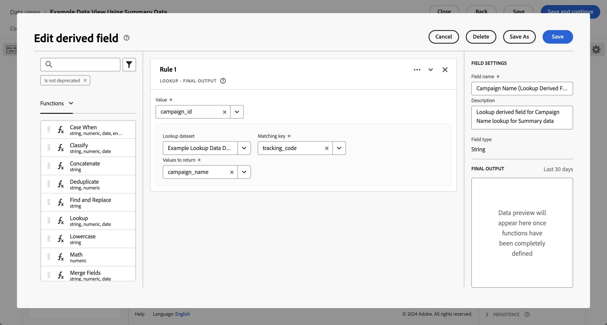
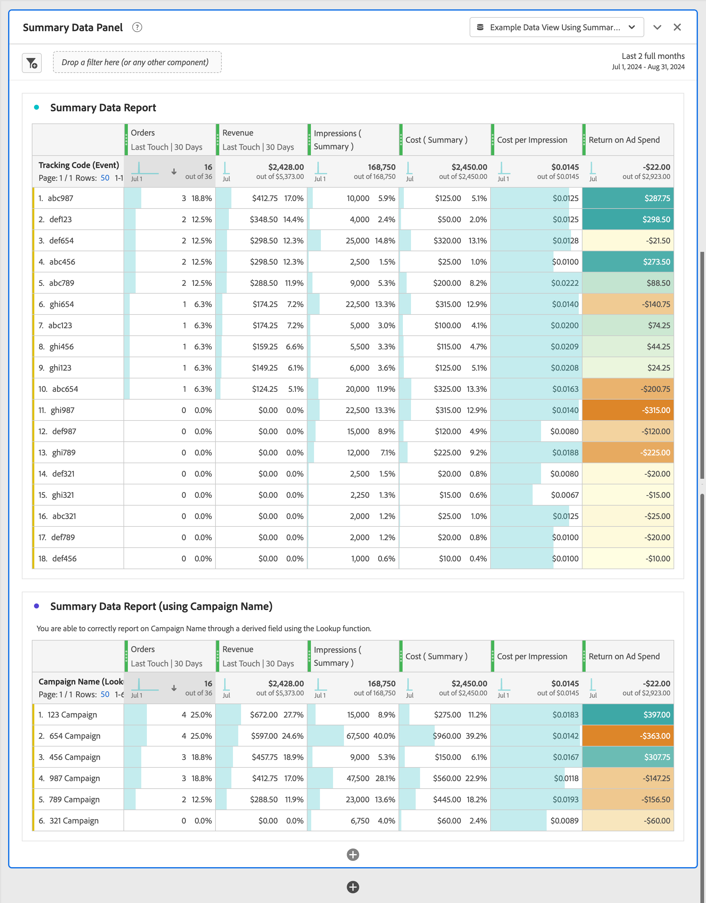

# Utilizzare i dati di riepilogo

Questo caso d’uso ti aiuta a comprendere come utilizzare i dati di riepilogo nelle attività di reporting e analisi. Il caso d’uso descrive tutti i passaggi necessari per utilizzare i dati di riepilogo in Customer Journey Analytics:

- [Acquisire](#ingest) dati di riepilogo e altre origini dati in Experience Platform.
- Configura la [connessione](#connection) per i dati di riepilogo e altre origini dati.
- Configura la [visualizzazione dati](#data-view) per combinare le tue origini dati.
- Report e analisi in [Workspace](#workspace) sui dati combinati.

Il caso d’uso fornisce dati di esempio per dati di riepilogo, dati evento e dati di ricerca. Tutti i dati contengono valori casuali.

## Acquisisci

Per questo caso d’uso utilizzi i seguenti dati di riepilogo di esempio, che mostrano i dati di riepilogo per l’esecuzione di campagne su Facebook.

+++Dati di riepilogo

| _id | nome_campagna | costo | impression | campaign_id | rete | ad_group | timestamp |
|---|---|---:|---:|---|---|---|---|
| 1 | Campagna 123 | 100 | 5000 | abc123 | facebook | abc-adgroup | 2024-07-18T18:20:39.000Z |
| 2 | Campagna 123 | 50 | 4000 | def123 | facebook | def-adgroup | 2024-07-18T18:20:39.000Z |
| 3 | Campagna 123 | 125 | 6000 | ghi123 | facebook | ghi-adgroup | 2024-07-18T18:20:39.000Z |
| 4 | Campagna 456 | 25 | 2500 | abc456 | facebook | abc-adgroup | 2024-07-18T18:20:39.000Z |
| 5 | Campagna 456 | 10 | 1000 | def456 | facebook | def-adgroup | 2024-07-18T18:20:39.000Z |
| 6 | Campagna 456 | 115 | 5500 | ghi456 | facebook | ghi-adgroup | 2024-07-18T18:20:39.000Z |
| 7 | Campagna 789 | 200 | 9000 | abc789 | facebook | abc-adgroup | 2024-07-18T18:20:39.000Z |
| 8 | Campagna 789 | 20 | 2000 | def789 | facebook | def-adgroup | 2024-07-18T18:20:39.000Z |
| 9 | Campagna 789 | 225 | 12000 | ghi789 | facebook | ghi-adgroup | 2024-07-18T18:20:39.000Z |
| 10 | Campagna 987 | 125 | 10000 | abc987 | facebook | abc-adgroup | 2024-07-18T18:20:39.000Z |
| 11 | Campagna 987 | 120 | 15000 | def987 | facebook | def-adgroup | 2024-07-18T18:20:39.000Z |
| 12 | Campagna 987 | 315 | 22500 | ghi987 | facebook | ghi-adgroup | 2024-07-18T18:20:39.000Z |
| 13 | Campagna 654 | 325 | 20000 | abc654 | facebook | abc-adgroup | 2024-07-18T18:20:39.000Z |
| 14 | Campagna 654 | 320 | 25000 | def654 | facebook | def-adgroup | 2024-07-18T18:20:39.000Z |
| 15 | Campagna 654 | 315 | 22500 | ghi654 | facebook | ghi-adgroup | 2024-07-18T18:20:39.000Z |
| 16 | Campagna 321 | 25 | 2000 | abc321 | facebook | abc-adgroup | 2024-07-18T18:20:39.000Z |
| 17 | Campagna 321 | 20 | 2500 | def321 | facebook | def-adgroup | 2024-07-18T18:20:39.000Z |
| 18 | Campagna 321 | 15 | 2250 | ghi321 | facebook | ghi-adgroup | 2024-07-18T18:20:39.000Z |

+++

Per utilizzare i dati di riepilogo in Customer Journey Analytics, in un rapporto o come parte dell’analisi dei dati in Workspace, è necessario

- uno schema di riepilogo in Experience Platform,
- un set di dati di riepilogo in Experience Platform,
- una connessione in Customer Journey Analytics configurata per utilizzare il set di dati di riepilogo,
- una visualizzazione dati in Customer Journey Analytics, configurata correttamente con metriche e dimensioni per i dati di riepilogo.

Questi dati di riepilogo vengono utilizzati insieme a un set di dati per dati evento e a un set di dati per dati di ricerca.

+++Dati evento

I dati evento sono disponibili nel set di dati evento di esempio. I dati di esempio sono simili al seguente:

| timestamp | _id | page_name | person_id | tracking_code | ordini | revenue_amount |
|---|---:|---|---|---|---:|---:|
| 2024-07-18T19:15:39+00:00 | 1 | pagina home | person-1abc123 | abc123 |  |  |
| 2024-07-18T19:15:39+00:00 | 2 | pagina di conferma | person-1abc123 |  | 1 | 174,25 |
| 2024-07-18T19:15:39+00:00 | 3 | pagina home | person-2def123 | def123 |  |  |
| 2024-07-18T19:15:39+00:00 | 4 | pagina home | person-3ghi123 | ghi123 |  |  |
| 2024-07-18T19:15:39+00:00 | 5 | pagina di conferma | person-3ghi123 |  | 1 | 149,25 |
| 2024-07-18T19:15:39+00:00 | 6 | pagina home | person-4abc456 | abc456 |  |  |
| 2024-07-18T19:15:39+00:00 | 7 | pagina home | person-5def456 | def456 |  |  |
| 2024-07-18T19:15:39+00:00 | 8 | pagina home | person-6ghi456 | ghi456 |  |  |
| 2024-07-18T19:15:39+00:00 | 9 | pagina di conferma | person-6ghi456 |  | 1 | 159,25 |
| 2024-07-18T19:15:39+00:00 | 10 | pagina home | person-7abc789 | abc789 |  |  |
| 2024-07-18T19:15:39+00:00 | 11 | pagina home | person-8def789 | def789 |  |  |
| 2024-07-18T19:15:39+00:00 | 12 | pagina home | person-9ghi789 | ghi789 |  |  |
| 2024-07-18T19:15:39+00:00 | 13 | pagina di conferma | person-9ghi789 |  | 1 | 124,25 |
| 2024-07-18T19:15:39+00:00 | 14 | pagina home | person-10abc987 | abc987 |  |  |
| 2024-07-18T19:15:39+00:00 | 15 | pagina home | person-11def987 | def987 |  |  |
| 2024-07-18T19:15:39+00:00 | 16 | pagina home | person-12ghi987 | ghi987 |  |  |
| 2024-07-18T19:15:39+00:00 | 17 | pagina home | person-13abc654 | abc654 |  |  |
| 2024-07-18T19:15:39+00:00 | 18 | pagina home | person-14def654 | def654 |  |  |
| 2024-07-18T19:15:39+00:00 | 19 | pagina home | person-15ghi654 | ghi654 |  |  |
| 2024-07-18T19:15:39+00:00 | 20 | pagina di conferma | person-15ghi654 |  | 1 | 174,25 |
| 2024-07-18T19:15:39+00:00 | 21 | pagina home | person-16abc321 | abc321 |  |  |
| 2024-07-18T19:15:39+00:00 | 22 | pagina home | person-17def321 | def321 |  |  |
| 2024-07-18T19:15:39+00:00 | 23 | pagina home | person-18ghi321 | ghi321 |  |  |
| 2024-07-18T19:15:39+00:00 | 24 | pagina home | person-19abc123 | abc123 |  |  |
| 2024-07-18T19:15:39+00:00 | 25 | pagina home | person-20def123 | def123 |  |  |
| 2024-07-18T19:15:39+00:00 | 26 | pagina home | person-21ghi123 | ghi123 |  |  |
| 2024-07-18T19:15:39+00:00 | 27 | pagina di conferma | person-21ghi123 |  | 1 | 149,25 |
| 2024-07-18T19:15:39+00:00 | 28 | pagina home | person-22abc456 | abc456 |  |  |
| 2024-07-18T19:15:39+00:00 | 29 | pagina home | person-23def456 | def456 |  |  |
| 2024-07-18T19:15:39+00:00 | 30 | pagina home | person-24ghi456 | ghi456 |  |  |
| 2024-07-18T19:15:39+00:00 | 31 | pagina home | person-25abc789 | abc789 |  |  |
| 2024-07-18T19:15:39+00:00 | 32 | pagina di conferma | person-25abc789 |  | 1 | 139,25 |
| 2024-07-18T19:15:39+00:00 | 33 | pagina home | person-26abc987 | abc987 |  |  |
| 2024-07-18T19:15:39+00:00 | 34 | pagina home | person-27def987 | def987 |  |  |
| 2024-07-18T19:15:39+00:00 | 35 | pagina home | person-28ghi987 | ghi987 |  |  |
| 2024-07-18T19:15:39+00:00 | 36 | pagina home | person-29abc654 | abc654 |  |  |
| 2024-07-18T19:15:39+00:00 | 37 | pagina di conferma | person-29abc654 |  | 1 | 124,25 |
| 2024-07-18T19:15:39+00:00 | 38 | pagina home | person-30def654 | def654 |  |  |
| 2024-07-18T19:15:39+00:00 | 39 | pagina home | person-31ghi654 | ghi654 |  |  |
| 2024-07-18T19:15:39+00:00 | 40 | pagina home | person-32abc321 | abc321 |  |  |
| 2024-07-18T19:15:39+00:00 | 41 | pagina home | person-33ghi456 | ghi456 |  |  |
| 2024-07-18T19:15:39+00:00 | 42 | pagina di conferma | person-33ghi456 |  | 1 | 174,25 |
| 2024-07-18T19:15:39+00:00 | 43 | pagina home | person-34abc789 | abc789 |  |  |
| 2024-07-18T19:15:39+00:00 | 44 | pagina home | person-35def789 | def789 |  |  |
| 2024-07-18T19:15:39+00:00 | 45 | pagina home | person-36ghi789 | ghi789 |  |  |
| 2024-07-18T19:15:39+00:00 | 46 | pagina di conferma | person-36ghi789 |  | 1 | 149,25 |
| 2024-07-18T19:15:39+00:00 | 47 | pagina home | person-37abc987 | abc987 |  |  |
| 2024-07-18T19:15:39+00:00 | 48 | pagina home | person-38def987 | def987 |  |  |
| 2024-07-18T19:15:39+00:00 | 49 | pagina home | person-39ghi987 | ghi987 |  |  |
| 2024-07-18T19:15:39+00:00 | 50 | pagina home | person-40abc654 | abc654 |  |  |
| 2024-07-18T19:15:39+00:00 | 51 | pagina di conferma | person-40abc654 |  | 1 | 124,25 |
| 2024-07-18T19:15:39+00:00 | 52 | pagina home | person-41def654 | def654 |  |  |
| 2024-07-18T19:15:39+00:00 | 53 | pagina home | person-42ghi654 | ghi654 |  |  |
| 2024-07-18T19:15:39+00:00 | 54 | pagina home | person-43abc321 | abc321 |  |  |
| 2024-07-18T19:15:39+00:00 | 55 | pagina home | person-44def321 | def321 |  |  |
| 2024-07-18T19:15:39+00:00 | 56 | pagina home | person-45ghi321 | ghi321 |  |  |
| 2024-07-18T19:15:39+00:00 | 57 | pagina home | person-46abc123 | abc123 |  |  |
| 2024-07-18T19:15:39+00:00 | 58 | pagina di conferma | person-46abc123 |  | 1 | 174,25 |
| 2024-07-18T19:15:39+00:00 | 59 | pagina home | person-47def123 | def123 |  |  |
| 2024-07-18T19:15:39+00:00 | 60 | pagina home | person-48ghi123 | ghi123 |  |  |
| 2024-07-18T19:15:39+00:00 | 61 | pagina home | person-49abc456 | abc456 |  |  |
| 2024-07-18T19:15:39+00:00 | 62 | pagina home | person-50def456 | def456 |  |  |
| 2024-07-18T19:15:39+00:00 | 63 | pagina home | person-51ghi456 | ghi456 |  |  |
| 2024-07-18T19:15:39+00:00 | 64 | pagina home | person-52abc789 | abc789 |  |  |
| 2024-07-18T19:15:39+00:00 | 65 | pagina di conferma | person-52abc789 |  | 1 | 149,25 |
| 2024-07-18T19:15:39+00:00 | 66 | pagina home | person-53abc987 | abc987 |  |  |
| 2024-07-18T19:15:39+00:00 | 67 | pagina home | person-54def987 | def987 |  |  |
| 2024-07-18T19:15:39+00:00 | 68 | pagina home | person-55ghi987 | ghi987 |  |  |
| 2024-07-18T19:15:39+00:00 | 69 | pagina di conferma | person-55ghi987 |  | 1 | 124,25 |
| 2024-07-18T19:15:39+00:00 | 70 | pagina home | person-56abc123 | abc123 |  |  |
| 2024-07-18T19:15:39+00:00 | 71 | pagina home | person-57def123 | def123 |  |  |
| 2024-07-18T19:15:39+00:00 | 72 | pagina di conferma | person-57def123 |  | 1 | 174,25 |
| 2024-07-18T19:15:39+00:00 | 73 | pagina home | person-58ghi123 | ghi123 |  |  |
| 2024-07-18T19:15:39+00:00 | 74 | pagina home | person-59abc456 | abc456 |  |  |
| 2024-07-18T19:15:39+00:00 | 75 | pagina di conferma | person-59abc456 |  | 1 | 149,25 |
| 2024-07-18T19:15:39+00:00 | 76 | pagina home | person-60def456 | def456 |  |  |
| 2024-07-18T19:15:39+00:00 | 77 | pagina home | person-61ghi456 | ghi456 |  |  |
| 2024-07-18T19:15:39+00:00 | 78 | pagina home | person-62abc789 | abc789 |  |  |
| 2024-07-18T19:15:39+00:00 | 79 | pagina di conferma | person-62abc789 |  | 1 | 159,25 |
| 2024-07-18T19:15:39+00:00 | 80 | pagina home | person-63def789 | def789 |  |  |
| 2024-07-18T19:15:39+00:00 | 81 | pagina home | person-64ghi789 | ghi789 |  |  |
| 2024-07-18T19:15:39+00:00 | 82 | pagina home | person-65abc987 | abc987 |  |  |
| 2024-07-18T19:15:39+00:00 | 83 | pagina di conferma | person-65abc987 |  | 1 | 124,25 |
| 2024-07-18T19:15:39+00:00 | 84 | pagina home | person-66def987 | def987 |  |  |
| 2024-07-18T19:15:39+00:00 | 85 | pagina home | person-67ghi987 | ghi987 |  |  |
| 2024-07-18T19:15:39+00:00 | 86 | pagina home | person-68abc654 | abc654 |  |  |
| 2024-07-18T19:15:39+00:00 | 87 | pagina home | person-69def654 | def654 |  |  |
| 2024-07-18T19:15:39+00:00 | 88 | pagina home | person-70ghi654 | ghi654 |  |  |
| 2024-07-18T19:15:39+00:00 | 89 | pagina home | person-71abc321 | abc321 |  |  |
| 2024-07-18T19:15:39+00:00 | 90 | pagina di conferma | person-71abc321 |  | 1 | 174,25 |
| 2024-07-18T19:15:39+00:00 | 91 | pagina home | person-72def321 | def321 |  |  |
| 2024-07-18T19:15:39+00:00 | 92 | pagina home | person-73ghi321 | ghi321 |  |  |
| 2024-07-18T19:15:39+00:00 | 93 | pagina home | person-74abc123 | abc123 |  |  |
| 2024-07-18T19:15:39+00:00 | 94 | pagina home | person-75def123 | def123 |  |  |
| 2024-07-18T19:15:39+00:00 | 95 | pagina home | person-76ghi123 | ghi123 |  |  |
| 2024-07-18T19:15:39+00:00 | 96 | pagina home | person-77abc456 | abc456 |  |  |
| 2024-07-18T19:15:39+00:00 | 97 | pagina di conferma | person-77abc456 |  | 1 | 149,25 |
| 2024-07-18T19:15:39+00:00 | 98 | pagina home | person-78def456 | def456 |  |  |
| 2024-07-18T19:15:39+00:00 | 99 | pagina home | person-79ghi456 | ghi456 |  |  |
| 2024-07-18T19:15:39+00:00 | 100 | pagina home | person-80abc789 | abc789 |  |  |
| 2024-07-18T19:15:39+00:00 | 101 | pagina home | person-81abc987 | abc987 |  |  |
| 2024-07-18T19:15:39+00:00 | 102 | pagina di conferma | person-81abc987 |  | 1 | 139,25 |
| 2024-07-18T19:15:39+00:00 | 103 | pagina home | person-82def987 | def987 |  |  |
| 2024-07-18T19:15:39+00:00 | 104 | pagina home | person-83ghi987 | ghi987 |  |  |
| 2024-07-18T19:15:39+00:00 | 105 | pagina home | person-84abc654 | abc654 |  |  |
| 2024-07-18T19:15:39+00:00 | 106 | pagina home | person-85def654 | def654 |  |  |
| 2024-07-18T19:15:39+00:00 | 107 | pagina di conferma | person-85def654 |  | 1 | 124,25 |
| 2024-07-18T19:15:39+00:00 | 108 | pagina home | person-86ghi654 | ghi654 |  |  |
| 2024-07-18T19:15:39+00:00 | 109 | pagina home | person-87abc321 | abc321 |  |  |
| 2024-07-18T19:15:39+00:00 | 110 | pagina home | person-88ghi456 | ghi456 |  |  |
| 2024-07-18T19:15:39+00:00 | 111 | pagina home | person-89abc789 | abc789 |  |  |
| 2024-07-18T19:15:39+00:00 | 112 | pagina di conferma | person-89abc789 |  | 1 | 174,25 |
| 2024-07-18T19:15:39+00:00 | 113 | pagina home | person-90def789 | def789 |  |  |
| 2024-07-18T19:15:39+00:00 | 114 | pagina home | person-91ghi789 | ghi789 |  |  |
| 2024-07-18T19:15:39+00:00 | 115 | pagina home | person-92abc987 | abc987 |  |  |
| 2024-07-18T19:15:39+00:00 | 116 | pagina di conferma | person-92abc987 |  | 1 | 149,25 |
| 2024-07-18T19:15:39+00:00 | 117 | pagina home | person-93def987 | def987 |  |  |
| 2024-07-18T19:15:39+00:00 | 118 | pagina home | person-94ghi987 | ghi987 |  |  |
| 2024-07-18T19:15:39+00:00 | 119 | pagina home | person-95abc654 | abc654 |  |  |
| 2024-07-18T19:15:39+00:00 | 120 | pagina home | person-96def654 | def654 |  |  |
| 2024-07-18T19:15:39+00:00 | 121 | pagina di conferma | person-96def654 |  | 1 | 124,25 |
| 2024-07-18T19:15:39+00:00 | 122 | pagina home | person-97ghi654 | ghi654 |  |  |
| 2024-07-18T19:15:39+00:00 | 123 | pagina home | person-98abc321 | abc321 |  |  |
| 2024-07-18T19:15:39+00:00 | 124 | pagina home | person-99def321 | def321 |  |  |
| 2024-07-18T19:15:39+00:00 | 125 | pagina home | person-100ghi321 | ghi321 |  |  |
| 2024-07-18T19:15:39+00:00 | 126 | pagina home | person-101abc123 | abc123 |  |  |
| 2024-07-18T19:15:39+00:00 | 127 | pagina home | person-102def123 | def123 |  |  |
| 2024-07-18T19:15:39+00:00 | 128 | pagina di conferma | person-102def123 |  | 1 | 174,25 |
| 2024-07-18T19:15:39+00:00 | 129 | pagina home | person-103ghi123 | ghi123 |  |  |
| 2024-07-18T19:15:39+00:00 | 130 | pagina home | person-104abc456 | abc456 |  |  |
| 2024-07-18T19:15:39+00:00 | 131 | pagina home | person-105def456 | def456 |  |  |
| 2024-07-18T19:15:39+00:00 | 132 | pagina home | person-106ghi456 | ghi456 |  |  |
| 2024-07-18T19:15:39+00:00 | 133 | pagina home | person-107abc789 | abc789 |  |  |
| 2024-07-18T19:15:39+00:00 | 134 | pagina home | person-108abc987 | abc987 |  |  |
| 2024-07-18T19:15:39+00:00 | 135 | pagina di conferma | person-108abc987 |  | 1 | 149,25 |
| 2024-07-18T19:15:39+00:00 | 136 | pagina home | person-109def987 | def987 |  |  |
| 2024-07-18T19:15:39+00:00 | 137 | pagina home | person-110ghi987 | ghi987 |  |  |
| 2024-07-18T19:15:39+00:00 | 138 | pagina di conferma | person-110ghi987 |  |  |  |
| 2024-07-18T19:15:39+00:00 | 139 | pagina home | person-111def987 | def987 |  |  |
| 2024-07-18T19:15:39+00:00 | 140 | pagina home | person-112def987 |  | 1 | 124,25 |
| 2024-07-18T19:15:39+00:00 | 141 | pagina di conferma | person-112def987 |  | 1 | 149,25 |
| 2024-07-18T19:15:39+00:00 | 142 | pagina home | person-113ghi987 | ghi987 |  |  |
| 2024-07-18T19:15:39+00:00 | 143 | pagina home | person-114abc654 | abc654 |  |  |
| 2024-07-18T19:15:39+00:00 | 144 | pagina home | person-115def654 | def654 |  |  |
| 2024-07-18T19:15:39+00:00 | 145 | pagina di conferma | person-115def654 |  | 1 | 159,25 |
| 2024-07-18T19:15:39+00:00 | 146 | pagina home | person-116ghi654 | ghi654 |  |  |
| 2024-07-18T19:15:39+00:00 | 147 | pagina home | person-117abc321 | abc321 |  |  |
| 2024-07-18T19:15:39+00:00 | 148 | pagina home | person-118def321 | def321 |  |  |
| 2024-07-18T19:15:39+00:00 | 149 | pagina di conferma | person-118def321 |  | 1 | 124,25 |
| 2024-07-18T19:15:39+00:00 | 150 | pagina home | person-119ghi321 | ghi321 |  |  |
| 2024-07-18T19:15:39+00:00 | 151 | pagina home | person-120abc123 | abc123 |  |  |
| 2024-07-18T19:15:39+00:00 | 152 | pagina home | person-121def123 | def123 |  |  |
| 2024-07-18T19:15:39+00:00 | 153 | pagina home | person-122ghi123 | ghi123 |  |  |
| 2024-07-18T19:15:39+00:00 | 154 | pagina home | person-123abc456 | abc456 |  |  |
| 2024-07-18T19:15:39+00:00 | 155 | pagina home | person-124def456 | def456 |  |  |
| 2024-07-18T19:15:39+00:00 | 156 | pagina di conferma | person-124def456 |  | 1 | 174,25 |
| 2024-07-18T19:15:39+00:00 | 157 | pagina home | person-125ghi456 | ghi456 |  |  |
| 2024-07-18T19:15:39+00:00 | 158 | pagina home | person-126abc789 | abc789 |  |  |
| 2024-07-18T19:15:39+00:00 | 159 | pagina home | person-127abc987 | abc987 |  |  |
| 2024-07-18T19:15:39+00:00 | 160 | pagina home | person-128def987 | def987 |  |  |
| 2024-07-18T19:15:39+00:00 | 161 | pagina home | person-129ghi987 | ghi987 |  |  |
| 2024-07-18T19:15:39+00:00 | 162 | pagina home | person-130abc654 | abc654 |  |  |
| 2024-07-18T19:15:39+00:00 | 163 | pagina di conferma | person-130abc654 |  | 1 | 149,25 |
| 2024-07-18T19:15:39+00:00 | 164 | pagina home | person-131def654 | def654 |  |  |
| 2024-07-18T19:15:39+00:00 | 165 | pagina home | person-132ghi654 | ghi654 |  |  |
| 2024-07-18T19:15:39+00:00 | 166 | pagina home | person-133abc321 | abc321 |  |  |
| 2024-07-18T19:15:39+00:00 | 167 | pagina home | person-134ghi456 | ghi456 |  |  |
| 2024-07-18T19:15:39+00:00 | 168 | pagina di conferma | person-134ghi456 |  | 1 | 139,25 |
| 2024-07-18T19:15:39+00:00 | 169 | pagina home | person-135abc789 | abc789 |  |  |
| 2024-07-18T19:15:39+00:00 | 170 | pagina home | person-136def789 | def789 |  |  |
| 2024-07-18T19:15:39+00:00 | 171 | pagina home | person-137ghi789 | ghi789 |  |  |
| 2024-07-18T19:15:39+00:00 | 172 | pagina home | person-138abc987 | abc987 |  |  |
| 2024-07-18T19:15:39+00:00 | 173 | pagina di conferma | person-138abc987 |  | 1 | 124,25 |
| 2024-07-18T19:15:39+00:00 | 174 | pagina home | person-139def987 | def987 |  |  |
| 2024-07-18T19:15:39+00:00 | 175 | pagina home | person-140ghi987 | ghi987 |  |  |
| 2024-07-18T19:15:39+00:00 | 176 | pagina home | person-141abc654 | abc654 |  |  |
| 2024-07-18T19:15:39+00:00 | 177 | pagina home | person-142def654 | def654 |  |  |
| 2024-07-18T19:15:39+00:00 | 178 | pagina di conferma | person-142def654 |  | 1 | 174,25 |
| 2024-07-18T19:15:39+00:00 | 179 | pagina home | person-143ghi654 | ghi654 |  |  |

+++

+++ Dati di ricerca

I dati di ricerca sono disponibili nel set di dati di ricerca di esempio. I dati di esempio sono simili al seguente:

| _id | tracking_code | ad_group | nome_campagna |
|---|---|---|---|
| 1 | abc123 | abc-adgroup | Campagna 123 |
| 2 | def123 | def-adgroup | Campagna 123 |
| 3 | ghi123 | ghi-adgroup | Campagna 123 |
| 4 | abc456 | abc-adgroup | Campagna 456 |
| 5 | def456 | def-adgroup | Campagna 456 |
| 6 | ghi456 | ghi-adgroup | Campagna 456 |
| 7 | abc789 | abc-adgroup | Campagna 789 |
| 8 | def789 | def-adgroup | Campagna 789 |
| 9 | ghi789 | ghi-adgroup | Campagna 789 |
| 10 | abc987 | abc-adgroup | Campagna 987 |
| 11 | def987 | def-adgroup | Campagna 987 |
| 12 | ghi987 | ghi-adgroup | Campagna 987 |
| 13 | abc654 | abc-adgroup | Campagna 654 |
| 14 | def654 | def-adgroup | Campagna 654 |
| 15 | ghi654 | ghi-adgroup | Campagna 654 |
| 16 | abc321 | abc-adgroup | Campagna 321 |
| 17 | def321 | def-adgroup | Campagna 321 |
| 18 | ghi321 | ghi-adgroup | Campagna 321 |

[ Scarica i dati di ricerca di esempio](./assets/lookup-data.csv)
+++

>[!INFO]
>
>Non vengono forniti ulteriori dettagli per la configurazione di schemi e set di dati per l’evento e i dati di ricerca. Questa configurazione si presume di conoscenza comune e segue gli stessi passaggi dei dati di ricerca.
>

### Schema di riepilogo

I dati di riepilogo richiedono uno schema di riepilogo in Experience Platform. Uno schema di riepilogo è uno schema che utilizza le Metriche di riepilogo XDM come classe base.

Per creare uno schema di riepilogo in Experience Platform:

1. Seleziona **[!UICONTROL Experience Platform]** dal      commutatore app.
1. Seleziona **[!UICONTROL Schemas]** nella barra a sinistra.
1. Selezionare  **[!UICONTROL Create schema]**.
1. Selezionare **[!UICONTROL Manual]** nella finestra di dialogo **[!UICONTROL Create a schema]**. Quindi utilizzare **[!UICONTROL Select]** per continuare.
1. Nel passaggio **[!UICONTROL Select a class]** della procedura guidata **[!UICONTROL Schemas]** > **[!UICONTROL Create schema]**, seleziona **[!UICONTROL Other]** dalle opzioni **[!UICONTROL Select a base class for this schema]**.
1. Dall&#39;elenco, selezionare **[!UICONTROL XDM Summary Metrics]** (oppure utilizzare il campo  per cercare) e selezionare **[!UICONTROL Next]**.
1. Nel passaggio **[!UICONTROL Name and review]** della procedura guidata **[!UICONTROL Schemas]** > **[!UICONTROL Create schema]**, immettere un **[!UICONTROL Schema display name]**, ad esempio `Example Summary Data Schema` e una descrizione facoltativa. Seleziona **[!UICONTROL Finish]** per completare questo passaggio.

Viene visualizzata la struttura dello schema di riepilogo di base, pronta per essere incrementata con i campi per i dati di riepilogo. Puoi aggiungere campi a uno schema utilizzando i gruppi di campi.

Per aggiungere un gruppo di campi contenente i campi per i dati di esempio:

1. Selezionare  **[!UICONTROL Add]** in **[!UICONTROL Field groups]**.
1. Nella finestra di dialogo **[!UICONTROL Add field groups]**, seleziona **[!UICONTROL Create new field group]**.
1. Immettere **[!UICONTROL Display name]** per il gruppo di campi, ad esempio `Example Summary Data`. Fornisci facoltativamente una descrizione.
1. Seleziona **[!UICONTROL Add field groups]**.
1. Sei di nuovo nell’interfaccia utente della struttura dello schema. Selezionare il nuovo **[!UICONTROL Example Summary Data]** in **[!UICONTROL Field groups]**.
1. Selezionare  accanto al nome dello schema **[!UICONTROL Example summary Data Schema]**. Viene aperto un pannello **[!UICONTROL Field properties]** che consente di aggiungere dettagli a un campo.
   1. Immetti **[!UICONTROL Field name]**: `campaign_id`
   1. Immetti **[!UICONTROL Display name]**: `campaign_id`
   1. Seleziona **[!UICONTROL Type]** dal menu a discesa **[!UICONTROL Select data type]**: **[!UICONTROL String]**
   1. Verificare che **[!UICONTROL Assign to]** **[!UICONTROL Field group]** sia selezionato e selezionare **[!UICONTROL Example Summary Data]** dal menu a discesa.
   1. Scorrere verso il basso e selezionare **[!UICONTROL Apply]**.
1. Ripetere il passaggio precedente per gli altri campi dei dati di riepilogo. Per i valori corretti, consulta la tabella seguente.

   | Nome campo: | Nome visualizzato | Tipo | Gruppo di campi |
   |---|---|---|---|
   | `ad_group` | `ad_group` | Stringa | Esempio di dati di riepilogo |
   | `campaign_name` | `campaign_name` | Stringa | Esempio di dati di riepilogo |
   | `cost` | `cost` | Doppio | Esempio di dati di riepilogo |
   | `impression` | `impression` | Intero | Esempio di dati di riepilogo |
   | `network` | `network` | Stringa | Esempio di dati di riepilogo |

1. Per salvare il gruppo di campi **[!UICONTROL Example Summary Data]** come parte dello schema, seleziona **[!UICONTROL Save]**. Viene visualizzata una conferma quando lo schema viene salvato correttamente.

Ora hai definito uno schema, con i dettagli del modello per i dati di riepilogo. Simile a quello riportato di seguito.

### Set di dati di riepilogo

Per memorizzare i dati di riepilogo in Experience Platform, devi innanzitutto creare un set di dati e quindi caricare i dati di riepilogo nel set di dati.

Per creare un set di dati:

1. Seleziona **[!UICONTROL Experience Platform]** dal      commutatore app.
1. Seleziona **[!UICONTROL Datasets]** nella barra a sinistra.
1. Selezionare  **[!UICONTROL Create dataset]**.
1. Nella schermata **[!UICONTROL Datasets]** > **[!UICONTROL Create datasets]**, selezionare **[!UICONTROL Create dataset from schema]**.
1. Nel passaggio **[!UICONTROL Select schema]** della procedura guidata **[!UICONTROL Workflows]** > **[!UICONTROL Create dataset from schema]**,  e seleziona **[!UICONTROL Example Summary Data Schema]**.
1. Seleziona **[!UICONTROL Next]**.
1. Nel passaggio **[!UICONTROL Configure dataset]** della procedura guidata **[!UICONTROL Workflows]** > **[!UICONTROL Create dataset from schema]**:
   1. Immettere un **[!UICONTROL Name]** per il set di dati, ad esempio: `Example Summary Data Dataset`. Fornisci facoltativamente una descrizione.
   1. Seleziona **[!UICONTROL Finish]**.

Viene visualizzata una schermata con i dettagli del nuovo set di dati.

Per caricare i dati di esempio in questo set di dati:

1. Seleziona **[!UICONTROL Experience Platform]** dal      commutatore app.
1. Seleziona **[!UICONTROL Workflows]** nella barra a sinistra.
   1. Selezionare **[!UICONTROL Map CSV to XDM schema]** dalle opzioni **[!UICONTROL Data ingestion]** nella schermata **[!UICONTROL Workflows]**.
   1. Selezionare **[!UICONTROL Launch]** dal pannello **[!UICONTROL Map CSV to XDM schema]**.
1. Nel passaggio **[!UICONTROL Dataflow detail]** della procedura guidata **[!UICONTROL Workflows]** > **[!UICONTROL Map CSV to XDM schema]**:
   1. Selezionare **[!UICONTROL Existing dataset]** per **[!UICONTROL Target dataset]**.
   1. Selezionare **[!UICONTROL Example Summary Data Dataset]** dall&#39;elenco a discesa.
   1. Seleziona **[!UICONTROL Next]**.
1. Nel passaggio **[!UICONTROL Select data]** della procedura guidata **[!UICONTROL Workflows]** > **[!UICONTROL Map CSV to XDM schema]**:
   1. Trascina il file con dati di riepilogo in formato CSV su **[!UICONTROL Drag and drop files]**. In alternativa, utilizzare **[!UICONTROL Choose files]** per selezionare il file.
   1. Assicurarsi che **[!UICONTROL Data format]** e **[!UICONTROL Delimiter]** abbiano i valori corretti per i dati di esempio. **[!UICONTROL Delimited]** come **[!UICONTROL Data format]** e **[!UICONTROL ,]** come **[!UICONTROL Delimiter]**.
   1. Un esempio (10 record) dei dati di riepilogo viene visualizzato in **[!UICONTROL Sample data]**.
   1. Seleziona **[!UICONTROL Next]**.
1. Nel passaggio **[!UICONTROL Mapping]** della procedura guidata **[!UICONTROL Workflows]** > **[!UICONTROL Map CSV to XDM schema]**:
   
   1. Verifica se tutti i campi dati di **[!UICONTROL Source Data]** sono mappati correttamente al **[!UICONTROL Target fields]** corrispondente nello schema. Per i dati di esempio, non vengono segnalati errori poiché i campi presenti nello schema sono stati denominati in modo esplicito, in modo simile ai nomi dei campi presenti nei dati di esempio. In caso contrario, è possibile utilizzare questa schermata per correggere la mappatura.
   1. È possibile selezionare  **[!UICONTROL Validate]** per convalidare (ancora una volta) i dati.
   1. Facoltativamente, è possibile selezionare  **[!UICONTROL Preview data]** per aprire una finestra di dialogo con un&#39;anteprima dei dati una volta caricati nel set di dati.
   1. Seleziona **[!UICONTROL Finish]**.

In **[!UICONTROL Sources]** > **[!UICONTROL Dataflow - XX/XX/XXXX, XX:XX XX]**, viene visualizzato lo stato del caricamento. Aggiorna per visualizzare gli aggiornamenti del caricamento. In caso di esito positivo, i dati di esempio vengono caricati in Experience Platform.

## Connessione

Per utilizzare i dati di esempio in Customer Journey Analytics, crea una connessione che include il set di dati di riepilogo di esempio da Experience Platform.

1. Seleziona **[!UICONTROL Customer Journey Analytics]** dal      commutatore app.
1. Selezionare **[!UICONTROL Connections]**, facoltativamente da **[!UICONTROL Data management]**, nel menu principale.
1. Seleziona **[!UICONTROL Create new connection]**.
1. In **[!UICONTROL Connections]** > **[!UICONTROL Untitled connection]**:
   1. Immetti un **[!UICONTROL Connection name]**, ad esempio `Example Connection Using Summary Data`.
   1. Seleziona dall’elenco a discesa Sandbox la sandbox che contiene il set di dati creato e gli altri set di dati da includere.
   1. Selezionare **[!UICONTROL less than 1 million]** dall&#39;elenco a discesa **[!UICONTROL Average number of daily events]**.
   1. Seleziona **[!UICONTROL Add datasets]**.
   1. Nel passaggio **[!UICONTROL Select datasets]** della procedura guidata **[!UICONTROL Add datasets]**:
      1. Cerca in  e seleziona **[!UICONTROL Example Summary Data Dataset]**, **[!UICONTROL Example Event Data Dataset]** e **[!UICONTROL Example Lookup Data Dataset]**.
      1. Seleziona **[!UICONTROL Next]**.
   1. Nel passaggio **[!UICONTROL Datasets settings]** della procedura guidata **[!UICONTROL Add datasets]**:

      1. Per **[!UICONTROL Example Event Data Dataset]**:

         1. Verificare che le selezioni per **[!UICONTROL Person ID]** (`person_id`) e **[!UICONTROL Timestamp]** siano corrette.
         1. Selezionare **[!UICONTROL Web Data]** da **[!UICONTROL Data source type]**.
         1. Abilita **[!UICONTROL Import all new data]**.
         1. Abilita **[!UICONTROL Backfill all existing data]**.

      1. Per **[!UICONTROL Example Lookup Data Dataset]**:

         1. Selezionare **[!UICONTROL tracking_code]** come **[!UICONTROL Key]** e **[!UICONTROL tracking_code (Event datasets)]** come chiave **[!UICONTROL Matching]**.
         1. Selezionare **[!UICONTROL Web Data]** da **[!UICONTROL Data source type]**.
         1. Abilita **[!UICONTROL Import all new data]**.
         1. Abilita **[!UICONTROL Backfill all existing data]**.

      1. Per **[!UICONTROL Example Summary Data Dataset]**:

         1. Verificare che le selezioni per **[!UICONTROL Timestamp]** e **[!UICONTROL Timezone]** siano corrette.
         1. Abilita **[!UICONTROL Import all new data]**.
         1. Abilita **[!UICONTROL Backfill all existing data]**.

      1. Seleziona **[!UICONTROL Add datasets]**.

1. Nella schermata di connessione **[!UICONTROL Connections]** > **[!UICONTROL Example Connection using Summary Data]**, selezionare **[!UICONTROL Save]** per salvare la connessione.

I dati dei set di dati vengono aggiunti a Customer Journey Analytics, che può richiedere un paio d’ore. Quindi, per favore, attendi prima di continuare.

Dopo un po’, verifica che i dati dei set di dati siano caricati correttamente in Customer Journey Analytics.

1. Seleziona **[!UICONTROL Customer Journey Analytics]** dal      commutatore app.
1. Selezionare **[!UICONTROL Connections]**, facoltativamente da **[!UICONTROL Data management]**, nel menu principale.
1. Selezionare la connessione, ad esempio **[!UICONTROL Example Connection Using Summary Data]**.
1. Selezionare un intervallo di date appropriato nei dettagli **[!UICONTROL Connection]** > **[!UICONTROL Example Connection Using Summary data]**.
   1. Selezionare , quindi **[!UICONTROL Last 7 days]**.
   1. Seleziona **[!UICONTROL Apply]**.

Nell&#39;elenco di **[!UICONTROL Datasets]**, i valori nella colonna **[!UICONTROL Records added]** devono confermare che i dati dei set di dati fanno ora parte di Customer Journey Analytics.

## Visualizzazione dati

Per poter creare rapporti sui dati corretti in Workspace, devi creare una visualizzazione dati contenente le metriche e le dimensioni pertinenti.

1. Seleziona **[!UICONTROL Customer Journey Analytics]** dal      commutatore app.
1. Selezionare **[!UICONTROL Data views]**, facoltativamente da **[!UICONTROL Data management]**, nel menu principale.
1. Seleziona **[!UICONTROL Create new data view]**.
1. In **[!UICONTROL Data views]**, passare attraverso le schermate della procedura guidata per configurare la visualizzazione dati.
   1. Nel passaggio **[!UICONTROL Configure]** di **[!UICONTROL Data views]**:
      1. Seleziona la connessione da **[!UICONTROL Settings]** | **[!UICONTROL Connection]**. Ad esempio: **[!UICONTROL Example Connection Using Summary Data]**.
      1. Immetti **[!UICONTROL Name]** per la visualizzazione dati, ad esempio `Example Data View Using Summary Data`.
      1. Lascia tutte le altre impostazioni.
      1. Seleziona **[!UICONTROL Save and continue]**.
   1. Nel passaggio **[!UICONTROL Components]** di **[!UICONTROL Data views]** > **[!UICONTROL Example Data View Using Summary Data]**:
      1. Aggiungi i seguenti componenti all’elenco Dimensioni e metriche. Tieni presente che, per maggiore chiarezza, i nomi dei componenti vengono modificati dal loro nome predefinito, utilizzando **[!UICONTROL Component name]** in **[!UICONTROL Component settings]** nel pannello dei componenti (a destra).

         **Metriche**

         | Nome componente | Set di dati | Tipo di dati dello schema | Percorso schema |
         |---|---|---|---|
         | Costo | Esempio di set di dati di riepilogo | Doppio | *_tenant*.cost |
         | Impression | Esempio di set di dati di riepilogo | Intero | *_tenant*.impression |
         | Ordini | Esempio di set di dati di dati evento | Intero | *_tenant*.orders |
         | Ricavi | Esempio di set di dati di dati evento | Doppio | *_tenant*.revenue_amount |

         **Dimensioni**

         | Nome componente | Set di dati | Tipo di dati dello schema | Percorso schema |
         |---|---|---|---|
         | Gruppo di annunci (ricerca) | Esempio di set di dati di ricerca | Stringa | *_tenant*.ad_group |
         | Gruppo di annunci (riepilogo) | Esempio di set di dati di riepilogo | Stringa | *_tenant*.ad_group |
         | ID campagna | Esempio di set di dati di riepilogo | Stringa | *_tenant*.campaign_id |
         | Nome campagna (ricerca) | Esempio di set di dati di ricerca | Stringa | *_tenant*.campaign_name |
         | Nome campagna (riepilogo) | Esempio di set di dati di riepilogo | Stringa | *_tenant*.campaign_name |
         | Rete | Esempio di set di dati di riepilogo | Stringa | *_tenant*.network |
         | Nome pagina | Esempio di set di dati di dati evento | Stringa | *_tenant*.page_name |
         | ID persona | Esempio di set di dati di dati evento | Stringa | *_tenant*.person_id |
         | Codice di tracciamento (evento) | Esempio di set di dati di dati evento | Stringa | *_tenant*.tracking_code |
         | Codice di tracciamento (ricerca) | Esempio di set di dati di ricerca | Stringa | *_tenant*.tracking_code |

      1. Selezionare la dimensione **[!UICONTROL Tracking Code (Event)]** nell&#39;elenco **[!UICONTROL Dimensions]**. Nel pannello dei componenti:

         
         1. Espandi  **[!UICONTROL Summary Data Group]**.
         1. Abilita **[!UICONTROL Create grouping]**.
         1. Selezionare **[!UICONTROL Campaign Id]** dall&#39;elenco a discesa **[!UICONTROL Dimension]**. Questo passaggio garantisce che i dati dell’evento e i dati di riepilogo vengano combinati correttamente a scopo di reporting.
         1. È possibile abilitare **[!UICONTROL Hide in reporting]**. [!UICONTROL Hide in reporting] assicura che la dimensione selezionata ([!UICONTROL Campaign Id]) sia nascosta in Analysis Workspace e in altri strumenti di reporting di Customer Journey Analytics. Se hai attivato questa opzione, puoi verificare quanto segue:
            1. Selezionare la dimensione **[!UICONTROL Campaign Id]** nell&#39;elenco **[!UICONTROL Dimensions]**.
            1. Si nota che **[!UICONTROL Hide component in reporting]** in **[!UICONTROL Component settings]** è ora abilitato automaticamente.

      1. Creare un nuovo campo derivato, ad esempio `Campaign Name (Lookup Derived Field)`, per garantire la possibilità di creare rapporti in Workspace utilizzando la dimensione Nome campagna (ricerca) dal set di dati Esempio di ricerca.

         

         1. Selezionare **[!UICONTROL campaign_id]** per **[!UICONTROL Value]**.
         1. Selezionare **[!UICONTROL Example Lookup Data Dataset]** dal menu a discesa **[!UICONTROL Lookup dataset]**.
         1. Selezionare **[!UICONTROL tracking_code]** dal menu a discesa **[!UICONTROL Matching Key]**.
         1. Selezionare **[!UICONTROL campaign_name]** dal menu a discesa **[!UICONTROL Values to return]**.
         1. Seleziona **[!UICONTROL Save]**.

      1. Aggiungere il campo derivato appena creato **[!UICONTROL Campaign Name (Lookup Derived Field)]** all&#39;elenco dei componenti **[!UICONTROL Dimensions]**.

      1. Selezionare la dimensione **[!UICONTROL Campaign Name (Lookup)]** nell&#39;elenco **[!UICONTROL Dimensions]**. Nel pannello dei componenti:

         

         1. Espandi  **[!UICONTROL Summary Data Group]**.
         1. Abilita **[!UICONTROL Create grouping]**.
         1. Selezionare **[!UICONTROL Campaign Name (Lookup Derived Field)]** dall&#39;elenco a discesa **[!UICONTROL Dimension]**. Questo passaggio garantisce che il nome della campagna (ricerca) dal set di dati di ricerca di esempio possa essere utilizzato in modo sicuro nel reporting (vedi [Workspace](#workspace)).

      1. Selezionare la metrica **[!UICONTROL Revenue]** dall&#39;elenco **[!UICONTROL Metrics]**. Nel pannello dei componenti:

         
         1. Espandi  **[!UICONTROL Attribution]**.
            1. Selezionare  **[!UICONTROL Last Touch]** dall&#39;elenco a discesa **[!UICONTROL Attribution Model]**.
            1. Selezionare **[!UICONTROL 30 Day]** dall&#39;elenco a discesa **[!UICONTROL Lookback window]**.
         1. Espandi  **Formato**.
            1. Selezionare **[!UICONTROL Currency]** dall&#39;elenco a discesa **[!UICONTROL Format]**.
            1. Selezionare **[!UICONTROL 2]** dall&#39;elenco a discesa **[!UICONTROL Decimal places]**.

      1. Selezionare la metrica **[!UICONTROL Orders]** dall&#39;elenco **[!UICONTROL Metrics]**. Nel pannello dei componenti:

         
         1. Espandi  **[!UICONTROL Attribution]**.
            1. Selezionare  **[!UICONTROL Last Touch]** dall&#39;elenco a discesa **[!UICONTROL Attribution Model]**.
            1. Selezionare **[!UICONTROL 30 Day]** dall&#39;elenco a discesa **[!UICONTROL Lookback window]**.
         1. Espandi  **[!UICONTROL Format]**.
            1. Selezionare **[!UICONTROL Decimal]** dall&#39;elenco a discesa **[!UICONTROL Format]**.
            1. Selezionare **[!UICONTROL ▲ Good (green)]** dall&#39;elenco a discesa **[!UICONTROL Show upward trend as]**.

      1. Seleziona **[!UICONTROL Save and continue]**.

   1. Nel passaggio **[!UICONTROL Settings]** di **[!UICONTROL Data views]**:
      1. Lascia tutte le impostazioni sui valori predefiniti.
      1. Seleziona **[!UICONTROL Save and finish.]**

Ora hai impostato la visualizzazione dati per la generazione di rapporti corretti sui dati di riepilogo.

## Workspace

Per creare un rapporto sui dati di riepilogo, crea un nuovo progetto in Analysis Workspace.

1. Seleziona **[!UICONTROL Customer Journey Analytics]** dal      commutatore app.
1. Seleziona **[!UICONTROL Workspace]** dal menu principale.
1. Seleziona **[!UICONTROL Create project]**.
1. Seleziona **[!UICONTROL Blank Workspace project]** dalla finestra di dialogo con le opzioni per creare un progetto Workspace vuoto.
1. Seleziona **[!UICONTROL Create]**.

Viene visualizzata un&#39;area di lavoro vuota con un pannello [!UICONTROL Freeform], costituita da un [!UICONTROL Freeform table] vuoto.

1. Assicurati che la visualizzazione dati, selezionata per il pannello, faccia riferimento alla visualizzazione dati contenente la configurazione dei dati di riepilogo. Ad esempio: **[!UICONTROL Example Data View Using Summary Data.]**
1. Assicurati che l’intervallo di date sia valido per i dati sui quali desideri creare rapporti. Ad esempio: **[!UICONTROL Last 2 full months]**.
1. Trascinare **[!UICONTROL Tracking Code (Event)]** da **[!UICONTROL Dimensions]** e rilasciare la dimensione nella tabella a forma libera vuota.
1. Trascinare **[!UICONTROL Orders]** da **[!UICONTROL Metrics]** e rilasciare la metrica nella colonna **[!UICONTROL Events]** per sostituire tale colonna nella tabella a forma libera.
1. Trascina **[!UICONTROL Revenue]** da **[!UICONTROL Metrics]** e rilascia la metrica da aggiungere come colonna aggiuntiva alla tabella a forma libera.
1. Trascina **[!UICONTROL Impressions (Summary)]** da **[!UICONTROL Metrics]** e rilascia la metrica da aggiungere come colonna aggiuntiva alla tabella a forma libera.
1. Trascina **[!UICONTROL Cost (Summary)]** da **[!UICONTROL Metrics]** e rilascia la metrica da aggiungere come colonna aggiuntiva alla tabella a forma libera.
1. Per salvare il progetto, selezionare **[!UICONTROL Project]** > **[!UICONTROL Save]** e specificare un nome per il progetto. Ad esempio: `Example Project Using Summary Data`.

Desideri utilizzare la potenza della generazione rapporti sui dati di riepilogo e rapporti sul costo per impression e sul ritorno sulla spesa pubblicitaria (ROAS). Per generare rapporti su queste metriche, devi creare due metriche calcolate.

1. Seleziona **[!UICONTROL Components]** > **[!UICONTROL Calculated metrics]**.
1. Selezionare  **[!UICONTROL Add]** per aggiungere una nuova metrica calcolata.
   1. Specificare `Cost per Impression` per **[!UICONTROL Name]**.
   1. Selezionare **[!UICONTROL Currency]** per **[!UICONTROL Format]**.
   1. Specificare `4` per **[!UICONTROL Decimal places]**.
   1. Utilizza  **[!UICONTROL Cost (Summary)]** **[!UICONTROL ÷]** **[!UICONTROL Impressions (Summary)]** come **[!UICONTROL Definition]**.
   1. Seleziona **[!UICONTROL Save]**.
1. Selezionare  **[!UICONTROL Add]** per aggiungere un&#39;altra metrica calcolata.
   1. Specificare `Return on Ad Spend` per **[!UICONTROL Name]**.
   1. Selezionare **[!UICONTROL Currency]** per **[!UICONTROL Format]**.
   1. Selezionare `2` per **[!UICONTROL Decimal places]**.
   1. Utilizza  **[!UICONTROL Revenue (Last Touch | 30 Days)]** **[!UICONTROL −]**  **[!UICONTROL Cost (Summary)]** come **[!UICONTROL Definition]**.
   1. Seleziona **[!UICONTROL Save]**.

Aggiungi le metriche calcolate al rapporto.

1. Trascina **[!UICONTROL Cost per Impression]**  da **[!UICONTROL Metrics]** e rilascia la metrica da aggiungere come colonna aggiuntiva alla tabella a forma libera.
   1. Selezionare  impostazioni colonna.
      1. Disabilita **[!UICONTROL Percent]**.
1. Trascina **[!UICONTROL Return on Ad Spend]**  da **[!UICONTROL Metrics]** e rilascia la metrica da aggiungere come colonna aggiuntiva alla tabella a forma libera.
   1. Selezionare  impostazioni colonna.
      1. Disabilita **[!UICONTROL Percent]**.
      1. Abilita **[!UICONTROL Conditional formatting]**.
         1. Seleziona **[!UICONTROL Auto-generated]**.
         1. Selezionare un **[!UICONTROL Conditional formatting palette]** preferito.
   1. Seleziona **[!UICONTROL Save]** per salvare il progetto.

Se desideri creare un rapporto sul nome della campagna anziché sul codice di tracciamento (evento), effettua le seguenti operazioni:

1. Duplica la visualizzazione a forma libera **[!UICONTROL Summary Data Report]**.
1. Rinomina la visualizzazione duplicata in `Summary Data Report (using Campaign Name)`.
1. Sostituisci  la dimensione **[!UICONTROL Tracking Code (Event)]** con la dimensione **[!UICONTROL Campaign Name (Lookup)]**.

Puoi creare rapporti corretti per il Nome campagna (ricerca) a causa del campo derivato creato e della configurazione del componente del gruppo di dati di riepilogo per Nome campagna (ricerca). Vedi [Visualizzazione dati](#data-view).

Il progetto finale deve essere simile a quello mostrato di seguito.

>[!MORELIKETHIS]
>
>[Dati di riepilogo](/help/data-views/summary-data.md)
>[Impostazioni componente gruppo di dati di riepilogo](/help/data-views/component-settings/summary-data-group.md)
