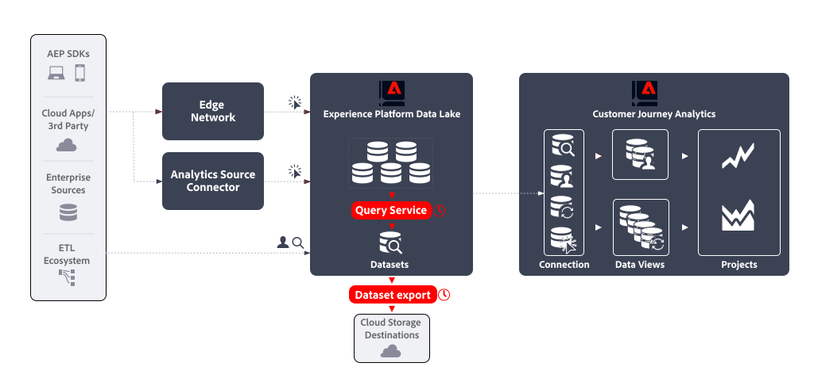

# Funzionalità di emulazione feed dati

I feed di dati di Adobe Analytics sono un modo potente per estrarre dati non elaborati da Adobe Analytics. Questo caso d’uso descrive come ottenere da Experienci Platform un tipo simile di dati non elaborati, in modo da poter utilizzare i dati in altre piattaforme, strumenti al di fuori di Adobe e a discrezione della tua organizzazione.

## Introduzione

L’emulazione di un feed dati di Adobe Analytics prevede:

* definizione di un **query pianificata** che genera i dati per il feed dati come set di dati di output , utilizzando **Servizio query**.
* definizione di un **esportazione di set di dati pianificata** che esporta il set di dati di output in una destinazione di archiviazione cloud, utilizzando **Esportazione set di dati**.




## Prerequisiti

Prima di utilizzare la funzionalità descritta in questo caso d’uso, assicurati di soddisfare tutti i seguenti requisiti:

* Un’implementazione funzionante che raccoglie dati nel data lake di Experienci Platform.
* Accedere al componente aggiuntivo Data Distiller per assicurarsi di avere i diritti per eseguire query batch. Consulta [Pacchetto Query Service](https://experienceleague.adobe.com/docs/experience-platform/query/packaging.html) per ulteriori informazioni.
* Accesso alla funzionalità Esporta set di dati, disponibile quando hai acquistato il pacchetto Real-Time CDP Prime o Ultimate, Adobe Journey Optimizer o Customer Journey Analytics. Consulta [Esportare i set di dati nelle destinazioni dell’archiviazione cloud](https://experienceleague.adobe.com/docs/experience-platform/destinations/ui/activate/export-datasets.html) per ulteriori informazioni.
* Una o più destinazioni (ad esempio: Amazon S3, Google Cloud Storage) configurate per esportare i dati non elaborati del feed di dati.


## Servizio query

Experienci Platform Query Service consente di eseguire query e unire qualsiasi set di dati nel data lake di Experienci Platform come se si trattasse di una tabella di database. Puoi quindi acquisire i risultati come nuovo set di dati da utilizzare ulteriormente nel reporting o per l’esportazione.

Utilizza il servizio Query [interfaccia utente](https://experienceleague.adobe.com/docs/experience-platform/query/ui/overview.html?lang=it), a [client connesso tramite il protocollo PostgresQL](https://experienceleague.adobe.com/docs/experience-platform/query/clients/overview.html), o [API RESTful](https://experienceleague.adobe.com/docs/experience-platform/query/api/getting-started.html) per creare e pianificare query per la raccolta dei dati per il proprio feed di dati.

### Crea query

È possibile utilizzare tutte le funzionalità di SQL ANSI standard per le istruzioni SELECT e altri comandi limitati per creare ed eseguire query che generano i dati per il feed di dati. Consulta [Sintassi SQL](https://experienceleague.adobe.com/docs/experience-platform/query/sql/syntax.html) per ulteriori informazioni. Oltre a questa sintassi SQL, Adobe supporta:

* predefinito [Funzioni definite dall&#39;Adobe (ADF)](https://experienceleague.adobe.com/docs/experience-platform/query/sql/adobe-defined-functions.html) che consentono di eseguire attività di business comuni sui dati evento memorizzati nel data lake di Experienci Platform, tra cui funzioni per [Sessionizzazione](https://experienceleague.adobe.com/docs/analytics/components/virtual-report-suites/vrs-mobile-visit-processing.html) e [Attribuzione](https://experienceleague.adobe.com/docs/analytics/analyze/analysis-workspace/attribution/overview.html?lang=it),
* diversi [Funzioni SQL Spark](https://experienceleague.adobe.com/docs/experience-platform/query/sql/spark-sql-functions.html),
* [comandi PostgreSQL dei metadati](https://experienceleague.adobe.com/docs/experience-platform/query/sql/metadata.html),
* [istruzioni preparate](https://experienceleague.adobe.com/docs/experience-platform/query/sql/prepared-statements.html).

#### Colonne feed dati

I campi XDM che puoi utilizzare nella query dipendono dalla definizione dello schema su cui si basano i set di dati. Assicurati di comprendere lo schema sottostante il set di dati. Consulta la [Guida all’interfaccia utente dei set di dati](https://experienceleague.adobe.com/docs/experience-platform/catalog/datasets/user-guide.html?lang=it) per ulteriori informazioni.

Per aiutarti a definire la mappatura tra le colonne Feed dati e i campi XDM, vedi [Mappatura dei campi di Analytics](https://experienceleague.adobe.com/docs/experience-platform/sources/connectors/adobe-applications/mapping/analytics.html?lang=it). Consulta anche [Panoramica dell’interfaccia utente degli schemi](https://experienceleague.adobe.com/docs/experience-platform/xdm/ui/overview.html#defining-xdm-fields) per ulteriori informazioni su come gestire le risorse XDM, inclusi schemi, classi, gruppi di campi e tipi di dati.

Ad esempio, nel caso in cui desideri utilizzare *nome pagina* come parte del feed di dati:

* Nell’interfaccia utente di Adobe Analytics Data Feed, puoi selezionare **[!UICONTROL pagename]** come colonna da aggiungere alla definizione del feed dati.
* In Query Service puoi includere: `web.webPageDetails.name` dal `sample_event_dataset_for_website_global_v1_1` set di dati (basato su **Schema evento di esempio per il sito web (Global v1.1)** experience event) nella query. Consulta la [Gruppo di campi schema Dettagli web](https://experienceleague.adobe.com/docs/experience-platform/xdm/field-groups/event/web-details.html) per ulteriori informazioni.

<!--
To understand the mapping between Adobe Analytics data feed columns and XDM fields in your experience event dataset and underlying schema, see [Analytics fields mapping](https://experienceleague.adobe.com/docs/experience-platform/sources/connectors/adobe-applications/mapping/analytics.html) and [Adobe Analytics ExperienceEvent Full Extension schema field group](https://experienceleague.adobe.com/docs/experience-platform/xdm/field-groups/event/analytics-full-extension.html) for more information.

Furthermore, the [automatically collected information by the Experience Platform Web SDK (out of the box)](https://experienceleague.adobe.com/docs/experience-platform/edge/data-collection/automatic-information.html) might be relevant to identify columns for your query.
-->

#### Identità

Ad Experience Platform, sono disponibili varie identità. Quando crei le query, assicurati di eseguire correttamente le query sulle identità.


Spesso le identità si trovano in un gruppo di campi separato. In un’implementazione ECID (`ecid`) può essere definito come parte di un gruppo di campi con un valore `core` oggetto, che fa parte di un `identification` oggetto (ad esempio: `_sampleorg.identification.core.ecid`). Gli ECID potrebbero essere organizzati in modo diverso negli schemi.

In alternativa, puoi utilizzare `identityMap` per eseguire una query per le identità. Questo oggetto è di tipo `Map` e utilizza un [struttura dati nidificata](#nested-data-structure).

Consulta [Definire i campi di identità nell’interfaccia utente](https://experienceleague.adobe.com/docs/experience-platform/xdm/ui/fields/identity.html) per ulteriori informazioni su come definire i campi di identità, consulta Experienci Platform.

Fai riferimento a [Identificatori primari nei dati di Analytics](https://experienceleague.adobe.com/docs/experience-platform/sources/connectors/adobe-applications/analytics.html#primary-identifiers-in-analytics-data) per capire come le identità di Adobe Analytics vengono mappate alle identità di Experienci Platform quando si utilizza il connettore di origine di Analytics. Questo potrebbe fungere da guida per la configurazione delle identità, anche quando non si utilizza il connettore di origine di Analytics.


#### Dati e identificazione a livello di hit

In base all’implementazione, i dati a livello di hit tradizionalmente raccolti in Adobe Analytics ora vengono memorizzati come dati evento con marca temporale in Experienci Platform. La tabella seguente è estratta da [Mappatura dei campi di Analytics](https://experienceleague.adobe.com/docs/experience-platform/sources/connectors/adobe-applications/mapping/analytics.html#generated-mapping-fields) e mostra esempi su come mappare le colonne Feed dati di Adobe Analytics specifiche per i livelli di hit con i campi XDM corrispondenti nelle query. La tabella mostra anche esempi di identificazione di hit, visite e visitatori tramite i campi XDM.

| Colonna feed dati | Campo XDM | Tipo | Descrizione |
|---|---|---|---|
| `hitid_high` + `hitid_low` | `_id` | string | Un identificatore univoco per identificare un hit. |
| `hitid_low` | `_id` | string | Utilizzato con `hitid_high` per identificare in modo univoco un hit. |
| `hitid_high` | `_id` | string | Utilizzato con `hitid_high` per identificare in modo univoco un hit. |
| `hit_time_gmt` | `receivedTimestamp` | string | La marca temporale dell’hit, in base all’ora UNIX®. |
| `cust_hit_time_gmt` | `timestamp` | string | Viene utilizzato solo nei set di dati abilitati per le marche temporali. Timestamp inviato con l’hit, in base all’ora UNIX®. |
| `visid_high` + `visid_low` | `identityMap` | oggetto | Un identificatore univoco per una visita. |
| `visid_high` + `visid_low` | `endUserIDs._experience.aaid.id` | string | Un identificatore univoco per una visita. |
| `visid_high` | `endUserIDs._experience.aaid.primary` | booleano | Utilizzato con `visid_low` per identificare in modo univoco una visita. |
| `visid_high` | `endUserIDs._experience.aaid.namespace.code` | string | Utilizzato con `visid_low` per identificare in modo univoco una visita. |
| `visid_low` | `identityMap` | oggetto | Utilizzato con `visid_high` per identificare in modo univoco una visita. |
| `cust_visid` | `identityMap` | oggetto | L’ID visitatore del cliente. |
| `cust_visid` | `endUserIDs._experience.aacustomid.id` | oggetto | L’ID visitatore del cliente. |
| `cust_visid` | `endUserIDs._experience.aacustomid.primary` | booleano | Il codice spazio dei nomi ID visitatore del cliente. |
| `cust_visid` | `endUserIDs._experience.aacustomid.namespace.code` | string | Utilizzato con `visid_low` per identificare in modo univoco l’id visitatore del cliente. |
| `geo\_*` | `placeContext.geo.* ` | stringa, numero | Dati di geolocalizzazione, come paese, regione, città e altri |
| `event_list` | `commerce.purchases`, `commerce.productViews`, `commerce.productListOpens`, `commerce.checkouts`, `commerce.productListAdds`, `commerce.productListRemovals`, `commerce.productListViews`, `_experience.analytics.event101to200.*`, ..., `_experience.analytics.event901_1000.*` | string | Eventi di e-commerce standard e personalizzati attivati sull’hit. |
| `page_event` | `web.webInteraction.type` | string | Tipo di hit inviato nella richiesta di immagine (hit standard, collegamento di download, collegamento di uscita o collegamento personalizzato su cui è stato fatto clic). |
| `page_event` | `web.webInteraction.linkClicks.value` | number | Tipo di hit inviato nella richiesta di immagine (hit standard, collegamento di download, collegamento di uscita o collegamento personalizzato su cui è stato fatto clic). |
| `page_event_var_1` | `web.webInteraction.URL` | string | Variabile utilizzata solo nelle richieste di immagini per il tracciamento dei collegamenti. Questa variabile contiene l’URL del collegamento di download, del collegamento di uscita o del collegamento personalizzato su cui è stato fatto clic. |
| `page_event_var_2` | `web.webInteraction.name` | string | Variabile utilizzata solo nelle richieste di immagini per il tracciamento dei collegamenti. Elenca il nome personalizzato del collegamento, se specificato. |
| `paid_search` | `search.isPaid` | booleano | Flag impostato se l’hit corrisponde al rilevamento di ricerche a pagamento. |
| `ref_type` | `web.webReferrertype` | string | Un ID numerico che rappresenta il tipo di riferimento per l’hit. |

#### Pubblica colonne

I feed di dati di Adobe Analytics utilizzano il concetto di colonne con una `post_` prefisso, ovvero colonne contenenti dati dopo l’elaborazione. Per ulteriori informazioni, consulta [Domande frequenti sui feed di dati](https://experienceleague.adobe.com/docs/analytics/export/analytics-data-feed/df-faq.html#post).

I dati raccolti nei set di dati tramite Experienci Platform Edge Network (Web SDK, Mobile SDK, Server API) non hanno alcun concetto di `post_` campi. Di conseguenza, `post_` prefisso e *non*-`post_` le colonne dei feed dati con prefisso vengono mappate sugli stessi campi XDM. Ad esempio, entrambi `page_url` e `post_page_url` le colonne del feed dati vengono mappate allo stesso modo `web.webPageDetails.URL` Campo XDM.

Consulta [Confrontare l’elaborazione dei dati in Adobe Analytics e Customer Journey Analytics](https://experienceleague.adobe.com/docs/analytics-platform/using/compare-aa-cja/cja-aa-comparison/data-processing-comparisons.html) per una panoramica della differenza nell’elaborazione dei dati.

Il `post_` il tipo di colonna del prefisso dei dati, se raccolto in Experienci Platform data lake, richiede tuttavia trasformazioni avanzate prima di poter essere utilizzato correttamente in un caso di utilizzo di feed di dati. L’esecuzione di queste trasformazioni avanzate nelle query comporta l’utilizzo di [Funzioni definite da Adobe](https://experienceleague.adobe.com/docs/experience-platform/query/sql/adobe-defined-functions.html) per la sessionizzazione, l’attribuzione e la deduplicazione. Consulta [Esempi](#examples) su come utilizzare queste funzioni.

#### Ricerche

Per cercare dati da altri set di dati, è possibile utilizzare la funzionalità SQL standard (`WHERE` clausola, `INNER JOIN`, `OUTER JOIN`, e altri).

#### Calcoli

Per eseguire calcoli sui campi (colonne), utilizzare le funzioni SQL standard, ad esempio `COUNT(*)`) o [operatori e funzioni matematiche e statistiche](https://experienceleague.adobe.com/docs/experience-platform/query/sql/spark-sql-functions.html#math) parte di Spark SQL. Inoltre, [funzioni finestra](https://experienceleague.adobe.com/docs/experience-platform/query/sql/adobe-defined-functions.html#window-functions) fornisce supporto per aggiornare le aggregazioni e restituire singoli elementi per ogni riga in un sottoinsieme ordinato. Consulta [Esempi](#examples) su come utilizzare queste funzioni.

#### Struttura dati nidificata

Gli schemi su cui si basano i set di dati spesso contengono tipi di dati complessi, tra cui strutture di dati nidificate. Precedentemente menzionato `identityMap` è un esempio di struttura di dati nidificata. Vedi di seguito per un esempio di `identityMap` dati.

```json
{
   "identityMap":{
      "FPID":[
         {
            "id":"55613368189701342632255821452918751312",
            "authenticatedState":"ambiguous"
         }
      ],
      "CRM":[
         {
            "id":"2394509340-30453470347",
            "authenticatedState":"authenticated"
         }
      ]
   }
}
```

È possibile utilizzare [`explode()` o altre funzioni di array](https://experienceleague.adobe.com/docs/experience-platform/query/sql/spark-sql-functions.html#arrays) da Spark SQL per passare ai dati all’interno di una struttura di dati nidificata, ad esempio:

```sql
select explode(identityMap) from demosys_cja_ee_v1_website_global_v1_1 limit 15;
```

In alternativa, puoi fare riferimento a singoli elementi utilizzando la notazione del punto. Ad esempio:

```sql
select identityMap.ecid from demosys_cja_ee_v1_website_global_v1_1 limit 15;
```

Consulta [Utilizzo delle strutture di dati nidificati in Query Service](https://experienceleague.adobe.com/docs/experience-platform/query/key-concepts/nested-data-structures.html) per ulteriori informazioni.


#### Esempi

Per le query che utilizzano i dati dei set di dati nel data lake di Experienci Platform, sfruttano le funzionalità aggiuntive di Funzioni definite da Adobe e/o Spark SQL e che fornirebbero risultati simili a quelli di un feed di dati Adobe Analytics equivalente, consulta

* [navigazione abbandonata](https://experienceleague.adobe.com/docs/experience-platform/query/use-cases/abandoned-browse.html)
* [analisi dell’attribuzione](https://experienceleague.adobe.com/docs/experience-platform/query/use-cases/attribution-analysis.html)
* [filtro bot](https://experienceleague.adobe.com/docs/experience-platform/query/use-cases/bot-filtering.html)
* e altri casi d’uso di esempio nella guida di Query Service.


### Pianifica query

Pianifica la query per assicurarti che venga eseguita e che i risultati vengano generati nell’intervallo desiderato.

#### Utilizzo dell’editor delle query

È possibile pianificare una query utilizzando l&#39;Editor query. Quando pianifichi la query, definisci un set di dati di output. Consulta [Pianificazioni query](https://experienceleague.adobe.com/docs/experience-platform/query/ui/query-schedules.html) per ulteriori informazioni.


#### Utilizzo dell’API Query Service

In alternativa, puoi utilizzare le API RESTful per definire una query e pianificarla. Consulta [Guida API di Query Service](https://experienceleague.adobe.com/docs/experience-platform/query/api/getting-started.html) per ulteriori informazioni.
Assicurati di definire il set di dati di output come parte del `ctasParameters` durante la creazione della query ([Creare una query](https://developer.adobe.com/experience-platform-apis/references/query-service/#tag/Queries/operation/createQuery)) o durante la creazione della pianificazione per una query ([Creare una query pianificata](https://developer.adobe.com/experience-platform-apis/references/query-service/#tag/Schedules/operation/createSchedule)).


## Esportazione set di dati

Dopo aver creato e pianificato la query e verificato che i risultati nei set di dati di output siano in linea con i requisiti, puoi esportare i set di dati non elaborati in destinazioni di archiviazione cloud. Questa esportazione si trova nella terminologia di Experienci Platform Destinations, o destinazioni di esportazione del set di dati. Consulta [Esportare i set di dati nelle destinazioni dell’archiviazione cloud](https://experienceleague.adobe.com/docs/experience-platform/destinations/ui/activate/export-datasets.html) panoramica.

Sono supportate le seguenti destinazioni di archiviazione cloud:

* [Archiviazione Azure Data Lake Gen2](https://experienceleague.adobe.com/docs/experience-platform/destinations/catalog/cloud-storage/adls-gen2.html)
* [Data Landing Zone](https://experienceleague.adobe.com/docs/experience-platform/destinations/catalog/cloud-storage/data-landing-zone.html)
* [Archiviazione cloud Google](https://experienceleague.adobe.com/docs/experience-platform/destinations/catalog/cloud-storage/google-cloud-storage.html)
* [Amazon S3](https://experienceleague.adobe.com/docs/experience-platform/destinations/catalog/cloud-storage/amazon-s3.html#changelog)
* [BLOB di Azure](https://experienceleague.adobe.com/docs/experience-platform/destinations/catalog/cloud-storage/azure-blob.html#changelog)
* [SFTP](https://experienceleague.adobe.com/docs/experience-platform/destinations/catalog/cloud-storage/sftp.html#changelog)


### Interfaccia utente Experienci Platform

Puoi esportare e pianificare l’esportazione dei set di dati di output tramite l’interfaccia utente di Experienci Platform. Questa sezione descrive i passaggi necessari.

#### Seleziona destinazione

Dopo aver determinato la destinazione di archiviazione cloud da esportare per il set di dati di output, [seleziona la destinazione](https://experienceleague.adobe.com/docs/experience-platform/destinations/ui/activate/export-datasets.html#select-destination). Quando non hai ancora configurato una destinazione per l’archiviazione cloud preferita, devi [creare una nuova connessione di destinazione](https://experienceleague.adobe.com/docs/experience-platform/destinations/ui/connect-destination.html).

Come parte della configurazione di una destinazione puoi definire il tipo di file (JSON o Parquet), se il file risultante deve essere compresso o meno e se un file manifesto deve essere incluso o meno.


#### Seleziona set di dati

Dopo aver selezionato la destinazione, nel successivo **[!UICONTROL Select datasets]** passaggio è necessario selezionare il set di dati di output dall’elenco dei set di dati. Se hai creato più query pianificate e desideri che i set di dati di output vengano inviati alla stessa destinazione di archiviazione cloud, puoi selezionare i set di dati di output corrispondenti. Consulta [Seleziona i set di dati](https://experienceleague.adobe.com/docs/experience-platform/destinations/ui/activate/export-datasets.html#select-datasets) per ulteriori informazioni.

#### Pianificare l’esportazione di set di dati

Infine, desideri pianificare l’esportazione del set di dati come parte del **[!UICONTROL Scheduling]** passaggio. In questo passaggio puoi definire la pianificazione e se l’esportazione del set di dati di output deve essere incrementale o meno. Consulta [Pianificare l’esportazione di set di dati](https://experienceleague.adobe.com/docs/experience-platform/destinations/ui/activate/export-datasets.html#scheduling) per ulteriori informazioni.


#### Passaggi finali

[Revisione](https://experienceleague.adobe.com/docs/experience-platform/destinations/ui/activate/export-datasets.html#review) la selezione e, se corretto, avvia l’esportazione del set di dati di output nella destinazione di archiviazione cloud.

Devi [verifica](https://experienceleague.adobe.com/docs/experience-platform/destinations/ui/activate/export-datasets.html#verify) esportazione dei dati riuscita. Durante l’esportazione dei set di dati, in Experienci Platform ne vengono creati uno o più `.json` o `.parquet` file nel percorso di archiviazione definito nella destinazione. I nuovi file verranno archiviati nel percorso di archiviazione in base alla pianificazione di esportazione configurata. In Experience Platform viene creata una struttura di cartelle nel percorso di archiviazione specificato come parte della destinazione selezionata, in cui vengono depositati i file esportati. Per ogni esportazione viene creata una nuova cartella, seguendo il modello: `folder-name-you-provided/datasetID/exportTime=YYYYMMDDHHMM`. Il nome di file predefinito viene generato in modo casuale e garantisce che i nomi di file esportati siano univoci.

### API del servizio Flusso

In alternativa, puoi esportare e pianificare l’esportazione dei set di dati di output utilizzando le API. I passaggi necessari sono documentati in [Esportare i set di dati utilizzando l’API del servizio Flusso](https://experienceleague.adobe.com/docs/experience-platform/destinations/api/export-datasets.html).

#### Introduzione

Per esportare i set di dati, assicurati di disporre dei [autorizzazioni richieste](https://experienceleague.adobe.com/docs/experience-platform/destinations/api/export-datasets.html#permissions). Verifica inoltre che la destinazione in cui desideri inviare il set di dati di output supporti l’esportazione dei set di dati. Devi quindi [raccogliere i valori per le intestazioni obbligatorie e facoltative](https://experienceleague.adobe.com/docs/experience-platform/destinations/api/export-datasets.html#gather-values-headers) che utilizzi nelle chiamate API. È inoltre necessario [identificare la specifica di connessione e gli ID delle specifiche di flusso della destinazione](https://experienceleague.adobe.com/docs/experience-platform/destinations/api/export-datasets.html#gather-connection-spec-flow-spec) intendi esportare i set di dati in.

#### Recuperare i set di dati idonei

È possibile [recuperare un elenco di set di dati idonei](https://experienceleague.adobe.com/docs/experience-platform/destinations/api/export-datasets.html#retrieve-list-of-available-datasets) per l’esportazione e verifica se il set di dati di output fa parte di tale elenco utilizzando [`GET /connectionSpecs/{id}/configs`](https://developer.adobe.com/experience-platform-apis/references/destinations/#tag/Configurations/operation/getDatasets) API.


#### Crea connessione sorgente

Ora devi [creare una connessione sorgente](https://experienceleague.adobe.com/docs/experience-platform/destinations/api/export-datasets.html#create-source-connection) per il set di dati di output, utilizzando il relativo ID univoco, che desideri esportare nella destinazione di archiviazione cloud. Utilizzi il [`POST /sourceConnections`](https://developer.adobe.com/experience-platform-apis/references/destinations/#tag/Source-connections/operation/postSourceConnection) API.

#### Autentica nella destinazione (crea connessione di base)

Ora devi [creare una connessione di base](https://experienceleague.adobe.com/docs/experience-platform/destinations/api/export-datasets.html#create-base-connection) per autenticare e archiviare correttamente le credenziali nella destinazione di archiviazione cloud utilizzando [`POST /targetConection`](https://developer.adobe.com/experience-platform-apis/references/destinations/#tag/Target-connections/operation/postTargetConnection) API.


#### Fornire parametri di esportazione

Quindi, devi [crea una connessione di destinazione aggiuntiva in cui sono memorizzati i parametri di esportazione](https://experienceleague.adobe.com/docs/experience-platform/destinations/api/export-datasets.html#create-target-connection) per il set di dati di output utilizzando, ancora una volta, il [`POST /targetConection`](https://developer.adobe.com/experience-platform-apis/references/destinations/#tag/Target-connections/operation/postTargetConnection) API. Questi parametri di esportazione includono posizione, formato file, compressione e altro ancora.

#### Imposta flusso di dati

Finalmente, [impostare il flusso di dati](https://experienceleague.adobe.com/docs/experience-platform/destinations/api/export-datasets.html#create-dataflow) per garantire che il set di dati di output venga esportato nella destinazione di archiviazione cloud utilizzando [`POST /flows`](https://developer.adobe.com/experience-platform-apis/references/destinations/#tag/Dataflows/operation/postFlow) API. In questo passaggio puoi definire la pianificazione per l’esportazione utilizzando `scheduleParams` parametro.

#### Convalida flusso di dati

A [verificare le esecuzioni corrette del flusso di dati](https://experienceleague.adobe.com/docs/experience-platform/destinations/api/export-datasets.html#get-dataflow-runs), utilizza [`GET /runs`](https://developer.adobe.com/experience-platform-apis/references/destinations/#tag/Dataflow-runs/operation/getFlowRuns) API, specificando l’ID del flusso di dati come parametro di query. Questo ID del flusso di dati è un identificatore restituito quando imposti il flusso di dati.

[Verifica](https://experienceleague.adobe.com/docs/experience-platform/destinations/ui/activate/export-datasets.html#verify) esportazione dei dati riuscita. Durante l’esportazione dei set di dati, in Experienci Platform ne vengono creati uno o più `.json` o `.parquet` file nel percorso di archiviazione definito nella destinazione. I nuovi file verranno archiviati nel percorso di archiviazione in base alla pianificazione di esportazione configurata. In Experience Platform viene creata una struttura di cartelle nel percorso di archiviazione specificato come parte della destinazione selezionata, in cui vengono depositati i file esportati. Per ogni esportazione viene creata una nuova cartella, seguendo il modello: `folder-name-you-provided/datasetID/exportTime=YYYYMMDDHHMM`. Il nome di file predefinito viene generato in modo casuale e garantisce che i nomi di file esportati siano univoci.

## Conclusione

In breve, l’emulazione della funzionalità Feed dati di Adobe Analytics implica la configurazione di query pianificate tramite Query Service e l’utilizzo dei risultati di tali query nelle esportazioni di set di dati pianificate.

>[!IMPORTANT]
>
>In questo caso d’uso sono coinvolti due scheduler. Per garantire il corretto funzionamento della funzionalità dei feed dati emulati, assicurati che le pianificazioni configurate in Query Service e le esportazioni di dati non interferiscano.
