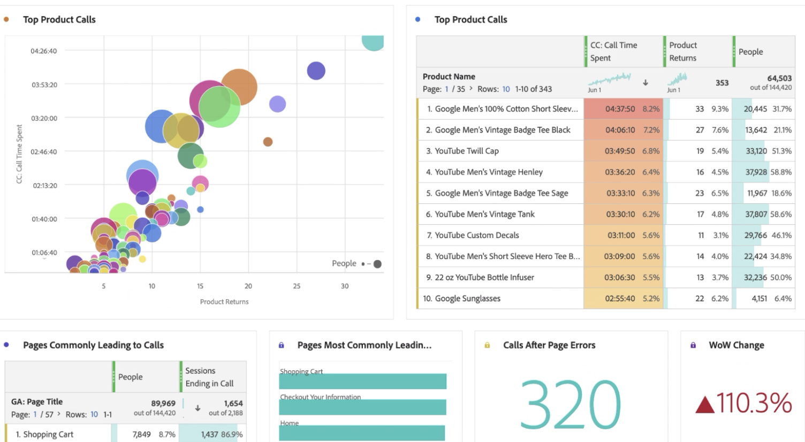

# Rapporto sui dati Google Analytics nel Customer Journey Analytics

Ora che hai [acquisito i dati delle Google Analytics in Experience Platform e Customer Journey Analytics (CJA)](/help/use-cases/ga-to-cja.md), ti mostreremo alcuni scenari utili per la generazione di rapporti su tali dati.

## Visualizzare dati web e dati app come set di dati combinati

Questo diagramma di Venn mostra la sovrapposizione degli utenti sul tuo sito web (dai tuoi dati Google Analytics), sulla tua app mobile (dai tuoi dati Firebase) e dal tuo call center. Puoi anche vedere i prodotti dalle prestazioni migliori, non solo sul web, ma anche nell’app mobile. Puoi anche ottenere il totale dei ricavi da entrambi, utilizzando una metrica calcolata. Osserva come i prodotti migliori raccontano una storia diversa quando vedi le entrate combinate. Senza i set di dati combinati, non avreste mai saputo che il &quot;Twill cap&quot; era un performer così forte.

## Identificare i motivi delle chiamate e ridurre il volume delle chiamate

Per verificare di aver ricevuto molte chiamate, puoi impostare la durata del call center negli ultimi 2 mesi. È facile vedere la tendenza crescente. Questo è preoccupante, dal momento che ogni minuto i vostri rappresentanti del call center sono al telefono costa denaro. Questo può sicuramente avere un impatto sul tuo fondo.

Diamo un’occhiata alle principali ragioni che causano l’aumento delle chiamate al call center. Notare che &quot;Carta di credito negata&quot;, &quot;Rimuovi carta di credito&quot; e &quot;Prodotto danneggiato&quot; sono i motivi principali. Questo può già suggerire come migliorare l’esperienza online. Puoi anche seguire la tendenza di queste ragioni di chiamata e vedere quali hanno contribuito maggiormente al picco complessivo. È interessante notare che i clienti con &quot;Prodotto danneggiato&quot; hanno trascorso più di 3 minuti per chiamata.

Diamo un’occhiata più approfondita e vediamo quali prodotti stanno causando la maggior parte delle chiamate al tuo call center e quanti clienti hanno effettuato tali chiamate. Il grafico a bolle indica che sono state chiamate 20.000 persone, hanno trascorso più di 4 ore 30 minuti e hanno restituito 33 unità del prodotto &quot;Men&#39;s short Sleeve Tee&quot;.

È possibile suddividere questa informazione per capire perché queste persone hanno restituito il prodotto trascinando nella dimensione &quot;Motivo della chiamata&quot;. Come potete vedere, il motivo per cui questo prodotto sta ricevendo così tante chiamate è dovuto a &quot;Prodotto danneggiato&quot;. Il passo successivo sarebbe quello di contattare il reparto di controllo qualità e vedere perché i clienti hanno ricevuto T-shirt danneggiate.

Ora esaminiamo quali pagine del sito web hanno guidato le chiamate in arrivo al call center. Questo consente di sapere dove si trovano le esperienze poco performanti sul sito web e di aiutare i responsabili dei prodotti a risolvere tali problemi.

Lo facciamo per

* Utilizzo di una metrica calcolata per filtrare i dati in base solo alle sessioni terminate con una chiamata al call center.
* Utilizzo del modello &quot;partecipazione&quot; nella Attribution IQ [di CJA](https://experienceleague.adobe.com/docs/analytics-platform/using/cja-workspace/attribution/models.html?lang=en#cja-workspace).

Puoi vedere facilmente quali pagine partecipano più di frequente a una sessione che termina con una chiamata . Puoi vedere che le pagine &quot;Carrello acquisti&quot; e &quot;Informazioni di pagamento&quot; guidavano la maggior parte delle chiamate. Poiché hai incluso anche i dati dell’app mobile firebase, puoi persino vedere gli errori di pagina e gli arresti dell’app che generano le chiamate . Si tratta di un punto dati molto importante se desideri fornire esperienze web e app mobili straordinarie.

Infine, utilizzando la tabella coorte in Analysis Workspace, è facile vedere quanto tempo normalmente gli utenti impiegano per chiamare il nostro call center dopo aver visitato il sito web. Qui potete vedere che il tempo medio è tra 3 e 4 settimane.

## Utilizzare l’attribuzione marketing avanzata

CJA consente di utilizzare modelli di attribuzione sofisticati sui dati multicanale. Nell’esempio seguente, è disponibile un confronto tra l’applicazione dell’attribuzione Ultimo contatto, Primo contatto, A forma di u e algoritmica dei ricavi alla dimensione Gruppo canali Google Analytics.

Utilizzando una metrica calcolata, puoi applicare tale attribuzione ai ricavi web, alle entrate delle app mobili e persino rimuovere i rendimenti dei prodotti. Di conseguenza, puoi vedere i ricavi netti effettivi per ogni canale di marketing.

Attribution IQ consente inoltre di filtrare facilmente i dati. Puoi visualizzare l’attribuzione solo su set specifici di utenti, ad esempio quelli che utilizzano più di un dispositivo.

Infine, puoi anche attribuire i ricavi Web e app al contenuto Google Ad. Noterai che hai ottenuto più ricavi dall&#39;app mobile guidata dai nostri Google Ads online che dal web. Ordinando gli annunci in base ai ricavi da web e app, si ottiene un&#39;immagine molto diversa di quello che i vostri annunci Google più performanti erano.

Senza CJA, non avresti potuto sapere che i tuoi annunci online avessero un impatto sui prodotti acquistati nella tua app mobile. Ora puoi vedere che i ricavi delle app mobili da Google Ads rappresentano un ulteriore $14-$5.000, rispetto al solo web.

