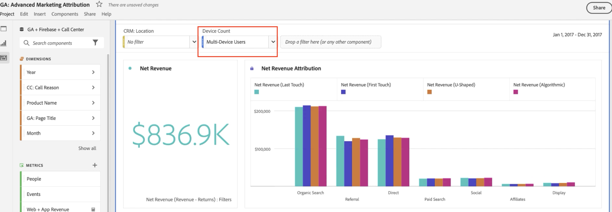

# Rapporto sui dati Google Analytics in Customer Journey Analytics

Quando i dati sono disponibili in Customer Journey Analytics, gli esempi seguenti forniscono scenari utili per la generazione di rapporti su tali dati.

## Visualizzare dati da web e app come set di dati combinati

Questo diagramma di Venn mostra la sovrapposizione degli utenti dal sito web (dai dati Google Analytics), dall’app mobile (dai dati Firebase) e dal call center. Evidenzia inoltre i prodotti con prestazioni migliori, non solo sul web, ma anche nell’app mobile. Utilizzando una metrica calcolata, puoi anche ottenere il totale dei ricavi da entrambi i canali. Osserva come i prodotti migliori raccontano una storia diversa quando si considerano i ricavi combinati. Senza i set di dati combinati, non sarebbe stato possibile comprendere il successo dell’articolo “Twill cap”.

## Identificare i motivi delle chiamate e ridurre il volume di chiamate

Puoi impostare la tendenza del tempo impiegato dal call center negli ultimi due mesi per determinare il volume delle chiamate. L’esempio seguente mostra la tendenza di questi dati negli ultimi due mesi. L’esempio seguente mostra una tendenza crescente che può influire sui costi organizzativi.

L’utilizzo della dimensione &quot;Motivo della chiamata&quot; può suggerire modi per migliorare l’esperienza web, evitando in primo luogo che le persone chiamino. L’esempio precedente mostra che “Prodotto danneggiato” ha un tempo medio di circa 3 minuti per chiamata, dando alla tua organizzazione un modo preciso per migliorare l’esperienza del cliente e ridurre i costi del call center.

Puoi visualizzare quali prodotti causano la maggior parte delle chiamate al call center e quanti clienti hanno effettuato tali chiamate. Il grafico a bolla indica che hanno chiamato 20.000 persone, per più di 4 ore e 30 minuti, e che sono stati rese 33 unità del prodotto “T-shirt uomo maniche corte”.

Nell’esempio, l’applicazione di un breakdown per la dimensione “Motivo chiamata” mostra un elemento dimensione “Prodotto danneggiato”. A questo punto non resta che contattare il reparto di controllo qualità e cercare di capire perché i clienti hanno ricevuto T-shirt danneggiate.

Puoi vedere quali pagine web hanno portato le chiamate al call center. Questo rapporto consente di capire quali aree del sito web offrono esperienze non ottimali, affinché i Product Manager possano occuparsi di migliorarle. L’esempio seguente utilizza una metrica calcolata con un modello di attribuzione di partecipazione per filtrare i dati in base alle sole sessioni terminate con una chiamata al call center.

L’esempio seguente mostra che le pagine “Carrello acquisti” e “Informazioni di pagamento” generano la maggior parte delle chiamate.

La tabella coorte consente di vedere dopo quanto tempo normalmente gli utenti chiamano il call center dopo aver visitato il sito web. L’esempio seguente indica che il tempo medio per questo set di dati di esempio è tra tre e quattro settimane.

## Utilizzare l’attribuzione marketing avanzata

Il Customer Journey Analytics consente di utilizzare modelli di attribuzione sofisticati sui dati cross-channel. L’esempio seguente propone un confronto tra l’applicazione dell’attribuzione Ultimo contatto, Primo contatto, A forma di U e Algoritmica dei ricavi alla dimensione Raggruppamenti canali di Google Analytics.

Con una metrica calcolata, puoi applicare tale attribuzione ai ricavi dal web, dall’app mobile e persino rimuovere eventuali resi. Il risultato è un importo realmente netto per ogni canale di marketing.

Attribution IQ consente inoltre di filtrare i dati. Puoi visualizzare l’attribuzione rispetto a solo specifici set di utenti, ad esempio considerando solo chi utilizza più dispositivi.

Puoi anche attribuire i ricavi dal sito web e dall’app ai contenuti Google Ad. L’esempio di questo set di dati ha portato maggiori ricavi dall’app mobile guidata da Google Ads online che dal web. Ordinando gli annunci in base ai ricavi derivanti dal web e dall’app, ottieni un quadro diverso di quali siano gli annunci Google Ads più preformanti.

La combinazione di set di dati nel Customer Journey Analytics consente di vedere in questo esempio che gli annunci online hanno avuto un impatto sui prodotti acquistati nell’app mobile. La visualizzazione seguente mostra che i ricavi dall’app mobile generati da Google Ads rappresentano un ulteriore $ 14.000 - $ 15.000, rispetto al solo web.

