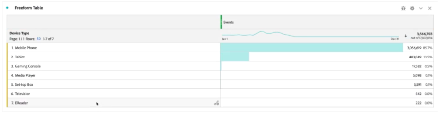

# Aggiunta di ricerche globali ai set di dati

Le ricerche globali migliorano la capacità del Customer Journey Analytics di creare rapporti su alcune dimensioni/attributi che non sono utili da soli, ma che sono utili se uniti ad altri dati. Alcuni esempi includono gli attributi dei dispositivi mobili e gli attributi delle dimensioni del sistema operativo e del browser, ad esempio i numeri di versione del browser. Una ricerca globale è molto simile a un set di dati di ricerca (noto come classificazioni in Adobe Analytics  tradizionale). Tuttavia, è globale tra le organizzazioni  Experienci Cloud. Le ricerche globali vengono applicate automaticamente a tutti i set di dati evento che contengono alcuni campi dello schema XDM (vedere di seguito per i campi specifici).
Per ogni posizione dello schema che  Adobe sta classificando, esiste un set di dati di ricerca globale. È possibile utilizzare i set di dati di ricerca globali con il connettore origine Analytics o con altri set di dati personalizzati che possono accettarli.

In Adobe Analytics  tradizionale, queste dimensioni vengono visualizzate autonomamente, mentre in CJA, è necessario includere attivamente queste dimensioni quando si creano le viste dati. Quando un set di dati viene selezionato per l&#39;inclusione in una connessione in CJA, alcuni set di dati vengono contrassegnati come compatibili con le ricerche globali. Il flusso di lavoro delle viste dati sa includere queste dimensioni di ricerca globali, come disponibili per la visualizzazione dati. I file di ricerca vengono automaticamente tenuti aggiornati e disponibili, in tutte le aree geografiche e per tutti gli account. Sono memorizzati in organizzazioni specifiche per l&#39;area geografica associate al cliente.
Quando un utente, nel flusso di lavoro Connessioni, seleziona un set di dati contrassegnato come una chiave per le ricerche globali, l&#39;interfaccia utente delle viste dati sa includere tutte le dimensioni delle ricerche globali disponibili per il reporting.

## Utilizzare ricerche globali con i set di dati del connettore dati del Adobe 

I set di dati di ricerca globali vengono applicati automaticamente al momento del rapporto. Se si utilizza il [Connettore dati di Analytics](https://experienceleague.adobe.com/docs/experience-platform/sources/connectors/adobe-applications/analytics.html?lang=en#connectors) e si inserisce una dimensione per la quale  Adobe fornisce una ricerca globale, viene automaticamente applicata questa ricerca globale. Se un set di dati dell&#39;evento contiene campi [XDM](https://experienceleague.adobe.com/docs/experience-platform/xdm/home.html?lang=en), è possibile applicarvi ricerche globali.

## Utilizzare ricerche globali con set di dati personalizzati

Nel set di dati dell&#39;evento deve essere presente una chiave compatibile con i set di dati di ricerca globali. Finché compili i campi XDM giusti aggiungendo alcuni dei nostri [mixin di schemi Adobe Experience Platform ](https://experienceleague.adobe.com/docs/experience-platform/xdm/mixins/event/environment-details.html?lang=en#mixins) standard, puoi far funzionare i dataset personalizzati con le ricerche globali.

## Campi di ricerca globali disponibili

* browser
*browser, group_id, id
* browser_group
*browser_group, id
* os
   * os, group_id, id
* os_group
   * os_group, id
* mobile_audio_support - multi
* mobile_color_thickness
* mobile_cookie_support
* mobile_device_name
* mobile_device_number_transmission
* mobile_device_type
* mobile_drm - multi
* mobile_image_support - multi
* mobile_information_services
* mobile_java_vm - multi
* mobile_mail_decoration
* mobile_Manufacturer
* mobile_max_bookmark_url_length
* mobile_max_browser_url_length
* mobile_max_mail_url_length
* mobile_net_protocol - multi
* mobile_os
* mobile_push_to_talk
* mobile_screen_height
* mobile_screen_size
* mobile_screen_width
* mobile_video_support - multi

## Report sulle dimensioni di ricerca globale

Per generare rapporti sulle dimensioni di ricerca globale, è necessario aggiungerle quando si crea una visualizzazione dati nel Customer Journey Analytics:

È quindi possibile visualizzare i dati di ricerca in Workspace:

