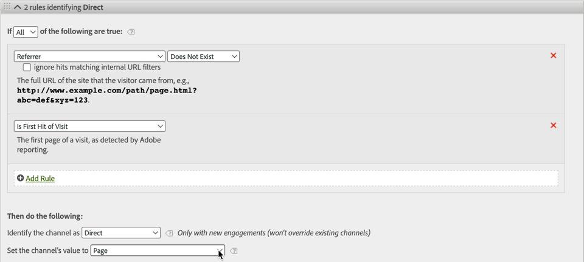

# Utilizzo delle dimensioni dei canali di marketing in Adobe Experience Platform

Se l&#39;azienda utilizza il [Connettore dati di Analytics](https://docs.adobe.com/content/help/it-IT/experience-platform/sources/connectors/adobe-applications/analytics.html) per inserire i dati della suite di rapporti in CJA, puoi configurare una connessione in CJA per creare rapporti sulle dimensioni del canale di marketing.

## Prerequisiti

* I dati della suite di rapporti devono già essere importati in Adobe Experience Platform utilizzando il [Connettore dati di Analytics](https://docs.adobe.com/content/help/en/experience-platform/sources/connectors/adobe-applications/analytics.html). Altre origini di dati non sono supportate, in quanto i canali Marketing si basano sulle regole di elaborazione in una suite di rapporti Analytics.
* Le regole di elaborazione del canale di marketing devono già essere configurate. Consultate [Regole di elaborazione per canali di marketing](https://docs.adobe.com/content/help/en/analytics/components/marketing-channels/c-rules.html) nella guida tradizionale ai componenti di Analytics.

## Elementi dello schema del canale di marketing

Una volta stabilito il Connettore dati di Analytics in una suite di rapporti desiderata, viene creato uno schema XDM. Questo schema contiene tutte le dimensioni e le metriche di Analytics come dati non elaborati. Questi dati non elaborati non contengono attribuzione o persistenza. Al contrario, ogni evento viene eseguito attraverso le regole di elaborazione dei canali di marketing e registra la prima regola che corrisponde. Quando si crea una visualizzazione dati in CJA è possibile specificare attribuzione e persistenza.

1. [Crea una ](/help/connections/create-connection.md) connessione che include un dataset basato sul Connettore dati di Analytics.
2. [Crea una ](/help/data-views/create-dataview.md) visualizzazione dati che include le dimensioni seguenti:
   * **`channel.typeAtSource`**: Equivalente alla dimensione  [del ](https://docs.adobe.com/content/help/en/analytics/components/dimensions/marketing-channel.html) canale Marketing.
   * **`channel._id`**: Equivalente al dettaglio del canale  [Marketing](https://docs.adobe.com/content/help/en/analytics/components/dimensions/marketing-detail.html)
3. Dare a ogni dimensione il modello di attribuzione e la persistenza desiderati. Se vuoi avere sia la prima che l’ultima dimensione touch, trascina più volte nell’area dei componenti ogni dimensione del canale di marketing. Dare a ogni dimensione il modello di attribuzione e la persistenza desiderati.  Adobe consiglia inoltre di assegnare a ciascuna dimensione un nome visualizzato per facilitarne l’utilizzo in Workspace.
4. Creare la visualizzazione dati.

Le dimensioni del canale di marketing sono ora disponibili per  Analysis Workspace.

## Differenze di elaborazione e architettura

>[!IMPORTANT]
>
>Esistono diverse differenze fondamentali tra i dati della suite di rapporti e quelli della piattaforma.  Adobe consiglia vivamente di modificare le regole di elaborazione dei canali di marketing della suite di rapporti per facilitare la corretta raccolta dei dati in Piattaforma.

Le impostazioni dei canali di marketing funzionano in modo diverso tra i dati della piattaforma e i dati della suite di rapporti. Considerate le seguenti differenze quando configurate i canali di marketing per la CJA:

* **Prima pagina della visita**: Questo criterio di regola è comune in diverse definizioni di canale di marketing predefinite. Qualsiasi regola di elaborazione che contiene questo criterio viene ignorata in Piattaforma (altri criteri nella stessa regola sono comunque validi). Le sessioni sono determinate in fase di query dei dati invece che al momento della raccolta dei dati, impedendo alla piattaforma di utilizzare questo criterio di regola specifico.  Adobe consiglia di rimuovere i criteri &#39;Is First Page of Visit&#39; da ogni regola di elaborazione del canale di marketing.

   

* **Ignora ultimo canale** di tocco: Questa impostazione in Marketing Channel Manager normalmente impedisce ad alcuni canali di ottenere l&#39;ultimo credito per i canali touch. La piattaforma ignora questa impostazione, consentendo a canali ampi come &#39;Direct&#39; o &#39;Internal&#39; di attribuire le metriche in modi potenzialmente indesiderati.  Adobe consiglia di rimuovere i canali in cui l&#39;opzione &quot;Ignora ultimo canale di contatto&quot; è deselezionata.
   * Puoi eliminare il canale di marketing &quot;Direct&quot; in Marketing Channel Manager, quindi fai affidamento sull&#39;elemento dimensione &quot;No value&quot; di CJA per quel canale. È inoltre possibile rinominare l&#39;elemento dimensione in &quot;Diretto&quot; o escludere l&#39;elemento dimensione completamente durante la configurazione di una visualizzazione dati.
   * In alternativa, puoi creare una classificazione dei canali di marketing, classificando ciascun valore su se stesso, ad eccezione dei canali che desideri escludere in CJA. È quindi possibile utilizzare questa dimensione di classificazione per creare una visualizzazione dati invece di `channel.typeAtSource`.

   

* **Scadenza** canale di marketing: Questa impostazione del periodo di coinvolgimento determina il periodo di inattività prima che un visitatore possa ottenere un nuovo primo canale touch nei dati della suite di rapporti. La piattaforma utilizza le proprie impostazioni di attribuzione, pertanto questa impostazione viene ignorata completamente in CJA.

   

## Confronto dei dati tra CJA e Analytics tradizionale

Poiché l&#39;architettura di Adobe Experience Platform è diversa da una suite di rapporti Analytics tradizionale, non è garantito che i risultati corrispondano. Tuttavia, potete utilizzare i seguenti suggerimenti per semplificare il confronto:

* Verificare che le differenze architettoniche elencate sopra non influiscano sul confronto. Ciò include la rimozione di canali che non ignorano l’ultimo canale di tocco e la rimozione di criteri di regola che sono il primo hit di una visita (sessione).
* Verificate che la connessione utilizzi la stessa suite di rapporti di Analytics tradizionale. Se la connessione CJA contiene più suite di rapporti con le proprie regole di elaborazione del canale Marketing, non esiste un modo semplice per confrontarla con Analytics tradizionale. Creare una connessione separata per ogni suite di rapporti per confrontare i dati.
* Assicurati di confrontare gli stessi intervalli di date e che l&#39;impostazione del fuso orario nella visualizzazione dati corrisponda al fuso orario della suite di rapporti.
* Utilizza un modello di attribuzione personalizzato quando visualizzi i dati della suite di rapporti. Ad esempio, utilizza la dimensione [Canale di marketing](https://experienceleague.adobe.com/docs/analytics/components/dimensions/marketing-channel.html) con metriche che utilizzano un modello di attribuzione non predefinito.  Adobe sconsiglia di confrontare le dimensioni predefinite [Primo canale di tocco](https://experienceleague.adobe.com/docs/analytics/components/dimensions/first-touch-channel.html) o [Ultimo canale di tocco](https://experienceleague.adobe.com/docs/analytics/components/dimensions/last-touch-channel.html), perché si basano sull&#39;attribuzione raccolta nella suite di rapporti. CJA non si basa sui dati di attribuzione di una suite di rapporti; viene invece calcolato quando viene eseguito un report CJA.
* Alcune metriche non dispongono di un confronto ragionevole a causa delle differenze architettoniche tra i dati della suite di rapporti e i dati della piattaforma. Alcuni esempi includono visite/sessioni, visitatori/persone, eventi/eventi.
