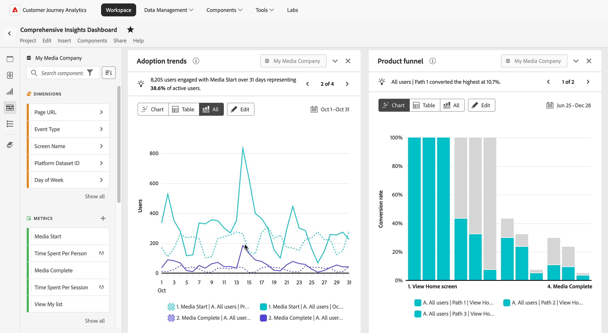

# Analisi del prodotto in Customer Journey Analytics

L’analisi del prodotto consiste nel comprendere in che modo gli utenti interagiscono con il prodotto in ogni fase del percorso. Comporta l’analisi dei dati per scoprire informazioni sul comportamento degli utenti, sulle prestazioni dei prodotti e sulle opportunità di crescita. Un’analisi efficace dei prodotti aiuta i team a prendere decisioni informate per migliorare le esperienze degli utenti, stimolare il coinvolgimento e raggiungere gli obiettivi aziendali.

Customer Journey Analytics offre ai team gli strumenti per analizzare e ottimizzare le esperienze dei prodotti con funzionalità per:

* **Gestione dei dati di prodotto su larga scala**: acquisizione, trasformazione e gestione dei dati di prodotto semplificate per soddisfare le esigenze aziendali, garantendo informazioni affidabili.
* **Misura acquisizione e attivazione**: tieni traccia di come i nuovi utenti scoprono il tuo prodotto e interagiscono con i primi eventi che generano valore.
* **Misura il coinvolgimento e l&#39;adozione**: scopri in che modo gli utenti progrediscono attraverso il funnel del prodotto, identifica i punti di attrito e tieni traccia dell&#39;adozione delle funzioni chiave.
* **Misura la fidelizzazione e la fidelizzazione**: analizza la fidelizzazione degli utenti nel tempo, identifica gli indicatori di abbandono e sviluppa strategie per ridurre l&#39;abbandono e aumentare la fidelizzazione.
* **Informazioni sul prodotto per azioni**: trasforma le informazioni basate sui dati in strategie utilizzabili per migliorare l&#39;esperienza utente e favorire la crescita sostenibile dei prodotti.
* **Condividi approfondimenti con la tua organizzazione**: comunica i risultati principali tra i team per allineare gli sforzi, promuovere la collaborazione e garantire che tutti si impegnino a raggiungere obiettivi di prodotto e business condivisi.

Sfruttando queste funzionalità, Customer Journey Analytics consente di sfruttare appieno il potenziale del prodotto e di creare un approccio integrato e basato sui dati per favorire il successo di utenti e aziende.

## Gestione dei dati di prodotto su larga scala

L&#39;accuratezza dei dati sui prodotti è il fondamento di un&#39;analisi efficace. L’acquisizione dei dati si riferisce al processo di strumentazione e raccolta dei dati di prodotto, mentre la gestione dei dati implica la trasformazione e la manutenzione di tali dati per garantire che soddisfino i requisiti analitici.

Le seguenti funzionalità di Adobe Experience Platform e Customer Journey Analytics consentono di acquisire e gestire i dati di prodotto su larga scala:

* Adobe Experience Platform
   * [Set di dati&#x200B;](https://experienceleague.adobe.com/en/docs/experience-platform/catalog/datasets/overview)
   * [Preparazione dati&#x200B;](https://experienceleague.adobe.com/it/docs/experience-platform/data-prep/home)
   * [Distiller dati&#x200B;](https://experienceleague.adobe.com/en/docs/experience-platform/query/data-distiller/overview)
* Customer Journey Analytics
   * [connessioni&#x200B;](/help/connections/overview.md)
   * [Visualizzazioni dati](/help/data-views/data-views.md), inclusi [campi derivati&#x200B;](/help/data-views/derived-fields/derived-fields.md)
   * [Segmenti&#x200B;](/help/components/filters/filters-overview.md)
   * [Metriche calcolate](/help/components/calc-metrics/calc-metr-overview.md)
   * [Analisi guidata&#x200B;: Timeline&#x200B;](/help/guided-analysis/types/timeline.md)

## Misurare l’acquisizione e l’attivazione

La crescita del prodotto si basa su informazioni actionable top-of-funnel che attraggono nuovi utenti, rivelano percorsi di conversione ed eliminano gli attriti lungo il percorso.

* L’acquisizione tiene traccia dei nuovi utenti che arrivano al prodotto, tra cui come arrivano e quali sforzi sono più o meno efficaci.
* Activation monitora i nuovi utenti che interagiscono con il primo evento di valore, definito in base agli obiettivi specifici.

Le seguenti funzionalità di Customer Journey Analytics consentono di misurare in modo efficace sia l’acquisizione che l’attivazione:

* [Analisi guidata&#x200B;: crescita attiva](/help/guided-analysis/types/active-growth.md)
* [Analisi guidata: crescita netta](/help/guided-analysis/types/net-growth.md)
* [Analisi guidata: tendenze](/help/guided-analysis//types/trends.md)
* [Pannello Attribution&#x200B;](/help/analysis-workspace/c-panels/attribution.md)
* [Tabella a forma libera](/help/analysis-workspace/c-panels/freeform-panel.md) che include la dimensione Canale di marketing (creazione tramite un [campo derivato](/help/data-views/derived-fields/derived-fields.md))

## Misura il coinvolgimento e l’adozione

L’acquisizione di nuovi utenti espande la parte superiore del funnel del prodotto. Il coinvolgimento si concentra sull&#39;indirizzare tali utenti verso il basso lungo il funnel e sulla rimozione degli ostacoli al loro successo. Il loro successo porta direttamente al successo aziendale.

Le seguenti funzionalità di Customer Journey Analytics consentono di tenere traccia del coinvolgimento e dell’adozione dei prodotti:

* [Analisi guidata: Coinvolgimento](/help/guided-analysis/types/engagement.md)
* [Analisi guidata: tendenze](/help/guided-analysis/types/trends.md)
* [Analisi guidata: Frequenza](/help/guided-analysis/types/frequency.md)
* [Analisi guidata: funnel](/help/guided-analysis/types/funnel.md)
* [Analisi guidata: tendenze di conversione](/help/guided-analysis/types/conversion-trends.md)
* [Analisi guidata: impatto sulla versione](/help/guided-analysis/types/release-impact.md)
* [Analisi guidata: impatto sul primo utilizzo&#x200B;](/help/guided-analysis/types/first-use-impact.md)
* [Analisi guidata: Timeline](/help/guided-analysis/types/timeline.md)
* [Tabelle a forma libera&#x200B;](/help/analysis-workspace/c-panels/freeform-panel.md)
* [Flusso](/help/analysis-workspace/visualizations/c-flow/flow.md)

## Misurazione di fidelizzazione e abbandono

Il mantenimento misura quanti utenti continuano a interagire con il prodotto dopo l’acquisizione e l’attivazione iniziali. I prodotti ad alte prestazioni mantengono una base di utenti stabile e fedele, ottimizzando l’interazione con le funzioni più strettamente correlate all’uso continuato. Un utente mantenuto ritorna e interagisce con il prodotto nel tempo, mentre un utente abbandonato non lo fa. I team di prodotto tengono traccia della fidelizzazione per individuare le funzionalità che guidano il coinvolgimento continuo e progettano interventi che spostano gli utenti indotti verso un comportamento di mantenimento degli utenti.

Le seguenti funzionalità di Customer Journey Analytics consentono di monitorare in modo efficace la conservazione e l&#39;abbandono:

* [Analisi guidata: mantenimento](/help/guided-analysis/types/retention.md)&#x200B;
* [Analisi guidata: crescita attiva](/help/guided-analysis/types/active-growth.md)
* [Analisi guidata: crescita netta](/help/guided-analysis/types/net-growth.md)
* [Tabella coorte&#x200B;](/help/analysis-workspace/visualizations/cohort-table/cohort-analysis.md)

## Informazioni sul prodotto fruibili

Gli approfondimenti forniscono valore solo quando guidano l&#39;azione. Converti i risultati delle analisi in azioni che migliorano l’esperienza utente e supportano la crescita dei prodotti a lungo termine.

Le seguenti funzionalità di Experience Cloud consentono di agire in modo efficace sulle informazioni:

* [Crea e pubblica tipi di pubblico](/help/components/audiences/publish.md)&#x200B; per l&#39;attivazione da Customer Journey Analytics
* Attiva i tipi di pubblico tramite i prodotti Experience Cloud:
   * [Esegui esperimenti](https://experienceleague.adobe.com/it/docs/journey-optimizer/using/content-management/content-experiment/get-started-experiment) in AJO e Adobe Target e misura l&#39;impatto delle varianti in Customer Journey Analytics utilizzando il [pannello Sperimentazione](/help/analysis-workspace/c-panels/experimentation.md)
   * [Distribuisci impegni in-app](https://experienceleague.adobe.com/en/docs/journey-optimizer/using/channels/in-app/get-started-in-app) agli utenti in AJO
* [Attiva tipi di pubblico](https://experienceleague.adobe.com/en/docs/experience-platform/destinations/ui/activate/activation-overview) in destinazioni esterne con Adobe Real-time CDP&#x200B;

## Condividi informazioni relative all’organizzazione&#x200B;

Comunica i risultati chiave tra i team per allineare gli sforzi, promuovere la collaborazione e garantire che tutti si impegnino a raggiungere obiettivi di prodotto e business condivisi.

Le seguenti funzionalità di Customer Journey Analytics consentono di condividere le informazioni in modo efficace:

* [Condividi](/help/analysis-workspace/curate-share/share-projects.md) visualizzazioni di analisi guidate personalizzate in base a specifiche domande aziendali, consentendo ai consumatori di gestire autonomamente la domanda successiva
* Combina analisi guidate, pannelli e visualizzazioni in un dashboard completo in [Analysis Workspace](/help/analysis-workspace/home.md)
* Crea una [scorecard per dispositivi mobili](/help/mobile-app/home.md) con informazioni chiave sui prodotti per utenti direzionali e altri consumatori in movimento
