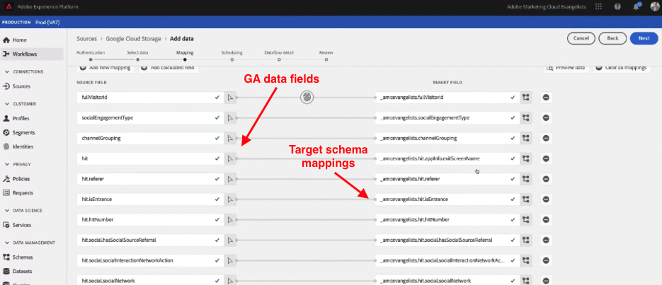
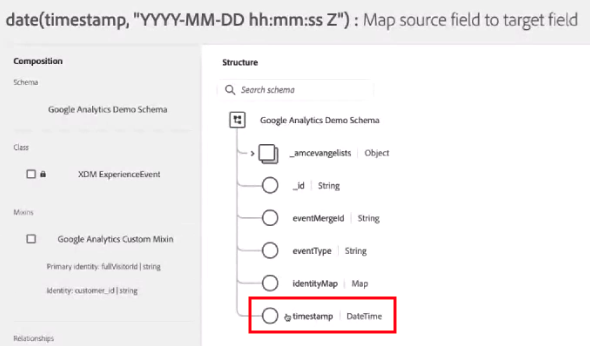
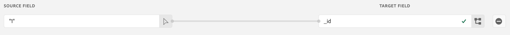

# Acquisire dati storici di Google Analytics

Questa pagina contiene informazioni su come acquisire dati storici da Google Analytics in Adobe Experience Platform come set di dati, in modo che sia possibile farvi riferimento in una visualizzazione dati in Customer Journey Analytics. Puoi combinare i passaggi descritti in questa pagina con quelli per generare un set di dati ricorrente descritti in [Configurazione di un’implementazione live di Google Analytics](streaming.md). Combina questo set di dati storici con il set di dati dell’implementazione corrente per ottenere una visualizzazione diretta in Customer Journey Analytics con dati sia correnti che precedenti.

## Prerequisiti

Per queste attività, devi disporre dei diritti di accesso e delle autorizzazioni seguenti:

* Accesso a Adobe Experience Platform
* Accesso a Google Analytics (GA Standard o GA 360)
* [Accesso amministratore](/help/technotes/access-control.md) a Customer Journey Analytics

## Configurare un’esportazione BigQuery

La struttura dei dati nelle proprietà di Universal Analytics è diversa da quella nelle proprietà di Google Analytics 4. Puoi configurare un’esportazione BigQuery in base al tipo di proprietà da cui desideri esportare i dati:

* [Configurare un’esportazione BigQuery per una proprietà Universal Analytics](https://support.google.com/analytics/answer/3416092)
* [Configurare un’esportazione BigQuery per una proprietà Google Analytics 4](https://support.google.com/analytics/answer/9823238)

### Requisiti aggiuntivi per le proprietà di Universal Analytics

>[!NOTE]
>
>Questa sezione è applicabile solo alle proprietà di Universal Analytics. Se devi esportare dati da una proprietà GA4, consulta [Esportare dati in Google Cloud Platform](#export-gcp).

Le proprietà di Universal Analytics memorizzano ogni record nei propri dati come sessione dell’utente invece che come singolo evento. È necessaria una query SQL per trasformare i dati di Universal Analytics in un formato compatibile con Adobe Experience Platform. Applica la funzione `UNNEST` al campo `hits` nello schema GA e salvalo come tabella BigQuery.


>[!BEGINSHADEBOX]

Per un video demo, vedi  [Da Google Analytics a Customer Journey Analytics - BigQuery](https://video.tv.adobe.com/v/332634?quality=12&learn=on){target="_blank"}.

>[!ENDSHADEBOX]


```sql
SELECT
   *,
   timestamp_seconds(`visitStartTime` + hit.time) AS `timestamp` 
FROM
   (
      SELECT
         fullVisitorId,
         visitNumber,
         visitId,
         visitStartTime,
         trafficSource,
         socialEngagementType,
         channelGrouping,
         device,
         geoNetwork,
         hit 
      FROM
         `example_bq_table_*`,
         UNNEST(hits) AS hit 
   )
```

## Esportare dati in Google Cloud Platform {#export-gcp}

In Google Cloud Platform, passa a **Export > Export to GCS** (Esporta > Esporta in GCS). Una volta che i dati sono in Google Cloud Storage, sono pronti per essere estratti in Adobe Experience Platform.

## Importare i dati da Google Cloud Storage in Experience Platform

1. In Adobe Experience Platform, seleziona **[!UICONTROL Origini]** a sinistra.
1. Nel catalogo, individua l&#39;opzione **[!UICONTROL Google Cloud Storage]**. Fare clic su **[!UICONTROL Aggiungi dati]**.


>[!BEGINSHADEBOX]

Consulta  [Importa dati Google Analytics in Adobe Experience Platform](https://video.tv.adobe.com/v/332676?quality=12&learn=on){target="_blank"} per un video dimostrativo.

>[!ENDSHADEBOX]


>[!TIP]
>
>Se prevedi di importare sia dati storici di Google Analytics che dati live in streaming, assicurati di utilizzare lo stesso schema per entrambi i set di dati. È possibile unire i set di dati in un Customer Journey Analytics utilizzando un [set di dati combinato](/help/connections/combined-dataset.md).

Puoi mappare i dati di eventi GA in un set di dati esistente creato in precedenza, oppure puoi creare un nuovo set di dati, utilizzando lo schema XDM scelto. Dopo che hai selezionato lo schema, Experience Platform applica l’apprendimento automatico per premappare sullo [schema XDM](https://experienceleague.adobe.com/docs/experience-platform/xdm/home.html?lang=it#ui) ciascuno dei campi presenti nei dati di Google Analytics.



Una volta completata la mappatura dei campi sullo schema XDM, puoi pianificare l’importazione su base periodica. Applicando la convalida degli errori durante il processo di acquisizione, puoi verificare che non vi siamo problemi con i dati importati.

## Campi XDM richiesti

Alcuni campi XDM in Platform richiedono il formato corretto per consentire la corretta elaborazione dei dati.

* **`timestamp`**: crea un campo calcolato speciale nell’interfaccia utente dello schema di Experience Platform. Fare clic su **[!UICONTROL Aggiungi campo calcolato]** e racchiudere la stringa `timestamp` in una funzione `date`:

  `date(timestamp, "yyyy-MM-dd HH:mm:ssZ")`

  Salva il campo calcolato nella struttura dati della marca temporale nello schema:

  

* **`_id`**: questo campo deve contenere un valore. Per Customer Journey Analytics non importa di quale valore si tratti. Puoi semplicemente aggiungere “1” al campo:

  

## Passaggi successivi

* Se disponi di dati correnti da inviare ad Adobe Experience Platform, consulta [Configurare lo streaming per i dati Google Analytics](streaming.md).
* Per iniziare a generare rapporti sui dati precedenti, consulta [Creare una connessione](/help/connections/create-connection.md).
