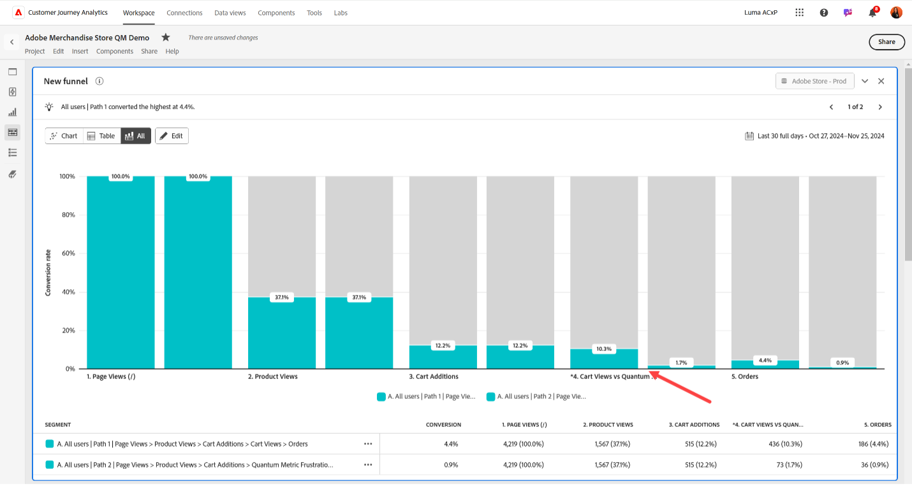

# Aggiungere eventi di attrito della metrica quantistica a Customer Journey Analytics

La metrica quantistica raccoglie eventi di attrito come la lentezza di caricamento delle pagine, gli errori di caricamento delle pagine, i clic di rabbia e altro ancora. Questi eventi possono essere trasmessi in Customer Journey Analytics come eventi complementari nel percorso di utenti. Con questi dati combinati, puoi comprendere meglio l’impatto dell’attrito sulle metriche a valle.

## Prerequisiti:

Questo caso d’uso ha due requisiti:

* Devi avere diritto al pacchetto **Dev Ops** della metrica Quantum.
* È necessario utilizzare i tag in Raccolta dati di Adobe Experience Platform.

## Passaggio 1: creare un campo schema per accogliere gli eventi di attrito della metrica quantistica

Questo caso d’uso richiede un campo schema dedicato a cui inviare i dati. Puoi creare questo campo in qualsiasi posizione desiderata nello schema e denominarlo come preferisci. I valori di esempio vengono forniti se l’organizzazione non ha una preferenza sul nome o sulla posizione.

1. Accedi a [experience.adobe.com](https://experience.adobe.com).
1. Passa a **[!UICONTROL Data Collection]** > **[!UICONTROL Schemas]**.
1. Seleziona lo schema desiderato dall’elenco.
1. Seleziona l&#39;icona  accanto all&#39;oggetto desiderato. Ad esempio, accanto a `Implementation Details`.
1. A destra, immetti il [!UICONTROL Name] desiderato. Ad esempio: `qmErrorName`.
1. Immettere il [!UICONTROL Display name] desiderato. Ad esempio: `Quantum Metric error name`.
1. Selezionare [!UICONTROL Type] come **[!UICONTROL String]**.
1. Seleziona **[!UICONTROL Save]**.

## Passaggio 2: acquisire eventi di attrito utilizzando l’estensione tag Quantum Metric

Consulta [Estensione della metrica quantistica](https://experienceleague.adobe.com/it/docs/experience-platform/destinations/catalog/analytics/quantum-metric) nella guida Destinazioni di Adobe Experience Platform per istruzioni su come impostare i tag per includere i dati della metrica quantistica. L’utilizzo di questa estensione passa più righe in un set di dati esistente.

Utilizza i tag nella raccolta dati di Adobe Experience Platform per impostare manualmente il nome dell’evento di attrito in modo che possa essere incluso nell’oggetto XDM e analizzato. Un modo per farlo è nel codice personalizzato della regola:

```js
_satellite.setVar('qm_error_name','error rage click');
return true;
```

Quindi, aggiungi l’elemento dati impostato dinamicamente all’oggetto XDM:


## Passaggio 3: aggiungere una o più dimensioni e metriche alla visualizzazione dati in Customer Journey Analytics

Modifica la visualizzazione dati esistente per aggiungere l’ID sessione come dimensione disponibile in Customer Journey Analytics.

1. Accedi a [experience.adobe.com](https://experience.adobe.com).
1. Passa a Customer Journey Analytics e seleziona **[!UICONTROL Data views]**, facoltativamente da **[!UICONTROL Data management]**, nel menu principale.
1. Seleziona la visualizzazione dati esistente desiderata.
1. Individuate l&#39;elenco del campo evento di attrito della metrica Quantum a sinistra e trascinatelo nell&#39;area delle metriche al centro.
1. Nel riquadro di destra, impostare l&#39;impostazione [Includi/Escludi valori](/help/data-views/component-settings/include-exclude-values.md) sugli eventi di attrito desiderati di cui tenere traccia. Puoi aggiungere più eventi di attrito alla stessa metrica per combinarli. Puoi anche trascinare un’altra copia del campo degli eventi di attrito nell’area delle metriche per tracciare altri eventi di attrito come metrica separata.
1. Dopo aver creato tutte le dimensioni e le metriche desiderate, fare clic su **[!UICONTROL Save]**.
1. Per un elenco completo degli eventi di errore, consulta la documentazione sulle metriche quantitative. Se hai altre domande, contatta il rappresentante dell&#39;Assistenza clienti per la metrica quantistica o invia una richiesta tramite il [portale delle richieste dei clienti per la metrica quantistica](https://community.quantummetric.com/s/public-support-page).

## Passaggio 4: utilizzare la dimensione e le metriche con il resto dei dati in Analysis Workspace

Con i dati evento di attrito della metrica quantistica raccolti insieme al resto dei dati del visitatore, puoi utilizzarli esattamente come faresti con qualsiasi altra dimensione o metrica in Customer Journey Analytics.

1. Accedi a [experience.adobe.com](https://experience.adobe.com).
1. Passare a Customer Journey Analytics e selezionare **[!UICONTROL Workspace]** nel menu principale.
1. Seleziona un progetto esistente o crea un progetto.
1. Crea una [tabella a forma libera](/help/analysis-workspace/visualizations/freeform-table/freeform-table.md).
1. Trascina le dimensioni e le metriche desiderate nell’area di lavoro di Workspace per l’analisi.



Le possibili idee di analisi includono:

* Dati dell’evento di attrito di tendenza nel tempo
* In una visualizzazione di abbandono o funnel, aggiungi eventi Customer Journey Analytics come alcuni passaggi ed eventi di attrito della metrica quantistica come altri. Questo rapporto consente di vedere dove i visitatori si trovano più comunemente nei guai.
* Crea e applica un segmento per i visitatori che sperimentano eventi di attrito per un’analisi più approfondita
