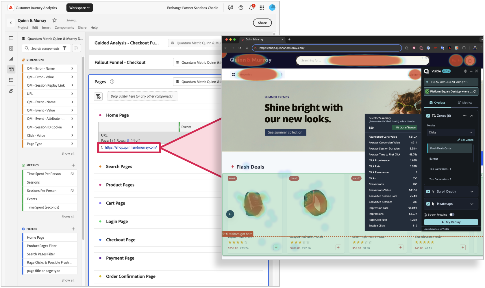

# Utilizzare le mappe di calore della metrica quantistica con Customer Journey Analytics

Il collegamento della mappatura di calore delle metriche quantistiche ai dati di CJA consente di comprendere meglio il coinvolgimento a livello di pagina e di ottimizzare le pagine in base al comportamento dei consumatori. Workspace può essere utilizzato per comprendere i flussi di utenti e vedere quali percorsi i consumatori seguono da una pagina all’altra. Quindi puoi fare clic su URL pagina con collegamento ipertestuale per creare una mappa visiva del modo in cui gli utenti interagiscono con il contenuto. Collegando Quantum Metric Heatmapping a CJA, ora puoi associare le interazioni a livello di pagina ai risultati di business, portando l’analisi al livello successivo.

La tabella restituisce tutte le sessioni in quel segmento e puoi fare clic su una di esse per approfondire l’analisi in QM.  Per ulteriori informazioni sulla ripetizione della sessione della metrica quantistica, consulta https://www.quantummetric.com/platform/session-replay

## Prerequisiti

Devi avere diritto al pacchetto **UX Ops** della metrica Quantum per accedere alle funzionalità della mappa di calore della metrica Quantum.

## Passaggio 1: configurare i collegamenti in Analysis Workspace

1. Accedi a [experience.adobe.com](https://experience.adobe.com).
1. Passa a Customer Journey Analytics e seleziona **[!UICONTROL Workspace]** nel menu principale.
1. Seleziona un progetto esistente o crea un progetto.
1. Crea una [tabella a forma libera](/help/analysis-workspace/visualizations/freeform-table/freeform-table.md).
1. Trascina la dimensione URL della pagina nell’area di lavoro di Workspace.
1. Fare clic con il pulsante destro del mouse sull&#39;intestazione della colonna della dimensione, quindi selezionare **[!UICONTROL Crea collegamenti ipertestuali per tutti gli elementi della dimensione]**.
1. Selezionare **[!UICONTROL Crea un URL personalizzato]**.
1. Incolla la seguente struttura URL:

   ```
   $value?qm-visible=true
   ```

1. Fai clic su **[!UICONTROL Crea]**.
1. Verifica uno dei collegamenti per vedere se si apre nell’URL con l’estensione Quantum Metric visibile. Questi collegamenti si aprono in una nuova scheda in modo che il progetto Workspace rimanga aperto.



## Passaggio 2: visualizzare le mappe di calore facendo clic sui collegamenti in Customer Journey Analytics

Dopo aver trovato una pagina da esplorare con la mappatura di calore, puoi applicarla al pannello desiderato. La tabella restituisce un URL che consente di esplorare le mappe di calore, la profondità di scorrimento e le zone chiave per l’interazione utilizzando la metrica quantistica. Per ulteriori informazioni, consulta [Panoramica del prodotto della mappa di calore della metrica quantistica](https://www.quantummetric.com/platform/interaction-heatmaps). Puoi anche contattare il rappresentante dell&#39;Assistenza clienti per la metrica quantistica o inviare una richiesta tramite il [portale delle richieste dei clienti per la metrica quantistica](https://community.quantummetric.com/s/public-support-page).
