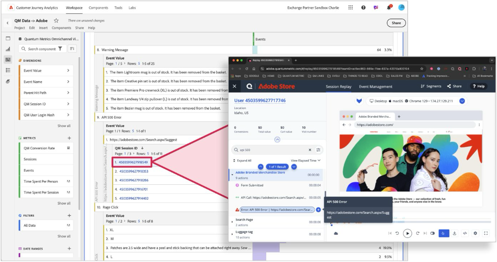

# La sessione della metrica quantistica viene ripetuta sui dati in Customer Journey Analytics

Collegando le ripetizioni della sessione della metrica quantistica ai dati di CJA, i clienti possono capire meglio &quot;il perché&quot; di &quot;cosa&quot;.  Workspace può essere utilizzato per scoprire le sessioni con attrito, quindi puoi fare clic sugli ID sessione con collegamento ipertestuale per esplorare la ripetizione della sessione in Metrica quantistica.  Questi dati consentono di visualizzare il comportamento all’interno di una sessione e una migliore comprensione di ciò che genera l’attrito dei consumatori.  Attraverso le ripetizioni delle sessioni associate a CJA, puoi acquisire un contesto critico sul comportamento del cliente nella tua esperienza.

## Prerequisiti

Questi passaggi presuppongono l’utilizzo di tag in Raccolta dati di Adobe Experience Platform. Puoi adattare questi metodi di raccolta dati a un’implementazione manuale di Web SDK se la tua organizzazione non utilizza i tag.

Per ulteriori informazioni, consulta la documentazione dell&#39;estensione tag [Quantum Metric](https://experienceleague.adobe.com/en/docs/experience-platform/destinations/catalog/analytics/quantum-metric).

## Passaggio 1: creare un campo schema per l’ID sessione della metrica quantistica

Questo caso d’uso richiede un campo schema dedicato a cui inviare i dati. Puoi creare questo campo in qualsiasi posizione desiderata nello schema e denominarlo come preferisci. I valori di esempio vengono forniti se l’organizzazione non ha una preferenza sul nome o sulla posizione.

1. Accedi a [experience.adobe.com](https://experience.adobe.com).
1. Passa a **[!UICONTROL Raccolta dati]** > **[!UICONTROL Schemi]**.
1. Seleziona lo schema desiderato dall’elenco.
1. Seleziona l&#39;icona  accanto all&#39;oggetto desiderato. Ad esempio, accanto a `Implementation Details`.
1. A destra, immetti il [!UICONTROL Nome] desiderato. Ad esempio: `qmSessionId`.
1. Immettere il [!UICONTROL nome visualizzato] desiderato. Ad esempio: `Quantum Metric session ID`.
1. Selezionare [!UICONTROL Tipo] come **[!UICONTROL Stringa]**.
1. Seleziona **[!UICONTROL Salva]**.

## Passaggio 2: acquisire l’ID della sessione della metrica quantistica utilizzando l’estensione del tag della metrica quantistica

Segui questi passaggi per aggiungere l’ID sessione della metrica quantistica ai dati inviati a Adobe Experience Platform.

1. Accedi a [experience.adobe.com](https://experience.adobe.com).
1. Passa a **[!UICONTROL Raccolta dati]** > **[!UICONTROL Tag]**.
1. Seleziona la proprietà tag desiderata.
1. Seleziona **[!UICONTROL Elementi dati]**, quindi seleziona **[!UICONTROL Aggiungi elemento dati]**.
1. Imposta le seguenti impostazioni:
   * **[!UICONTROL Nome]**: `Quantum Metric session ID`
   * **[!UICONTROL Estensione]**: [!UICONTROL Core]
   * **[!UICONTROL Tipo Di Elemento Dati]**: [!UICONTROL Codice Personalizzato]
1. Seleziona il pulsante **[!UICONTROL Apri editor]** e incolla il seguente codice:

   ```js
   // Check for the presence of the Quantum Metric session ID cookie
   const qmCookie = _satellite.cookie.get("QuantumMetricSessionID");
   if(qmCookie != null) return qmCookie;
   // If a cookie is not set, check local storage
   const qmLocalStorage = JSON.parse(localStorage.getItem("QM_S") || "{}");
   if (qmLocalStorage?.s != null) return qmLocalStorage.s;
   ```

1. Seleziona **[!UICONTROL Salva]**.

## Passaggio 3: mappare l’elemento dati sul campo dello schema XDM desiderato

Ora che l’elemento dati ha una logica per ottenere il valore desiderato, mappa l’elemento dati all’oggetto XDM.

1. Nella proprietà tag, seleziona **[!UICONTROL Elementi dati]**, quindi seleziona l&#39;elemento dati che ospita l&#39;oggetto XDM.
1. Nella colonna di destra di questo elemento dati, passa al percorso stabilito durante la creazione del campo schema.
1. Imposta il valore sul nome dell’elemento dati racchiuso tra simboli di percentuale. Ad esempio: `%Quantum Metric session ID%`.
1. Seleziona **[!UICONTROL Salva]**.
1. Aggiungi una libreria, quindi pubblica le modifiche in produzione.

Se l’oggetto XDM è già incluso in una configurazione di azione invia evento, i dati verranno visualizzati alla pubblicazione delle modifiche.

>[!NOTE]
>
>A volte il Web SDK viene eseguito più rapidamente del codice della metrica quantistica. In questi casi, l’ID sessione viene inviato all’hit successivo. Se un visitatore non viene recapitato, l’ID sessione non viene raccolto in queste istanze.

## Passaggio 3: aggiungere l’ID sessione della metrica quantistica come dimensione disponibile

Una volta pubblicate le modifiche di cui sopra, modifica la visualizzazione dati esistente per aggiungere l’ID sessione come dimensione disponibile in Customer Journey Analytics.

1. Accedi a [experience.adobe.com](https://experience.adobe.com).
1. Passa a Customer Journey Analytics e seleziona **[!UICONTROL Visualizzazioni dati]** nel menu principale.
1. Seleziona la visualizzazione dati esistente desiderata.
1. Individuate il campo ID sessione della metrica quantistica a sinistra e trascinatelo nell&#39;area delle dimensioni al centro.
1. Nel riquadro di destra, impostare l&#39;impostazione [persistenza](/help/data-views/component-settings/persistence.md) su `Session`.
1. Seleziona **[!UICONTROL Salva]**.

## Passaggio 4: configurare Analysis Workspace per la dimensione ID sessione

Crea una tabella a forma libera in Workspace e configurala in modo che i valori ID sessione siano collegati direttamente alla metrica quantistica.

1. Accedi a [experience.adobe.com](https://experience.adobe.com).
1. Passa a Customer Journey Analytics e seleziona **[!UICONTROL Workspace]** nel menu principale.
1. Seleziona un progetto esistente o crea un progetto.
1. Crea una [tabella a forma libera](/help/analysis-workspace/visualizations/freeform-table/freeform-table.md).
1. Trascina la dimensione ID sessione nell’area di lavoro di Workspace.
1. Fare clic con il pulsante destro del mouse sull&#39;intestazione della colonna della dimensione, quindi selezionare **[!UICONTROL Crea collegamenti ipertestuali per tutti gli elementi della dimensione]**.
1. Selezionare **[!UICONTROL Crea un URL personalizzato]**.
1. Incolla la seguente struttura URL:

   ```
   https://adobe.quantummetric.com/#/replay/cookie:$value
   ```

1. Fai clic su **[!UICONTROL Crea]**.

Ogni ID sessione è ora un collegamento cliccabile. Per ulteriori informazioni sull&#39;aggiunta di collegamenti ipertestuali a elementi dimensionali di Analysis Workspace, vedere [Creare collegamenti ipertestuali in una tabella a forma libera](/help/analysis-workspace/visualizations/freeform-table/freeform-table-hyperlinks.md).



## Passaggio 5: visualizzare le sessioni da Customer Journey Analytics

Dopo aver trovato un segmento interessante da esplorare per le ripetizioni di sessione, puoi applicarlo al pannello che include i collegamenti ID sessione. La tabella restituisce tutte le sessioni in quel segmento e puoi fare clic su una di esse per approfondire l’analisi in Metrica quantistica.

Per ulteriori informazioni, consulta [la guida aziendale alla ripetizione della sessione](https://www.quantummetric.com/resources/ebook/the-enterprise-guide-to-session-replay) sulla metrica quantistica. Puoi anche contattare il rappresentante dell&#39;Assistenza clienti per la metrica quantistica o inviare una richiesta tramite il [portale delle richieste dei clienti per la metrica quantistica](https://community.quantummetric.com/s/public-support-page).
